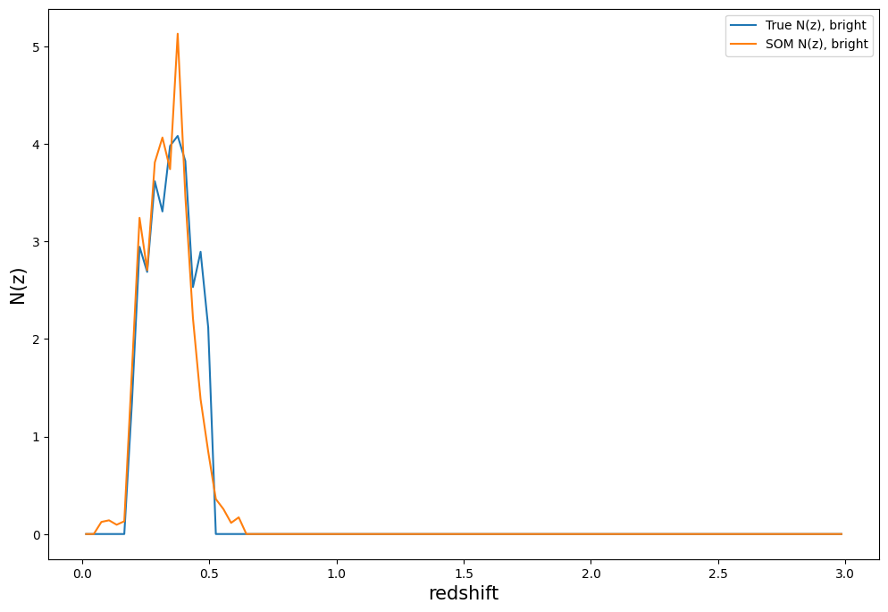

Somoclu SOM Summarizer Demo
===========================

**Author:** Ziang Yan, Sam Schmidt

**Last successfully run:** June 16, 2023

This notebook shows a quick demonstration of the use of the
``SOMocluSummarizer`` summarization module. Algorithmically, this module
is not very different from the NZDir estimator/summarizer. NZDir
operates by finding neighboring photometric points around spectroscopic
objects. SOMocluSummarizer takes a large training set of data in the
``Inform_SOMocluUmmarizer`` stage and trains a self-organized map (SOM)
(using code from the ``somoclu`` package available at:
https://github.com/peterwittek/somoclu/). Once the SOM is set up, the
“best match unit” are determined for both the photometric/unknown data
and a set of spectroscopic data with known redshifts. For each SOM cell,
the algorithm constructs a histogram using the spectroscopic members
mapped to that cell, and weights these by the number of photometric
galaxies in that cell. Both the photometric and spectroscopic datasets
can also employ an optional weight per-galaxy.

The summarizer also identifies SOM cells that contain photometric data
but do not contain and galaxies with a measured spec-z, and thus do not
have an obvious redshift estimate. It writes out the (raveled) SOM cell
indices that contain “uncovered”/uncalibratable data to the file
specified by the ``uncovered_cell_file`` option as a list of integers.
The cellIDs and galaxy/objIDs for all photometric galaxies will be
written out to the file specified by the ``cellid_output`` parameter.
Any galaxies in these cells should really be removed, and thus some
iteration may be necessary in defining bin membership by looking at the
properties of objects in these uncovered cells before a final N(z) is
estimated, as otherwise a bias may be present.

The shape and number of cells used in constructing the SOM affects
performance, as do several tuning parameters. This paper,
http://www.giscience2010.org/pdfs/paper_230.pdf gives a rough guideline
that the number of cells should be of the order ~ 5 x sqrt (number of
data rows x number of column rows), though this is a rough guide. Some
studies have found a 2D SOM that is more elongated in one direction to
be preferential, while others claim that a square layout is optimal, the
user can set the number of cells in each SOM dimension via the
``n_rows`` and ``n_cols`` parameters. For more discussion on SOMs see
the Appendices of this KiDS paper: http://arxiv.org/abs/1909.09632.

As with the other RAIL summarizers, we bootstrap the spectroscopic
sample and return N bootstraps in an ensemble, along with a single
fiducial N(z) estimate.

More specific details of the algorithm’s set up will be described in the
course of this notebook, along with some illustrative plots.

Let’s set up our dependencies:

.. code:: ipython3

    import numpy as np
    import matplotlib.pyplot as plt
    import pickle
    import rail
    import os
    import qp
    import tables_io
    from rail.core.data import TableHandle, Hdf5Handle
    from rail.core.stage import RailStage
    from rail.utils.path_utils import find_rail_file

Next, let’s set up the Data Store, so that our RAIL module will know
where to fetch data:

.. code:: ipython3

    DS = RailStage.data_store
    DS.__class__.allow_overwrite = True

First, let’s grab some data files. For the SOM, we will want to train on
a fairly large, representative set that encompasses all of our expected
data. We’ll grab a larger data file than we typically use in our demos
to ensure that we construct a meaningful SOM.

This data consists of ~150,000 galaxies from a single healpix pixel of
the comsoDC2 truth catalog with mock 10-year magnitude errors added. It
is cut at a relatively bright i<23.5 magnitudes in order to concentrate
on galaxies with particularly high S/N rates.

.. code:: ipython3

    training_file = "./healpix_10326_bright_data.hdf5"
    
    if not os.path.exists(training_file):
      os.system('curl -O https://portal.nersc.gov/cfs/lsst/PZ/healpix_10326_bright_data.hdf5')

.. code:: ipython3

    # way to get big data file
    training_data = DS.read_file("training_data", TableHandle, training_file)

Now, let’s set up the inform stage for our summarizer

.. code:: ipython3

    from rail.estimation.algos.somoclu_som import *

We need to define all of our necessary initialization params, which
includes the following: - ``name`` (str): the name of our estimator, as
utilized by ceci - ``model`` (str): the name for the model file
containing the SOM and associated parameters that will be written by
this stage - ``hdf5_groupname`` (str): name of the hdf5 group (if any)
where the photometric data resides in the training file - ``n_rows``
(int): the number of dimensions in the y-direction for our 2D SOM -
``n_columns`` (int): the number of dimensions in the x-direction for our
2D SOM - ``gridtype`` (str): the parameter that specifies the grid form
of the nodes. Options: ``rectangular``\ (default) and ``hexagonal``. -
``initialization`` (str): the parameter specifying the method of
initializing the SOM. Options: ``pca``: principal componant analysis
(default); ``random``: randomly initialize the SOM. - ``maptype`` (str):
the parameter specifying the map topology. Options:
``planar``\ (default) and ``toroid``. - ``n_epochs`` (int): the number
of iteration steps during SOM training. SOMs can take a while to
converge, so we will use a fairly large number of 500,000 iterations. -
``std_coeff`` (float): the “radius” of how far to spread changes in the
SOM - ``som_learning_rate`` (float): a number between 0 and 1 that
controls how quickly the weighting function decreases. SOM’s are not
guaranteed to converge mathematically, and so this parameter tunes how
the response drops per iteration. A typical values we might use might be
between 0.5 and 0.75. - ``column_usage`` (str): this value determines
what values will be used to construct the SOM, valid choices are
``colors``, ``magandcolors``, and ``columns``. If set to ``colors``, the
code will take adjacent columns as specified in ``usecols`` to construct
colors and use those as SOM inputs. If set to ``magandcolors`` it will
use the single column specfied by ``ref_column_name`` and the
aforementioned colors to construct the SOM. If set to ``columns`` then
it will simply take each of the columns in ``usecols`` with no
modification. So, if a user wants to use K magnitudes and L colors, they
can precompute the colors and specify all names in ``usecols``. NOTE:
accompanying ``usecols`` you must have a ``nondetect_val`` dictionary
that lists the replacement values for any non-detection-valued entries
for each column, see the code for an example dictionary. WE will set
``column_usage`` to colors and use only colors in this example notebook.

.. code:: ipython3

    dim = 71
    grid_type = 'hexagonal'
    
    
    inform_dict = dict(model='output_SOMoclu_model.pkl', 
                       hdf5_groupname='photometry',
                       n_rows=dim, n_columns=dim, 
                       gridtype = grid_type,
                       maptype = 'toroid',
                       n_epochs=30,
                       std_coeff=12.0, som_learning_rate=0.75,
                       column_usage='colors')

.. code:: ipython3

    inform_som = SOMocluInformer.make_stage(name='inform_som', **inform_dict)

Let’s run our stage, which will write out a file called
``output_SOM_model.pkl``

**NOTE for those using M1 Macs:** you may get an error like
``wrap_train not found`` when running the inform stage in the cell just
below here. If so, this can be solved by reinstalling somoclu from conda
rather than pip with the command:

::

   conda install -c conda-forge somoclu

.. code:: ipython3

    %%time
    inform_som.inform(training_data)

.. parsed-literal::

    Inserting handle into data store.  model_inform_som: inprogress_output_SOMoclu_model.pkl, inform_som
    CPU times: user 15min 29s, sys: 764 ms, total: 15min 30s
    Wall time: 3min 56s

.. parsed-literal::

    <rail.core.data.ModelHandle at 0x7fa51cdf8fa0>

Running the stage took ~1 minute wall time on a desktop Mac and ~3.5
minutes on NERSC Jupyter lab. Remember, however, that in many production
cases we would likely load a pre-trained SOM specifically tuned to the
given dataset, and this inform stage would not be run each time.

Let’s read in the SOM model file, which contains our som model and
several of the parameters used in constructing the SOM, and needed by
our summarization model.

.. code:: ipython3

    with open("output_SOMoclu_model.pkl", "rb") as f:
        model = pickle.load(f)

.. code:: ipython3

    model.keys()

.. parsed-literal::

    dict_keys(['som', 'usecols', 'ref_column', 'n_rows', 'n_columns', 'column_usage'])

To visualize our SOM, let’s calculate the cell occupation of our
training sample, as well as the mean redshift of the galaxies in each
cell. The SOM took colors as inputs, so we will need to construct the
colors for our training set galaxie:

.. code:: ipython3

    bands = ['u','g','r','i','z','y']
    bandnames = [f"mag_{band}_lsst" for band in bands]
    ngal = len(training_data.data['photometry']['mag_i_lsst'])
    colors = np.zeros([5, ngal])
    for i in range(5):
        colors[i] = training_data.data['photometry'][bandnames[i]] - training_data.data['photometry'][bandnames[i+1]]

We can calculate the best SOM cell using the get_bmus() function defined
in somoclu_som.py, which will return the 2D SOM coordinates for each
galaxy, and then use these for our visualizations (this step might take
a while):

.. code:: ipython3

    SOM = model['som']
    bmu_coordinates = get_bmus(SOM, colors.T).T

.. code:: ipython3

    meanszs = np.zeros_like(SOM.umatrix)
    cellocc = np.zeros_like(SOM.umatrix)
    
    for i in range(training_data.data['photometry']['redshift'].size):
        bmu_x, bmu_y = bmu_coordinates.T[i]
        meanszs[bmu_x, bmu_y] += training_data.data['photometry']['redshift'][i]
        cellocc[bmu_x, bmu_y] += 1
    meanszs /= cellocc

.. parsed-literal::

    /tmp/ipykernel_8927/3421861057.py:8: RuntimeWarning: invalid value encountered in divide
      meanszs /= cellocc

Here is the cell occupation distribution:

.. code:: ipython3

    fig, ax = plt.subplots(nrows=1, ncols=1, figsize=(12,12))
    plot_som(ax, cellocc.T, grid_type=grid_type, colormap=cm.coolwarm, cbar_name='cell occupation')

.. image:: ../../../docs/rendered/estimation_examples/11_SomocluSOM_files/../../../docs/rendered/estimation_examples/11_SomocluSOM_24_0.png

And here is the mean redshift per cell:

.. code:: ipython3

    fig, ax = plt.subplots(nrows=1, ncols=1, figsize=(12,12))
    plot_som(ax, meanszs.T, grid_type=grid_type, colormap=cm.coolwarm, cbar_name='mean redshift')

.. image:: ../../../docs/rendered/estimation_examples/11_SomocluSOM_files/../../../docs/rendered/estimation_examples/11_SomocluSOM_26_0.png

Note that there is spatial correlation between redshift and cell
position, which is good, this is showing how there are gradual changes
in redshift between similarly-colored galaxies (and sometimes abrupt
changes, when degeneracies are present).

Now that we have illustrated what exactly we have constructed, let’s use
the SOM to predict the redshift distribution for a set of photometric
objects. We will make a simple cut in spectroscopic redshift to create a
compact redshift bin. In more realistic circumstances we would likely be
using color cuts or photometric redshift estimates to define our test
bin(s). We will cut our photometric sample to only include galaxies in
0.5<specz<0.9.

We will need to trim both our spec-z set to i<23.5 to match our trained
SOM:

.. code:: ipython3

    testfile = find_rail_file('examples_data/testdata/test_dc2_training_9816.hdf5')
    data = tables_io.read(testfile)['photometry']
    mask = ((data['redshift'] > 0.2) & (data['redshift']<0.5))
    brightmask = ((mask) & (data['mag_i_lsst']<23.5))
    trim_data = {}
    bright_data = {}
    for key in data.keys():
        trim_data[key] = data[key][mask]
        bright_data[key] = data[key][brightmask]
    trimdict = dict(photometry=trim_data)
    brightdict = dict(photometry=bright_data)
    # add data to data store
    test_data = DS.add_data("tomo_bin", trimdict, Hdf5Handle)
    bright_data = DS.add_data("bright_bin", brightdict, Hdf5Handle)

.. code:: ipython3

    specfile = find_rail_file("examples_data/testdata/test_dc2_validation_9816.hdf5")
    spec_data = tables_io.read(specfile)['photometry']
    smask = (spec_data['mag_i_lsst'] <23.5)
    trim_spec = {}
    for key in spec_data.keys():
        trim_spec[key] = spec_data[key][smask]
    trim_dict = dict(photometry=trim_spec)
    spec_data = DS.add_data("spec_data", trim_dict, Hdf5Handle)

Note that we have removed the ‘photometry’ group, we will specify the
``phot_groupname`` as “” in the parameters below.

As before, let us specify our initialization params for the
SomocluSOMSummarizer stage, including:

-  ``model``: name of the pickled model that we created, in this case
   “output_SOM_model.pkl”
-  ``hdf5_groupname`` (str): hdf5 group for our photometric data (in our
   case ““)
-  ``objid_name`` (str): string specifying the name of the ID column, if
   present photom data, will be written out to cellid_output file
-  ``spec_groupname`` (str): hdf5 group for the spectroscopic data
-  ``nzbins`` (int): number of bins to use in our histogram ensemble
-  ``nsamples`` (int): number of bootstrap samples to generate
-  ``output`` (str): name of the output qp file with N samples
-  ``single_NZ`` (str): name of the qp file with fiducial distribution
-  ``uncovered_cell_file`` (str): name of hdf5 file containing a list of
   all of the cells with phot data but no spec-z objects: photometric
   objects in these cells will *not* be accounted for in the final N(z),
   and should really be removed from the sample before running the
   summarizer. Note that we return a single integer that is constructed
   from the pairs of SOM cell indices via
   ``np.ravel_multi_index``\ (indices).

.. code:: ipython3

    summ_dict = dict(model="output_SOMoclu_model.pkl", hdf5_groupname='photometry',
                     spec_groupname='photometry', nzbins=101, nsamples=25,
                     output='SOM_ensemble.hdf5', single_NZ='fiducial_SOMoclu_NZ.hdf5',
                     uncovered_cell_file='all_uncovered_cells.hdf5',
                     objid_name='id',
                     cellid_output='output_cellIDs.hdf5')

Now let’s initialize and run the summarizer. One feature of the SOM: if
any SOM cells contain photometric data but do not contain any redshifts
values in the spectroscopic set, then no reasonable redshift estimate
for those objects is defined, and they are skipped. The method currently
prints the indices of uncovered cells, we may modify the algorithm to
actually output the uncovered galaxies in a separate file in the future.

.. code:: ipython3

    som_summarizer = SOMocluSummarizer.make_stage(name='SOMoclu_summarizer', **summ_dict)

.. code:: ipython3

    som_summarizer.summarize(test_data, spec_data)

.. parsed-literal::

    Inserting handle into data store.  model: output_SOMoclu_model.pkl, SOMoclu_summarizer
    Warning: number of clusters is not provided. The SOM will NOT be grouped into clusters.

.. parsed-literal::

    Process 0 running summarizer on chunk 0 - 1545
    Inserting handle into data store.  cellid_output_SOMoclu_summarizer: inprogress_output_cellIDs.hdf5, SOMoclu_summarizer
    the following clusters contain photometric data but not spectroscopic data:
    {np.int64(2048), np.int64(4105), np.int64(2068), np.int64(4119), np.int64(4120), np.int64(2078), np.int64(2081), np.int64(4134), np.int64(2087), np.int64(2089), np.int64(4146), np.int64(4151), np.int64(4159), np.int64(4160), np.int64(2114), np.int64(4170), np.int64(4171), np.int64(4176), np.int64(2133), np.int64(2135), np.int64(4187), np.int64(2142), np.int64(4192), np.int64(2176), np.int64(4230), np.int64(4234), np.int64(2197), np.int64(4250), np.int64(2206), np.int64(4284), np.int64(2237), np.int64(194), np.int64(4294), np.int64(4313), np.int64(2269), np.int64(4320), np.int64(2274), np.int64(2277), np.int64(4328), np.int64(2295), np.int64(4356), np.int64(4364), np.int64(4366), np.int64(4369), np.int64(4370), np.int64(4375), np.int64(2330), np.int64(2333), np.int64(4383), np.int64(4388), np.int64(4402), np.int64(2355), np.int64(4409), np.int64(2362), np.int64(316), np.int64(4434), np.int64(4438), np.int64(349), np.int64(4445), np.int64(2409), np.int64(4463), np.int64(4473), np.int64(4479), np.int64(2439), np.int64(4503), np.int64(4511), np.int64(4514), np.int64(426), np.int64(4525), np.int64(4540), np.int64(2505), np.int64(2508), np.int64(4564), np.int64(4566), np.int64(4570), np.int64(4571), np.int64(2540), np.int64(4593), np.int64(4594), np.int64(4595), np.int64(4608), np.int64(2563), np.int64(2564), np.int64(2565), np.int64(2567), np.int64(4622), np.int64(2580), np.int64(4639), np.int64(2595), np.int64(4647), np.int64(558), np.int64(4659), np.int64(2615), np.int64(576), np.int64(4679), np.int64(2634), np.int64(2646), np.int64(4697), np.int64(2668), np.int64(4719), np.int64(4726), np.int64(4727), np.int64(4730), np.int64(2690), np.int64(4741), np.int64(648), np.int64(4749), np.int64(2706), np.int64(666), np.int64(4762), np.int64(2718), np.int64(2725), np.int64(4776), np.int64(2729), np.int64(696), np.int64(4803), np.int64(4804), np.int64(2772), np.int64(727), np.int64(4830), np.int64(2782), np.int64(2787), np.int64(741), np.int64(4840), np.int64(749), np.int64(4846), np.int64(2807), np.int64(2811), np.int64(2829), np.int64(2842), np.int64(2853), np.int64(4905), np.int64(2871), np.int64(4933), np.int64(2892), np.int64(2893), np.int64(2894), np.int64(4942), np.int64(2896), np.int64(4940), np.int64(2899), np.int64(4949), np.int64(2908), np.int64(4959), np.int64(2922), np.int64(4975), np.int64(4976), np.int64(2933), np.int64(4981), np.int64(4987), np.int64(2941), np.int64(2943), np.int64(4992), np.int64(2946), np.int64(5004), np.int64(5013), np.int64(5025), np.int64(5027), np.int64(2989), np.int64(3000), np.int64(3013), np.int64(3014), np.int64(3018), np.int64(971), np.int64(3025), np.int64(3037), np.int64(3042), np.int64(3058), np.int64(3063), np.int64(3084), np.int64(3085), np.int64(1041), np.int64(3102), np.int64(3127), np.int64(1085), np.int64(3150), np.int64(1102), np.int64(3171), np.int64(3182), np.int64(3183), np.int64(3203), np.int64(3208), np.int64(1164), np.int64(3230), np.int64(3292), np.int64(3295), np.int64(3302), np.int64(3303), np.int64(3309), np.int64(3311), np.int64(3313), np.int64(1278), np.int64(3346), np.int64(1300), np.int64(1307), np.int64(3359), np.int64(3367), np.int64(3368), np.int64(1326), np.int64(1332), np.int64(1333), np.int64(3388), np.int64(1346), np.int64(3396), np.int64(1371), np.int64(1377), np.int64(1382), np.int64(3437), np.int64(1391), np.int64(3442), np.int64(1397), np.int64(3445), np.int64(3460), np.int64(3469), np.int64(1424), np.int64(3476), np.int64(1434), np.int64(3487), np.int64(3492), np.int64(3495), np.int64(1471), np.int64(3519), np.int64(1472), np.int64(1481), np.int64(3530), np.int64(1490), np.int64(3543), np.int64(1513), np.int64(1517), np.int64(1538), np.int64(1539), np.int64(1545), np.int64(3603), np.int64(3626), np.int64(3629), np.int64(1584), np.int64(3642), np.int64(3648), np.int64(3658), np.int64(1613), np.int64(3667), np.int64(1633), np.int64(1645), np.int64(1649), np.int64(1655), np.int64(3705), np.int64(3712), np.int64(3714), np.int64(1668), np.int64(1674), np.int64(1681), np.int64(1689), np.int64(1695), np.int64(3761), np.int64(3767), np.int64(3768), np.int64(3773), np.int64(3776), np.int64(1730), np.int64(3783), np.int64(1744), np.int64(3795), np.int64(1755), np.int64(3806), np.int64(3807), np.int64(1765), np.int64(1767), np.int64(3817), np.int64(3818), np.int64(3824), np.int64(1782), np.int64(1792), np.int64(1802), np.int64(3856), np.int64(3860), np.int64(3863), np.int64(1824), np.int64(3882), np.int64(1840), np.int64(3895), np.int64(1854), np.int64(1865), np.int64(1866), np.int64(3918), np.int64(3920), np.int64(3921), np.int64(1875), np.int64(3925), np.int64(1881), np.int64(1894), np.int64(3943), np.int64(1896), np.int64(3946), np.int64(3953), np.int64(1912), np.int64(1914), np.int64(1920), np.int64(3979), np.int64(3992), np.int64(3996), np.int64(1958), np.int64(4015), np.int64(1970), np.int64(4020), np.int64(1973), np.int64(1981), np.int64(1997), np.int64(4049), np.int64(4060), np.int64(4065), np.int64(4068), np.int64(2045), np.int64(4094)}

.. parsed-literal::

    521 out of 5041 have usable data
    Inserting handle into data store.  output_SOMoclu_summarizer: inprogress_SOM_ensemble.hdf5, SOMoclu_summarizer
    Inserting handle into data store.  single_NZ_SOMoclu_summarizer: inprogress_fiducial_SOMoclu_NZ.hdf5, SOMoclu_summarizer
    Inserting handle into data store.  uncovered_cluster_file_SOMoclu_summarizer: inprogress_uncovered_cluster_file_SOMoclu_summarizer, SOMoclu_summarizer

.. parsed-literal::

    NOTE/WARNING: Expected output file uncovered_cluster_file_SOMoclu_summarizer was not generated.

.. parsed-literal::

    <rail.core.data.QPHandle at 0x7fa4c5c0b3a0>

Let’s open the fiducial N(z) file, plot it, and see how it looks, and
compare it to the true tomographic bin file:

.. code:: ipython3

    fid_ens = qp.read("fiducial_SOMoclu_NZ.hdf5")

.. code:: ipython3

    def get_cont_hist(data, bins):
        hist, bin_edge = np.histogram(data, bins=bins, density=True)
        return hist, (bin_edge[1:]+bin_edge[:-1])/2

.. code:: ipython3

    test_nz_hist, zbin = get_cont_hist(test_data.data['photometry']['redshift'], np.linspace(0,3,101))
    som_nz_hist = np.squeeze(fid_ens.pdf(zbin))

.. code:: ipython3

    fig, ax = plt.subplots(1,1, figsize=(12,8))
    ax.set_xlabel("redshift", fontsize=15)
    ax.set_ylabel("N(z)", fontsize=15)
    ax.plot(zbin, test_nz_hist, label='True N(z)')
    ax.plot(zbin, som_nz_hist, label='SOM N(z)')
    plt.legend()

.. parsed-literal::

    <matplotlib.legend.Legend at 0x7fa4c5c40040>

.. image:: ../../../docs/rendered/estimation_examples/11_SomocluSOM_files/../../../docs/rendered/estimation_examples/11_SomocluSOM_40_1.png

Seems fine, roughly the correct redshift range for the lower redshift
peak, but a few secondary peaks at large z tail. What if we try the
bright dataset that we made?

.. code:: ipython3

    bright_dict = dict(model="output_SOMoclu_model.pkl", hdf5_groupname='photometry',
                       spec_groupname='photometry', nzbins=101, nsamples=25,
                       output='BRIGHT_SOMoclu_ensemble.hdf5', single_NZ='BRIGHT_fiducial_SOMoclu_NZ.hdf5',
                       uncovered_cell_file="BRIGHT_uncovered_cells.hdf5",
                       objid_name='id',
                       cellid_output='BRIGHT_output_cellIDs.hdf5')
    bright_summarizer = SOMocluSummarizer.make_stage(name='bright_summarizer', **bright_dict)

.. code:: ipython3

    bright_summarizer.summarize(bright_data, spec_data)

.. parsed-literal::

    Warning: number of clusters is not provided. The SOM will NOT be grouped into clusters.

.. parsed-literal::

    Process 0 running summarizer on chunk 0 - 645
    Inserting handle into data store.  cellid_output_bright_summarizer: inprogress_BRIGHT_output_cellIDs.hdf5, bright_summarizer
    the following clusters contain photometric data but not spectroscopic data:
    {np.int64(2048), np.int64(2563), np.int64(1539), np.int64(2565), np.int64(2567), np.int64(1545), np.int64(3084), np.int64(3085), np.int64(4622), np.int64(1041), np.int64(3603), np.int64(2580), np.int64(4119), np.int64(4120), np.int64(4639), np.int64(2081), np.int64(4134), np.int64(4647), np.int64(3626), np.int64(3629), np.int64(4146), np.int64(3127), np.int64(3642), np.int64(4679), np.int64(2634), np.int64(4171), np.int64(1613), np.int64(3150), np.int64(3667), np.int64(2646), np.int64(4697), np.int64(4187), np.int64(4192), np.int64(3182), np.int64(1649), np.int64(4726), np.int64(1655), np.int64(3705), np.int64(2690), np.int64(1668), np.int64(4741), np.int64(4230), np.int64(3208), np.int64(648), np.int64(4234), np.int64(1164), np.int64(4749), np.int64(4762), np.int64(2206), np.int64(2729), np.int64(3761), np.int64(3767), np.int64(696), np.int64(4284), np.int64(2237), np.int64(3773), np.int64(1730), np.int64(4804), np.int64(2772), np.int64(727), np.int64(4313), np.int64(2269), np.int64(3806), np.int64(3295), np.int64(4320), np.int64(2274), np.int64(2787), np.int64(2277), np.int64(3302), np.int64(4840), np.int64(3817), np.int64(3309), np.int64(749), np.int64(3311), np.int64(4846), np.int64(1792), np.int64(4356), np.int64(4364), np.int64(4366), np.int64(3856), np.int64(4369), np.int64(4370), np.int64(3346), np.int64(4375), np.int64(3863), np.int64(2333), np.int64(1824), np.int64(4388), np.int64(2853), np.int64(4905), np.int64(3882), np.int64(1326), np.int64(2871), np.int64(3895), np.int64(2362), np.int64(316), np.int64(1346), np.int64(3396), np.int64(4933), np.int64(2892), np.int64(2893), np.int64(3918), np.int64(2896), np.int64(3921), np.int64(4434), np.int64(4949), np.int64(3925), np.int64(1881), np.int64(2908), np.int64(349), np.int64(3943), np.int64(1896), np.int64(2409), np.int64(2922), np.int64(3946), np.int64(1391), np.int64(4975), np.int64(3953), np.int64(3442), np.int64(1397), np.int64(3445), np.int64(2933), np.int64(4981), np.int64(4473), np.int64(1912), np.int64(4992), np.int64(1920), np.int64(3979), np.int64(5004), np.int64(3469), np.int64(1424), np.int64(3476), np.int64(5013), np.int64(3996), np.int64(4511), np.int64(2989), np.int64(4020), np.int64(3000), np.int64(3013), np.int64(3014), np.int64(2505), np.int64(3018), np.int64(4049), np.int64(1490), np.int64(4564), np.int64(4570), np.int64(4060), np.int64(3042), np.int64(2540), np.int64(4593), np.int64(3058), np.int64(4595), np.int64(3063), np.int64(2045), np.int64(4094)}

.. parsed-literal::

    321 out of 5041 have usable data
    Inserting handle into data store.  output_bright_summarizer: inprogress_BRIGHT_SOMoclu_ensemble.hdf5, bright_summarizer
    Inserting handle into data store.  single_NZ_bright_summarizer: inprogress_BRIGHT_fiducial_SOMoclu_NZ.hdf5, bright_summarizer
    Inserting handle into data store.  uncovered_cluster_file_bright_summarizer: inprogress_uncovered_cluster_file_bright_summarizer, bright_summarizer

.. parsed-literal::

    NOTE/WARNING: Expected output file uncovered_cluster_file_bright_summarizer was not generated.

.. parsed-literal::

    <rail.core.data.QPHandle at 0x7fa4c5cb7a60>

.. code:: ipython3

    bright_fid_ens = qp.read("BRIGHT_fiducial_SOMoclu_NZ.hdf5")

.. code:: ipython3

    bright_nz_hist, zbin = get_cont_hist(bright_data.data['photometry']['redshift'], np.linspace(0,3,101))
    bright_som_nz_hist = np.squeeze(bright_fid_ens.pdf(zbin))

.. code:: ipython3

    fig, ax = plt.subplots(1,1, figsize=(12,8))
    ax.set_xlabel("redshift", fontsize=15)
    ax.set_ylabel("N(z)", fontsize=15)
    ax.plot(zbin, bright_nz_hist, label='True N(z), bright')
    ax.plot(zbin, bright_som_nz_hist, label='SOM N(z), bright')
    plt.legend()

.. parsed-literal::

    <matplotlib.legend.Legend at 0x7fa4c5ce4220>

Looks better, we’ve eliminated the secondary peak. Now, SOMs are a bit
touchy to train, and are highly dependent on the dataset used to train
them. This demo used a relatively small dataset (~150,000 DC2 galaxies
from one healpix pixel) to train the SOM, and even smaller photometric
and spectroscopic datasets of 10,000 and 20,000 galaxies. We should
expect slightly better results with more data, at least in cells where
the spectroscopic data is representative.

However, there is a caveat that SOMs are not guaranteed to converge, and
are very sensitive to both the input data and tunable parameters of the
model. So, users should do some verification tests before trusting the
SOM is going to give accurate results.

Finally, let’s load up our bootstrap ensembles and overplot N(z) of
bootstrap samples:

.. code:: ipython3

    boot_ens = qp.read("BRIGHT_SOMoclu_ensemble.hdf5")

.. code:: ipython3

    fig, ax=plt.subplots(1,1,figsize=(8, 8))
    ax.set_xlim((0,1))
    ax.set_xlabel("redshift", fontsize=20)
    ax.set_ylabel("N(z)", fontsize=20)
    
    ax.plot(zbin, bright_nz_hist, lw=2, label='True N(z)', color='C1', zorder=1)
    ax.plot(zbin, bright_som_nz_hist, lw=2, label='SOM mean N(z)', color='k', zorder=2)
    
    for i in range(boot_ens.npdf):
        #ax = plt.subplot(2,3,i+1)
        pdf = np.squeeze(boot_ens[i].pdf(zbin))
        if i == 0:        
            ax.plot(zbin, pdf, color='C2',zorder=0, lw=2, alpha=0.5, label='SOM N(z) samples')
        else:
            ax.plot(zbin, pdf, color='C2',zorder=0, lw=2, alpha=0.5)
        #boot_ens[i].plot_native(axes=ax, label=f'SOM bootstrap {i}')
    plt.legend(fontsize=20)
    plt.xlim(0, 1.5)
    
    plt.xticks(fontsize=18)
    plt.yticks(fontsize=18)

.. parsed-literal::

    (array([-1.,  0.,  1.,  2.,  3.,  4.,  5.,  6.,  7.]),
     [Text(0, -1.0, '−1'),
      Text(0, 0.0, '0'),
      Text(0, 1.0, '1'),
      Text(0, 2.0, '2'),
      Text(0, 3.0, '3'),
      Text(0, 4.0, '4'),
      Text(0, 5.0, '5'),
      Text(0, 6.0, '6'),
      Text(0, 7.0, '7')])

.. image:: ../../../docs/rendered/estimation_examples/11_SomocluSOM_files/../../../docs/rendered/estimation_examples/11_SomocluSOM_50_1.png

Quantitative metrics
--------------------

Let’s look at how we’ve done at estimating the mean redshift and “width”
(via standard deviation) of our tomographic bin compared to the true
redshift and “width” for both our “full” sample and “bright” i<23.5
samples. We will plot the mean and std dev for the full and bright
distributions compared to the true mean and width, and show the Gaussian
uncertainty approximation given the scatter in the bootstraps for the
mean:

.. code:: ipython3

    from scipy.stats import norm

.. code:: ipython3

    full_ens = qp.read("SOM_ensemble.hdf5")
    full_means = full_ens.mean().flatten()
    full_stds = full_ens.std().flatten()
    true_full_mean = np.mean(test_data.data['photometry']['redshift'])
    true_full_std = np.std(test_data.data['photometry']['redshift'])
    # mean and width of bootstraps
    full_mu = np.mean(full_means)
    full_sig = np.std(full_means)
    full_norm = norm(loc=full_mu, scale=full_sig)
    grid = np.linspace(0, .7, 301)
    full_uncert = full_norm.pdf(grid)*2.51*full_sig

Let’s check the accuracy and precision of mean readshift:

.. code:: ipython3

    print("The mean redshift of the SOM ensemble is: "+str(round(np.mean(full_means),4)) + '+-' + str(round(np.std(full_means),4)))
    print("The mean redshift of the real data is: "+str(round(true_full_mean,4)))
    print("The bias of mean redshift is:"+str(round(np.mean(full_means)-true_full_mean,4)) + '+-' + str(round(np.std(full_means),4)))

.. parsed-literal::

    The mean redshift of the SOM ensemble is: 0.3338+-0.0048
    The mean redshift of the real data is: 0.3547
    The bias of mean redshift is:-0.0209+-0.0048

.. code:: ipython3

    bright_means = boot_ens.mean().flatten()
    bright_stds = boot_ens.std().flatten()
    true_bright_mean = np.mean(bright_data.data['photometry']['redshift'])
    true_bright_std = np.std(bright_data.data['photometry']['redshift'])
    bright_uncert = np.std(bright_means)
    # mean and width of bootstraps
    bright_mu = np.mean(bright_means)
    bright_sig = np.std(bright_means)
    bright_norm = norm(loc=bright_mu, scale=bright_sig)
    bright_uncert = bright_norm.pdf(grid)*2.51*bright_sig

.. code:: ipython3

    print("The mean redshift of the SOM ensemble is: "+str(round(np.mean(bright_means),4)) + '+-' + str(round(np.std(bright_means),4)))
    print("The mean redshift of the real data is: "+str(round(true_bright_mean,4)))
    print("The bias of mean redshift is:"+str(round(np.mean(bright_means)-true_bright_mean, 4)) + '+-' + str(round(np.std(bright_means),4)))

.. parsed-literal::

    The mean redshift of the SOM ensemble is: 0.3341+-0.0039
    The mean redshift of the real data is: 0.3493
    The bias of mean redshift is:-0.0152+-0.0039

.. code:: ipython3

    plt.figure(figsize=(12,18))
    ax0 = plt.subplot(2, 1, 1)
    ax0.set_xlim(0.0, 0.7)
    ax0.axvline(true_full_mean, color='r', lw=3, label='true mean full sample')
    ax0.vlines(full_means, ymin=0, ymax=1, color='r', ls='--', lw=1, label='bootstrap means')
    ax0.axvline(true_full_std, color='b', lw=3, label='true std full sample')
    ax0.vlines(full_stds, ymin=0, ymax=1, lw=1, color='b', ls='--', label='bootstrap stds')
    ax0.plot(grid, full_uncert, c='k', label='full mean uncertainty')
    ax0.legend(loc='upper right', fontsize=12)
    ax0.set_xlabel('redshift', fontsize=12)
    ax0.set_title('mean and std for full sample', fontsize=12)
    
    ax1 = plt.subplot(2, 1, 2)
    ax1.set_xlim(0.0, 0.7)
    ax1.axvline(true_bright_mean, color='r', lw=3, label='true mean bright sample')
    ax1.vlines(bright_means, ymin=0, ymax=1, color='r', ls='--', lw=1, label='bootstrap means')
    ax1.axvline(true_bright_std, color='b', lw=3, label='true std bright sample')
    ax1.plot(grid, bright_uncert, c='k', label='bright mean uncertainty')
    ax1.vlines(bright_stds, ymin=0, ymax=1, ls='--', lw=1, color='b', label='bootstrap stds')
    ax1.legend(loc='upper right', fontsize=12)
    ax1.set_xlabel('redshift', fontsize=12)
    ax1.set_title('mean and std for bright sample', fontsize=12);

.. image:: ../../../docs/rendered/estimation_examples/11_SomocluSOM_files/../../../docs/rendered/estimation_examples/11_SomocluSOM_58_0.png

For both cases, the mean redshifts seem to be pretty precise and
accurate (bright sample seems more precise). For the full sample, the
SOM N(z) are slightly wider, while for the bright sample the widths are
also fairly accurate. For both cases, the errors in mean redshift are at
levels of ~0.005, close to the tolerance for cosmological analysis.
However, we have not consider the photometric error in magnitudes and
colors, as well as additional color selections. Our sample is also
limited. This demo only serves as a preliminary implementation of SOM in
RAIL.

.. code:: ipython3

    import numpy as np
    import matplotlib.pyplot as plt
    
    clgg = {}
    for i in range(5):
        clgg['tomo_bin'+str(i+1)] = np.random.random(100)
        
    for i in range(5):
        plt.plot(np.arange(100), clgg['tomo_bin'+str(i+1)], label='tomo_bin'+str(i+1))
    plt.legend()

.. parsed-literal::

    <matplotlib.legend.Legend at 0x7fa4c8949900>

.. image:: ../../../docs/rendered/estimation_examples/11_SomocluSOM_files/../../../docs/rendered/estimation_examples/11_SomocluSOM_60_1.png

