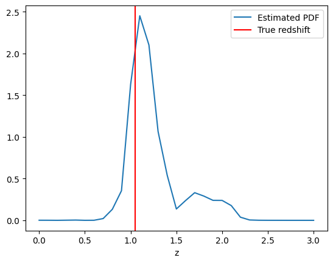
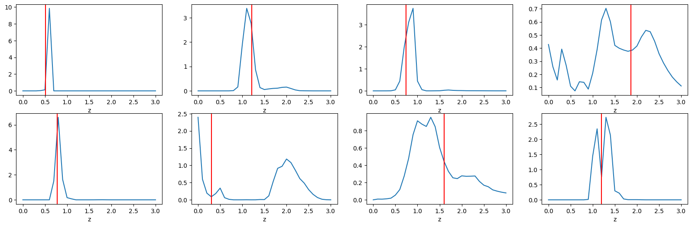
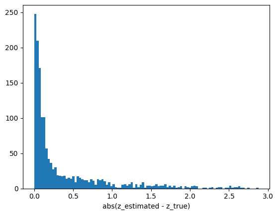
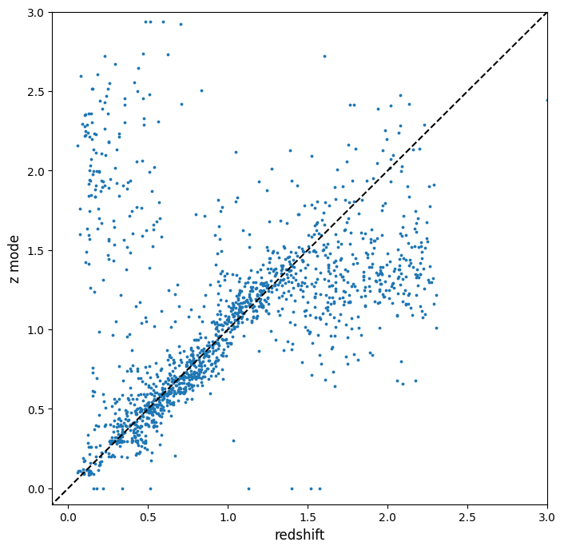

RAIL_Lephare example on LSST data
=================================

**Author:** Raphael Shirley, Edited by Tianqing Zhang

**Last successfully run:** May 16, 2025

This example notebook uses synthetic data produced by PZFlow in
combination with several predefined SED templates and filter definition
files.

.. code:: ipython3

    from rail.estimation.algos.lephare import LephareInformer, LephareEstimator
    import numpy as np
    import lephare as lp
    from rail.core.stage import RailStage
    from rail.core.data import TableHandle
    from rail.utils.path_utils import RAILDIR
    
    import matplotlib.pyplot as plt
    import os
    DS = RailStage.data_store
    DS.__class__.allow_overwrite = True

.. parsed-literal::

    LEPHAREDIR is being set to the default cache directory:
    /home/runner/.cache/lephare/data
    More than 1Gb may be written there.
    LEPHAREWORK is being set to the default cache directory:
    /home/runner/.cache/lephare/work
    Default work cache is already linked. 
    This is linked to the run directory:
    /home/runner/.cache/lephare/runs/20250916T065841

Here we load previously created synthetic data

.. code:: ipython3

    trainFile = os.path.join(RAILDIR, 'rail/examples_data/testdata/output_table_conv_train.hdf5')
    testFile = os.path.join(RAILDIR, 'rail/examples_data/testdata/output_table_conv_test.hdf5')
    traindata_io = DS.read_file("training_data", TableHandle, trainFile)
    testdata_io = DS.read_file("test_data", TableHandle, testFile)

Retrieve all the required filter and template files

One could add or take out bandpasses by editing the configuration file.

.. code:: ipython3

    lephare_config_file = os.path.join(RAILDIR, 'rail/examples_data/estimation_data/data/lsst.para')
    lephare_config = lp.read_config(lephare_config_file)
    
    lp.data_retrieval.get_auxiliary_data(keymap=lephare_config)

.. parsed-literal::

    Number of keywords read in the config file: 86

.. parsed-literal::

    Registry file downloaded and saved as data_registry.txt.

.. parsed-literal::

    Downloading file 'examples/output.para' from 'https://raw.githubusercontent.com/lephare-photoz/lephare-data/main/examples/output.para' to '/home/runner/.cache/lephare/data'.

.. parsed-literal::

    Downloading file 'alloutputkeys.txt' from 'https://raw.githubusercontent.com/lephare-photoz/lephare-data/main/alloutputkeys.txt' to '/home/runner/.cache/lephare/data'.

.. parsed-literal::

    Downloading file 'opa/tau00.out' from 'https://raw.githubusercontent.com/lephare-photoz/lephare-data/main/opa/tau00.out' to '/home/runner/.cache/lephare/data'.

.. parsed-literal::

    Downloading file 'opa/tau01.out' from 'https://raw.githubusercontent.com/lephare-photoz/lephare-data/main/opa/tau01.out' to '/home/runner/.cache/lephare/data'.

.. parsed-literal::

    Downloading file 'opa/OPACITY.dat' from 'https://raw.githubusercontent.com/lephare-photoz/lephare-data/main/opa/OPACITY.dat' to '/home/runner/.cache/lephare/data'.

.. parsed-literal::

    Downloading file 'opa/tau02.out' from 'https://raw.githubusercontent.com/lephare-photoz/lephare-data/main/opa/tau02.out' to '/home/runner/.cache/lephare/data'.

.. parsed-literal::

    Downloading file 'opa/tau03.out' from 'https://raw.githubusercontent.com/lephare-photoz/lephare-data/main/opa/tau03.out' to '/home/runner/.cache/lephare/data'.

.. parsed-literal::

    Downloading file 'opa/tau04.out' from 'https://raw.githubusercontent.com/lephare-photoz/lephare-data/main/opa/tau04.out' to '/home/runner/.cache/lephare/data'.

.. parsed-literal::

    Created directory: /home/runner/.cache/lephare/data/examples
    Created directory: /home/runner/.cache/lephare/data/filt/lsst
    Created directory: /home/runner/.cache/lephare/data/sed/STAR/BD
    Created directory: /home/runner/.cache/lephare/data/sed/GAL/BETHERMIN12
    Created directory: /home/runner/.cache/lephare/data/vega
    Created directory: /home/runner/.cache/lephare/data/ext
    Created directory: /home/runner/.cache/lephare/data/sed/GAL/COSMOS_SED
    Created directory: /home/runner/.cache/lephare/data/sed/STAR/WD
    Created directory: /home/runner/.cache/lephare/data/sed/STAR/LAGET
    Created directory: /home/runner/.cache/lephare/data/opa
    Created directory: /home/runner/.cache/lephare/data/sed/QSO/SALVATO09
    Created directory: /home/runner/.cache/lephare/data/sed/STAR/PICKLES
    Checking/downloading 421 files...

.. parsed-literal::

    Downloading file 'opa/tau05.out' from 'https://raw.githubusercontent.com/lephare-photoz/lephare-data/main/opa/tau05.out' to '/home/runner/.cache/lephare/data'.

.. parsed-literal::

    Downloading file 'opa/tau06.out' from 'https://raw.githubusercontent.com/lephare-photoz/lephare-data/main/opa/tau06.out' to '/home/runner/.cache/lephare/data'.

.. parsed-literal::

    Downloading file 'opa/tau07.out' from 'https://raw.githubusercontent.com/lephare-photoz/lephare-data/main/opa/tau07.out' to '/home/runner/.cache/lephare/data'.

.. parsed-literal::

    Downloading file 'opa/tau08.out' from 'https://raw.githubusercontent.com/lephare-photoz/lephare-data/main/opa/tau08.out' to '/home/runner/.cache/lephare/data'.

.. parsed-literal::

    Downloading file 'opa/tau09.out' from 'https://raw.githubusercontent.com/lephare-photoz/lephare-data/main/opa/tau09.out' to '/home/runner/.cache/lephare/data'.

.. parsed-literal::

    Downloading file 'opa/tau10.out' from 'https://raw.githubusercontent.com/lephare-photoz/lephare-data/main/opa/tau10.out' to '/home/runner/.cache/lephare/data'.

.. parsed-literal::

    Downloading file 'opa/tau11.out' from 'https://raw.githubusercontent.com/lephare-photoz/lephare-data/main/opa/tau11.out' to '/home/runner/.cache/lephare/data'.

.. parsed-literal::

    Downloading file 'opa/tau12.out' from 'https://raw.githubusercontent.com/lephare-photoz/lephare-data/main/opa/tau12.out' to '/home/runner/.cache/lephare/data'.

.. parsed-literal::

    Downloading file 'opa/tau13.out' from 'https://raw.githubusercontent.com/lephare-photoz/lephare-data/main/opa/tau13.out' to '/home/runner/.cache/lephare/data'.

.. parsed-literal::

    Downloading file 'opa/tau14.out' from 'https://raw.githubusercontent.com/lephare-photoz/lephare-data/main/opa/tau14.out' to '/home/runner/.cache/lephare/data'.

.. parsed-literal::

    Downloading file 'opa/tau15.out' from 'https://raw.githubusercontent.com/lephare-photoz/lephare-data/main/opa/tau15.out' to '/home/runner/.cache/lephare/data'.

.. parsed-literal::

    Downloading file 'opa/tau16.out' from 'https://raw.githubusercontent.com/lephare-photoz/lephare-data/main/opa/tau16.out' to '/home/runner/.cache/lephare/data'.

.. parsed-literal::

    Downloading file 'opa/tau17.out' from 'https://raw.githubusercontent.com/lephare-photoz/lephare-data/main/opa/tau17.out' to '/home/runner/.cache/lephare/data'.

.. parsed-literal::

    Downloading file 'opa/tau18.out' from 'https://raw.githubusercontent.com/lephare-photoz/lephare-data/main/opa/tau18.out' to '/home/runner/.cache/lephare/data'.

.. parsed-literal::

    Downloading file 'opa/tau19.out' from 'https://raw.githubusercontent.com/lephare-photoz/lephare-data/main/opa/tau19.out' to '/home/runner/.cache/lephare/data'.

.. parsed-literal::

    Downloading file 'opa/tau20.out' from 'https://raw.githubusercontent.com/lephare-photoz/lephare-data/main/opa/tau20.out' to '/home/runner/.cache/lephare/data'.

.. parsed-literal::

    Downloading file 'opa/tau21.out' from 'https://raw.githubusercontent.com/lephare-photoz/lephare-data/main/opa/tau21.out' to '/home/runner/.cache/lephare/data'.

.. parsed-literal::

    Downloading file 'opa/tau22.out' from 'https://raw.githubusercontent.com/lephare-photoz/lephare-data/main/opa/tau22.out' to '/home/runner/.cache/lephare/data'.

.. parsed-literal::

    Downloading file 'opa/tau23.out' from 'https://raw.githubusercontent.com/lephare-photoz/lephare-data/main/opa/tau23.out' to '/home/runner/.cache/lephare/data'.

.. parsed-literal::

    Downloading file 'opa/tau24.out' from 'https://raw.githubusercontent.com/lephare-photoz/lephare-data/main/opa/tau24.out' to '/home/runner/.cache/lephare/data'.

.. parsed-literal::

    Downloading file 'opa/tau25.out' from 'https://raw.githubusercontent.com/lephare-photoz/lephare-data/main/opa/tau25.out' to '/home/runner/.cache/lephare/data'.

.. parsed-literal::

    Downloading file 'opa/tau26.out' from 'https://raw.githubusercontent.com/lephare-photoz/lephare-data/main/opa/tau26.out' to '/home/runner/.cache/lephare/data'.

.. parsed-literal::

    Downloading file 'opa/tau27.out' from 'https://raw.githubusercontent.com/lephare-photoz/lephare-data/main/opa/tau27.out' to '/home/runner/.cache/lephare/data'.

.. parsed-literal::

    Downloading file 'opa/tau28.out' from 'https://raw.githubusercontent.com/lephare-photoz/lephare-data/main/opa/tau28.out' to '/home/runner/.cache/lephare/data'.

.. parsed-literal::

    Downloading file 'opa/tau29.out' from 'https://raw.githubusercontent.com/lephare-photoz/lephare-data/main/opa/tau29.out' to '/home/runner/.cache/lephare/data'.

.. parsed-literal::

    Downloading file 'opa/tau30.out' from 'https://raw.githubusercontent.com/lephare-photoz/lephare-data/main/opa/tau30.out' to '/home/runner/.cache/lephare/data'.

.. parsed-literal::

    Downloading file 'opa/tau31.out' from 'https://raw.githubusercontent.com/lephare-photoz/lephare-data/main/opa/tau31.out' to '/home/runner/.cache/lephare/data'.

.. parsed-literal::

    Downloading file 'opa/tau32.out' from 'https://raw.githubusercontent.com/lephare-photoz/lephare-data/main/opa/tau32.out' to '/home/runner/.cache/lephare/data'.

.. parsed-literal::

    Downloading file 'opa/tau33.out' from 'https://raw.githubusercontent.com/lephare-photoz/lephare-data/main/opa/tau33.out' to '/home/runner/.cache/lephare/data'.

.. parsed-literal::

    Downloading file 'opa/tau34.out' from 'https://raw.githubusercontent.com/lephare-photoz/lephare-data/main/opa/tau34.out' to '/home/runner/.cache/lephare/data'.

.. parsed-literal::

    Downloading file 'opa/tau35.out' from 'https://raw.githubusercontent.com/lephare-photoz/lephare-data/main/opa/tau35.out' to '/home/runner/.cache/lephare/data'.

.. parsed-literal::

    Downloading file 'opa/tau36.out' from 'https://raw.githubusercontent.com/lephare-photoz/lephare-data/main/opa/tau36.out' to '/home/runner/.cache/lephare/data'.

.. parsed-literal::

    Downloading file 'opa/tau37.out' from 'https://raw.githubusercontent.com/lephare-photoz/lephare-data/main/opa/tau37.out' to '/home/runner/.cache/lephare/data'.

.. parsed-literal::

    Downloading file 'opa/tau38.out' from 'https://raw.githubusercontent.com/lephare-photoz/lephare-data/main/opa/tau38.out' to '/home/runner/.cache/lephare/data'.

.. parsed-literal::

    Downloading file 'opa/tau39.out' from 'https://raw.githubusercontent.com/lephare-photoz/lephare-data/main/opa/tau39.out' to '/home/runner/.cache/lephare/data'.

.. parsed-literal::

    Downloading file 'opa/tau40.out' from 'https://raw.githubusercontent.com/lephare-photoz/lephare-data/main/opa/tau40.out' to '/home/runner/.cache/lephare/data'.

.. parsed-literal::

    Downloading file 'opa/tau41.out' from 'https://raw.githubusercontent.com/lephare-photoz/lephare-data/main/opa/tau41.out' to '/home/runner/.cache/lephare/data'.

.. parsed-literal::

    Downloading file 'opa/tau42.out' from 'https://raw.githubusercontent.com/lephare-photoz/lephare-data/main/opa/tau42.out' to '/home/runner/.cache/lephare/data'.

.. parsed-literal::

    Downloading file 'opa/tau43.out' from 'https://raw.githubusercontent.com/lephare-photoz/lephare-data/main/opa/tau43.out' to '/home/runner/.cache/lephare/data'.

.. parsed-literal::

    Downloading file 'opa/tau44.out' from 'https://raw.githubusercontent.com/lephare-photoz/lephare-data/main/opa/tau44.out' to '/home/runner/.cache/lephare/data'.

.. parsed-literal::

    Downloading file 'opa/tau45.out' from 'https://raw.githubusercontent.com/lephare-photoz/lephare-data/main/opa/tau45.out' to '/home/runner/.cache/lephare/data'.

.. parsed-literal::

    Downloading file 'opa/tau46.out' from 'https://raw.githubusercontent.com/lephare-photoz/lephare-data/main/opa/tau46.out' to '/home/runner/.cache/lephare/data'.

.. parsed-literal::

    Downloading file 'opa/tau47.out' from 'https://raw.githubusercontent.com/lephare-photoz/lephare-data/main/opa/tau47.out' to '/home/runner/.cache/lephare/data'.

.. parsed-literal::

    Downloading file 'opa/tau48.out' from 'https://raw.githubusercontent.com/lephare-photoz/lephare-data/main/opa/tau48.out' to '/home/runner/.cache/lephare/data'.

.. parsed-literal::

    Downloading file 'opa/tau49.out' from 'https://raw.githubusercontent.com/lephare-photoz/lephare-data/main/opa/tau49.out' to '/home/runner/.cache/lephare/data'.

.. parsed-literal::

    Downloading file 'opa/tau50.out' from 'https://raw.githubusercontent.com/lephare-photoz/lephare-data/main/opa/tau50.out' to '/home/runner/.cache/lephare/data'.

.. parsed-literal::

    Downloading file 'opa/tau51.out' from 'https://raw.githubusercontent.com/lephare-photoz/lephare-data/main/opa/tau51.out' to '/home/runner/.cache/lephare/data'.

.. parsed-literal::

    Downloading file 'opa/tau52.out' from 'https://raw.githubusercontent.com/lephare-photoz/lephare-data/main/opa/tau52.out' to '/home/runner/.cache/lephare/data'.

.. parsed-literal::

    Downloading file 'opa/tau53.out' from 'https://raw.githubusercontent.com/lephare-photoz/lephare-data/main/opa/tau53.out' to '/home/runner/.cache/lephare/data'.

.. parsed-literal::

    Downloading file 'opa/tau54.out' from 'https://raw.githubusercontent.com/lephare-photoz/lephare-data/main/opa/tau54.out' to '/home/runner/.cache/lephare/data'.

.. parsed-literal::

    Downloading file 'opa/tau55.out' from 'https://raw.githubusercontent.com/lephare-photoz/lephare-data/main/opa/tau55.out' to '/home/runner/.cache/lephare/data'.

.. parsed-literal::

    Downloading file 'opa/tau57.out' from 'https://raw.githubusercontent.com/lephare-photoz/lephare-data/main/opa/tau57.out' to '/home/runner/.cache/lephare/data'.

.. parsed-literal::

    Downloading file 'opa/tau56.out' from 'https://raw.githubusercontent.com/lephare-photoz/lephare-data/main/opa/tau56.out' to '/home/runner/.cache/lephare/data'.

.. parsed-literal::

    Downloading file 'opa/tau58.out' from 'https://raw.githubusercontent.com/lephare-photoz/lephare-data/main/opa/tau58.out' to '/home/runner/.cache/lephare/data'.

.. parsed-literal::

    Downloading file 'opa/tau59.out' from 'https://raw.githubusercontent.com/lephare-photoz/lephare-data/main/opa/tau59.out' to '/home/runner/.cache/lephare/data'.

.. parsed-literal::

    Downloading file 'opa/tau60.out' from 'https://raw.githubusercontent.com/lephare-photoz/lephare-data/main/opa/tau60.out' to '/home/runner/.cache/lephare/data'.

.. parsed-literal::

    Downloading file 'opa/tau61.out' from 'https://raw.githubusercontent.com/lephare-photoz/lephare-data/main/opa/tau61.out' to '/home/runner/.cache/lephare/data'.

.. parsed-literal::

    Downloading file 'opa/tau62.out' from 'https://raw.githubusercontent.com/lephare-photoz/lephare-data/main/opa/tau62.out' to '/home/runner/.cache/lephare/data'.

.. parsed-literal::

    Downloading file 'opa/tau63.out' from 'https://raw.githubusercontent.com/lephare-photoz/lephare-data/main/opa/tau63.out' to '/home/runner/.cache/lephare/data'.

.. parsed-literal::

    Downloading file 'opa/tau64.out' from 'https://raw.githubusercontent.com/lephare-photoz/lephare-data/main/opa/tau64.out' to '/home/runner/.cache/lephare/data'.

.. parsed-literal::

    Downloading file 'opa/tau65.out' from 'https://raw.githubusercontent.com/lephare-photoz/lephare-data/main/opa/tau65.out' to '/home/runner/.cache/lephare/data'.

.. parsed-literal::

    Downloading file 'opa/tau66.out' from 'https://raw.githubusercontent.com/lephare-photoz/lephare-data/main/opa/tau66.out' to '/home/runner/.cache/lephare/data'.

.. parsed-literal::

    Downloading file 'opa/tau67.out' from 'https://raw.githubusercontent.com/lephare-photoz/lephare-data/main/opa/tau67.out' to '/home/runner/.cache/lephare/data'.

.. parsed-literal::

    Downloading file 'opa/tau68.out' from 'https://raw.githubusercontent.com/lephare-photoz/lephare-data/main/opa/tau68.out' to '/home/runner/.cache/lephare/data'.

.. parsed-literal::

    Downloading file 'opa/tau69.out' from 'https://raw.githubusercontent.com/lephare-photoz/lephare-data/main/opa/tau69.out' to '/home/runner/.cache/lephare/data'.

.. parsed-literal::

    Downloading file 'opa/tau70.out' from 'https://raw.githubusercontent.com/lephare-photoz/lephare-data/main/opa/tau70.out' to '/home/runner/.cache/lephare/data'.

.. parsed-literal::

    Downloading file 'opa/tau71.out' from 'https://raw.githubusercontent.com/lephare-photoz/lephare-data/main/opa/tau71.out' to '/home/runner/.cache/lephare/data'.

.. parsed-literal::

    Downloading file 'opa/tau72.out' from 'https://raw.githubusercontent.com/lephare-photoz/lephare-data/main/opa/tau72.out' to '/home/runner/.cache/lephare/data'.

.. parsed-literal::

    Downloading file 'opa/tau73.out' from 'https://raw.githubusercontent.com/lephare-photoz/lephare-data/main/opa/tau73.out' to '/home/runner/.cache/lephare/data'.

.. parsed-literal::

    Downloading file 'opa/tau74.out' from 'https://raw.githubusercontent.com/lephare-photoz/lephare-data/main/opa/tau74.out' to '/home/runner/.cache/lephare/data'.

.. parsed-literal::

    Downloading file 'opa/tau75.out' from 'https://raw.githubusercontent.com/lephare-photoz/lephare-data/main/opa/tau75.out' to '/home/runner/.cache/lephare/data'.

.. parsed-literal::

    Downloading file 'opa/tau76.out' from 'https://raw.githubusercontent.com/lephare-photoz/lephare-data/main/opa/tau76.out' to '/home/runner/.cache/lephare/data'.

.. parsed-literal::

    Downloading file 'opa/tau77.out' from 'https://raw.githubusercontent.com/lephare-photoz/lephare-data/main/opa/tau77.out' to '/home/runner/.cache/lephare/data'.

.. parsed-literal::

    Downloading file 'opa/tau78.out' from 'https://raw.githubusercontent.com/lephare-photoz/lephare-data/main/opa/tau78.out' to '/home/runner/.cache/lephare/data'.

.. parsed-literal::

    Downloading file 'opa/tau79.out' from 'https://raw.githubusercontent.com/lephare-photoz/lephare-data/main/opa/tau79.out' to '/home/runner/.cache/lephare/data'.

.. parsed-literal::

    Downloading file 'opa/tau80.out' from 'https://raw.githubusercontent.com/lephare-photoz/lephare-data/main/opa/tau80.out' to '/home/runner/.cache/lephare/data'.

.. parsed-literal::

    Downloading file 'vega/BD+17.sed' from 'https://raw.githubusercontent.com/lephare-photoz/lephare-data/main/vega/BD+17.sed' to '/home/runner/.cache/lephare/data'.

.. parsed-literal::

    Downloading file 'vega/BD+17o4708.sed' from 'https://raw.githubusercontent.com/lephare-photoz/lephare-data/main/vega/BD+17o4708.sed' to '/home/runner/.cache/lephare/data'.

.. parsed-literal::

    Downloading file 'vega/SunLCB.sed' from 'https://raw.githubusercontent.com/lephare-photoz/lephare-data/main/vega/SunLCB.sed' to '/home/runner/.cache/lephare/data'.

.. parsed-literal::

    Downloading file 'vega/VegaLCB.sed' from 'https://raw.githubusercontent.com/lephare-photoz/lephare-data/main/vega/VegaLCB.sed' to '/home/runner/.cache/lephare/data'.

.. parsed-literal::

    Downloading file 'vega/a0v.sed' from 'https://raw.githubusercontent.com/lephare-photoz/lephare-data/main/vega/a0v.sed' to '/home/runner/.cache/lephare/data'.

.. parsed-literal::

    Downloading file 'vega/a0v_n.sed' from 'https://raw.githubusercontent.com/lephare-photoz/lephare-data/main/vega/a0v_n.sed' to '/home/runner/.cache/lephare/data'.

.. parsed-literal::

    Downloading file 'filt/lsst/total_u.pb' from 'https://raw.githubusercontent.com/lephare-photoz/lephare-data/main/filt/lsst/total_u.pb' to '/home/runner/.cache/lephare/data'.

.. parsed-literal::

    Downloading file 'filt/lsst/total_g.pb' from 'https://raw.githubusercontent.com/lephare-photoz/lephare-data/main/filt/lsst/total_g.pb' to '/home/runner/.cache/lephare/data'.

.. parsed-literal::

    Downloading file 'filt/lsst/total_r.pb' from 'https://raw.githubusercontent.com/lephare-photoz/lephare-data/main/filt/lsst/total_r.pb' to '/home/runner/.cache/lephare/data'.

.. parsed-literal::

    Downloading file 'filt/lsst/total_i.pb' from 'https://raw.githubusercontent.com/lephare-photoz/lephare-data/main/filt/lsst/total_i.pb' to '/home/runner/.cache/lephare/data'.

.. parsed-literal::

    Downloading file 'filt/lsst/total_z.pb' from 'https://raw.githubusercontent.com/lephare-photoz/lephare-data/main/filt/lsst/total_z.pb' to '/home/runner/.cache/lephare/data'.

.. parsed-literal::

    Downloading file 'filt/lsst/total_y.pb' from 'https://raw.githubusercontent.com/lephare-photoz/lephare-data/main/filt/lsst/total_y.pb' to '/home/runner/.cache/lephare/data'.

.. parsed-literal::

    Downloading file 'sed/STAR/STAR_MOD_ALL.list' from 'https://raw.githubusercontent.com/lephare-photoz/lephare-data/main/sed/STAR/STAR_MOD_ALL.list' to '/home/runner/.cache/lephare/data'.

.. parsed-literal::

    Downloading file 'sed/STAR/PICKLES/o5v.sed.ext' from 'https://raw.githubusercontent.com/lephare-photoz/lephare-data/main/sed/STAR/PICKLES/o5v.sed.ext' to '/home/runner/.cache/lephare/data'.

.. parsed-literal::

    Downloading file 'sed/STAR/PICKLES/o8iii.sed.ext' from 'https://raw.githubusercontent.com/lephare-photoz/lephare-data/main/sed/STAR/PICKLES/o8iii.sed.ext' to '/home/runner/.cache/lephare/data'.

.. parsed-literal::

    Downloading file 'sed/STAR/PICKLES/o9v.sed.ext' from 'https://raw.githubusercontent.com/lephare-photoz/lephare-data/main/sed/STAR/PICKLES/o9v.sed.ext' to '/home/runner/.cache/lephare/data'.

.. parsed-literal::

    Downloading file 'sed/STAR/PICKLES/b0i.sed.ext' from 'https://raw.githubusercontent.com/lephare-photoz/lephare-data/main/sed/STAR/PICKLES/b0i.sed.ext' to '/home/runner/.cache/lephare/data'.

.. parsed-literal::

    Downloading file 'sed/STAR/PICKLES/b0v.sed.ext' from 'https://raw.githubusercontent.com/lephare-photoz/lephare-data/main/sed/STAR/PICKLES/b0v.sed.ext' to '/home/runner/.cache/lephare/data'.

.. parsed-literal::

    Downloading file 'sed/STAR/PICKLES/b12iii.sed.ext' from 'https://raw.githubusercontent.com/lephare-photoz/lephare-data/main/sed/STAR/PICKLES/b12iii.sed.ext' to '/home/runner/.cache/lephare/data'.

.. parsed-literal::

    Downloading file 'sed/STAR/PICKLES/b1i.sed.ext' from 'https://raw.githubusercontent.com/lephare-photoz/lephare-data/main/sed/STAR/PICKLES/b1i.sed.ext' to '/home/runner/.cache/lephare/data'.

.. parsed-literal::

    Downloading file 'sed/STAR/PICKLES/b1v.sed.ext' from 'https://raw.githubusercontent.com/lephare-photoz/lephare-data/main/sed/STAR/PICKLES/b1v.sed.ext' to '/home/runner/.cache/lephare/data'.

.. parsed-literal::

    Downloading file 'sed/STAR/PICKLES/b2ii.sed.ext' from 'https://raw.githubusercontent.com/lephare-photoz/lephare-data/main/sed/STAR/PICKLES/b2ii.sed.ext' to '/home/runner/.cache/lephare/data'.

.. parsed-literal::

    Downloading file 'sed/STAR/PICKLES/b2iv.sed.ext' from 'https://raw.githubusercontent.com/lephare-photoz/lephare-data/main/sed/STAR/PICKLES/b2iv.sed.ext' to '/home/runner/.cache/lephare/data'.

.. parsed-literal::

    Downloading file 'sed/STAR/PICKLES/b3i.sed.ext' from 'https://raw.githubusercontent.com/lephare-photoz/lephare-data/main/sed/STAR/PICKLES/b3i.sed.ext' to '/home/runner/.cache/lephare/data'.

.. parsed-literal::

    Downloading file 'sed/STAR/PICKLES/b3iii.sed.ext' from 'https://raw.githubusercontent.com/lephare-photoz/lephare-data/main/sed/STAR/PICKLES/b3iii.sed.ext' to '/home/runner/.cache/lephare/data'.

.. parsed-literal::

    Downloading file 'sed/STAR/PICKLES/b3v.sed.ext' from 'https://raw.githubusercontent.com/lephare-photoz/lephare-data/main/sed/STAR/PICKLES/b3v.sed.ext' to '/home/runner/.cache/lephare/data'.

.. parsed-literal::

    Downloading file 'sed/STAR/PICKLES/b57v.sed.ext' from 'https://raw.githubusercontent.com/lephare-photoz/lephare-data/main/sed/STAR/PICKLES/b57v.sed.ext' to '/home/runner/.cache/lephare/data'.

.. parsed-literal::

    Downloading file 'sed/STAR/PICKLES/b5i.sed.ext' from 'https://raw.githubusercontent.com/lephare-photoz/lephare-data/main/sed/STAR/PICKLES/b5i.sed.ext' to '/home/runner/.cache/lephare/data'.

.. parsed-literal::

    Downloading file 'sed/STAR/PICKLES/b5ii.sed.ext' from 'https://raw.githubusercontent.com/lephare-photoz/lephare-data/main/sed/STAR/PICKLES/b5ii.sed.ext' to '/home/runner/.cache/lephare/data'.

.. parsed-literal::

    Downloading file 'sed/STAR/PICKLES/b5iii.sed.ext' from 'https://raw.githubusercontent.com/lephare-photoz/lephare-data/main/sed/STAR/PICKLES/b5iii.sed.ext' to '/home/runner/.cache/lephare/data'.

.. parsed-literal::

    Downloading file 'sed/STAR/PICKLES/b6iv.sed.ext' from 'https://raw.githubusercontent.com/lephare-photoz/lephare-data/main/sed/STAR/PICKLES/b6iv.sed.ext' to '/home/runner/.cache/lephare/data'.

.. parsed-literal::

    Downloading file 'sed/STAR/PICKLES/b8i.sed.ext' from 'https://raw.githubusercontent.com/lephare-photoz/lephare-data/main/sed/STAR/PICKLES/b8i.sed.ext' to '/home/runner/.cache/lephare/data'.

.. parsed-literal::

    Downloading file 'sed/STAR/PICKLES/b8v.sed.ext' from 'https://raw.githubusercontent.com/lephare-photoz/lephare-data/main/sed/STAR/PICKLES/b8v.sed.ext' to '/home/runner/.cache/lephare/data'.

.. parsed-literal::

    Downloading file 'sed/STAR/PICKLES/b9iii.sed.ext' from 'https://raw.githubusercontent.com/lephare-photoz/lephare-data/main/sed/STAR/PICKLES/b9iii.sed.ext' to '/home/runner/.cache/lephare/data'.

.. parsed-literal::

    Downloading file 'sed/STAR/PICKLES/b9v.sed.ext' from 'https://raw.githubusercontent.com/lephare-photoz/lephare-data/main/sed/STAR/PICKLES/b9v.sed.ext' to '/home/runner/.cache/lephare/data'.

.. parsed-literal::

    Downloading file 'sed/STAR/PICKLES/a0i.sed.ext' from 'https://raw.githubusercontent.com/lephare-photoz/lephare-data/main/sed/STAR/PICKLES/a0i.sed.ext' to '/home/runner/.cache/lephare/data'.

.. parsed-literal::

    Downloading file 'sed/STAR/PICKLES/a0iii.sed.ext' from 'https://raw.githubusercontent.com/lephare-photoz/lephare-data/main/sed/STAR/PICKLES/a0iii.sed.ext' to '/home/runner/.cache/lephare/data'.

.. parsed-literal::

    Downloading file 'sed/STAR/PICKLES/a0iv.sed.ext' from 'https://raw.githubusercontent.com/lephare-photoz/lephare-data/main/sed/STAR/PICKLES/a0iv.sed.ext' to '/home/runner/.cache/lephare/data'.

.. parsed-literal::

    Downloading file 'sed/STAR/PICKLES/a0v.sed.ext' from 'https://raw.githubusercontent.com/lephare-photoz/lephare-data/main/sed/STAR/PICKLES/a0v.sed.ext' to '/home/runner/.cache/lephare/data'.

.. parsed-literal::

    Downloading file 'sed/STAR/PICKLES/a2i.sed.ext' from 'https://raw.githubusercontent.com/lephare-photoz/lephare-data/main/sed/STAR/PICKLES/a2i.sed.ext' to '/home/runner/.cache/lephare/data'.

.. parsed-literal::

    Downloading file 'sed/STAR/PICKLES/a2v.sed.ext' from 'https://raw.githubusercontent.com/lephare-photoz/lephare-data/main/sed/STAR/PICKLES/a2v.sed.ext' to '/home/runner/.cache/lephare/data'.

.. parsed-literal::

    Downloading file 'sed/STAR/PICKLES/a3iii.sed.ext' from 'https://raw.githubusercontent.com/lephare-photoz/lephare-data/main/sed/STAR/PICKLES/a3iii.sed.ext' to '/home/runner/.cache/lephare/data'.

.. parsed-literal::

    Downloading file 'sed/STAR/PICKLES/a3v.sed.ext' from 'https://raw.githubusercontent.com/lephare-photoz/lephare-data/main/sed/STAR/PICKLES/a3v.sed.ext' to '/home/runner/.cache/lephare/data'.

.. parsed-literal::

    Downloading file 'sed/STAR/PICKLES/a47iv.sed.ext' from 'https://raw.githubusercontent.com/lephare-photoz/lephare-data/main/sed/STAR/PICKLES/a47iv.sed.ext' to '/home/runner/.cache/lephare/data'.

.. parsed-literal::

    Downloading file 'sed/STAR/PICKLES/a5iii.sed.ext' from 'https://raw.githubusercontent.com/lephare-photoz/lephare-data/main/sed/STAR/PICKLES/a5iii.sed.ext' to '/home/runner/.cache/lephare/data'.

.. parsed-literal::

    Downloading file 'sed/STAR/PICKLES/a5v.sed.ext' from 'https://raw.githubusercontent.com/lephare-photoz/lephare-data/main/sed/STAR/PICKLES/a5v.sed.ext' to '/home/runner/.cache/lephare/data'.

.. parsed-literal::

    Downloading file 'sed/STAR/PICKLES/a7iii.sed.ext' from 'https://raw.githubusercontent.com/lephare-photoz/lephare-data/main/sed/STAR/PICKLES/a7iii.sed.ext' to '/home/runner/.cache/lephare/data'.

.. parsed-literal::

    Downloading file 'sed/STAR/PICKLES/a7v.sed.ext' from 'https://raw.githubusercontent.com/lephare-photoz/lephare-data/main/sed/STAR/PICKLES/a7v.sed.ext' to '/home/runner/.cache/lephare/data'.

.. parsed-literal::

    Downloading file 'sed/STAR/PICKLES/f02iv.sed.ext' from 'https://raw.githubusercontent.com/lephare-photoz/lephare-data/main/sed/STAR/PICKLES/f02iv.sed.ext' to '/home/runner/.cache/lephare/data'.

.. parsed-literal::

    Downloading file 'sed/STAR/PICKLES/f0i.sed.ext' from 'https://raw.githubusercontent.com/lephare-photoz/lephare-data/main/sed/STAR/PICKLES/f0i.sed.ext' to '/home/runner/.cache/lephare/data'.

.. parsed-literal::

    Downloading file 'sed/STAR/PICKLES/f0ii.sed.ext' from 'https://raw.githubusercontent.com/lephare-photoz/lephare-data/main/sed/STAR/PICKLES/f0ii.sed.ext' to '/home/runner/.cache/lephare/data'.

.. parsed-literal::

    Downloading file 'sed/STAR/PICKLES/f0iii.sed.ext' from 'https://raw.githubusercontent.com/lephare-photoz/lephare-data/main/sed/STAR/PICKLES/f0iii.sed.ext' to '/home/runner/.cache/lephare/data'.

.. parsed-literal::

    Downloading file 'sed/STAR/PICKLES/f0v.sed.ext' from 'https://raw.githubusercontent.com/lephare-photoz/lephare-data/main/sed/STAR/PICKLES/f0v.sed.ext' to '/home/runner/.cache/lephare/data'.

.. parsed-literal::

    Downloading file 'sed/STAR/PICKLES/f2ii.sed.ext' from 'https://raw.githubusercontent.com/lephare-photoz/lephare-data/main/sed/STAR/PICKLES/f2ii.sed.ext' to '/home/runner/.cache/lephare/data'.

.. parsed-literal::

    Downloading file 'sed/STAR/PICKLES/f2iii.sed.ext' from 'https://raw.githubusercontent.com/lephare-photoz/lephare-data/main/sed/STAR/PICKLES/f2iii.sed.ext' to '/home/runner/.cache/lephare/data'.

.. parsed-literal::

    Downloading file 'sed/STAR/PICKLES/f5i.sed.ext' from 'https://raw.githubusercontent.com/lephare-photoz/lephare-data/main/sed/STAR/PICKLES/f5i.sed.ext' to '/home/runner/.cache/lephare/data'.

.. parsed-literal::

    Downloading file 'sed/STAR/PICKLES/f2v.sed.ext' from 'https://raw.githubusercontent.com/lephare-photoz/lephare-data/main/sed/STAR/PICKLES/f2v.sed.ext' to '/home/runner/.cache/lephare/data'.

.. parsed-literal::

    Downloading file 'sed/STAR/PICKLES/f5iii.sed.ext' from 'https://raw.githubusercontent.com/lephare-photoz/lephare-data/main/sed/STAR/PICKLES/f5iii.sed.ext' to '/home/runner/.cache/lephare/data'.

.. parsed-literal::

    Downloading file 'sed/STAR/PICKLES/f5iv.sed.ext' from 'https://raw.githubusercontent.com/lephare-photoz/lephare-data/main/sed/STAR/PICKLES/f5iv.sed.ext' to '/home/runner/.cache/lephare/data'.

.. parsed-literal::

    Downloading file 'sed/STAR/PICKLES/f5v.sed.ext' from 'https://raw.githubusercontent.com/lephare-photoz/lephare-data/main/sed/STAR/PICKLES/f5v.sed.ext' to '/home/runner/.cache/lephare/data'.

.. parsed-literal::

    Downloading file 'sed/STAR/PICKLES/wf5v.sed.ext' from 'https://raw.githubusercontent.com/lephare-photoz/lephare-data/main/sed/STAR/PICKLES/wf5v.sed.ext' to '/home/runner/.cache/lephare/data'.

.. parsed-literal::

    Downloading file 'sed/STAR/PICKLES/f6v.sed.ext' from 'https://raw.githubusercontent.com/lephare-photoz/lephare-data/main/sed/STAR/PICKLES/f6v.sed.ext' to '/home/runner/.cache/lephare/data'.

.. parsed-literal::

    Downloading file 'sed/STAR/PICKLES/rf6v.sed.ext' from 'https://raw.githubusercontent.com/lephare-photoz/lephare-data/main/sed/STAR/PICKLES/rf6v.sed.ext' to '/home/runner/.cache/lephare/data'.

.. parsed-literal::

    Downloading file 'sed/STAR/PICKLES/f8i.sed.ext' from 'https://raw.githubusercontent.com/lephare-photoz/lephare-data/main/sed/STAR/PICKLES/f8i.sed.ext' to '/home/runner/.cache/lephare/data'.

.. parsed-literal::

    Downloading file 'sed/STAR/PICKLES/f8iv.sed.ext' from 'https://raw.githubusercontent.com/lephare-photoz/lephare-data/main/sed/STAR/PICKLES/f8iv.sed.ext' to '/home/runner/.cache/lephare/data'.

.. parsed-literal::

    Downloading file 'sed/STAR/PICKLES/f8v.sed.ext' from 'https://raw.githubusercontent.com/lephare-photoz/lephare-data/main/sed/STAR/PICKLES/f8v.sed.ext' to '/home/runner/.cache/lephare/data'.

.. parsed-literal::

    Downloading file 'sed/STAR/PICKLES/wf8v.sed.ext' from 'https://raw.githubusercontent.com/lephare-photoz/lephare-data/main/sed/STAR/PICKLES/wf8v.sed.ext' to '/home/runner/.cache/lephare/data'.

.. parsed-literal::

    Downloading file 'sed/STAR/PICKLES/rf8v.sed.ext' from 'https://raw.githubusercontent.com/lephare-photoz/lephare-data/main/sed/STAR/PICKLES/rf8v.sed.ext' to '/home/runner/.cache/lephare/data'.

.. parsed-literal::

    Downloading file 'sed/STAR/PICKLES/g0i.sed.ext' from 'https://raw.githubusercontent.com/lephare-photoz/lephare-data/main/sed/STAR/PICKLES/g0i.sed.ext' to '/home/runner/.cache/lephare/data'.

.. parsed-literal::

    Downloading file 'sed/STAR/PICKLES/g0iii.sed.ext' from 'https://raw.githubusercontent.com/lephare-photoz/lephare-data/main/sed/STAR/PICKLES/g0iii.sed.ext' to '/home/runner/.cache/lephare/data'.

.. parsed-literal::

    Downloading file 'sed/STAR/PICKLES/g0iv.sed.ext' from 'https://raw.githubusercontent.com/lephare-photoz/lephare-data/main/sed/STAR/PICKLES/g0iv.sed.ext' to '/home/runner/.cache/lephare/data'.

.. parsed-literal::

    Downloading file 'sed/STAR/PICKLES/g0v.sed.ext' from 'https://raw.githubusercontent.com/lephare-photoz/lephare-data/main/sed/STAR/PICKLES/g0v.sed.ext' to '/home/runner/.cache/lephare/data'.

.. parsed-literal::

    Downloading file 'sed/STAR/PICKLES/wg0v.sed.ext' from 'https://raw.githubusercontent.com/lephare-photoz/lephare-data/main/sed/STAR/PICKLES/wg0v.sed.ext' to '/home/runner/.cache/lephare/data'.

.. parsed-literal::

    Downloading file 'sed/STAR/PICKLES/rg0v.sed.ext' from 'https://raw.githubusercontent.com/lephare-photoz/lephare-data/main/sed/STAR/PICKLES/rg0v.sed.ext' to '/home/runner/.cache/lephare/data'.

.. parsed-literal::

    Downloading file 'sed/STAR/PICKLES/g2i.sed.ext' from 'https://raw.githubusercontent.com/lephare-photoz/lephare-data/main/sed/STAR/PICKLES/g2i.sed.ext' to '/home/runner/.cache/lephare/data'.

.. parsed-literal::

    Downloading file 'sed/STAR/PICKLES/g2iv.sed.ext' from 'https://raw.githubusercontent.com/lephare-photoz/lephare-data/main/sed/STAR/PICKLES/g2iv.sed.ext' to '/home/runner/.cache/lephare/data'.

.. parsed-literal::

    Downloading file 'sed/STAR/PICKLES/g2v.sed.ext' from 'https://raw.githubusercontent.com/lephare-photoz/lephare-data/main/sed/STAR/PICKLES/g2v.sed.ext' to '/home/runner/.cache/lephare/data'.

.. parsed-literal::

    Downloading file 'sed/STAR/PICKLES/g5i.sed.ext' from 'https://raw.githubusercontent.com/lephare-photoz/lephare-data/main/sed/STAR/PICKLES/g5i.sed.ext' to '/home/runner/.cache/lephare/data'.

.. parsed-literal::

    Downloading file 'sed/STAR/PICKLES/g5ii.sed.ext' from 'https://raw.githubusercontent.com/lephare-photoz/lephare-data/main/sed/STAR/PICKLES/g5ii.sed.ext' to '/home/runner/.cache/lephare/data'.

.. parsed-literal::

    Downloading file 'sed/STAR/PICKLES/g5iii.sed.ext' from 'https://raw.githubusercontent.com/lephare-photoz/lephare-data/main/sed/STAR/PICKLES/g5iii.sed.ext' to '/home/runner/.cache/lephare/data'.

.. parsed-literal::

    Downloading file 'sed/STAR/PICKLES/wg5iii.sed.ext' from 'https://raw.githubusercontent.com/lephare-photoz/lephare-data/main/sed/STAR/PICKLES/wg5iii.sed.ext' to '/home/runner/.cache/lephare/data'.

.. parsed-literal::

    Downloading file 'sed/STAR/PICKLES/rg5iii.sed.ext' from 'https://raw.githubusercontent.com/lephare-photoz/lephare-data/main/sed/STAR/PICKLES/rg5iii.sed.ext' to '/home/runner/.cache/lephare/data'.

.. parsed-literal::

    Downloading file 'sed/STAR/PICKLES/g5iv.sed.ext' from 'https://raw.githubusercontent.com/lephare-photoz/lephare-data/main/sed/STAR/PICKLES/g5iv.sed.ext' to '/home/runner/.cache/lephare/data'.

.. parsed-literal::

    Downloading file 'sed/STAR/PICKLES/g5v.sed.ext' from 'https://raw.githubusercontent.com/lephare-photoz/lephare-data/main/sed/STAR/PICKLES/g5v.sed.ext' to '/home/runner/.cache/lephare/data'.

.. parsed-literal::

    Downloading file 'sed/STAR/PICKLES/wg5v.sed.ext' from 'https://raw.githubusercontent.com/lephare-photoz/lephare-data/main/sed/STAR/PICKLES/wg5v.sed.ext' to '/home/runner/.cache/lephare/data'.

.. parsed-literal::

    Downloading file 'sed/STAR/PICKLES/rg5v.sed.ext' from 'https://raw.githubusercontent.com/lephare-photoz/lephare-data/main/sed/STAR/PICKLES/rg5v.sed.ext' to '/home/runner/.cache/lephare/data'.

.. parsed-literal::

    Downloading file 'sed/STAR/PICKLES/g8i.sed.ext' from 'https://raw.githubusercontent.com/lephare-photoz/lephare-data/main/sed/STAR/PICKLES/g8i.sed.ext' to '/home/runner/.cache/lephare/data'.

.. parsed-literal::

    Downloading file 'sed/STAR/PICKLES/g8iii.sed.ext' from 'https://raw.githubusercontent.com/lephare-photoz/lephare-data/main/sed/STAR/PICKLES/g8iii.sed.ext' to '/home/runner/.cache/lephare/data'.

.. parsed-literal::

    Downloading file 'sed/STAR/PICKLES/wg8iii.sed.ext' from 'https://raw.githubusercontent.com/lephare-photoz/lephare-data/main/sed/STAR/PICKLES/wg8iii.sed.ext' to '/home/runner/.cache/lephare/data'.

.. parsed-literal::

    Downloading file 'sed/STAR/PICKLES/g8iv.sed.ext' from 'https://raw.githubusercontent.com/lephare-photoz/lephare-data/main/sed/STAR/PICKLES/g8iv.sed.ext' to '/home/runner/.cache/lephare/data'.

.. parsed-literal::

    Downloading file 'sed/STAR/PICKLES/g8v.sed.ext' from 'https://raw.githubusercontent.com/lephare-photoz/lephare-data/main/sed/STAR/PICKLES/g8v.sed.ext' to '/home/runner/.cache/lephare/data'.

.. parsed-literal::

    Downloading file 'sed/STAR/PICKLES/k01ii.sed.ext' from 'https://raw.githubusercontent.com/lephare-photoz/lephare-data/main/sed/STAR/PICKLES/k01ii.sed.ext' to '/home/runner/.cache/lephare/data'.

.. parsed-literal::

    Downloading file 'sed/STAR/PICKLES/k0iii.sed.ext' from 'https://raw.githubusercontent.com/lephare-photoz/lephare-data/main/sed/STAR/PICKLES/k0iii.sed.ext' to '/home/runner/.cache/lephare/data'.

.. parsed-literal::

    Downloading file 'sed/STAR/PICKLES/wk0iii.sed.ext' from 'https://raw.githubusercontent.com/lephare-photoz/lephare-data/main/sed/STAR/PICKLES/wk0iii.sed.ext' to '/home/runner/.cache/lephare/data'.

.. parsed-literal::

    Downloading file 'sed/STAR/PICKLES/rk0iii.sed.ext' from 'https://raw.githubusercontent.com/lephare-photoz/lephare-data/main/sed/STAR/PICKLES/rk0iii.sed.ext' to '/home/runner/.cache/lephare/data'.

.. parsed-literal::

    Downloading file 'sed/STAR/PICKLES/k0iv.sed.ext' from 'https://raw.githubusercontent.com/lephare-photoz/lephare-data/main/sed/STAR/PICKLES/k0iv.sed.ext' to '/home/runner/.cache/lephare/data'.

.. parsed-literal::

    Downloading file 'sed/STAR/PICKLES/k0v.sed.ext' from 'https://raw.githubusercontent.com/lephare-photoz/lephare-data/main/sed/STAR/PICKLES/k0v.sed.ext' to '/home/runner/.cache/lephare/data'.

.. parsed-literal::

    Downloading file 'sed/STAR/PICKLES/rk0v.sed.ext' from 'https://raw.githubusercontent.com/lephare-photoz/lephare-data/main/sed/STAR/PICKLES/rk0v.sed.ext' to '/home/runner/.cache/lephare/data'.

.. parsed-literal::

    Downloading file 'sed/STAR/PICKLES/k1iii.sed.ext' from 'https://raw.githubusercontent.com/lephare-photoz/lephare-data/main/sed/STAR/PICKLES/k1iii.sed.ext' to '/home/runner/.cache/lephare/data'.

.. parsed-literal::

    Downloading file 'sed/STAR/PICKLES/wk1iii.sed.ext' from 'https://raw.githubusercontent.com/lephare-photoz/lephare-data/main/sed/STAR/PICKLES/wk1iii.sed.ext' to '/home/runner/.cache/lephare/data'.

.. parsed-literal::

    Downloading file 'sed/STAR/PICKLES/rk1iii.sed.ext' from 'https://raw.githubusercontent.com/lephare-photoz/lephare-data/main/sed/STAR/PICKLES/rk1iii.sed.ext' to '/home/runner/.cache/lephare/data'.

.. parsed-literal::

    Downloading file 'sed/STAR/PICKLES/k1iv.sed.ext' from 'https://raw.githubusercontent.com/lephare-photoz/lephare-data/main/sed/STAR/PICKLES/k1iv.sed.ext' to '/home/runner/.cache/lephare/data'.

.. parsed-literal::

    Downloading file 'sed/STAR/PICKLES/k2i.sed.ext' from 'https://raw.githubusercontent.com/lephare-photoz/lephare-data/main/sed/STAR/PICKLES/k2i.sed.ext' to '/home/runner/.cache/lephare/data'.

.. parsed-literal::

    Downloading file 'sed/STAR/PICKLES/k2iii.sed.ext' from 'https://raw.githubusercontent.com/lephare-photoz/lephare-data/main/sed/STAR/PICKLES/k2iii.sed.ext' to '/home/runner/.cache/lephare/data'.

.. parsed-literal::

    Downloading file 'sed/STAR/PICKLES/wk2iii.sed.ext' from 'https://raw.githubusercontent.com/lephare-photoz/lephare-data/main/sed/STAR/PICKLES/wk2iii.sed.ext' to '/home/runner/.cache/lephare/data'.

.. parsed-literal::

    Downloading file 'sed/STAR/PICKLES/rk2iii.sed.ext' from 'https://raw.githubusercontent.com/lephare-photoz/lephare-data/main/sed/STAR/PICKLES/rk2iii.sed.ext' to '/home/runner/.cache/lephare/data'.

.. parsed-literal::

    Downloading file 'sed/STAR/PICKLES/k2v.sed.ext' from 'https://raw.githubusercontent.com/lephare-photoz/lephare-data/main/sed/STAR/PICKLES/k2v.sed.ext' to '/home/runner/.cache/lephare/data'.

.. parsed-literal::

    Downloading file 'sed/STAR/PICKLES/k34ii.sed.ext' from 'https://raw.githubusercontent.com/lephare-photoz/lephare-data/main/sed/STAR/PICKLES/k34ii.sed.ext' to '/home/runner/.cache/lephare/data'.

.. parsed-literal::

    Downloading file 'sed/STAR/PICKLES/k3i.sed.ext' from 'https://raw.githubusercontent.com/lephare-photoz/lephare-data/main/sed/STAR/PICKLES/k3i.sed.ext' to '/home/runner/.cache/lephare/data'.

.. parsed-literal::

    Downloading file 'sed/STAR/PICKLES/wk3iii.sed.ext' from 'https://raw.githubusercontent.com/lephare-photoz/lephare-data/main/sed/STAR/PICKLES/wk3iii.sed.ext' to '/home/runner/.cache/lephare/data'.

.. parsed-literal::

    Downloading file 'sed/STAR/PICKLES/k3iii.sed.ext' from 'https://raw.githubusercontent.com/lephare-photoz/lephare-data/main/sed/STAR/PICKLES/k3iii.sed.ext' to '/home/runner/.cache/lephare/data'.

.. parsed-literal::

    Downloading file 'sed/STAR/PICKLES/rk3iii.sed.ext' from 'https://raw.githubusercontent.com/lephare-photoz/lephare-data/main/sed/STAR/PICKLES/rk3iii.sed.ext' to '/home/runner/.cache/lephare/data'.

.. parsed-literal::

    Downloading file 'sed/STAR/PICKLES/k3iv.sed.ext' from 'https://raw.githubusercontent.com/lephare-photoz/lephare-data/main/sed/STAR/PICKLES/k3iv.sed.ext' to '/home/runner/.cache/lephare/data'.

.. parsed-literal::

    Downloading file 'sed/STAR/PICKLES/k3v.sed.ext' from 'https://raw.githubusercontent.com/lephare-photoz/lephare-data/main/sed/STAR/PICKLES/k3v.sed.ext' to '/home/runner/.cache/lephare/data'.

.. parsed-literal::

    Downloading file 'sed/STAR/PICKLES/k4i.sed.ext' from 'https://raw.githubusercontent.com/lephare-photoz/lephare-data/main/sed/STAR/PICKLES/k4i.sed.ext' to '/home/runner/.cache/lephare/data'.

.. parsed-literal::

    Downloading file 'sed/STAR/PICKLES/k4iii.sed.ext' from 'https://raw.githubusercontent.com/lephare-photoz/lephare-data/main/sed/STAR/PICKLES/k4iii.sed.ext' to '/home/runner/.cache/lephare/data'.

.. parsed-literal::

    Downloading file 'sed/STAR/PICKLES/wk4iii.sed.ext' from 'https://raw.githubusercontent.com/lephare-photoz/lephare-data/main/sed/STAR/PICKLES/wk4iii.sed.ext' to '/home/runner/.cache/lephare/data'.

.. parsed-literal::

    Downloading file 'sed/STAR/PICKLES/rk4iii.sed.ext' from 'https://raw.githubusercontent.com/lephare-photoz/lephare-data/main/sed/STAR/PICKLES/rk4iii.sed.ext' to '/home/runner/.cache/lephare/data'.

.. parsed-literal::

    Downloading file 'sed/STAR/PICKLES/k4v.sed.ext' from 'https://raw.githubusercontent.com/lephare-photoz/lephare-data/main/sed/STAR/PICKLES/k4v.sed.ext' to '/home/runner/.cache/lephare/data'.

.. parsed-literal::

    Downloading file 'sed/STAR/PICKLES/k5iii.sed.ext' from 'https://raw.githubusercontent.com/lephare-photoz/lephare-data/main/sed/STAR/PICKLES/k5iii.sed.ext' to '/home/runner/.cache/lephare/data'.

.. parsed-literal::

    Downloading file 'sed/STAR/PICKLES/rk5iii.sed.ext' from 'https://raw.githubusercontent.com/lephare-photoz/lephare-data/main/sed/STAR/PICKLES/rk5iii.sed.ext' to '/home/runner/.cache/lephare/data'.

.. parsed-literal::

    Downloading file 'sed/STAR/PICKLES/k5v.sed.ext' from 'https://raw.githubusercontent.com/lephare-photoz/lephare-data/main/sed/STAR/PICKLES/k5v.sed.ext' to '/home/runner/.cache/lephare/data'.

.. parsed-literal::

    Downloading file 'sed/STAR/PICKLES/k7v.sed.ext' from 'https://raw.githubusercontent.com/lephare-photoz/lephare-data/main/sed/STAR/PICKLES/k7v.sed.ext' to '/home/runner/.cache/lephare/data'.

.. parsed-literal::

    Downloading file 'sed/STAR/PICKLES/m0iii.sed.ext' from 'https://raw.githubusercontent.com/lephare-photoz/lephare-data/main/sed/STAR/PICKLES/m0iii.sed.ext' to '/home/runner/.cache/lephare/data'.

.. parsed-literal::

    Downloading file 'sed/STAR/PICKLES/m0v.sed.ext' from 'https://raw.githubusercontent.com/lephare-photoz/lephare-data/main/sed/STAR/PICKLES/m0v.sed.ext' to '/home/runner/.cache/lephare/data'.

.. parsed-literal::

    Downloading file 'sed/STAR/PICKLES/m1iii.sed.ext' from 'https://raw.githubusercontent.com/lephare-photoz/lephare-data/main/sed/STAR/PICKLES/m1iii.sed.ext' to '/home/runner/.cache/lephare/data'.

.. parsed-literal::

    Downloading file 'sed/STAR/PICKLES/m1v.sed.ext' from 'https://raw.githubusercontent.com/lephare-photoz/lephare-data/main/sed/STAR/PICKLES/m1v.sed.ext' to '/home/runner/.cache/lephare/data'.

.. parsed-literal::

    Downloading file 'sed/STAR/PICKLES/m2i.sed.ext' from 'https://raw.githubusercontent.com/lephare-photoz/lephare-data/main/sed/STAR/PICKLES/m2i.sed.ext' to '/home/runner/.cache/lephare/data'.

.. parsed-literal::

    Downloading file 'sed/STAR/PICKLES/m2iii.sed.ext' from 'https://raw.githubusercontent.com/lephare-photoz/lephare-data/main/sed/STAR/PICKLES/m2iii.sed.ext' to '/home/runner/.cache/lephare/data'.

.. parsed-literal::

    Downloading file 'sed/STAR/PICKLES/m2p5v.sed.ext' from 'https://raw.githubusercontent.com/lephare-photoz/lephare-data/main/sed/STAR/PICKLES/m2p5v.sed.ext' to '/home/runner/.cache/lephare/data'.

.. parsed-literal::

    Downloading file 'sed/STAR/PICKLES/m2v.sed.ext' from 'https://raw.githubusercontent.com/lephare-photoz/lephare-data/main/sed/STAR/PICKLES/m2v.sed.ext' to '/home/runner/.cache/lephare/data'.

.. parsed-literal::

    Downloading file 'sed/STAR/PICKLES/m3ii.sed.ext' from 'https://raw.githubusercontent.com/lephare-photoz/lephare-data/main/sed/STAR/PICKLES/m3ii.sed.ext' to '/home/runner/.cache/lephare/data'.

.. parsed-literal::

    Downloading file 'sed/STAR/PICKLES/m3iii.sed.ext' from 'https://raw.githubusercontent.com/lephare-photoz/lephare-data/main/sed/STAR/PICKLES/m3iii.sed.ext' to '/home/runner/.cache/lephare/data'.

.. parsed-literal::

    Downloading file 'sed/STAR/PICKLES/m3v.sed.ext' from 'https://raw.githubusercontent.com/lephare-photoz/lephare-data/main/sed/STAR/PICKLES/m3v.sed.ext' to '/home/runner/.cache/lephare/data'.

.. parsed-literal::

    Downloading file 'sed/STAR/PICKLES/m4iii.sed.ext' from 'https://raw.githubusercontent.com/lephare-photoz/lephare-data/main/sed/STAR/PICKLES/m4iii.sed.ext' to '/home/runner/.cache/lephare/data'.

.. parsed-literal::

    Downloading file 'sed/STAR/PICKLES/m4v.sed.ext' from 'https://raw.githubusercontent.com/lephare-photoz/lephare-data/main/sed/STAR/PICKLES/m4v.sed.ext' to '/home/runner/.cache/lephare/data'.

.. parsed-literal::

    Downloading file 'sed/STAR/PICKLES/m5iii.sed.ext' from 'https://raw.githubusercontent.com/lephare-photoz/lephare-data/main/sed/STAR/PICKLES/m5iii.sed.ext' to '/home/runner/.cache/lephare/data'.

.. parsed-literal::

    Downloading file 'sed/STAR/PICKLES/m5v.sed.ext' from 'https://raw.githubusercontent.com/lephare-photoz/lephare-data/main/sed/STAR/PICKLES/m5v.sed.ext' to '/home/runner/.cache/lephare/data'.

.. parsed-literal::

    Downloading file 'sed/STAR/PICKLES/m6iii.sed.ext' from 'https://raw.githubusercontent.com/lephare-photoz/lephare-data/main/sed/STAR/PICKLES/m6iii.sed.ext' to '/home/runner/.cache/lephare/data'.

.. parsed-literal::

    Downloading file 'sed/STAR/PICKLES/m6v.sed.ext' from 'https://raw.githubusercontent.com/lephare-photoz/lephare-data/main/sed/STAR/PICKLES/m6v.sed.ext' to '/home/runner/.cache/lephare/data'.

.. parsed-literal::

    Downloading file 'sed/STAR/PICKLES/m7iii.sed.ext' from 'https://raw.githubusercontent.com/lephare-photoz/lephare-data/main/sed/STAR/PICKLES/m7iii.sed.ext' to '/home/runner/.cache/lephare/data'.

.. parsed-literal::

    Downloading file 'sed/STAR/PICKLES/m8iii.sed.ext' from 'https://raw.githubusercontent.com/lephare-photoz/lephare-data/main/sed/STAR/PICKLES/m8iii.sed.ext' to '/home/runner/.cache/lephare/data'.

.. parsed-literal::

    Downloading file 'sed/STAR/PICKLES/m9iii.sed.ext' from 'https://raw.githubusercontent.com/lephare-photoz/lephare-data/main/sed/STAR/PICKLES/m9iii.sed.ext' to '/home/runner/.cache/lephare/data'.

.. parsed-literal::

    Downloading file 'sed/STAR/PICKLES/m10iii.sed.ext' from 'https://raw.githubusercontent.com/lephare-photoz/lephare-data/main/sed/STAR/PICKLES/m10iii.sed.ext' to '/home/runner/.cache/lephare/data'.

.. parsed-literal::

    Downloading file 'sed/STAR/WD/WDg191b2b.sed.ext' from 'https://raw.githubusercontent.com/lephare-photoz/lephare-data/main/sed/STAR/WD/WDg191b2b.sed.ext' to '/home/runner/.cache/lephare/data'.

.. parsed-literal::

    Downloading file 'sed/STAR/WD/WDgd153.sed.ext' from 'https://raw.githubusercontent.com/lephare-photoz/lephare-data/main/sed/STAR/WD/WDgd153.sed.ext' to '/home/runner/.cache/lephare/data'.

.. parsed-literal::

    Downloading file 'sed/STAR/WD/WDgd71.sed.ext' from 'https://raw.githubusercontent.com/lephare-photoz/lephare-data/main/sed/STAR/WD/WDgd71.sed.ext' to '/home/runner/.cache/lephare/data'.

.. parsed-literal::

    Downloading file 'sed/STAR/WD/WDhz43.sed.ext' from 'https://raw.githubusercontent.com/lephare-photoz/lephare-data/main/sed/STAR/WD/WDhz43.sed.ext' to '/home/runner/.cache/lephare/data'.

.. parsed-literal::

    Downloading file 'sed/STAR/LAGET/T3500G400.dat' from 'https://raw.githubusercontent.com/lephare-photoz/lephare-data/main/sed/STAR/LAGET/T3500G400.dat' to '/home/runner/.cache/lephare/data'.

.. parsed-literal::

    Downloading file 'sed/STAR/LAGET/T3750G400.dat' from 'https://raw.githubusercontent.com/lephare-photoz/lephare-data/main/sed/STAR/LAGET/T3750G400.dat' to '/home/runner/.cache/lephare/data'.

.. parsed-literal::

    Downloading file 'sed/STAR/LAGET/T4000G400.dat' from 'https://raw.githubusercontent.com/lephare-photoz/lephare-data/main/sed/STAR/LAGET/T4000G400.dat' to '/home/runner/.cache/lephare/data'.

.. parsed-literal::

    Downloading file 'sed/STAR/LAGET/T4250G400.dat' from 'https://raw.githubusercontent.com/lephare-photoz/lephare-data/main/sed/STAR/LAGET/T4250G400.dat' to '/home/runner/.cache/lephare/data'.

.. parsed-literal::

    Downloading file 'sed/STAR/LAGET/T4500G400.dat' from 'https://raw.githubusercontent.com/lephare-photoz/lephare-data/main/sed/STAR/LAGET/T4500G400.dat' to '/home/runner/.cache/lephare/data'.

.. parsed-literal::

    Downloading file 'sed/STAR/LAGET/T4750G400.dat' from 'https://raw.githubusercontent.com/lephare-photoz/lephare-data/main/sed/STAR/LAGET/T4750G400.dat' to '/home/runner/.cache/lephare/data'.

.. parsed-literal::

    Downloading file 'sed/STAR/LAGET/T5000G400.dat' from 'https://raw.githubusercontent.com/lephare-photoz/lephare-data/main/sed/STAR/LAGET/T5000G400.dat' to '/home/runner/.cache/lephare/data'.

.. parsed-literal::

    Downloading file 'sed/STAR/LAGET/T5250G400.dat' from 'https://raw.githubusercontent.com/lephare-photoz/lephare-data/main/sed/STAR/LAGET/T5250G400.dat' to '/home/runner/.cache/lephare/data'.

.. parsed-literal::

    Downloading file 'sed/STAR/LAGET/T5500G400.dat' from 'https://raw.githubusercontent.com/lephare-photoz/lephare-data/main/sed/STAR/LAGET/T5500G400.dat' to '/home/runner/.cache/lephare/data'.

.. parsed-literal::

    Downloading file 'sed/STAR/LAGET/T5750G400.dat' from 'https://raw.githubusercontent.com/lephare-photoz/lephare-data/main/sed/STAR/LAGET/T5750G400.dat' to '/home/runner/.cache/lephare/data'.

.. parsed-literal::

    Downloading file 'sed/STAR/LAGET/T6000G400.dat' from 'https://raw.githubusercontent.com/lephare-photoz/lephare-data/main/sed/STAR/LAGET/T6000G400.dat' to '/home/runner/.cache/lephare/data'.

.. parsed-literal::

    Downloading file 'sed/STAR/LAGET/T6250G400.dat' from 'https://raw.githubusercontent.com/lephare-photoz/lephare-data/main/sed/STAR/LAGET/T6250G400.dat' to '/home/runner/.cache/lephare/data'.

.. parsed-literal::

    Downloading file 'sed/STAR/LAGET/T6500G400.dat' from 'https://raw.githubusercontent.com/lephare-photoz/lephare-data/main/sed/STAR/LAGET/T6500G400.dat' to '/home/runner/.cache/lephare/data'.

.. parsed-literal::

    Downloading file 'sed/STAR/LAGET/T6750G400.dat' from 'https://raw.githubusercontent.com/lephare-photoz/lephare-data/main/sed/STAR/LAGET/T6750G400.dat' to '/home/runner/.cache/lephare/data'.

.. parsed-literal::

    Downloading file 'sed/STAR/LAGET/T7000G400.dat' from 'https://raw.githubusercontent.com/lephare-photoz/lephare-data/main/sed/STAR/LAGET/T7000G400.dat' to '/home/runner/.cache/lephare/data'.

.. parsed-literal::

    Downloading file 'sed/STAR/LAGET/T7250G400.dat' from 'https://raw.githubusercontent.com/lephare-photoz/lephare-data/main/sed/STAR/LAGET/T7250G400.dat' to '/home/runner/.cache/lephare/data'.

.. parsed-literal::

    Downloading file 'sed/STAR/LAGET/T7500G400.dat' from 'https://raw.githubusercontent.com/lephare-photoz/lephare-data/main/sed/STAR/LAGET/T7500G400.dat' to '/home/runner/.cache/lephare/data'.

.. parsed-literal::

    Downloading file 'sed/STAR/LAGET/T7750G400.dat' from 'https://raw.githubusercontent.com/lephare-photoz/lephare-data/main/sed/STAR/LAGET/T7750G400.dat' to '/home/runner/.cache/lephare/data'.

.. parsed-literal::

    Downloading file 'sed/STAR/LAGET/T8000G400.dat' from 'https://raw.githubusercontent.com/lephare-photoz/lephare-data/main/sed/STAR/LAGET/T8000G400.dat' to '/home/runner/.cache/lephare/data'.

.. parsed-literal::

    Downloading file 'sed/STAR/BD/lte05-4.5-0.0.AMES-dusty.7.sed' from 'https://raw.githubusercontent.com/lephare-photoz/lephare-data/main/sed/STAR/BD/lte05-4.5-0.0.AMES-dusty.7.sed' to '/home/runner/.cache/lephare/data'.

.. parsed-literal::

    Downloading file 'sed/STAR/BD/lte06-4.5-0.0.AMES-dusty.7.sed' from 'https://raw.githubusercontent.com/lephare-photoz/lephare-data/main/sed/STAR/BD/lte06-4.5-0.0.AMES-dusty.7.sed' to '/home/runner/.cache/lephare/data'.

.. parsed-literal::

    Downloading file 'sed/STAR/BD/lte07-4.5-0.0.AMES-dusty.7.sed' from 'https://raw.githubusercontent.com/lephare-photoz/lephare-data/main/sed/STAR/BD/lte07-4.5-0.0.AMES-dusty.7.sed' to '/home/runner/.cache/lephare/data'.

.. parsed-literal::

    Downloading file 'sed/STAR/BD/lte08-4.5-0.0.AMES-cond.7.sed' from 'https://raw.githubusercontent.com/lephare-photoz/lephare-data/main/sed/STAR/BD/lte08-4.5-0.0.AMES-cond.7.sed' to '/home/runner/.cache/lephare/data'.

.. parsed-literal::

    Downloading file 'sed/STAR/BD/lte08-4.5-0.0.AMES-dusty.7.sed' from 'https://raw.githubusercontent.com/lephare-photoz/lephare-data/main/sed/STAR/BD/lte08-4.5-0.0.AMES-dusty.7.sed' to '/home/runner/.cache/lephare/data'.

.. parsed-literal::

    Downloading file 'sed/STAR/BD/lte09-4.5-0.0.AMES-cond.7.sed' from 'https://raw.githubusercontent.com/lephare-photoz/lephare-data/main/sed/STAR/BD/lte09-4.5-0.0.AMES-cond.7.sed' to '/home/runner/.cache/lephare/data'.

.. parsed-literal::

    Downloading file 'sed/STAR/BD/lte09-4.5-0.0.AMES-dusty.7.sed' from 'https://raw.githubusercontent.com/lephare-photoz/lephare-data/main/sed/STAR/BD/lte09-4.5-0.0.AMES-dusty.7.sed' to '/home/runner/.cache/lephare/data'.

.. parsed-literal::

    Downloading file 'sed/STAR/BD/lte10-4.5-0.0.AMES-cond.7.sed' from 'https://raw.githubusercontent.com/lephare-photoz/lephare-data/main/sed/STAR/BD/lte10-4.5-0.0.AMES-cond.7.sed' to '/home/runner/.cache/lephare/data'.

.. parsed-literal::

    Downloading file 'sed/STAR/BD/lte10-4.5-0.0.AMES-dusty.7.sed' from 'https://raw.githubusercontent.com/lephare-photoz/lephare-data/main/sed/STAR/BD/lte10-4.5-0.0.AMES-dusty.7.sed' to '/home/runner/.cache/lephare/data'.

.. parsed-literal::

    Downloading file 'sed/STAR/BD/lte11-4.5-0.0.AMES-dusty.7.sed' from 'https://raw.githubusercontent.com/lephare-photoz/lephare-data/main/sed/STAR/BD/lte11-4.5-0.0.AMES-dusty.7.sed' to '/home/runner/.cache/lephare/data'.

.. parsed-literal::

    Downloading file 'sed/STAR/BD/lte12-4.5-0.0.AMES-cond.7.sed' from 'https://raw.githubusercontent.com/lephare-photoz/lephare-data/main/sed/STAR/BD/lte12-4.5-0.0.AMES-cond.7.sed' to '/home/runner/.cache/lephare/data'.

.. parsed-literal::

    Downloading file 'sed/STAR/BD/lte12-4.5-0.0.AMES-dusty.7.sed' from 'https://raw.githubusercontent.com/lephare-photoz/lephare-data/main/sed/STAR/BD/lte12-4.5-0.0.AMES-dusty.7.sed' to '/home/runner/.cache/lephare/data'.

.. parsed-literal::

    Downloading file 'sed/STAR/BD/lte13-4.5-0.0.AMES-cond.7.sed' from 'https://raw.githubusercontent.com/lephare-photoz/lephare-data/main/sed/STAR/BD/lte13-4.5-0.0.AMES-cond.7.sed' to '/home/runner/.cache/lephare/data'.

.. parsed-literal::

    Downloading file 'sed/STAR/BD/lte13-4.5-0.0.AMES-dusty.7.sed' from 'https://raw.githubusercontent.com/lephare-photoz/lephare-data/main/sed/STAR/BD/lte13-4.5-0.0.AMES-dusty.7.sed' to '/home/runner/.cache/lephare/data'.

.. parsed-literal::

    Downloading file 'sed/STAR/BD/lte14-4.5-0.0.AMES-cond.7.sed' from 'https://raw.githubusercontent.com/lephare-photoz/lephare-data/main/sed/STAR/BD/lte14-4.5-0.0.AMES-cond.7.sed' to '/home/runner/.cache/lephare/data'.

.. parsed-literal::

    Downloading file 'sed/STAR/BD/lte14-4.5-0.0.AMES-dusty.7.sed' from 'https://raw.githubusercontent.com/lephare-photoz/lephare-data/main/sed/STAR/BD/lte14-4.5-0.0.AMES-dusty.7.sed' to '/home/runner/.cache/lephare/data'.

.. parsed-literal::

    Downloading file 'sed/STAR/BD/lte15-4.5-0.0.AMES-cond.7.sed' from 'https://raw.githubusercontent.com/lephare-photoz/lephare-data/main/sed/STAR/BD/lte15-4.5-0.0.AMES-cond.7.sed' to '/home/runner/.cache/lephare/data'.

.. parsed-literal::

    Downloading file 'sed/STAR/BD/lte15-4.5-0.0.AMES-dusty.7.sed' from 'https://raw.githubusercontent.com/lephare-photoz/lephare-data/main/sed/STAR/BD/lte15-4.5-0.0.AMES-dusty.7.sed' to '/home/runner/.cache/lephare/data'.

.. parsed-literal::

    Downloading file 'sed/STAR/BD/lte16-4.5-0.0.AMES-cond.7.sed' from 'https://raw.githubusercontent.com/lephare-photoz/lephare-data/main/sed/STAR/BD/lte16-4.5-0.0.AMES-cond.7.sed' to '/home/runner/.cache/lephare/data'.

.. parsed-literal::

    Downloading file 'sed/STAR/BD/lte16-4.5-0.0.AMES-dusty.7.sed' from 'https://raw.githubusercontent.com/lephare-photoz/lephare-data/main/sed/STAR/BD/lte16-4.5-0.0.AMES-dusty.7.sed' to '/home/runner/.cache/lephare/data'.

.. parsed-literal::

    Downloading file 'sed/STAR/BD/lte17-4.5-0.0.AMES-cond.7.sed' from 'https://raw.githubusercontent.com/lephare-photoz/lephare-data/main/sed/STAR/BD/lte17-4.5-0.0.AMES-cond.7.sed' to '/home/runner/.cache/lephare/data'.

.. parsed-literal::

    Downloading file 'sed/STAR/BD/lte17-4.5-0.0.AMES-dusty.7.sed' from 'https://raw.githubusercontent.com/lephare-photoz/lephare-data/main/sed/STAR/BD/lte17-4.5-0.0.AMES-dusty.7.sed' to '/home/runner/.cache/lephare/data'.

.. parsed-literal::

    Downloading file 'sed/STAR/BD/lte18-4.5-0.0.AMES-cond.7.sed' from 'https://raw.githubusercontent.com/lephare-photoz/lephare-data/main/sed/STAR/BD/lte18-4.5-0.0.AMES-cond.7.sed' to '/home/runner/.cache/lephare/data'.

.. parsed-literal::

    Downloading file 'sed/STAR/BD/lte18-4.5-0.0.AMES-dusty.7.sed' from 'https://raw.githubusercontent.com/lephare-photoz/lephare-data/main/sed/STAR/BD/lte18-4.5-0.0.AMES-dusty.7.sed' to '/home/runner/.cache/lephare/data'.

.. parsed-literal::

    Downloading file 'sed/STAR/BD/lte19-4.5-0.0.AMES-cond.7.sed' from 'https://raw.githubusercontent.com/lephare-photoz/lephare-data/main/sed/STAR/BD/lte19-4.5-0.0.AMES-cond.7.sed' to '/home/runner/.cache/lephare/data'.

.. parsed-literal::

    Downloading file 'sed/STAR/BD/lte19-4.5-0.0.AMES-dusty.7.sed' from 'https://raw.githubusercontent.com/lephare-photoz/lephare-data/main/sed/STAR/BD/lte19-4.5-0.0.AMES-dusty.7.sed' to '/home/runner/.cache/lephare/data'.

.. parsed-literal::

    Downloading file 'sed/STAR/BD/lte20-4.5-0.0.AMES-cond.7.sed' from 'https://raw.githubusercontent.com/lephare-photoz/lephare-data/main/sed/STAR/BD/lte20-4.5-0.0.AMES-cond.7.sed' to '/home/runner/.cache/lephare/data'.

.. parsed-literal::

    Downloading file 'sed/STAR/BD/lte20-4.5-0.0.AMES-dusty.7.sed' from 'https://raw.githubusercontent.com/lephare-photoz/lephare-data/main/sed/STAR/BD/lte20-4.5-0.0.AMES-dusty.7.sed' to '/home/runner/.cache/lephare/data'.

.. parsed-literal::

    Downloading file 'sed/STAR/BD/lte21-4.5-0.0.AMES-cond.7.sed' from 'https://raw.githubusercontent.com/lephare-photoz/lephare-data/main/sed/STAR/BD/lte21-4.5-0.0.AMES-cond.7.sed' to '/home/runner/.cache/lephare/data'.

.. parsed-literal::

    Downloading file 'sed/STAR/BD/lte22-4.5-0.0.AMES-cond.7.sed' from 'https://raw.githubusercontent.com/lephare-photoz/lephare-data/main/sed/STAR/BD/lte22-4.5-0.0.AMES-cond.7.sed' to '/home/runner/.cache/lephare/data'.

.. parsed-literal::

    Downloading file 'sed/STAR/BD/lte22-4.5-0.0.AMES-dusty.7.sed' from 'https://raw.githubusercontent.com/lephare-photoz/lephare-data/main/sed/STAR/BD/lte22-4.5-0.0.AMES-dusty.7.sed' to '/home/runner/.cache/lephare/data'.

.. parsed-literal::

    Downloading file 'sed/STAR/BD/lte23-4.5-0.0.AMES-cond.7.sed' from 'https://raw.githubusercontent.com/lephare-photoz/lephare-data/main/sed/STAR/BD/lte23-4.5-0.0.AMES-cond.7.sed' to '/home/runner/.cache/lephare/data'.

.. parsed-literal::

    Downloading file 'sed/STAR/BD/lte23-4.5-0.0.AMES-dusty.7.sed' from 'https://raw.githubusercontent.com/lephare-photoz/lephare-data/main/sed/STAR/BD/lte23-4.5-0.0.AMES-dusty.7.sed' to '/home/runner/.cache/lephare/data'.

.. parsed-literal::

    Downloading file 'sed/STAR/BD/lte24-4.5-0.0.AMES-cond.7.sed' from 'https://raw.githubusercontent.com/lephare-photoz/lephare-data/main/sed/STAR/BD/lte24-4.5-0.0.AMES-cond.7.sed' to '/home/runner/.cache/lephare/data'.

.. parsed-literal::

    Downloading file 'sed/STAR/BD/lte24-4.5-0.0.AMES-dusty.7.sed' from 'https://raw.githubusercontent.com/lephare-photoz/lephare-data/main/sed/STAR/BD/lte24-4.5-0.0.AMES-dusty.7.sed' to '/home/runner/.cache/lephare/data'.

.. parsed-literal::

    Downloading file 'sed/STAR/BD/lte25-4.5-0.0.AMES-cond.7.sed' from 'https://raw.githubusercontent.com/lephare-photoz/lephare-data/main/sed/STAR/BD/lte25-4.5-0.0.AMES-cond.7.sed' to '/home/runner/.cache/lephare/data'.

.. parsed-literal::

    Downloading file 'sed/STAR/BD/lte25-4.5-0.0.AMES-dusty.7.sed' from 'https://raw.githubusercontent.com/lephare-photoz/lephare-data/main/sed/STAR/BD/lte25-4.5-0.0.AMES-dusty.7.sed' to '/home/runner/.cache/lephare/data'.

.. parsed-literal::

    Downloading file 'sed/STAR/BD/lte26-4.5-0.0.AMES-cond.7.sed' from 'https://raw.githubusercontent.com/lephare-photoz/lephare-data/main/sed/STAR/BD/lte26-4.5-0.0.AMES-cond.7.sed' to '/home/runner/.cache/lephare/data'.

.. parsed-literal::

    Downloading file 'sed/STAR/BD/lte26-4.5-0.0.AMES-dusty.7.sed' from 'https://raw.githubusercontent.com/lephare-photoz/lephare-data/main/sed/STAR/BD/lte26-4.5-0.0.AMES-dusty.7.sed' to '/home/runner/.cache/lephare/data'.

.. parsed-literal::

    Downloading file 'sed/STAR/BD/lte27-4.5-0.0.AMES-dusty.7.sed' from 'https://raw.githubusercontent.com/lephare-photoz/lephare-data/main/sed/STAR/BD/lte27-4.5-0.0.AMES-dusty.7.sed' to '/home/runner/.cache/lephare/data'.

.. parsed-literal::

    Downloading file 'sed/STAR/BD/lte28-4.5-0.0.AMES-dusty.7.sed' from 'https://raw.githubusercontent.com/lephare-photoz/lephare-data/main/sed/STAR/BD/lte28-4.5-0.0.AMES-dusty.7.sed' to '/home/runner/.cache/lephare/data'.

.. parsed-literal::

    Downloading file 'sed/STAR/BD/lte29-4.5-0.0.AMES-dusty.7.sed' from 'https://raw.githubusercontent.com/lephare-photoz/lephare-data/main/sed/STAR/BD/lte29-4.5-0.0.AMES-dusty.7.sed' to '/home/runner/.cache/lephare/data'.

.. parsed-literal::

    Downloading file 'sed/STAR/BD/lte30-4.5-0.0.AMES-dusty.7.sed' from 'https://raw.githubusercontent.com/lephare-photoz/lephare-data/main/sed/STAR/BD/lte30-4.5-0.0.AMES-dusty.7.sed' to '/home/runner/.cache/lephare/data'.

.. parsed-literal::

    Downloading file 'sed/STAR/BD/lte31-4.5-0.0.AMES-dusty.7.sed' from 'https://raw.githubusercontent.com/lephare-photoz/lephare-data/main/sed/STAR/BD/lte31-4.5-0.0.AMES-dusty.7.sed' to '/home/runner/.cache/lephare/data'.

.. parsed-literal::

    Downloading file 'sed/STAR/BD/lte32-4.5-0.0.AMES-dusty.7.sed' from 'https://raw.githubusercontent.com/lephare-photoz/lephare-data/main/sed/STAR/BD/lte32-4.5-0.0.AMES-dusty.7.sed' to '/home/runner/.cache/lephare/data'.

.. parsed-literal::

    Downloading file 'sed/STAR/BD/lte33-4.5-0.0.AMES-dusty.7.sed' from 'https://raw.githubusercontent.com/lephare-photoz/lephare-data/main/sed/STAR/BD/lte33-4.5-0.0.AMES-dusty.7.sed' to '/home/runner/.cache/lephare/data'.

.. parsed-literal::

    Downloading file 'sed/STAR/BD/lte34-4.5-0.0.AMES-dusty.7.sed' from 'https://raw.githubusercontent.com/lephare-photoz/lephare-data/main/sed/STAR/BD/lte34-4.5-0.0.AMES-dusty.7.sed' to '/home/runner/.cache/lephare/data'.

.. parsed-literal::

    Downloading file 'sed/STAR/BD/lte35-4.5-0.0.AMES-dusty.7.sed' from 'https://raw.githubusercontent.com/lephare-photoz/lephare-data/main/sed/STAR/BD/lte35-4.5-0.0.AMES-dusty.7.sed' to '/home/runner/.cache/lephare/data'.

.. parsed-literal::

    Downloading file 'sed/STAR/BD/lte36-4.5-0.0.AMES-dusty.7.sed' from 'https://raw.githubusercontent.com/lephare-photoz/lephare-data/main/sed/STAR/BD/lte36-4.5-0.0.AMES-dusty.7.sed' to '/home/runner/.cache/lephare/data'.

.. parsed-literal::

    Downloading file 'sed/STAR/BD/lte37-4.5-0.0.AMES-dusty.7.sed' from 'https://raw.githubusercontent.com/lephare-photoz/lephare-data/main/sed/STAR/BD/lte37-4.5-0.0.AMES-dusty.7.sed' to '/home/runner/.cache/lephare/data'.

.. parsed-literal::

    Downloading file 'sed/STAR/BD/lte38-4.5-0.0.AMES-dusty.7.sed' from 'https://raw.githubusercontent.com/lephare-photoz/lephare-data/main/sed/STAR/BD/lte38-4.5-0.0.AMES-dusty.7.sed' to '/home/runner/.cache/lephare/data'.

.. parsed-literal::

    Downloading file 'sed/STAR/BD/lte39-4.5-0.0.AMES-dusty.7.sed' from 'https://raw.githubusercontent.com/lephare-photoz/lephare-data/main/sed/STAR/BD/lte39-4.5-0.0.AMES-dusty.7.sed' to '/home/runner/.cache/lephare/data'.

.. parsed-literal::

    Downloading file 'sed/STAR/BD/lte22-4.5-0.0.NextGen.7.sed' from 'https://raw.githubusercontent.com/lephare-photoz/lephare-data/main/sed/STAR/BD/lte22-4.5-0.0.NextGen.7.sed' to '/home/runner/.cache/lephare/data'.

.. parsed-literal::

    Downloading file 'sed/STAR/BD/lte23-4.5-0.0.NextGen.7.sed' from 'https://raw.githubusercontent.com/lephare-photoz/lephare-data/main/sed/STAR/BD/lte23-4.5-0.0.NextGen.7.sed' to '/home/runner/.cache/lephare/data'.

.. parsed-literal::

    Downloading file 'sed/STAR/BD/lte24-4.5-0.0.NextGen.7.sed' from 'https://raw.githubusercontent.com/lephare-photoz/lephare-data/main/sed/STAR/BD/lte24-4.5-0.0.NextGen.7.sed' to '/home/runner/.cache/lephare/data'.

.. parsed-literal::

    Downloading file 'sed/STAR/BD/lte25-4.5-0.0.NextGen.7.sed' from 'https://raw.githubusercontent.com/lephare-photoz/lephare-data/main/sed/STAR/BD/lte25-4.5-0.0.NextGen.7.sed' to '/home/runner/.cache/lephare/data'.

.. parsed-literal::

    Downloading file 'sed/STAR/BD/lte26-4.5-0.0.NextGen.7.sed' from 'https://raw.githubusercontent.com/lephare-photoz/lephare-data/main/sed/STAR/BD/lte26-4.5-0.0.NextGen.7.sed' to '/home/runner/.cache/lephare/data'.

.. parsed-literal::

    Downloading file 'sed/STAR/BD/lte27-4.5-0.0.NextGen.7.sed' from 'https://raw.githubusercontent.com/lephare-photoz/lephare-data/main/sed/STAR/BD/lte27-4.5-0.0.NextGen.7.sed' to '/home/runner/.cache/lephare/data'.

.. parsed-literal::

    Downloading file 'sed/STAR/BD/lte28-4.5-0.0.NextGen.7.sed' from 'https://raw.githubusercontent.com/lephare-photoz/lephare-data/main/sed/STAR/BD/lte28-4.5-0.0.NextGen.7.sed' to '/home/runner/.cache/lephare/data'.

.. parsed-literal::

    Downloading file 'sed/STAR/BD/lte29-4.5-0.0.NextGen.7.sed' from 'https://raw.githubusercontent.com/lephare-photoz/lephare-data/main/sed/STAR/BD/lte29-4.5-0.0.NextGen.7.sed' to '/home/runner/.cache/lephare/data'.

.. parsed-literal::

    Downloading file 'sed/STAR/BD/lte30-4.5-0.0.NextGen.7.sed' from 'https://raw.githubusercontent.com/lephare-photoz/lephare-data/main/sed/STAR/BD/lte30-4.5-0.0.NextGen.7.sed' to '/home/runner/.cache/lephare/data'.

.. parsed-literal::

    Downloading file 'sed/STAR/BD/lte31-4.5-0.0.NextGen.7.sed' from 'https://raw.githubusercontent.com/lephare-photoz/lephare-data/main/sed/STAR/BD/lte31-4.5-0.0.NextGen.7.sed' to '/home/runner/.cache/lephare/data'.

.. parsed-literal::

    Downloading file 'sed/STAR/BD/lte32-4.5-0.0.NextGen.7.sed' from 'https://raw.githubusercontent.com/lephare-photoz/lephare-data/main/sed/STAR/BD/lte32-4.5-0.0.NextGen.7.sed' to '/home/runner/.cache/lephare/data'.

.. parsed-literal::

    Downloading file 'sed/STAR/BD/lte33-4.5-0.0.NextGen.7.sed' from 'https://raw.githubusercontent.com/lephare-photoz/lephare-data/main/sed/STAR/BD/lte33-4.5-0.0.NextGen.7.sed' to '/home/runner/.cache/lephare/data'.

.. parsed-literal::

    Downloading file 'sed/STAR/BD/lte34-4.5-0.0.NextGen.7.sed' from 'https://raw.githubusercontent.com/lephare-photoz/lephare-data/main/sed/STAR/BD/lte34-4.5-0.0.NextGen.7.sed' to '/home/runner/.cache/lephare/data'.

.. parsed-literal::

    Downloading file 'sed/STAR/BD/lte35-4.5-0.0.NextGen.7.sed' from 'https://raw.githubusercontent.com/lephare-photoz/lephare-data/main/sed/STAR/BD/lte35-4.5-0.0.NextGen.7.sed' to '/home/runner/.cache/lephare/data'.

.. parsed-literal::

    Downloading file 'sed/STAR/BD/lte36-4.5-0.0.NextGen.7.sed' from 'https://raw.githubusercontent.com/lephare-photoz/lephare-data/main/sed/STAR/BD/lte36-4.5-0.0.NextGen.7.sed' to '/home/runner/.cache/lephare/data'.

.. parsed-literal::

    Downloading file 'sed/STAR/BD/lte37-4.5-0.0.NextGen.7.sed' from 'https://raw.githubusercontent.com/lephare-photoz/lephare-data/main/sed/STAR/BD/lte37-4.5-0.0.NextGen.7.sed' to '/home/runner/.cache/lephare/data'.

.. parsed-literal::

    Downloading file 'sed/STAR/BD/lte38-4.5-0.0.NextGen.7.sed' from 'https://raw.githubusercontent.com/lephare-photoz/lephare-data/main/sed/STAR/BD/lte38-4.5-0.0.NextGen.7.sed' to '/home/runner/.cache/lephare/data'.

.. parsed-literal::

    Downloading file 'sed/STAR/BD/lte39-4.5-0.0.NextGen.7.sed' from 'https://raw.githubusercontent.com/lephare-photoz/lephare-data/main/sed/STAR/BD/lte39-4.5-0.0.NextGen.7.sed' to '/home/runner/.cache/lephare/data'.

.. parsed-literal::

    Downloading file 'sed/STAR/BD/lte40-4.5-0.0.NextGen.7.sed' from 'https://raw.githubusercontent.com/lephare-photoz/lephare-data/main/sed/STAR/BD/lte40-4.5-0.0.NextGen.7.sed' to '/home/runner/.cache/lephare/data'.

.. parsed-literal::

    Downloading file 'sed/STAR/BD/lte42-4.5-0.0.NextGen.7.sed' from 'https://raw.githubusercontent.com/lephare-photoz/lephare-data/main/sed/STAR/BD/lte42-4.5-0.0.NextGen.7.sed' to '/home/runner/.cache/lephare/data'.

.. parsed-literal::

    Downloading file 'sed/STAR/BD/lte44-4.5-0.0.NextGen.7.sed' from 'https://raw.githubusercontent.com/lephare-photoz/lephare-data/main/sed/STAR/BD/lte44-4.5-0.0.NextGen.7.sed' to '/home/runner/.cache/lephare/data'.

.. parsed-literal::

    Downloading file 'sed/STAR/BD/lte46-4.5-0.0.NextGen.7.sed' from 'https://raw.githubusercontent.com/lephare-photoz/lephare-data/main/sed/STAR/BD/lte46-4.5-0.0.NextGen.7.sed' to '/home/runner/.cache/lephare/data'.

.. parsed-literal::

    Downloading file 'sed/STAR/BD/lte48-4.5-0.0.NextGen.7.sed' from 'https://raw.githubusercontent.com/lephare-photoz/lephare-data/main/sed/STAR/BD/lte48-4.5-0.0.NextGen.7.sed' to '/home/runner/.cache/lephare/data'.

.. parsed-literal::

    Downloading file 'sed/STAR/BD/lte50-4.5-0.0.NextGen.7.sed' from 'https://raw.githubusercontent.com/lephare-photoz/lephare-data/main/sed/STAR/BD/lte50-4.5-0.0.NextGen.7.sed' to '/home/runner/.cache/lephare/data'.

.. parsed-literal::

    Downloading file 'sed/STAR/BD/lte52-4.5-0.0.NextGen.7.sed' from 'https://raw.githubusercontent.com/lephare-photoz/lephare-data/main/sed/STAR/BD/lte52-4.5-0.0.NextGen.7.sed' to '/home/runner/.cache/lephare/data'.

.. parsed-literal::

    Downloading file 'sed/STAR/BD/lte54-4.5-0.0.NextGen.7.sed' from 'https://raw.githubusercontent.com/lephare-photoz/lephare-data/main/sed/STAR/BD/lte54-4.5-0.0.NextGen.7.sed' to '/home/runner/.cache/lephare/data'.

.. parsed-literal::

    Downloading file 'sed/STAR/BD/lte56-4.5-0.0.NextGen.7.sed' from 'https://raw.githubusercontent.com/lephare-photoz/lephare-data/main/sed/STAR/BD/lte56-4.5-0.0.NextGen.7.sed' to '/home/runner/.cache/lephare/data'.

.. parsed-literal::

    Downloading file 'sed/STAR/BD/lte58-4.5-0.0.NextGen.7.sed' from 'https://raw.githubusercontent.com/lephare-photoz/lephare-data/main/sed/STAR/BD/lte58-4.5-0.0.NextGen.7.sed' to '/home/runner/.cache/lephare/data'.

.. parsed-literal::

    Downloading file 'sed/STAR/BD/lte60-4.5-0.0.NextGen.7.sed' from 'https://raw.githubusercontent.com/lephare-photoz/lephare-data/main/sed/STAR/BD/lte60-4.5-0.0.NextGen.7.sed' to '/home/runner/.cache/lephare/data'.

.. parsed-literal::

    Downloading file 'sed/STAR/BD/lte62-4.5-0.0.NextGen.7.sed' from 'https://raw.githubusercontent.com/lephare-photoz/lephare-data/main/sed/STAR/BD/lte62-4.5-0.0.NextGen.7.sed' to '/home/runner/.cache/lephare/data'.

.. parsed-literal::

    Downloading file 'sed/STAR/BD/lte64-4.5-0.0.NextGen.7.sed' from 'https://raw.githubusercontent.com/lephare-photoz/lephare-data/main/sed/STAR/BD/lte64-4.5-0.0.NextGen.7.sed' to '/home/runner/.cache/lephare/data'.

.. parsed-literal::

    Downloading file 'sed/STAR/BD/lte66-4.5-0.0.NextGen.7.sed' from 'https://raw.githubusercontent.com/lephare-photoz/lephare-data/main/sed/STAR/BD/lte66-4.5-0.0.NextGen.7.sed' to '/home/runner/.cache/lephare/data'.

.. parsed-literal::

    Downloading file 'sed/STAR/BD/lte68-4.5-0.0.NextGen.7.sed' from 'https://raw.githubusercontent.com/lephare-photoz/lephare-data/main/sed/STAR/BD/lte68-4.5-0.0.NextGen.7.sed' to '/home/runner/.cache/lephare/data'.

.. parsed-literal::

    Downloading file 'sed/STAR/BD/lte70-4.5-0.0.NextGen.7.sed' from 'https://raw.githubusercontent.com/lephare-photoz/lephare-data/main/sed/STAR/BD/lte70-4.5-0.0.NextGen.7.sed' to '/home/runner/.cache/lephare/data'.

.. parsed-literal::

    Downloading file 'sed/STAR/BD/lte72-4.5-0.0.NextGen.7.sed' from 'https://raw.githubusercontent.com/lephare-photoz/lephare-data/main/sed/STAR/BD/lte72-4.5-0.0.NextGen.7.sed' to '/home/runner/.cache/lephare/data'.

.. parsed-literal::

    Downloading file 'sed/STAR/BD/lte74-4.5-0.0.NextGen.7.sed' from 'https://raw.githubusercontent.com/lephare-photoz/lephare-data/main/sed/STAR/BD/lte74-4.5-0.0.NextGen.7.sed' to '/home/runner/.cache/lephare/data'.

.. parsed-literal::

    Downloading file 'sed/STAR/BD/lte76-4.5-0.0.NextGen.7.sed' from 'https://raw.githubusercontent.com/lephare-photoz/lephare-data/main/sed/STAR/BD/lte76-4.5-0.0.NextGen.7.sed' to '/home/runner/.cache/lephare/data'.

.. parsed-literal::

    Downloading file 'sed/STAR/BD/lte78-4.5-0.0.NextGen.7.sed' from 'https://raw.githubusercontent.com/lephare-photoz/lephare-data/main/sed/STAR/BD/lte78-4.5-0.0.NextGen.7.sed' to '/home/runner/.cache/lephare/data'.

.. parsed-literal::

    Downloading file 'sed/STAR/BD/lte80-4.5-0.0.NextGen.7.sed' from 'https://raw.githubusercontent.com/lephare-photoz/lephare-data/main/sed/STAR/BD/lte80-4.5-0.0.NextGen.7.sed' to '/home/runner/.cache/lephare/data'.

.. parsed-literal::

    Downloading file 'sed/STAR/BD/lte82-4.5-0.0.NextGen.7.sed' from 'https://raw.githubusercontent.com/lephare-photoz/lephare-data/main/sed/STAR/BD/lte82-4.5-0.0.NextGen.7.sed' to '/home/runner/.cache/lephare/data'.

.. parsed-literal::

    Downloading file 'sed/STAR/BD/lte84-4.5-0.0.NextGen.7.sed' from 'https://raw.githubusercontent.com/lephare-photoz/lephare-data/main/sed/STAR/BD/lte84-4.5-0.0.NextGen.7.sed' to '/home/runner/.cache/lephare/data'.

.. parsed-literal::

    Downloading file 'sed/STAR/BD/lte86-4.5-0.0.NextGen.7.sed' from 'https://raw.githubusercontent.com/lephare-photoz/lephare-data/main/sed/STAR/BD/lte86-4.5-0.0.NextGen.7.sed' to '/home/runner/.cache/lephare/data'.

.. parsed-literal::

    Downloading file 'sed/STAR/BD/lte88-4.5-0.0.NextGen.7.sed' from 'https://raw.githubusercontent.com/lephare-photoz/lephare-data/main/sed/STAR/BD/lte88-4.5-0.0.NextGen.7.sed' to '/home/runner/.cache/lephare/data'.

.. parsed-literal::

    Downloading file 'sed/STAR/BD/lte90-4.5-0.0.NextGen.7.sed' from 'https://raw.githubusercontent.com/lephare-photoz/lephare-data/main/sed/STAR/BD/lte90-4.5-0.0.NextGen.7.sed' to '/home/runner/.cache/lephare/data'.

.. parsed-literal::

    Downloading file 'sed/STAR/BD/lte92-4.5-0.0.NextGen.7.sed' from 'https://raw.githubusercontent.com/lephare-photoz/lephare-data/main/sed/STAR/BD/lte92-4.5-0.0.NextGen.7.sed' to '/home/runner/.cache/lephare/data'.

.. parsed-literal::

    Downloading file 'sed/STAR/BD/lte94-4.5-0.0.NextGen.7.sed' from 'https://raw.githubusercontent.com/lephare-photoz/lephare-data/main/sed/STAR/BD/lte94-4.5-0.0.NextGen.7.sed' to '/home/runner/.cache/lephare/data'.

.. parsed-literal::

    Downloading file 'sed/STAR/BD/lte96-4.5-0.0.NextGen.7.sed' from 'https://raw.githubusercontent.com/lephare-photoz/lephare-data/main/sed/STAR/BD/lte96-4.5-0.0.NextGen.7.sed' to '/home/runner/.cache/lephare/data'.

.. parsed-literal::

    Downloading file 'sed/STAR/BD/lte98-4.5-0.0.NextGen.7.sed' from 'https://raw.githubusercontent.com/lephare-photoz/lephare-data/main/sed/STAR/BD/lte98-4.5-0.0.NextGen.7.sed' to '/home/runner/.cache/lephare/data'.

.. parsed-literal::

    Downloading file 'sed/GAL/COSMOS_SED/COSMOS_MOD.list' from 'https://raw.githubusercontent.com/lephare-photoz/lephare-data/main/sed/GAL/COSMOS_SED/COSMOS_MOD.list' to '/home/runner/.cache/lephare/data'.

.. parsed-literal::

    Downloading file 'sed/GAL/COSMOS_SED/Ell1_A_0.sed' from 'https://raw.githubusercontent.com/lephare-photoz/lephare-data/main/sed/GAL/COSMOS_SED/Ell1_A_0.sed' to '/home/runner/.cache/lephare/data'.

.. parsed-literal::

    Downloading file 'sed/GAL/COSMOS_SED/Ell2_A_0.sed' from 'https://raw.githubusercontent.com/lephare-photoz/lephare-data/main/sed/GAL/COSMOS_SED/Ell2_A_0.sed' to '/home/runner/.cache/lephare/data'.

.. parsed-literal::

    Downloading file 'sed/GAL/COSMOS_SED/Ell3_A_0.sed' from 'https://raw.githubusercontent.com/lephare-photoz/lephare-data/main/sed/GAL/COSMOS_SED/Ell3_A_0.sed' to '/home/runner/.cache/lephare/data'.

.. parsed-literal::

    Downloading file 'sed/GAL/COSMOS_SED/Ell4_A_0.sed' from 'https://raw.githubusercontent.com/lephare-photoz/lephare-data/main/sed/GAL/COSMOS_SED/Ell4_A_0.sed' to '/home/runner/.cache/lephare/data'.

.. parsed-literal::

    Downloading file 'sed/GAL/COSMOS_SED/Ell5_A_0.sed' from 'https://raw.githubusercontent.com/lephare-photoz/lephare-data/main/sed/GAL/COSMOS_SED/Ell5_A_0.sed' to '/home/runner/.cache/lephare/data'.

.. parsed-literal::

    Downloading file 'sed/GAL/COSMOS_SED/Ell6_A_0.sed' from 'https://raw.githubusercontent.com/lephare-photoz/lephare-data/main/sed/GAL/COSMOS_SED/Ell6_A_0.sed' to '/home/runner/.cache/lephare/data'.

.. parsed-literal::

    Downloading file 'sed/GAL/COSMOS_SED/Ell7_A_0.sed' from 'https://raw.githubusercontent.com/lephare-photoz/lephare-data/main/sed/GAL/COSMOS_SED/Ell7_A_0.sed' to '/home/runner/.cache/lephare/data'.

.. parsed-literal::

    Downloading file 'sed/GAL/COSMOS_SED/S0_A_0.sed' from 'https://raw.githubusercontent.com/lephare-photoz/lephare-data/main/sed/GAL/COSMOS_SED/S0_A_0.sed' to '/home/runner/.cache/lephare/data'.

.. parsed-literal::

    Downloading file 'sed/GAL/COSMOS_SED/Sa_A_0.sed' from 'https://raw.githubusercontent.com/lephare-photoz/lephare-data/main/sed/GAL/COSMOS_SED/Sa_A_0.sed' to '/home/runner/.cache/lephare/data'.

.. parsed-literal::

    Downloading file 'sed/GAL/COSMOS_SED/Sa_A_1.sed' from 'https://raw.githubusercontent.com/lephare-photoz/lephare-data/main/sed/GAL/COSMOS_SED/Sa_A_1.sed' to '/home/runner/.cache/lephare/data'.

.. parsed-literal::

    Downloading file 'sed/GAL/COSMOS_SED/Sb_A_0.sed' from 'https://raw.githubusercontent.com/lephare-photoz/lephare-data/main/sed/GAL/COSMOS_SED/Sb_A_0.sed' to '/home/runner/.cache/lephare/data'.

.. parsed-literal::

    Downloading file 'sed/GAL/COSMOS_SED/Sb_A_1.sed' from 'https://raw.githubusercontent.com/lephare-photoz/lephare-data/main/sed/GAL/COSMOS_SED/Sb_A_1.sed' to '/home/runner/.cache/lephare/data'.

.. parsed-literal::

    Downloading file 'sed/GAL/COSMOS_SED/Sc_A_0.sed' from 'https://raw.githubusercontent.com/lephare-photoz/lephare-data/main/sed/GAL/COSMOS_SED/Sc_A_0.sed' to '/home/runner/.cache/lephare/data'.

.. parsed-literal::

    Downloading file 'sed/GAL/COSMOS_SED/Sc_A_1.sed' from 'https://raw.githubusercontent.com/lephare-photoz/lephare-data/main/sed/GAL/COSMOS_SED/Sc_A_1.sed' to '/home/runner/.cache/lephare/data'.

.. parsed-literal::

    Downloading file 'sed/GAL/COSMOS_SED/Sc_A_2.sed' from 'https://raw.githubusercontent.com/lephare-photoz/lephare-data/main/sed/GAL/COSMOS_SED/Sc_A_2.sed' to '/home/runner/.cache/lephare/data'.

.. parsed-literal::

    Downloading file 'sed/GAL/COSMOS_SED/Sd_A_0.sed' from 'https://raw.githubusercontent.com/lephare-photoz/lephare-data/main/sed/GAL/COSMOS_SED/Sd_A_0.sed' to '/home/runner/.cache/lephare/data'.

.. parsed-literal::

    Downloading file 'sed/GAL/COSMOS_SED/Sd_A_1.sed' from 'https://raw.githubusercontent.com/lephare-photoz/lephare-data/main/sed/GAL/COSMOS_SED/Sd_A_1.sed' to '/home/runner/.cache/lephare/data'.

.. parsed-literal::

    Downloading file 'sed/GAL/COSMOS_SED/Sd_A_2.sed' from 'https://raw.githubusercontent.com/lephare-photoz/lephare-data/main/sed/GAL/COSMOS_SED/Sd_A_2.sed' to '/home/runner/.cache/lephare/data'.

.. parsed-literal::

    Downloading file 'sed/GAL/COSMOS_SED/Sdm_A_0.sed' from 'https://raw.githubusercontent.com/lephare-photoz/lephare-data/main/sed/GAL/COSMOS_SED/Sdm_A_0.sed' to '/home/runner/.cache/lephare/data'.

.. parsed-literal::

    Downloading file 'sed/GAL/COSMOS_SED/SB0_A_0.sed' from 'https://raw.githubusercontent.com/lephare-photoz/lephare-data/main/sed/GAL/COSMOS_SED/SB0_A_0.sed' to '/home/runner/.cache/lephare/data'.

.. parsed-literal::

    Downloading file 'sed/GAL/COSMOS_SED/SB1_A_0.sed' from 'https://raw.githubusercontent.com/lephare-photoz/lephare-data/main/sed/GAL/COSMOS_SED/SB1_A_0.sed' to '/home/runner/.cache/lephare/data'.

.. parsed-literal::

    Downloading file 'sed/GAL/COSMOS_SED/SB2_A_0.sed' from 'https://raw.githubusercontent.com/lephare-photoz/lephare-data/main/sed/GAL/COSMOS_SED/SB2_A_0.sed' to '/home/runner/.cache/lephare/data'.

.. parsed-literal::

    Downloading file 'sed/GAL/COSMOS_SED/SB3_A_0.sed' from 'https://raw.githubusercontent.com/lephare-photoz/lephare-data/main/sed/GAL/COSMOS_SED/SB3_A_0.sed' to '/home/runner/.cache/lephare/data'.

.. parsed-literal::

    Downloading file 'sed/GAL/COSMOS_SED/SB4_A_0.sed' from 'https://raw.githubusercontent.com/lephare-photoz/lephare-data/main/sed/GAL/COSMOS_SED/SB4_A_0.sed' to '/home/runner/.cache/lephare/data'.

.. parsed-literal::

    Downloading file 'sed/GAL/COSMOS_SED/SB5_A_0.sed' from 'https://raw.githubusercontent.com/lephare-photoz/lephare-data/main/sed/GAL/COSMOS_SED/SB5_A_0.sed' to '/home/runner/.cache/lephare/data'.

.. parsed-literal::

    Downloading file 'sed/GAL/COSMOS_SED/SB6_A_0.sed' from 'https://raw.githubusercontent.com/lephare-photoz/lephare-data/main/sed/GAL/COSMOS_SED/SB6_A_0.sed' to '/home/runner/.cache/lephare/data'.

.. parsed-literal::

    Downloading file 'sed/GAL/COSMOS_SED/SB7_A_0.sed' from 'https://raw.githubusercontent.com/lephare-photoz/lephare-data/main/sed/GAL/COSMOS_SED/SB7_A_0.sed' to '/home/runner/.cache/lephare/data'.

.. parsed-literal::

    Downloading file 'sed/GAL/COSMOS_SED/SB8_A_0.sed' from 'https://raw.githubusercontent.com/lephare-photoz/lephare-data/main/sed/GAL/COSMOS_SED/SB8_A_0.sed' to '/home/runner/.cache/lephare/data'.

.. parsed-literal::

    Downloading file 'sed/GAL/COSMOS_SED/SB9_A_0.sed' from 'https://raw.githubusercontent.com/lephare-photoz/lephare-data/main/sed/GAL/COSMOS_SED/SB9_A_0.sed' to '/home/runner/.cache/lephare/data'.

.. parsed-literal::

    Downloading file 'sed/GAL/COSMOS_SED/SB10_A_0.sed' from 'https://raw.githubusercontent.com/lephare-photoz/lephare-data/main/sed/GAL/COSMOS_SED/SB10_A_0.sed' to '/home/runner/.cache/lephare/data'.

.. parsed-literal::

    Downloading file 'sed/GAL/COSMOS_SED/SB11_A_0.sed' from 'https://raw.githubusercontent.com/lephare-photoz/lephare-data/main/sed/GAL/COSMOS_SED/SB11_A_0.sed' to '/home/runner/.cache/lephare/data'.

.. parsed-literal::

    Downloading file 'sed/QSO/SALVATO09/AGN_MOD.list' from 'https://raw.githubusercontent.com/lephare-photoz/lephare-data/main/sed/QSO/SALVATO09/AGN_MOD.list' to '/home/runner/.cache/lephare/data'.

.. parsed-literal::

    Downloading file 'sed/QSO/SALVATO09/CB1_0_LOIII4.sed' from 'https://raw.githubusercontent.com/lephare-photoz/lephare-data/main/sed/QSO/SALVATO09/CB1_0_LOIII4.sed' to '/home/runner/.cache/lephare/data'.

.. parsed-literal::

    Downloading file 'sed/QSO/SALVATO09/S0_template_norm.sed' from 'https://raw.githubusercontent.com/lephare-photoz/lephare-data/main/sed/QSO/SALVATO09/S0_template_norm.sed' to '/home/runner/.cache/lephare/data'.

.. parsed-literal::

    Downloading file 'sed/QSO/SALVATO09/Sb_template_norm.sed' from 'https://raw.githubusercontent.com/lephare-photoz/lephare-data/main/sed/QSO/SALVATO09/Sb_template_norm.sed' to '/home/runner/.cache/lephare/data'.

.. parsed-literal::

    Downloading file 'sed/QSO/SALVATO09/Spi4_template_norm.sed' from 'https://raw.githubusercontent.com/lephare-photoz/lephare-data/main/sed/QSO/SALVATO09/Spi4_template_norm.sed' to '/home/runner/.cache/lephare/data'.

.. parsed-literal::

    Downloading file 'sed/QSO/SALVATO09/M82_template_norm.sed' from 'https://raw.githubusercontent.com/lephare-photoz/lephare-data/main/sed/QSO/SALVATO09/M82_template_norm.sed' to '/home/runner/.cache/lephare/data'.

.. parsed-literal::

    Downloading file 'sed/QSO/SALVATO09/I22491_template_norm.sed.save' from 'https://raw.githubusercontent.com/lephare-photoz/lephare-data/main/sed/QSO/SALVATO09/I22491_template_norm.sed.save' to '/home/runner/.cache/lephare/data'.

.. parsed-literal::

    Downloading file 'sed/QSO/SALVATO09/Sey18_template_norm.sed' from 'https://raw.githubusercontent.com/lephare-photoz/lephare-data/main/sed/QSO/SALVATO09/Sey18_template_norm.sed' to '/home/runner/.cache/lephare/data'.

.. parsed-literal::

    Downloading file 'sed/QSO/SALVATO09/Sey2_template_norm.sed' from 'https://raw.githubusercontent.com/lephare-photoz/lephare-data/main/sed/QSO/SALVATO09/Sey2_template_norm.sed' to '/home/runner/.cache/lephare/data'.

.. parsed-literal::

    Downloading file 'sed/QSO/SALVATO09/S0_10_QSO2_90.sed' from 'https://raw.githubusercontent.com/lephare-photoz/lephare-data/main/sed/QSO/SALVATO09/S0_10_QSO2_90.sed' to '/home/runner/.cache/lephare/data'.

.. parsed-literal::

    Downloading file 'sed/QSO/SALVATO09/S0_20_QSO2_80.sed' from 'https://raw.githubusercontent.com/lephare-photoz/lephare-data/main/sed/QSO/SALVATO09/S0_20_QSO2_80.sed' to '/home/runner/.cache/lephare/data'.

.. parsed-literal::

    Downloading file 'sed/QSO/SALVATO09/S0_30_QSO2_70.sed' from 'https://raw.githubusercontent.com/lephare-photoz/lephare-data/main/sed/QSO/SALVATO09/S0_30_QSO2_70.sed' to '/home/runner/.cache/lephare/data'.

.. parsed-literal::

    Downloading file 'sed/QSO/SALVATO09/S0_40_QSO2_60.sed' from 'https://raw.githubusercontent.com/lephare-photoz/lephare-data/main/sed/QSO/SALVATO09/S0_40_QSO2_60.sed' to '/home/runner/.cache/lephare/data'.

.. parsed-literal::

    Downloading file 'sed/QSO/SALVATO09/S0_50_QSO2_50.sed' from 'https://raw.githubusercontent.com/lephare-photoz/lephare-data/main/sed/QSO/SALVATO09/S0_50_QSO2_50.sed' to '/home/runner/.cache/lephare/data'.

.. parsed-literal::

    Downloading file 'sed/QSO/SALVATO09/S0_60_QSO2_40.sed' from 'https://raw.githubusercontent.com/lephare-photoz/lephare-data/main/sed/QSO/SALVATO09/S0_60_QSO2_40.sed' to '/home/runner/.cache/lephare/data'.

.. parsed-literal::

    Downloading file 'sed/QSO/SALVATO09/S0_70_QSO2_30.sed' from 'https://raw.githubusercontent.com/lephare-photoz/lephare-data/main/sed/QSO/SALVATO09/S0_70_QSO2_30.sed' to '/home/runner/.cache/lephare/data'.

.. parsed-literal::

    Downloading file 'sed/QSO/SALVATO09/S0_80_QSO2_20.sed' from 'https://raw.githubusercontent.com/lephare-photoz/lephare-data/main/sed/QSO/SALVATO09/S0_80_QSO2_20.sed' to '/home/runner/.cache/lephare/data'.

.. parsed-literal::

    Downloading file 'sed/QSO/SALVATO09/S0_90_QSO2_10.sed' from 'https://raw.githubusercontent.com/lephare-photoz/lephare-data/main/sed/QSO/SALVATO09/S0_90_QSO2_10.sed' to '/home/runner/.cache/lephare/data'.

.. parsed-literal::

    Downloading file 'sed/QSO/SALVATO09/Mrk231_template_norm.sed' from 'https://raw.githubusercontent.com/lephare-photoz/lephare-data/main/sed/QSO/SALVATO09/Mrk231_template_norm.sed' to '/home/runner/.cache/lephare/data'.

.. parsed-literal::

    Downloading file 'sed/QSO/SALVATO09/I22491_90_TQSO1_10.sed' from 'https://raw.githubusercontent.com/lephare-photoz/lephare-data/main/sed/QSO/SALVATO09/I22491_90_TQSO1_10.sed' to '/home/runner/.cache/lephare/data'.

.. parsed-literal::

    Downloading file 'sed/QSO/SALVATO09/I22491_80_TQSO1_20.sed' from 'https://raw.githubusercontent.com/lephare-photoz/lephare-data/main/sed/QSO/SALVATO09/I22491_80_TQSO1_20.sed' to '/home/runner/.cache/lephare/data'.

.. parsed-literal::

    Downloading file 'sed/QSO/SALVATO09/I22491_70_TQSO1_30.sed' from 'https://raw.githubusercontent.com/lephare-photoz/lephare-data/main/sed/QSO/SALVATO09/I22491_70_TQSO1_30.sed' to '/home/runner/.cache/lephare/data'.

.. parsed-literal::

    Downloading file 'sed/QSO/SALVATO09/I22491_60_TQSO1_40.sed' from 'https://raw.githubusercontent.com/lephare-photoz/lephare-data/main/sed/QSO/SALVATO09/I22491_60_TQSO1_40.sed' to '/home/runner/.cache/lephare/data'.

.. parsed-literal::

    Downloading file 'sed/QSO/SALVATO09/I22491_50_TQSO1_50.sed' from 'https://raw.githubusercontent.com/lephare-photoz/lephare-data/main/sed/QSO/SALVATO09/I22491_50_TQSO1_50.sed' to '/home/runner/.cache/lephare/data'.

.. parsed-literal::

    Downloading file 'sed/QSO/SALVATO09/I22491_40_TQSO1_60.sed' from 'https://raw.githubusercontent.com/lephare-photoz/lephare-data/main/sed/QSO/SALVATO09/I22491_40_TQSO1_60.sed' to '/home/runner/.cache/lephare/data'.

.. parsed-literal::

    Downloading file 'sed/QSO/SALVATO09/pl_I22491_30_TQSO1_70.sed' from 'https://raw.githubusercontent.com/lephare-photoz/lephare-data/main/sed/QSO/SALVATO09/pl_I22491_30_TQSO1_70.sed' to '/home/runner/.cache/lephare/data'.

.. parsed-literal::

    Downloading file 'sed/QSO/SALVATO09/pl_I22491_20_TQSO1_80.sed' from 'https://raw.githubusercontent.com/lephare-photoz/lephare-data/main/sed/QSO/SALVATO09/pl_I22491_20_TQSO1_80.sed' to '/home/runner/.cache/lephare/data'.

.. parsed-literal::

    Downloading file 'sed/QSO/SALVATO09/pl_I22491_10_TQSO1_90.sed' from 'https://raw.githubusercontent.com/lephare-photoz/lephare-data/main/sed/QSO/SALVATO09/pl_I22491_10_TQSO1_90.sed' to '/home/runner/.cache/lephare/data'.

.. parsed-literal::

    Downloading file 'sed/QSO/SALVATO09/pl_QSOH_template_norm.sed' from 'https://raw.githubusercontent.com/lephare-photoz/lephare-data/main/sed/QSO/SALVATO09/pl_QSOH_template_norm.sed' to '/home/runner/.cache/lephare/data'.

.. parsed-literal::

    Downloading file 'sed/QSO/SALVATO09/pl_QSO_DR2_029_t0.spec' from 'https://raw.githubusercontent.com/lephare-photoz/lephare-data/main/sed/QSO/SALVATO09/pl_QSO_DR2_029_t0.spec' to '/home/runner/.cache/lephare/data'.

.. parsed-literal::

    Downloading file 'sed/QSO/SALVATO09/pl_TQSO1_template_norm.sed' from 'https://raw.githubusercontent.com/lephare-photoz/lephare-data/main/sed/QSO/SALVATO09/pl_TQSO1_template_norm.sed' to '/home/runner/.cache/lephare/data'.

.. parsed-literal::

    Downloading file 'sed/GAL/BETHERMIN12/BETHERMIN12_MOD.list' from 'https://raw.githubusercontent.com/lephare-photoz/lephare-data/main/sed/GAL/BETHERMIN12/BETHERMIN12_MOD.list' to '/home/runner/.cache/lephare/data'.

.. parsed-literal::

    Downloading file 'sed/GAL/BETHERMIN12/sed_z1_MS.dat' from 'https://raw.githubusercontent.com/lephare-photoz/lephare-data/main/sed/GAL/BETHERMIN12/sed_z1_MS.dat' to '/home/runner/.cache/lephare/data'.

.. parsed-literal::

    Downloading file 'ext/SMC_prevot.dat' from 'https://raw.githubusercontent.com/lephare-photoz/lephare-data/main/ext/SMC_prevot.dat' to '/home/runner/.cache/lephare/data'.

.. parsed-literal::

    Downloading file 'ext/SB_calzetti.dat' from 'https://raw.githubusercontent.com/lephare-photoz/lephare-data/main/ext/SB_calzetti.dat' to '/home/runner/.cache/lephare/data'.

.. parsed-literal::

    Downloading file 'ext/SB_calzetti_bump1.dat' from 'https://raw.githubusercontent.com/lephare-photoz/lephare-data/main/ext/SB_calzetti_bump1.dat' to '/home/runner/.cache/lephare/data'.

.. parsed-literal::

    Downloading file 'ext/SB_calzetti_bump2.dat' from 'https://raw.githubusercontent.com/lephare-photoz/lephare-data/main/ext/SB_calzetti_bump2.dat' to '/home/runner/.cache/lephare/data'.

.. parsed-literal::

    Downloading file 'ext/MW_seaton.dat' from 'https://raw.githubusercontent.com/lephare-photoz/lephare-data/main/ext/MW_seaton.dat' to '/home/runner/.cache/lephare/data'.

.. parsed-literal::

    421 completed.
    All files downloaded successfully and are non-empty.

We use the inform stage to create the library of SEDs with various
redshifts, extinction parameters, and reddening values. This typically
takes ~3-4 minutes.

.. code:: ipython3

    inform_lephare = LephareInformer.make_stage(
        name="inform_Lephare",
        nondetect_val=np.nan,
        model="lephare.pkl",
        hdf5_groupname="",
        # Use a sparse redshift grid to speed up the notebook
        zmin=0,
        zmax=3,
        nzbins=31,
        lephare_config = lephare_config # this is important if you want to modify your default setup with the parameter file
    )
    inform_lephare.inform(traindata_io)

.. parsed-literal::

    Inserting handle into data store.  input: None, inform_Lephare
    rail_lephare is setting the Z_STEP config to 0.1,0.0,3.0 based on the informer params.
    User defined LEPHAREDIR is set. Code runs depend on all required
    auxiliary data being present at /home/runner/.cache/lephare/data.
    User defined LEPHAREWORK is set. All intermediate files will be written to:
     /home/runner/.cache/lephare/runs/inform_Lephare
    # NAME                        IDENT      Lbda_mean Lbeff(Vega)       FWHM     AB-cor    TG-cor      VEGA M_sun(AB)   CALIB      Lb_eff    Fac_corr
    total_u.pb                    1             0.3717      0.3767      0.0446    0.6034   -0.2606  -20.8561    6.2709       0      0.3703      1.0000
    total_g.pb                    2             0.4844      0.4746      0.1423   -0.0854   -0.2506  -20.7225    5.0868       0      0.4767      1.0000
    total_r.pb                    3             0.6249      0.6162      0.1383    0.1515    0.2644  -21.5241    4.6488       0      0.6194      1.0000
    total_i.pb                    4             0.7579      0.7517      0.1278    0.3729    0.5879  -22.1705    4.5353       0      0.7539      1.0000
    total_z.pb                    5             0.8692      0.8670      0.1047    0.5178    0.7624  -22.6171    4.5165       0      0.8669      1.0000
    total_y.pb                    6             0.9768      0.9732      0.0898    0.5512    0.7770  -22.9043    4.5084       0      0.9744      1.0000
    {'star_sed': '/home/runner/.cache/lephare/data/sed/STAR/STAR_MOD_ALL.list'}
    #######################################
    # It s translating SEDs to binary library #
    # with the following options :           
    # Config file     : 
    # Library type     : STAR
    # STAR_SED    :/home/runner/.cache/lephare/data/sed/STAR/STAR_MOD_ALL.list
    # STAR_LIB    :LSST_STAR_BIN
    # STAR_LIB doc:/home/runner/.cache/lephare/runs/inform_Lephare/lib_bin/LSST_STAR_BIN.doc
    # STAR_FSCALE :0.0000
    #######################################
    Number of SED in the list 254

.. parsed-literal::

    WRONG NUMBER OF ARGUMENTS FOR OPTION MOD_EXTINC
    We have 2 instead of 8
    Use default value 0,0 for all filters 
    #######################################
    # It s computing the SYNTHETIC MAGNITUDES #
    # For Gal/QSO libraries with these OPTIONS #
    # with the following options :           
    # Config file     : 
    # Filter file     : filter_lsst
    # Magnitude type     : AB
    # COSMOLOGY   :70.0000,0.3000,0.7000
    # STAR_LIB_IN    :/home/runner/.cache/lephare/runs/inform_Lephare/lib_bin/LSST_STAR_BIN(.doc & .bin)
    # STAR_LIB_OUT   :/home/runner/.cache/lephare/runs/inform_Lephare/lib_mag/LSST_STAR_MAG(.doc & .bin)
    # LIB_ASCII   YES
    # CREATION_DATE Tue Sep 16 07:04:10 2025
    #############################################
    {'gal_sed': '/home/runner/.cache/lephare/data/sed/GAL/COSMOS_SED/COSMOS_MOD.list'}
    #######################################
    # It s translating SEDs to binary library #
    # with the following options :           
    # Config file     : 
    # Library type     : GAL
    # GAL_SED    :/home/runner/.cache/lephare/data/sed/GAL/COSMOS_SED/COSMOS_MOD.list
    # GAL_LIB    :LSST_GAL_BIN
    # GAL_LIB doc:/home/runner/.cache/lephare/runs/inform_Lephare/lib_bin/LSST_GAL_BIN.doc
    # GAL_LIB phys:/home/runner/.cache/lephare/runs/inform_Lephare/lib_bin/LSST_GAL_BIN.phys
    # SEL_AGE    :none
    # GAL_FSCALE :1.0000
    # AGE_RANGE   0.0000 15000000000.0000
    #######################################
    Number of SED in the list 31
    #######################################
    # It s computing the SYNTHETIC MAGNITUDES #
    # For Gal/QSO libraries with these OPTIONS #
    # with the following options :           
    # Config file     : 
    # Filter file     : filter_lsst
    # Magnitude type     : AB
    # GAL_LIB_IN    :/home/runner/.cache/lephare/runs/inform_Lephare/lib_bin/LSST_GAL_BIN(.doc & .bin)
    # GAL_LIB_OUT   :/home/runner/.cache/lephare/runs/inform_Lephare/lib_mag/LSST_GAL_MAG(.doc & .bin)
    # Z_STEP   :0.1000 0.0000 3.0000
    # COSMOLOGY   :70.0000,0.3000,0.7000
    # EXTINC_LAW   :SMC_prevot.dat SB_calzetti.dat SB_calzetti_bump1.dat SB_calzetti_bump2.dat 
    # MOD_EXTINC   :18 26 26 33 26 33 26 33 
    # EB_V   :0.0000 0.0500 0.1000 0.1500 0.2000 0.2500 0.3000 0.3500 0.4000 0.5000 
    # EM_LINES   EMP_UV
    # EM_DISPERSION   0.5000,0.7500,1.0000,1.5000,2.0000,
    # LIB_ASCII   YES
    # CREATION_DATE Tue Sep 16 07:04:10 2025
    #############################################

.. parsed-literal::

    {'qso_sed': '/home/runner/.cache/lephare/data/sed/QSO/SALVATO09/AGN_MOD.list'}
    #######################################
    # It s translating SEDs to binary library #
    # with the following options :           
    # Config file     : 
    # Library type     : QSO
    # QSO_SED    :/home/runner/.cache/lephare/data/sed/QSO/SALVATO09/AGN_MOD.list
    # QSO_LIB    :LSST_QSO_BIN
    # QSO_LIB doc:/home/runner/.cache/lephare/runs/inform_Lephare/lib_bin/LSST_QSO_BIN.doc
    # QSO_FSCALE :1.0000
    #######################################
    Number of SED in the list 30

.. parsed-literal::

    #######################################
    # It s computing the SYNTHETIC MAGNITUDES #
    # For Gal/QSO libraries with these OPTIONS #
    # with the following options :           
    # Config file     : 
    # Filter file     : filter_lsst
    # Magnitude type     : AB
    # QSO_LIB_IN    :/home/runner/.cache/lephare/runs/inform_Lephare/lib_bin/LSST_QSO_BIN(.doc & .bin)
    # QSO_LIB_OUT   :/home/runner/.cache/lephare/runs/inform_Lephare/lib_mag/LSST_QSO_MAG(.doc & .bin)
    # Z_STEP   :0.1000 0.0000 3.0000
    # COSMOLOGY   :70.0000,0.3000,0.7000
    # EXTINC_LAW   :SB_calzetti.dat 
    # MOD_EXTINC   :0 1000 
    # EB_V   :0.0000 0.1000 0.2000 0.3000 # LIB_ASCII   YES
    # CREATION_DATE Tue Sep 16 07:07:28 2025
    #############################################
    Inserting handle into data store.  model_inform_Lephare: inprogress_lephare.pkl, inform_Lephare

.. parsed-literal::

    <rail.core.data.ModelHandle at 0x7f4f344831c0>

Now we take the sythetic test data, and find the best fits from the
library. This results in a PDF, zmode, and zmean for each input test
data. Takes ~2 minutes to run on 1500 inputs.

.. code:: ipython3

    estimate_lephare = LephareEstimator.make_stage(
        name="test_Lephare",
        nondetect_val=np.nan,
        model=inform_lephare.get_handle("model"),
        hdf5_groupname="",
        aliases=dict(input="test_data", output="lephare_estim"),
    )
    
    lephare_estimated = estimate_lephare.estimate(testdata_io)

.. parsed-literal::

    Inserting handle into data store.  model: <class 'rail.core.data.ModelHandle'> lephare.pkl, (wd), test_Lephare
    User defined LEPHAREDIR is set. Code runs depend on all required
    auxiliary data being present at /home/runner/.cache/lephare/data.
    User defined LEPHAREWORK is set. All intermediate files will be written to:
     /home/runner/.cache/lephare/runs/inform_Lephare
    Process 0 running estimator on chunk 0 - 1,500
    Using user columns from input table assuming they are in the standard order.
    Processing 1500 objects with 6 bands
    ####################################### 
    # PHOTOMETRIC REDSHIFT with OPTIONS   # 
    # Config file            : 
    # CAT_IN                 : bidon
    # CAT_OUT                : zphot.out
    # CAT_LINES              : 0 1000000000
    # PARA_OUT               : /home/runner/.cache/lephare/data/examples/output.para
    # INP_TYPE               : M
    # CAT_FMT[0:MEME 1:MMEE] : 0
    # CAT_MAG                : AB
    # ZPHOTLIB               : LSST_STAR_MAG LSST_GAL_MAG LSST_QSO_MAG 
    # FIR_LIB                : 
    # FIR_LMIN               : 7.000000
    # FIR_CONT               : -1.000000
    # FIR_SCALE              : -1.000000
    # FIR_FREESCALE          : YES
    # FIR_SUBSTELLAR         : NO
    # ERR_SCALE              : 0.020000 0.020000 0.020000 0.020000 0.020000 0.020000 
    # ERR_FACTOR             : 1.500000 
    # GLB_CONTEXT            : 63
    # FORB_CONTEXT           : -1
    # DZ_WIN                 : 1.000000
    # MIN_THRES              : 0.020000
    # MAG_ABS                : -24.000000 -5.000000
    # MAG_ABS_AGN            : -30.000000 -10.000000
    # MAG_REF                : 3
    # NZ_PRIOR               : -1 -2
    # Z_INTERP               : YES
    # Z_METHOD               : BEST
    # PROB_INTZ              : 0.000000 
    # MABS_METHOD            : 1
    # MABS_CONTEXT           : 63 
    # MABS_REF               : 1 
    # AUTO_ADAPT             : NO
    # ADAPT_BAND             : 5
    # ADAPT_LIM              : 1.500000 23.000000
    # ADAPT_ZBIN             : 0.010000 6.000000
    # ZFIX                   : NO
    # SPEC_OUT               : NO
    # CHI_OUT                : NO
    # PDZ_OUT                : test
    ####################################### 
    Reading input librairies ...
    Read lib 
    Number of keywords to be read in the doc: 13
    Number of keywords read at the command line (excluding -c config): 0
    Reading keywords from /home/runner/.cache/lephare/runs/inform_Lephare/lib_mag/LSST_QSO_MAG.doc
    Number of keywords read in the config file: 16
    Keyword NUMBER_ROWS not provided 
    Keyword NUMBER_SED not provided 
    Keyword Z_FORM not provided 
    Reading library: /home/runner/.cache/lep

.. parsed-literal::

    hare/runs/inform_Lephare/lib_mag/LSST_QSO_MAG.bin
     Done with the library reading with 3720 SED read. 
    Number of keywords to be read in the doc: 13
    Number of keywords read at the command line (excluding -c config): 0
    Reading keywords from /home/runner/.cache/lephare/runs/inform_Lephare/lib_mag/LSST_GAL_MAG.doc
    Number of keywords read in the config file: 16
    Keyword NUMBER_ROWS not provided 
    Keyword NUMBER_SED not provided 
    Keyword Z_FORM not provided 
    Reading library: /home/runner/.cache/lephare/runs/inform_Lephare/lib_mag/LSST_GAL_MAG.bin
     Done with the library reading with 46190 SED read. 
    Number of keywords to be read in the doc: 13
    Number of keywords read at the command line (excluding -c config): 0
    Reading keywords from /home/runner/.cache/lephare/runs/inform_Lephare/lib_mag/LSST_STAR_MAG.doc
    Number of keywords read in the config file: 16
    Keyword NUMBER_ROWS not provided 
    Keyword NUMBER_SED not provided 
    Keyword Z_FORM not provided 
    Reading library: /home/runner/.cache/lephare/runs/inform_Lephare/lib_mag/LSST_STAR_MAG.bin
     Done with the library reading with 46444 SED read. 
    Read lib out 
    Read filt 
    # NAME                        IDENT      Lbda_mean Lbeff(Vega)       FWHM     AB-cor      VEGA   CALIB    Fac_corr
    total_u.pb                    1             0.3717      0.3767      0.0446    0.6034  -20.8600       0      1.0000
    total_g.pb                    2             0.4844      0.4746      0.1423   -0.0854  -20.7200       0      1.0000
    total_r.pb                    3             0.6249      0.6162      0.1383    0.1515  -21.5200       0      1.0000
    total_i.pb                    4             0.7579      0.7517      0.1278    0.3729  -22.1700       0      1.0000
    total_z.pb                    5             0.8692      0.8670      0.1047    0.5178  -22.6200       0      1.0000
    total_y.pb                    6             0.9768      0.9732      0.0898    0.5512  -22.9000       0      1.0000

.. parsed-literal::

    AUTO_ADAPT set to NO. Using zero offsets.
    Source 113 // Band 0 removed to improve the chi2, with old and new chi2 1703.4709 470.1358

.. parsed-literal::

    Source 425 // Band 5 removed to improve the chi2, with old and new chi2 1233.4076 0.0679
    Source 449 // Band 0 removed to improve the chi2, with old and new chi2 1769.2671 535.9139
    Source 449 // Band 1 removed to improve the chi2, with old and new chi2 1769.2671 233.6168
    Source 492 // Band 1 removed to improve the chi2, with old and new chi2 3289.6386 2056.3348
    Source 492 // Band 0 removed to improve the chi2, with old and new chi2 3289.6386 823.0952
    Source 789 // Band 5 removed to improve the chi2, with old and new chi2 1213.6508 1.7374
    Source 898 // Band 1 removed to improve the chi2, with old and new chi2 2183.3132 1054.9139
    Source 898 // Band 0 removed to improve the chi2, with old and new chi2 2183.3132 0.1129
    Source 1140 // Band 5 removed to improve the chi2, with old and new chi2 703.2486 0.8348
    Source 1160 // Band 1 removed to improve the chi2, with old and new chi2 2674.1035 1441.1565
    Source 1160 // Band 0 removed to improve the chi2, with old and new chi2 2674.1035 208.4284
    Source 1251 // Band 2 removed to improve the chi2, with old and new chi2 3699.9778 2466.6408
    Source 1251 // Band 1 removed to improve the chi2, with old and new chi2 3699.9778 1233.3110
    Source 1302 // Band 5 removed to improve the chi2, with old and new chi2 1236.4875 3.1952
    Source 1427 // Band 5 removed to improve the chi2, with old and new chi2 1151.7123 0.0671
    Source 1451 // Band 5 removed to improve the chi2, with old and new chi2 1227.1517 0.0367
    Inserting handle into data store.  output_test_Lephare: inprogress_output_test_Lephare.hdf5, test_Lephare

An example lephare PDF and comparison to the true value

.. code:: ipython3

    indx = 0
    zgrid = np.linspace(0,3,31)
    plt.plot(zgrid, np.squeeze(lephare_estimated.data[indx].pdf(zgrid)), label='Estimated PDF')
    plt.axvline(x=testdata_io.data['redshift'][indx], color='r', label='True redshift')
    plt.legend()
    plt.xlabel('z')
    plt.show()

More example fits

.. code:: ipython3

    indxs = [8, 16, 32, 64, 128, 256, 512, 1024]
    zgrid = np.linspace(0,3,31)
    fig, axs = plt.subplots(2,4, figsize=(20,6))
    for i, indx in enumerate(indxs):
        ax = axs[i//4, i%4]
        ax.plot(zgrid, np.squeeze(lephare_estimated.data[indx].pdf(zgrid)), label='Estimated PDF')
        ax.axvline(x=testdata_io.data['redshift'][indx], color='r', label='True redshift')
        ax.set_xlabel('z')

Histogram of the absolute difference between lephare estimate and true
redshift

.. code:: ipython3

    estimate_diff_from_truth = np.abs(lephare_estimated.data.ancil['zmode'] - testdata_io.data['redshift'])
    
    plt.figure()
    plt.hist(estimate_diff_from_truth, 100)
    plt.xlabel('abs(z_estimated - z_true)')
    plt.show()

Let’s compare the estimated median redshift vs. the true redshift in a
scatter plot.

.. code:: ipython3

    truez = testdata_io.data['redshift']
    
    plt.figure(figsize=(8,8))
    plt.scatter(truez, lephare_estimated.data.median(), s=3)
    plt.plot([-1,3],[-1,3], 'k--')
    plt.xlim([-0.1,3])
    plt.ylim([-0.1,3])
    
    plt.xlabel("redshift", fontsize=12)
    plt.ylabel("z mode", fontsize=12)

.. parsed-literal::

    Text(0, 0.5, 'z mode')

