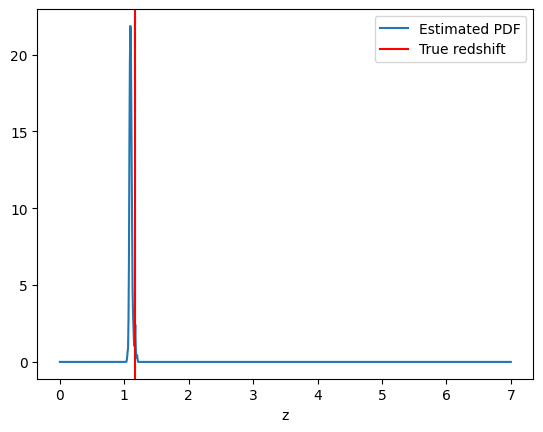
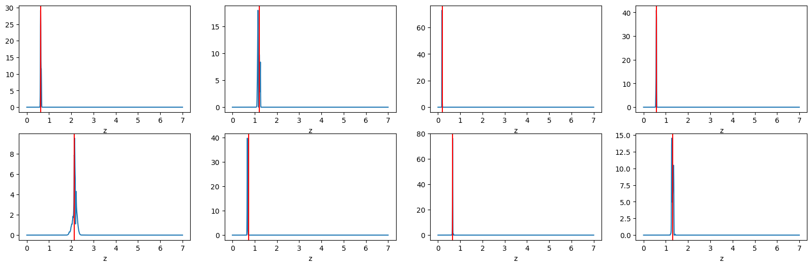
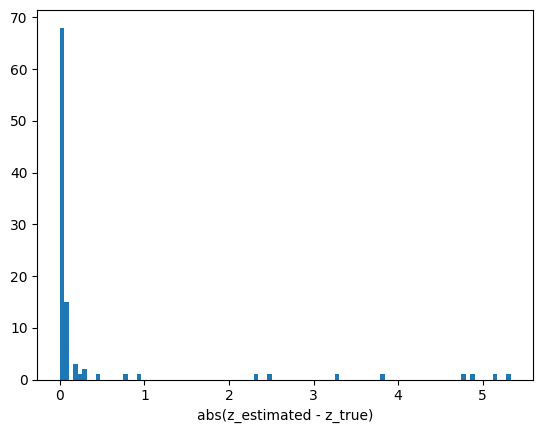
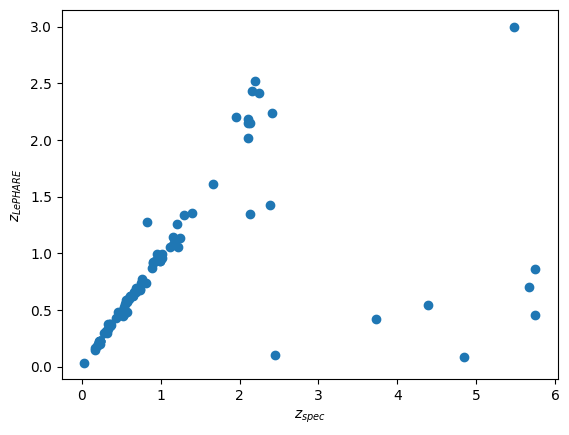
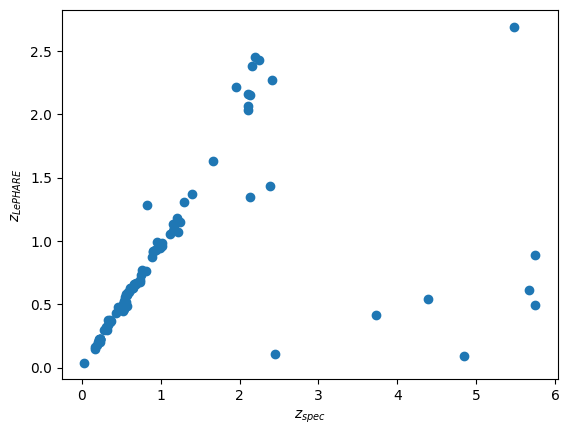

COSMOS LePhare example
======================

The default data for testing LePHARE is the COSMOS dataset.

In this example we use RAIL to run the standard LePHARE COSMOS example.

In this example we use fluxes not magnitudes. In order to use magnitudes
you must both update the config and the values.

.. code:: ipython3

    from rail.estimation.algos.lephare import LephareInformer, LephareEstimator
    import numpy as np
    import lephare as lp
    from rail.core.stage import RailStage
    import matplotlib.pyplot as plt
    from astropy.table import Table
    import astropy.units as u
    from collections import OrderedDict
    from rail.core.data import Hdf5Handle
    
    import os
    
    DS = RailStage.data_store
    DS.__class__.allow_overwrite = True

.. parsed-literal::

    LEPHAREDIR is being set to the default cache directory:
    /home/runner/.cache/lephare/data
    More than 1Gb may be written there.
    LEPHAREWORK is being set to the default cache directory:
    /home/runner/.cache/lephare/work
    Default work cache is already linked. 
    This is linked to the run directory:
    /home/runner/.cache/lephare/runs/20250712T065616

Here we load previously created synthetic data

Retrieve all the required filter and template files

.. code:: ipython3

    lephare_config = lp.default_cosmos_config
    # For useable science results you must use a denser redshift grid by commenting out the following line which will revert to the config dz of 0.01.
    lephare_config['Z_STEP']= ".1,0.,7."
    nobj=100 # Increase to run on more objects. Set to -1 to run on all.
    
    lp.data_retrieval.get_auxiliary_data(keymap=lephare_config, additional_files=["examples/COSMOS.in","examples/output.para"])

.. parsed-literal::

    Registry file downloaded and saved as data_registry.txt.

.. parsed-literal::

    Downloading file 'filt/cosmos/u_new.pb' from 'https://raw.githubusercontent.com/lephare-photoz/lephare-data/main/filt/cosmos/u_new.pb' to '/home/runner/.cache/lephare/data'.

.. parsed-literal::

    Downloading file 'filt/hsc/iHSC.pb' from 'https://raw.githubusercontent.com/lephare-photoz/lephare-data/main/filt/hsc/iHSC.pb' to '/home/runner/.cache/lephare/data'.

.. parsed-literal::

    Downloading file 'filt/hsc/rHSC.pb' from 'https://raw.githubusercontent.com/lephare-photoz/lephare-data/main/filt/hsc/rHSC.pb' to '/home/runner/.cache/lephare/data'.

.. parsed-literal::

    Downloading file 'filt/hsc/zHSC.pb' from 'https://raw.githubusercontent.com/lephare-photoz/lephare-data/main/filt/hsc/zHSC.pb' to '/home/runner/.cache/lephare/data'.

.. parsed-literal::

    Downloading file 'filt/cosmos/u_cfht.lowres' from 'https://raw.githubusercontent.com/lephare-photoz/lephare-data/main/filt/cosmos/u_cfht.lowres' to '/home/runner/.cache/lephare/data'.

.. parsed-literal::

    Downloading file 'filt/hsc/yHSC.pb' from 'https://raw.githubusercontent.com/lephare-photoz/lephare-data/main/filt/hsc/yHSC.pb' to '/home/runner/.cache/lephare/data'.

.. parsed-literal::

    Downloading file 'filt/vista/Y.lowres' from 'https://raw.githubusercontent.com/lephare-photoz/lephare-data/main/filt/vista/Y.lowres' to '/home/runner/.cache/lephare/data'.

.. parsed-literal::

    Downloading file 'filt/hsc/gHSC.pb' from 'https://raw.githubusercontent.com/lephare-photoz/lephare-data/main/filt/hsc/gHSC.pb' to '/home/runner/.cache/lephare/data'.

.. parsed-literal::

    Downloading file 'filt/vista/J.lowres' from 'https://raw.githubusercontent.com/lephare-photoz/lephare-data/main/filt/vista/J.lowres' to '/home/runner/.cache/lephare/data'.

.. parsed-literal::

    Downloading file 'filt/vista/H.lowres' from 'https://raw.githubusercontent.com/lephare-photoz/lephare-data/main/filt/vista/H.lowres' to '/home/runner/.cache/lephare/data'.

.. parsed-literal::

    Downloading file 'filt/vista/K.lowres' from 'https://raw.githubusercontent.com/lephare-photoz/lephare-data/main/filt/vista/K.lowres' to '/home/runner/.cache/lephare/data'.

.. parsed-literal::

    Downloading file 'filt/cosmos/IB427.lowres' from 'https://raw.githubusercontent.com/lephare-photoz/lephare-data/main/filt/cosmos/IB427.lowres' to '/home/runner/.cache/lephare/data'.

.. parsed-literal::

    Downloading file 'filt/cosmos/IB464.lowres' from 'https://raw.githubusercontent.com/lephare-photoz/lephare-data/main/filt/cosmos/IB464.lowres' to '/home/runner/.cache/lephare/data'.

.. parsed-literal::

    Downloading file 'filt/cosmos/IB484.lowres' from 'https://raw.githubusercontent.com/lephare-photoz/lephare-data/main/filt/cosmos/IB484.lowres' to '/home/runner/.cache/lephare/data'.

.. parsed-literal::

    Downloading file 'filt/cosmos/IB527.lowres' from 'https://raw.githubusercontent.com/lephare-photoz/lephare-data/main/filt/cosmos/IB527.lowres' to '/home/runner/.cache/lephare/data'.

.. parsed-literal::

    Downloading file 'filt/cosmos/IB505.lowres' from 'https://raw.githubusercontent.com/lephare-photoz/lephare-data/main/filt/cosmos/IB505.lowres' to '/home/runner/.cache/lephare/data'.

.. parsed-literal::

    Created directory: /home/runner/.cache/lephare/data/filt/hsc
    Created directory: /home/runner/.cache/lephare/data/filt/cosmos
    Created directory: /home/runner/.cache/lephare/data/filt/vista
    Checking/downloading 445 files...

.. parsed-literal::

    Downloading file 'filt/cosmos/IB574.lowres' from 'https://raw.githubusercontent.com/lephare-photoz/lephare-data/main/filt/cosmos/IB574.lowres' to '/home/runner/.cache/lephare/data'.

.. parsed-literal::

    Downloading file 'filt/cosmos/IB624.lowres' from 'https://raw.githubusercontent.com/lephare-photoz/lephare-data/main/filt/cosmos/IB624.lowres' to '/home/runner/.cache/lephare/data'.

.. parsed-literal::

    Downloading file 'filt/cosmos/IB679.lowres' from 'https://raw.githubusercontent.com/lephare-photoz/lephare-data/main/filt/cosmos/IB679.lowres' to '/home/runner/.cache/lephare/data'.

.. parsed-literal::

    Downloading file 'filt/cosmos/IB709.lowres' from 'https://raw.githubusercontent.com/lephare-photoz/lephare-data/main/filt/cosmos/IB709.lowres' to '/home/runner/.cache/lephare/data'.

.. parsed-literal::

    Downloading file 'filt/cosmos/IB738.lowres' from 'https://raw.githubusercontent.com/lephare-photoz/lephare-data/main/filt/cosmos/IB738.lowres' to '/home/runner/.cache/lephare/data'.

.. parsed-literal::

    Downloading file 'filt/cosmos/IB767.lowres' from 'https://raw.githubusercontent.com/lephare-photoz/lephare-data/main/filt/cosmos/IB767.lowres' to '/home/runner/.cache/lephare/data'.

.. parsed-literal::

    Downloading file 'filt/cosmos/IB827.lowres' from 'https://raw.githubusercontent.com/lephare-photoz/lephare-data/main/filt/cosmos/IB827.lowres' to '/home/runner/.cache/lephare/data'.

.. parsed-literal::

    Downloading file 'filt/cosmos/NB711.lowres' from 'https://raw.githubusercontent.com/lephare-photoz/lephare-data/main/filt/cosmos/NB711.lowres' to '/home/runner/.cache/lephare/data'.

.. parsed-literal::

    Downloading file 'filt/cosmos/NB816.lowres' from 'https://raw.githubusercontent.com/lephare-photoz/lephare-data/main/filt/cosmos/NB816.lowres' to '/home/runner/.cache/lephare/data'.

.. parsed-literal::

    Downloading file 'filt/vista/NB118.lowres' from 'https://raw.githubusercontent.com/lephare-photoz/lephare-data/main/filt/vista/NB118.lowres' to '/home/runner/.cache/lephare/data'.

.. parsed-literal::

    Downloading file 'filt/cosmos/irac_ch1.lowres' from 'https://raw.githubusercontent.com/lephare-photoz/lephare-data/main/filt/cosmos/irac_ch1.lowres' to '/home/runner/.cache/lephare/data'.

.. parsed-literal::

    Downloading file 'filt/cosmos/irac_ch2.lowres' from 'https://raw.githubusercontent.com/lephare-photoz/lephare-data/main/filt/cosmos/irac_ch2.lowres' to '/home/runner/.cache/lephare/data'.

.. parsed-literal::

    Downloading file 'filt/cosmos/irac_ch3.lowres' from 'https://raw.githubusercontent.com/lephare-photoz/lephare-data/main/filt/cosmos/irac_ch3.lowres' to '/home/runner/.cache/lephare/data'.

.. parsed-literal::

    Downloading file 'filt/cosmos/irac_ch4.lowres' from 'https://raw.githubusercontent.com/lephare-photoz/lephare-data/main/filt/cosmos/irac_ch4.lowres' to '/home/runner/.cache/lephare/data'.

.. parsed-literal::

    Downloading file 'examples/COSMOS.in' from 'https://raw.githubusercontent.com/lephare-photoz/lephare-data/main/examples/COSMOS.in' to '/home/runner/.cache/lephare/data'.

.. parsed-literal::

    445 completed.
    All files downloaded successfully and are non-empty.
    Checking/downloading 2 files...

.. parsed-literal::

    2 completed.
    All files downloaded successfully and are non-empty.

.. code:: ipython3

    bands=lephare_config['FILTER_LIST'].split(',')
    len(bands)

.. parsed-literal::

    30

.. code:: ipython3

    # For a test lets just look at the first 100 objects
    cosmos=Table.read(os.path.join(lp.LEPHAREDIR,"examples/COSMOS.in"),format='ascii')[:nobj]

.. code:: ipython3

    print(f"We will run on {len(cosmos)} objects.")

.. parsed-literal::

    We will run on 100 objects.

.. code:: ipython3

    # The example file is in the historical lephare format.
    data=OrderedDict()
    flux_cols=[]
    flux_err_cols=[]
    for n,b in enumerate(bands):
        #print(1+2*n,2+2*n)
        flux=cosmos[cosmos.colnames[1+2*n]]
        flux_err=cosmos[cosmos.colnames[2+2*n]]
        data[f"flux_{b}"]=flux
        flux_cols.append(f"flux_{b}")
        data[f"flux_err_{b}"]=flux_err
        flux_err_cols.append(f"flux_err_{b}")
    data["redshift"]=np.array(cosmos[cosmos.colnames[-2]])

.. code:: ipython3

    data_io = DS.add_data("tomo_bin", data, Hdf5Handle)

We use the inform stage to create the library of SEDs with various
redshifts, extinction parameters, and reddening values.

.. code:: ipython3

    inform_lephare = LephareInformer.make_stage(
        name="inform_COSMOS",
        nondetect_val=np.nan,
        model="lephare.pkl",
        hdf5_groupname="",
        lephare_config=lephare_config,
        bands=flux_cols,
        err_bands=flux_err_cols,
        ref_band=flux_cols[0],
    )
    
    inform_lephare.inform(data_io)

.. parsed-literal::

    rail_lephare is setting the Z_STEP config to 0.01,0.0,3.0 based on the informer params.
    User defined LEPHAREDIR is set. Code runs depend on all required
    auxiliary data being present at /home/runner/.cache/lephare/data.
    User defined LEPHAREWORK is set. All intermediate files will be written to:
     /home/runner/.cache/lephare/runs/inform_COSMOS
    # NAME                        IDENT      Lbda_mean Lbeff(Vega)       FWHM     AB-cor    TG-cor      VEGA M_sun(AB)   CALIB      Lb_eff    Fac_corr
    u_cfht.lowres                 1             0.3844      0.3908      0.0538    0.3150   -0.3891  -20.6345    6.0327       0      0.3815      1.0000
    u_new.pb                      2             0.3690      0.3750      0.0456    0.6195   -0.2745  -20.8527    6.3135       0      0.3668      1.0000
    gHSC.pb                       3             0.4851      0.4760      0.1194   -0.0860   -0.2458  -20.7272    5.0764       0      0.4780      1.0000
    rHSC.pb                       4             0.6241      0.6142      0.1539    0.1466    0.2580  -21.5143    4.6523       0      0.6178      1.0000
    iHSC.pb                       5             0.7716      0.7637      0.1476    0.3942    0.6138  -22.2286    4.5323       0      0.7666      1.0000
    zHSC.pb                       6             0.8915      0.8907      0.0768    0.5169    0.7625  -22.6733    4.5147       0      0.8903      1.0000
    yHSC.pb                       7             0.9801      0.9771      0.0797    0.5534    0.7763  -22.9145    4.5081       0      0.9782      1.0000
    Y.lowres                      8             1.0222      1.0196      0.0919    0.6043    0.8180  -23.0574    4.5130       0      1.0206      1.0000
    J.lowres                      9             1.2555      1.2481      0.1712    0.9228  -99.0000  -23.8194    4.5638       0      1.2514      1.0000
    H.lowres                      10            1.6497      1.6352      0.2893    1.3701  -99.0000  -24.8565    4.7045       0      1.6409      1.0000
    K.lowres                      11            2.1577      2.1435      0.2926    1.8335  -99.0000  -25.9057    5.1316       0      2.1502      1.0000
    IB427.lowres                  12            0.4264      0.4256      0.0207   -0.1446   -0.4942  -20.4117    5.5152       0      0.4262      1.0000
    IB464.lowres                  13            0.4636      0.4633      0.0218   -0.1520   -0.3463  -20.5860    5.0658       0      0.4634      1.0000
    IB484.lowres                  14            0.4851      0.4846      0.0228   -0.0241   -0.1770  -20.8122    4.9880       0      0.4849      1.0000
    IB505.lowres                  15            0.5064      0.5061      0.0231   -0.0656   -0.1366  -20.8639    4.9423       0      0.5061      1.0000
    IB527.lowres                  16            0.5262      0.5259      0.0242   -0.0260   -0.0464  -20.9871    4.8937       0      0.5260      1.0000
    IB574.lowres                  17            0.5766      0.5762      0.0272    0.0657    0.1377  -21.2773    4.7042       0      0.5763      1.0000
    IB624.lowres                  18            0.6234      0.6230      0.0301    0.1527    0.2768  -21.5339    4.6386       0      0.6232      1.0000
    IB679.lowres                  19            0.6783      0.6779      0.0336    0.2542    0.4288  -21.8183    4.5709       0      0.6779      1.0000
    IB709.lowres                  20            0.7075      0.7071      0.0316    0.2982    0.4968  -21.9541    4.5558       0      0.7072      1.0000
    IB738.lowres                  21            0.7363      0.7358      0.0323    0.3460    0.5577  -22.0886    4.5449       0      0.7360      1.0000
    IB767.lowres                  22            0.7687      0.7681      0.0364    0.3992    0.6164  -22.2351    4.5243       0      0.7683      1.0000
    IB827.lowres                  23            0.8246      0.8241      0.0344    0.4891    0.7300  -22.4777    4.5161       0      0.8243      1.0000
    NB711.lowres                  24            0.7120      0.7119      0.0073    0.3072    0.5084  -21.9774    4.5542       0      0.7120      1.0000
    NB816.lowres                  25            0.8150      0.8149      0.0120    0.4713    0.7098  -22.4349    4.5154       0      0.8149      1.0000
    NB118.lowres                  26            1.1909      1.1909      0.0112    0.8376  -99.0000  -23.6250    4.5554       0      1.1909      1.0000
    irac_ch1.lowres               27            3.5763      3.5264      0.7411    2.7951  -99.0000  -27.9585    6.0679       1      3.5634      1.0036
    irac_ch2.lowres               28            4.5290      4.4609      1.0105    3.2634  -99.0000  -28.9384    6.5680       1      4.5111      1.0040
    irac_ch3.lowres               29            5.7873      5.6765      1.3509    3.7537  -99.0000  -29.9581    7.0472       1      5.7592      1.0050
    irac_ch4.lowres               30            8.0442      7.7033      2.8394    4.3959  -99.0000  -31.2962    7.6701       1      7.9590      1.0110
    {'star_sed': '/home/runner/.cache/lephare/data/sed/STAR/STAR_MOD_ALL.list'}
    #######################################
    # It s translating SEDs to binary library #
    # with the following options :           
    # Config file     : 
    # Library type     : STAR
    # STAR_SED    :/home/runner/.cache/lephare/data/sed/STAR/STAR_MOD_ALL.list
    # STAR_LIB    :LIB_STAR
    # STAR_LIB doc:/home/runner/.cache/lephare/runs/inform_COSMOS/lib_bin/LIB_STAR.doc
    # STAR_FSCALE :0.0000
    #######################################
    Number of SED in the list 254

.. parsed-literal::

    WRONG NUMBER OF ARGUMENTS FOR OPTION MOD_EXTINC
    We have 2 instead of 8
    Use default value 0,0 for all filters 
    #######################################
    # It s computing the SYNTHETIC MAGNITUDES #
    # For Gal/QSO libraries with these OPTIONS #
    # with the following options :           
    # Config file     : 
    # Filter file     : filter_cosmos
    # Magnitude type     : AB
    # COSMOLOGY   :70.0000,0.3000,0.7000
    # STAR_LIB_IN    :/home/runner/.cache/lephare/runs/inform_COSMOS/lib_bin/LIB_STAR(.doc & .bin)
    # STAR_LIB_OUT   :/home/runner/.cache/lephare/runs/inform_COSMOS/lib_mag/STAR_COSMOS(.doc & .bin)
    # LIB_ASCII   YES
    # CREATION_DATE Sat Jul 12 07:20:02 2025
    #############################################

.. parsed-literal::

    {'gal_sed': '/home/runner/.cache/lephare/data/sed/GAL/COSMOS_SED/COSMOS_MOD.list'}
    #######################################
    # It s translating SEDs to binary library #
    # with the following options :           
    # Config file     : 
    # Library type     : GAL
    # GAL_SED    :/home/runner/.cache/lephare/data/sed/GAL/COSMOS_SED/COSMOS_MOD.list
    # GAL_LIB    :LIB_CE
    # GAL_LIB doc:/home/runner/.cache/lephare/runs/inform_COSMOS/lib_bin/LIB_CE.doc
    # GAL_LIB phys:/home/runner/.cache/lephare/runs/inform_COSMOS/lib_bin/LIB_CE.phys
    # SEL_AGE    :none
    # GAL_FSCALE :1.0000
    # AGE_RANGE   0.0000 15000000000.0000
    #######################################
    Number of SED in the list 31
    #######################################
    # It s computing the SYNTHETIC MAGNITUDES #
    # For Gal/QSO libraries with these OPTIONS #
    # with the following options :           
    # Config file     : 
    # Filter file     : filter_cosmos
    # Magnitude type     : AB
    # GAL_LIB_IN    :/home/runner/.cache/lephare/runs/inform_COSMOS/lib_bin/LIB_CE(.doc & .bin)
    # GAL_LIB_OUT   :/home/runner/.cache/lephare/runs/inform_COSMOS/lib_mag/CE_COSMOS(.doc & .bin)
    # Z_STEP   :0.0100 0.0000 3.0000
    # COSMOLOGY   :70.0000,0.3000,0.7000
    # EXTINC_LAW   :SMC_prevot.dat SB_calzetti.dat SB_calzetti_bump1.dat SB_calzetti_bump2.dat 
    # MOD_EXTINC   :18 26 26 33 26 33 26 33 
    # EB_V   :0.0000 0.0500 0.1000 0.1500 0.2000 0.2500 0.3000 0.3500 0.4000 0.5000 
    # EM_LINES   EMP_UV
    # EM_DISPERSION   0.5000,0.7500,1.0000,1.5000,2.0000,
    # LIB_ASCII   YES
    # CREATION_DATE Sat Jul 12 07:20:02 2025
    #############################################

.. parsed-literal::

    {'qso_sed': '/home/runner/.cache/lephare/data/sed/QSO/SALVATO09/AGN_MOD.list'}
    #######################################
    # It s translating SEDs to binary library #
    # with the following options :           
    # Config file     : 
    # Library type     : QSO
    # QSO_SED    :/home/runner/.cache/lephare/data/sed/QSO/SALVATO09/AGN_MOD.list
    # QSO_LIB    :LIB_QSO
    # QSO_LIB doc:/home/runner/.cache/lephare/runs/inform_COSMOS/lib_bin/LIB_QSO.doc
    # QSO_FSCALE :1.0000
    #######################################
    Number of SED in the list 30
    #######################################
    # It s computing the SYNTHETIC MAGNITUDES #
    # For Gal/QSO libraries with these OPTIONS #
    # with the following options :           
    # Config file     : 
    # Filter file     : filter_cosmos
    # Magnitude type     : AB
    # QSO_LIB_IN    :/home/runner/.cache/lephare/runs/inform_COSMOS/lib_bin/LIB_QSO(.doc & .bin)
    # QSO_LIB_OUT   :/home/runner/.cache/lephare/runs/inform_COSMOS/lib_mag/QSO_COSMOS(.doc & .bin)
    # Z_STEP   :0.0100 0.0000 3.0000
    # COSMOLOGY   :70.0000,0.3000,0.7000
    # EXTINC_LAW   :SB_calzetti.dat 
    # MOD_EXTINC   :0 1000 
    # EB_V   :0.0000 0.1000 0.2000 0.3000 # LIB_ASCII   YES
    # CREATION_DATE Sat Jul 12 07:24:08 2025
    #############################################

.. parsed-literal::

    Inserting handle into data store.  model_inform_COSMOS: inprogress_lephare.pkl, inform_COSMOS

.. parsed-literal::

    <rail.core.data.ModelHandle at 0x7faa2c33f010>

Now we take the sythetic test data, and find the best fits from the
library. This results in a PDF, zmode, and zmean for each input test
data.

.. code:: ipython3

    estimate_lephare = LephareEstimator.make_stage(
        name="test_Lephare_COSMOS",
        nondetect_val=np.nan,
        model=inform_lephare.get_handle("model"),
        hdf5_groupname="",
        aliases=dict(input="test_data", output="lephare_estim"),
        bands=flux_cols,
        err_bands=flux_err_cols,
        ref_band=flux_cols[0],
    )
    
    lephare_estimated = estimate_lephare.estimate(data_io)

.. parsed-literal::

    User defined LEPHAREDIR is set. Code runs depend on all required
    auxiliary data being present at /home/runner/.cache/lephare/data.
    User defined LEPHAREWORK is set. All intermediate files will be written to:
     /home/runner/.cache/lephare/runs/inform_COSMOS
    Process 0 running estimator on chunk 0 - 100
    Using user columns from input table assuming they are in the standard order.
    Processing 100 objects with 30 bands
    ####################################### 
    # PHOTOMETRIC REDSHIFT with OPTIONS   # 
    # Config file            : 
    # CAT_IN                 : change_me_to_output_filename_required.ascii
    # CAT_OUT                : zphot.out
    # CAT_LINES              : 0 1000000000
    # PARA_OUT               : /home/runner/.cache/lephare/data/examples/output.para
    # INP_TYPE               : F
    # CAT_FMT[0:MEME 1:MMEE] : 0
    # CAT_MAG                : AB
    # ZPHOTLIB               : CE_COSMOS STAR_COSMOS QSO_COSMOS 
    # FIR_LIB                : 
    # FIR_LMIN               : 7.000000
    # FIR_CONT               : -1.000000
    # FIR_SCALE              : -1.000000
    # FIR_FREESCALE          : YES
    # FIR_SUBSTELLAR         : NO
    # ERR_SCALE              : 0.020000 0.020000 0.020000 0.020000 0.020000 0.020000 0.020000 0.050000 0.050000 0.050000 0.050000 0.020000 0.020000 0.020000 0.020000 0.020000 0.020000 0.020000 0.020000 0.020000 0.020000 0.020000 0.020000 0.050000 0.050000 0.050000 0.050000 0.100000 0.200000 0.300000 
    # ERR_FACTOR             : 1.500000 
    # GLB_CONTEXT            : 0
    # FORB_CONTEXT           : -1
    # DZ_WIN                 : 1.000000
    # MIN_THRES              : 0.020000
    # MAG_ABS                : -24.000000 -5.000000
    # MAG_ABS_AGN            : -30.000000 -10.000000
    # MAG_REF                : 3
    # NZ_PRIOR               : -1 -2
    # Z_INTERP               : YES
    # Z_METHOD               : BEST
    # PROB_INTZ              : 0.000000 
    # MABS_METHOD            : 1
    # MABS_CONTEXT           : 33556478 
    # MABS_REF               : 11 
    # AUTO_ADAPT             : NO
    # ADAPT_BAND             : 5
    # ADAPT_LIM              : 1.500000 23.000000
    # ADAPT_ZBIN             : 0.010000 6.000000
    # ZFIX                   : NO
    # SPEC_OUT               : NO
    # CHI_OUT                : NO
    # PDZ_OUT                : test
    ####################################### 
    Reading input librairies ...
    Read lib 
    Number of keywords to be read in the doc: 13
    Number of keywords read at the command line (excluding -c config): 0
    Reading keywords from /home/runner/.cache/lephare/runs/inform_COSMOS/lib_mag/QSO_COSMOS.doc
    Number of keywords read in the config file: 16
    Keyword NUMBER_ROWS not provided 
    Keyword NUMBER_SED not provided 
    Keyword Z_FORM not provided 
    Reading library: /home/runner/.cache/lephare/runs/inform_COSMOS/lib_mag/QSO_COSMOS.bin
     Done with the library reading with 36120 SED read. 
    Number of keywords to be read in the doc: 13
    Number of keywords read at the command line (excluding -c config): 0
    Reading keywords from /home/runner/.cache/lephare/runs/inform_COSMOS/lib_mag/STAR_COSMOS.doc
    Number of keywords read in the config file: 16
    Keyword NUMBER_ROWS not provided 
    Keyword NUMBER_SED not provided 
    Keyword Z_FORM not provided 
    Reading library: /home/runner/.cache/lephare/runs/inform_COSMOS/lib_mag/STAR_COSMOS.bin
     Done with the library reading with 36374 SED read. 
    Number of keywords to be read in the doc: 13
    Number of keywords read at the command line (excluding -c config): 0
    Reading keywords from /home/runner/.cache/lephare/runs/inform_COSMOS/lib_mag/CE_COSMOS.doc
    Number of keywords read in the config file: 16
    Keyword NUMBER_ROWS not provided 
    Keyword NUMBER_SED not provided 
    Keyword Z_FORM not provided 
    Reading library: /home/runner/.cache/lephare/runs/inform_COSMOS/lib_mag/CE_COSMOS.bin
     Done with the library reading with 448744 SED read. 
    Read lib out 
    Read filt 
    # NAME                        IDENT      Lbda_mean Lbeff(Vega)       FWHM     AB-cor      VEGA   CALIB    Fac_corr
    u_cfht.lowres                 1             0.3844      0.3908      0.0538    0.3150  -20.6300       0      1.0000
    u_new.pb                      2             0.3690      0.3750      0.0456    0.6195  -20.8500       0      1.0000
    gHSC.pb                       3             0.4851      0.4760      0.1194   -0.0860  -20.7300       0      1.0000
    rHSC.pb                       4             0.6241      0.6142      0.1539    0.1466  -21.5100       0      1.0000
    iHSC.pb                       5             0.7716      0.7637      0.1476    0.3942  -22.2300       0      1.0000
    zHSC.pb                       6             0.8915      0.8907      0.0768    0.5169  -22.6700       0      1.0000
    yHSC.pb                       7             0.9801      0.9771      0.0797    0.5534  -22.9100       0      1.0000
    Y.lowres                      8             1.0220      1.0200      0.0919    0.6043  -23.0600       0      1.0000
    J.lowres                      9             1.2550      1.2480      0.1712    0.9228  -23.8200       0      1.0000
    H.lowres                      10            1.6500      1.6350      0.2893    1.3700  -24.8600       0      1.0000
    K.lowres                      11            2.1580      2.1430      0.2926    1.8330  -25.9100       0      1.0000
    IB427.lowres                  12            0.4264      0.4256      0.0207   -0.1446  -20.4100       0      1.0000
    IB464.lowres                  13            0.4636      0.4633      0.0218   -0.1520  -20.5900       0      1.0000
    IB484.lowres                  14            0.4851      0.4846      0.0228   -0.0241  -20.8100       0      1.0000
    IB505.lowres                  15            0.5064      0.5061      0.0231   -0.0656  -20.8600       0      1.0000
    IB527.lowres                  16            0.5262      0.5259      0.0242   -0.0260  -20.9900       0      1.0000
    IB574.lowres                  17            0.5766      0.5762      0.0272    0.0657  -21.2800       0      1.0000
    IB624.lowres                  18            0.6234      0.6230      0.0301    0.1527  -21.5300       0      1.0000
    IB679.lowres                  19            0.6783      0.6779      0.0336    0.2542  -21.8200       0      1.0000
    IB709.lowres                  20            0.7075      0.7071      0.0316    0.2982  -21.9500       0      1.0000
    IB738.lowres                  21            0.7363      0.7358      0.0323    0.3460  -22.0900       0      1.0000
    IB767.lowres                  22            0.7687      0.7681      0.0364    0.3992  -22.2400       0      1.0000
    IB827.lowres                  23            0.8246      0.8241      0.0344    0.4891  -22.4800       0      1.0000
    NB711.lowres                  24            0.7120      0.7119      0.0073    0.3072  -21.9800       0      1.0000
    NB816.lowres                  25            0.8150      0.8149      0.0120    0.4713  -22.4300       0      1.0000
    NB118.lowres                  26            1.1910      1.1910      0.0112    0.8376  -23.6200       0      1.0000
    irac_ch1.lowres               27            3.5760      3.5260      0.7411    2.7950  -27.9600       1      1.0040
    irac_ch2.lowres               28            4.5290      4.4610      1.0100    3.2630  -28.9400       1      1.0040
    irac_ch3.lowres               29            5.7870      5.6760      1.3510    3.7540  -29.9600       1      1.0050
    irac_ch4.lowres               30            8.0440      7.7030      2.8390    4.3960  -31.3000       1      1.0110

.. parsed-literal::

    AUTO_ADAPT set to NO. Using zero offsets.

.. parsed-literal::

    Inserting handle into data store.  output_test_Lephare_COSMOS: inprogress_output_test_Lephare_COSMOS.hdf5, test_Lephare_COSMOS

.. code:: ipython3

    lephare_config["AUTO_ADAPT"] 

.. parsed-literal::

    'NO'

An example lephare PDF and comparison to the true value

.. code:: ipython3

    indx = 1
    zgrid = np.linspace(0,7,1000)
    plt.plot(zgrid, np.squeeze(lephare_estimated.data[indx].pdf(zgrid)), label='Estimated PDF')
    plt.axvline(x=data_io.data['redshift'][indx], color='r', label='True redshift')
    plt.legend()
    plt.xlabel('z')
    plt.show()

More example fits

.. code:: ipython3

    indxs = [8, 16, 32, 64, 65, 66, 68, 69] #, 128, 256, 512, 1024]
    zgrid = np.linspace(0,7,1000)
    fig, axs = plt.subplots(2,4, figsize=(20,6))
    for i, indx in enumerate(indxs):
        ax = axs[i//4, i%4]
        ax.plot(zgrid, np.squeeze(lephare_estimated.data[indx].pdf(zgrid)), label='Estimated PDF')
        ax.axvline(x=data_io.data['redshift'][indx], color='r', label='True redshift')
        ax.set_xlabel('z')

Histogram of the absolute difference between lephare estimate and true
redshift

.. code:: ipython3

    estimate_diff_from_truth = np.abs(lephare_estimated.data.ancil['zmode'] - data['redshift'])
    
    plt.figure()
    plt.hist(estimate_diff_from_truth, 100)
    plt.xlabel('abs(z_estimated - z_true)')
    plt.show()

.. code:: ipython3

    plt.scatter(data['redshift'],lephare_estimated.data.ancil['Z_BEST'])
    plt.xlabel('$z_{spec}$')
    plt.ylabel('$z_{LePHARE}$')

.. parsed-literal::

    Text(0, 0.5, '$z_{LePHARE}$')

.. code:: ipython3

    plt.scatter(data['redshift'],lephare_estimated.data.ancil['zmean'])
    plt.xlabel('$z_{spec}$')
    plt.ylabel('$z_{LePHARE}$')

.. parsed-literal::

    Text(0, 0.5, '$z_{LePHARE}$')

