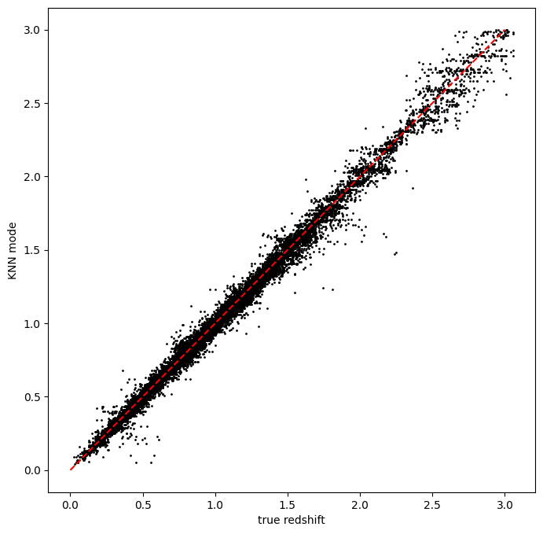

Running RAIL with a different dataset
=====================================

**Authors:** Sam Schmidt

**Last run successfully:** September 24, 2025

This is a notebook with a quick example of running a ``rail`` algoritm
with a different dataset and overriding configuration parameters.

Most of our other demo notebooks use small datasets included with the
RAIL demo package, all with the same input names. These datasets are
named consistently with many of the default parameter values used in
RAIL, e.g. ``hdf5_groupname="photometry"`` and ugrizy photometry named
in a pattern ``"mag_{band}_lsst"``, often specified in
``SHARED_PARAMS``.

This notebook will just show a quick run with an alternate dataset,
showing the values that users will likely need to change in order to get
things running.

.. code:: ipython3

    import os
    import matplotlib.pyplot as plt
    import numpy as np
    import tables_io

First, we’ll start with grabbing some small datasets from NERSC, a tar
file with some data drawn from the Roman-Rubin simulation:

.. code:: ipython3

    training_file = "./romanrubin_demo_data.tar"
    
    if not os.path.exists(training_file):
      os.system('curl -O https://portal.nersc.gov/cfs/lsst/PZ/romanrubin_demo_data.tar')
      os.system('tar -xvf romanrubin_demo_data.tar')

.. parsed-literal::

      % Total    % Received % Xferd  Average Speed   Time    Time     Time  Current
                                     Dload  Upload   Total   Spent    Left  Speed
    
  0     0    0     0    0     0      0      0 --:--:-- --:--:-- --:--:--     0

.. parsed-literal::

    
  0     0    0     0    0     0      0      0 --:--:-- --:--:-- --:--:--     0

.. parsed-literal::

    romanrubin_train_data.hdf5
    romanrubin_test_data.hdf5

.. parsed-literal::

    
100 4670k  100 4670k    0     0  4468k      0  0:00:01  0:00:01 --:--:-- 4468k

Let’s load one of the files and look at the contents:

.. code:: ipython3

    infile = "romanrubin_train_data.hdf5"
    data = tables_io.read(infile)
    data.keys()

.. parsed-literal::

    odict_keys(['H', 'H_err', 'J', 'J_err', 'g', 'g_err', 'i', 'i_err', 'r', 'r_err', 'redshift', 'u', 'u_err', 'y', 'y_err', 'z', 'z_err'])

We can see that, unlike the demo data in other notebooks, there is no
top level hdf5_groupname of “photometry”, the data is directly in the
top level of the hdf5 file. As such, we will need to specify
``hdf5_groupname=""`` to override the default value of ``"photometry"``
in RAIL.

We also see that the magnitudes and errors are simply named with the
band name, e.g. ``"u"`` rather than ``"mag_u_lsst"``. Again, we will
need to specify the band and error names in order to override the
defaults in RAIL. Let’s do that below, using the KNearNeighInformer and
Estimator algorithms:

.. code:: ipython3

    from rail.core.data import TableHandle
    from rail.core.stage import RailStage
    from rail.estimation.algos.k_nearneigh import KNearNeighInformer, KNearNeighEstimator

.. code:: ipython3

    DS = RailStage.data_store
    DS.__class__.allow_overwrite = True

.. code:: ipython3

    trainFile = "./romanrubin_train_data.hdf5"
    testFile = "./romanrubin_test_data.hdf5"
    training_data = DS.read_file("training_data", TableHandle, trainFile)
    test_data = DS.read_file("test_data", TableHandle, testFile)

The dataset-specific parameters
-------------------------------

We will need to specify several parameters to override the default
values in RAIL, we can create a dictionary of these and pass those into
the ``make_stage`` for our informer. Because we have Roman J and H, we
will also demonstrate running with 8 bands rather than the default six.

RAIL requires that we specify the names of the input columns as
``bands``, and the input errors on those as ``err_bands``. Most
algorithms also require a ``ref_band``. To handle non-detections, RAIL
uses a dictionary of ``mag_limits`` which must contain keys for all of
the columns in ``bands`` and a float for the value with which the
non-detect will be replaced. You may also need to specify a different
``nondetect_val`` if the dataset has a different convention for
non-detections (in this dataset, our non-detetions have a value of
``np.inf``).

**NOTE:** RAIL uses ``SHARED_PARAMS``, a central location for specifying
a subset of parameters that are common to a dataset, and setting them in
one place when running multiple algorithms. However, any configuration
parameters specified as ``SHARED_PARAMS`` can be overridden in the same
way as any other parameter, there is nothing special about them, and we
will do that here with ``bands``, ``err_bands``, etc…

Let’s set up our dictionary with these values:

.. code:: ipython3

    bands = ['u', 'g', 'r', 'i', 'z', 'y', 'J', 'H']
    errbands = []
    maglims = {}
    limvals = [27.8, 29.0, 29.1, 28.6, 28.0, 27.0, 26.4, 26.4]
    for band, limval in zip(bands, limvals):
        errbands.append(f"{band}_err")
        maglims[band] = limval
    
    
    print(bands)
    print(errbands)
    print(maglims)

.. parsed-literal::

    ['u', 'g', 'r', 'i', 'z', 'y', 'J', 'H']
    ['u_err', 'g_err', 'r_err', 'i_err', 'z_err', 'y_err', 'J_err', 'H_err']
    {'u': 27.8, 'g': 29.0, 'r': 29.1, 'i': 28.6, 'z': 28.0, 'y': 27.0, 'J': 26.4, 'H': 26.4}

.. code:: ipython3

    knn_dict = dict(hdf5_groupname='', bands=bands, err_bands=errbands, mag_limits=maglims, ref_band='i')

We can now feed this into our inform stage:

.. code:: ipython3

    pz_train = KNearNeighInformer.make_stage(name='inform_KNN', model='rd_demo_knn.pkl', **knn_dict)

.. code:: ipython3

    %%time
    pz_train.inform(training_data)

.. parsed-literal::

    Inserting handle into data store.  input: None, inform_KNN
    split into 11250 training and 3750 validation samples
    finding best fit sigma and NNeigh...

.. parsed-literal::

    
    
    
    best fit values are sigma=0.017222222222222222 and numneigh=7
    
    
    
    Inserting handle into data store.  model_inform_KNN: inprogress_rd_demo_knn.pkl, inform_KNN
    CPU times: user 14 s, sys: 2.88 s, total: 16.8 s
    Wall time: 16.9 s

.. parsed-literal::

    <rail.core.data.ModelHandle at 0x7fb964393d30>

We can use the same dictionary to specify overrides for the estimator
stage:

.. code:: ipython3

    pz = KNearNeighEstimator.make_stage(name='KNN', model=pz_train.get_handle('model'), **knn_dict)
    results = pz.estimate(test_data)

.. parsed-literal::

    Inserting handle into data store.  model: <class 'rail.core.data.ModelHandle'> rd_demo_knn.pkl, (wd), KNN
    Process 0 running estimator on chunk 0 - 10,000
    Process 0 estimating PZ PDF for rows 0 - 10,000

.. parsed-literal::

    Inserting handle into data store.  output_KNN: inprogress_output_KNN.hdf5, KNN
    Process 0 running estimator on chunk 10,000 - 20,000
    Process 0 estimating PZ PDF for rows 10,000 - 20,000

Let’s plot the mode vs the true redshift to make sure that things ran
properly:

.. code:: ipython3

    zmode = results().ancil['zmode'].flatten()

Let’s plot the redshift mode against the true redshifts to see how they
look:

.. code:: ipython3

    plt.figure(figsize=(8,8))
    plt.scatter(test_data()['redshift'],zmode,s=1,c='k',label='KNN mode')
    plt.plot([0,3],[0,3],'r--');
    plt.xlabel("true redshift")
    plt.ylabel("KNN mode")

.. parsed-literal::

    Text(0, 0.5, 'KNN mode')

Yes, things look very nice, and the inclusion of NIR photometry gives us
very little scatter and very few outliers!

