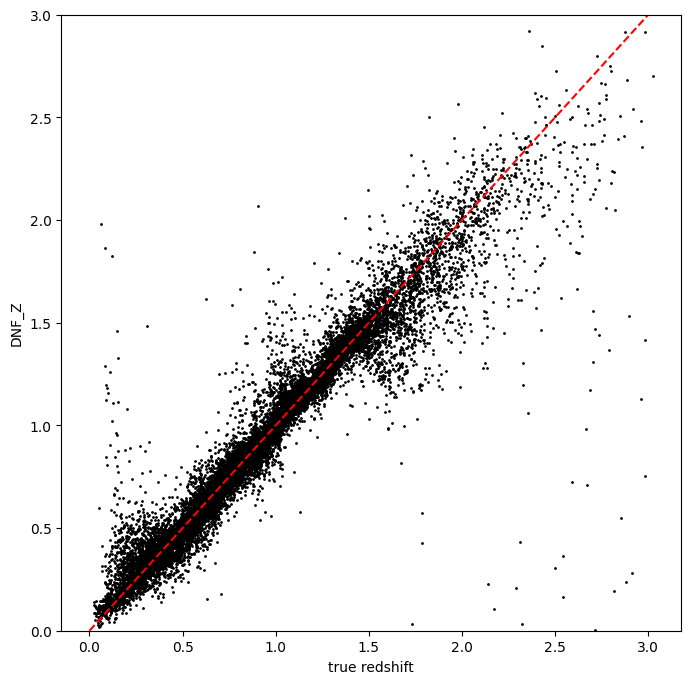
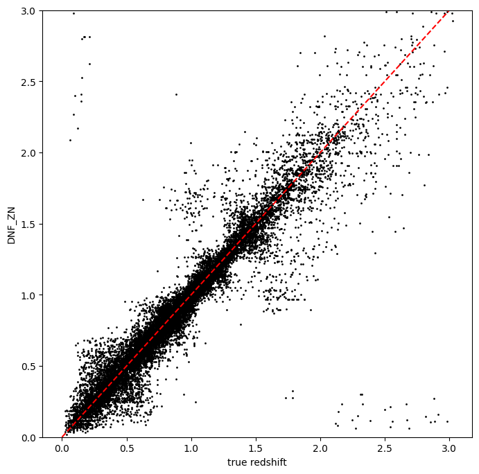
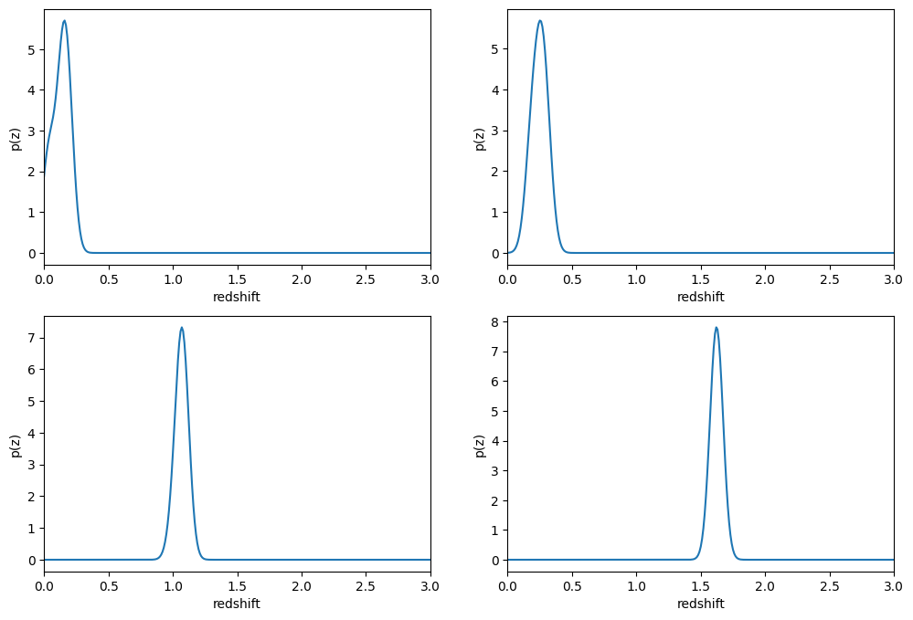
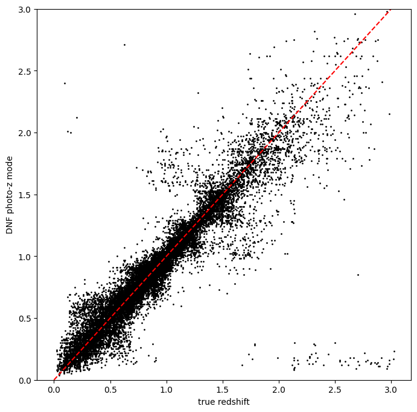
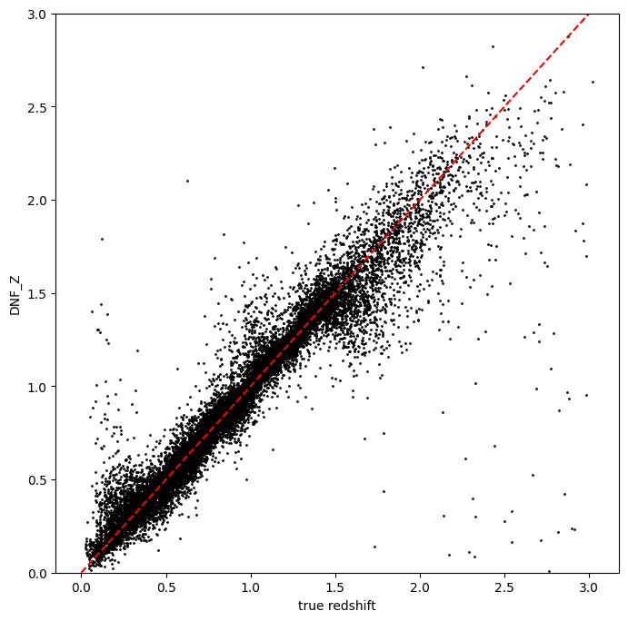
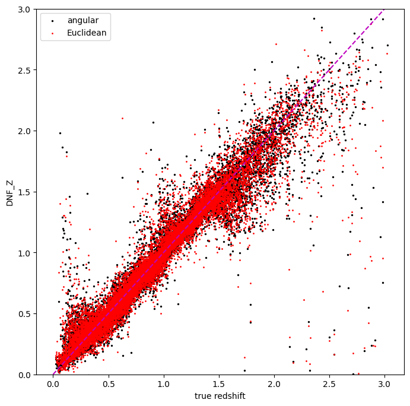
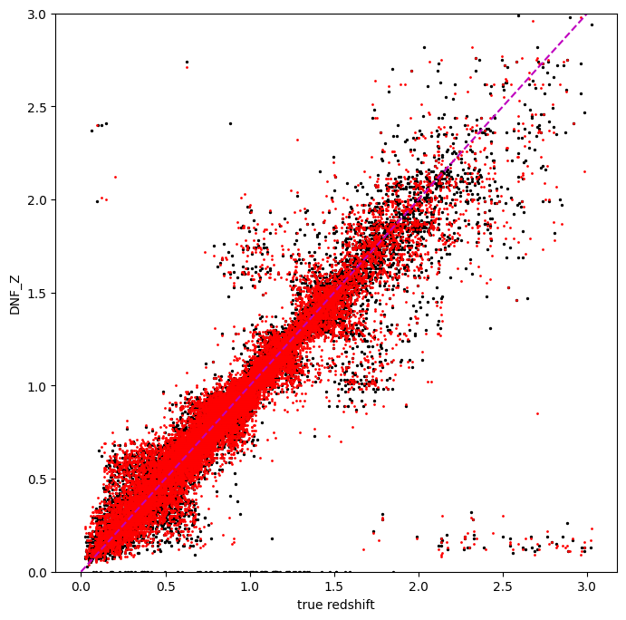
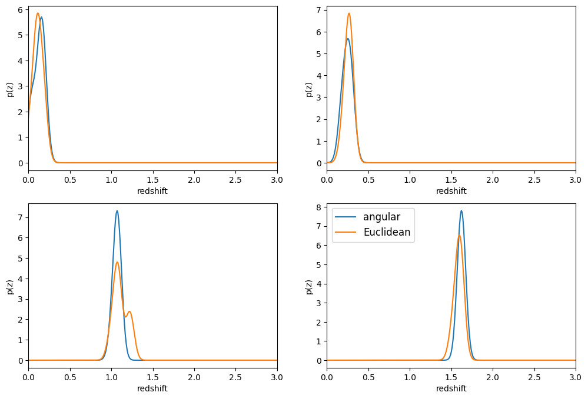

RAIL’s DNF implementation example
=================================

**Authors**: Laura Toribio San Cipriano, Sam Schmidt and Juan De Vicente
**last successfully run**: Feb 05, 2025

This is a notebook demonstrating some of the features of the LSSTDESC
``RAIL`` version of the DNF estimator, see `De Vicente et
al. (2016) <https://arxiv.org/abs/1511.07623>`__ for more details on the
algorithm.

DNF (Directional Neighbourhood Fitting) is a nearest-neighbor approach
for photometric redshift estimation developed at the CIEMAT (Centro de
Investigaciones Energéticas, Medioambientales y Tecnológicas) at Madrid.
DNF computes the photo-z hyperplane that best fits the directional
neighbourhood of a photometric galaxy in the training sample.

The current version of the code for ``RAIL``\ consists of a training
stage, ``DNFInformer`` and a estimation stage ``DNFEstimator``.
``DNFInformer`` is a class that preprocesses the protometric data,
handles missing or non-detected values, and trains a first basic
k-Nearest Neighbors regressor for redshift prediction. The
``DNFEstimator`` calculates photometric redshifts based on an
enhancement of Nearest Neighbor techniques. The class supports three
main metrics for redshift estimation: ENF, ANF or DNF.

-  **ENF**: Euclidean neighbourhood. It’s a common distance metric used
   in kNN (k-Nearest Neighbors) for photometric redshift prediction.
-  **ANF**: uses normalized inner product for more accurate photo-z
   predictions. It is particularly **recommended** when working with
   datasets containing more than four filters.
-  **DNF**: combines Euclidean and angular metrics, improving accuracy,
   especially for larger neighborhoods, and maintaining proportionality
   in observable content.

``DNFInformer``
~~~~~~~~~~~~~~~

The ``DNFInformer`` class processes a training dataset and produces a
model file containing the computed magnitudes, colors, and their
associated errors for the dataset. This model is then utilized in the
``DNFEstimator`` stage for photometric redshift estimation. Missing
photometric detections (non-detections) are handled by replacing them
with a configurable placeholder value, or optionally ignoring them
during model training.

The configurable parameters for ``DNFInformer`` include:

-  ``bands``: List of band names expected in the input dataset.
-  ``err_bands``: List of magnitude error column names corresponding to
   the bands.
-  ``redshift_col``: String indicating the name of the redshift column
   in the input data.
-  ``mag_limits``: Dictionary with band names as keys and floats
   representing the acceptable magnitude range for each band.
-  ``nondetect_val``: Float or np.nan, the value indicating a
   non-detection, which will be replaced by the values in mag_limits.
-  ``replace_nondetect``: Boolean; if True, non-detections are replaced
   with the specified nondetect_val. If False, non-detections are
   ignored during the neighbor-finding process.

``DNFEstimator``
~~~~~~~~~~~~~~~~

The ``DNFEstimator`` class uses the model generated by DNFInformer to
compute photometric redshifts for new datasets and the PDFs. It
identifies the nearest neighbors from the training data using various
distance metrics and estimates redshifts based on these neighbors.

The configurable parameters for ``DNFEstimator`` include:

-  ``bands``, ``err_bands``, ``redshift_col``, ``nondetect_val``,
   ``mag_limits``: As described for ``DNFInformer``.
-  ``selection_mode``: Integer indicating the method for neighbor
   selection:

   -  ``0``: Euclidean Neighbourhood Fitting (ENF).
   -  ``1``: Angular Neighbourhood Fitting (ANF).
   -  ``2``: Directional Neighbourhood Fitting (DNF).

-  ``zmin``, ``zmax``, ``nzbins``: Float values defining the minimum and
   maximum redshift range and the number of bins for estimation of the
   PDFs.
-  ``pdf_estimation``: Boolean; if True, computes a probability density
   function (PDF) for the redshift of each object.

.. code:: ipython3

    import os
    import matplotlib.pyplot as plt
    import numpy as np
    #%matplotlib inline 

.. code:: ipython3

    import rail
    import qp
    from rail.core.data import TableHandle
    from rail.core.stage import RailStage

.. code:: ipython3

    DS = RailStage.data_store
    DS.__class__.allow_overwrite = True

Training the informer
---------------------

You can configure DNF by setting options in a dictionary when
initializing an instance of our ``DNFInformer`` stage. Any parameters
not explicitly defined will use their default values.

.. code:: ipython3

    dnf_dict = dict(zmin=0.0, zmax=3.0, nzbins=301, hdf5_groupname='photometry')

We will begin by training the algorithm, to to this we instantiate a
rail object with a call to the base class.

.. code:: ipython3

    from rail.estimation.algos.dnf import DNFInformer, DNFEstimator
    pz_train = DNFInformer.make_stage(name='inform_DNF', model='demo_DNF_model.pkl', **dnf_dict)

Now, let’s load our training data, which is stored in hdf5 format. We’ll
load it into the Data Store so that the ceci stages are able to access
it.

.. code:: ipython3

    from rail.utils.path_utils import RAILDIR
    trainFile = os.path.join(RAILDIR, 'rail/examples_data/testdata/test_dc2_training_9816.hdf5')
    testFile = os.path.join(RAILDIR, 'rail/examples_data/testdata/test_dc2_validation_9816.hdf5')
    training_data = DS.read_file("training_data", TableHandle, trainFile)
    test_data = DS.read_file("test_data", TableHandle, testFile)

The inform stage of DNF transforms magnitudes into colors, corrects
undetected values in the training data, and saves them as a model
dictionary. This dictionary is then stored in a pickle file specified by
the model keyword above, in this case, ‘demo_dnf_model.pkl’.

.. code:: ipython3

    %%time
    pz_train.inform(training_data)

.. parsed-literal::

    Inserting handle into data store.  model_inform_DNF: inprogress_demo_DNF_model.pkl, inform_DNF
    CPU times: user 9.12 ms, sys: 2.01 ms, total: 11.1 ms
    Wall time: 10.8 ms

.. parsed-literal::

    <rail.core.data.ModelHandle at 0x7fbbbc9a4e80>

Run DNF
-------

Now, we can configure the main photo-z stage and run our algorithm on
the data to generate basic photo-z estimates. Keep in mind that we are
loading the trained model obtained from the inform stage using the
statement\ ``model=pz_train.get_handle('model')``. We will set
``nondetect_replace`` to ``True`` to replace non-detection magnitudes
with their 1-sigma limits and utilize all colors.

DNF provides three methods for selecting the distance metric: Euclidean
(“ENF,” set with ``selection_mode`` of ``0``), Angular (“ANF,” set with
``selection_mode = 1``, which is the default for this stage), and
Directional (“DNF,” set with ``selection_mode = 2``).

For our first example, we will set ``selection_mode`` to ``1``, using
the angular distance:

.. code:: ipython3

    %%time
    pz = DNFEstimator.make_stage(name='DNF_estimate', hdf5_groupname='photometry',
                            model=pz_train.get_handle('model'),
                            selection_mode=1,
                            nondetect_replace=True)
    results = pz.estimate(test_data)

.. parsed-literal::

    using metric ANF
    Process 0 running estimator on chunk 0 - 10000
    Process 0 estimating PZ PDF for rows 0 - 10,000

.. parsed-literal::

    /opt/hostedtoolcache/Python/3.10.16/x64/lib/python3.10/site-packages/rail/estimation/algos/dnf.py:400: RuntimeWarning: invalid value encountered in sqrt
      alpha = np.sqrt(1.0 - NIP**2)

.. parsed-literal::

    /opt/hostedtoolcache/Python/3.10.16/x64/lib/python3.10/site-packages/rail/estimation/algos/dnf.py:445: RuntimeWarning: divide by zero encountered in divide
      inverse_distances = 1.0 / distances
    /opt/hostedtoolcache/Python/3.10.16/x64/lib/python3.10/site-packages/rail/estimation/algos/dnf.py:453: RuntimeWarning: invalid value encountered in divide
      wmatrix = inverse_distances / row_sum

.. parsed-literal::

    /opt/hostedtoolcache/Python/3.10.16/x64/lib/python3.10/site-packages/qp/interp_pdf.py:88: RuntimeWarning: invalid value encountered in divide
      self._yvals = (self._yvals.T / self._ycumul[:, -1]).T
    /opt/hostedtoolcache/Python/3.10.16/x64/lib/python3.10/site-packages/qp/interp_pdf.py:89: RuntimeWarning: invalid value encountered in divide
      self._ycumul = (self._ycumul.T / self._ycumul[:, -1]).T

.. parsed-literal::

    Inserting handle into data store.  output_DNF_estimate: inprogress_output_DNF_estimate.hdf5, DNF_estimate
    Process 0 running estimator on chunk 10000 - 20000
    Process 0 estimating PZ PDF for rows 10,000 - 20,000

.. parsed-literal::

    /opt/hostedtoolcache/Python/3.10.16/x64/lib/python3.10/site-packages/rail/estimation/algos/dnf.py:400: RuntimeWarning: invalid value encountered in sqrt
      alpha = np.sqrt(1.0 - NIP**2)

.. parsed-literal::

    /opt/hostedtoolcache/Python/3.10.16/x64/lib/python3.10/site-packages/rail/estimation/algos/dnf.py:445: RuntimeWarning: divide by zero encountered in divide
      inverse_distances = 1.0 / distances
    /opt/hostedtoolcache/Python/3.10.16/x64/lib/python3.10/site-packages/rail/estimation/algos/dnf.py:453: RuntimeWarning: invalid value encountered in divide
      wmatrix = inverse_distances / row_sum

.. parsed-literal::

    /opt/hostedtoolcache/Python/3.10.16/x64/lib/python3.10/site-packages/qp/interp_pdf.py:88: RuntimeWarning: invalid value encountered in divide
      self._yvals = (self._yvals.T / self._ycumul[:, -1]).T
    /opt/hostedtoolcache/Python/3.10.16/x64/lib/python3.10/site-packages/qp/interp_pdf.py:89: RuntimeWarning: invalid value encountered in divide
      self._ycumul = (self._ycumul.T / self._ycumul[:, -1]).T

.. parsed-literal::

    Process 0 running estimator on chunk 20000 - 20449
    Process 0 estimating PZ PDF for rows 20,000 - 20,449

.. parsed-literal::

    CPU times: user 16.6 s, sys: 381 ms, total: 16.9 s
    Wall time: 16.9 s

DNF calculates its own point estimate, ``DNF_Z``, which is stored in the
qp Ensemble ``ancil`` data. Also, DNF calculates other photo-zs called
``DNF_ZN``.

-  ``DNF_Z`` represents the photometric redshift for each galaxy
   computed as the weighted average or hyperplane fit (depending on the
   option selected) for a set of neighbors determined by a specific
   metric (ENF, ANF, DNF) where the outliers are removed

-  ``DNF_ZN`` represents the photometric redshift using only the closest
   neighbor. It is mainly used for computing the redshift distributions.

Let’s plot that versus the true redshift. We can also compute the PDF
mode for each object and plot that as well:

.. code:: ipython3

    zdnf = results().ancil['DNF_Z'].flatten()

.. code:: ipython3

    zn_dnf = results().ancil['DNF_ZN'].flatten()

.. code:: ipython3

    zgrid = np.linspace(0,3,301)
    zmode = results().mode(zgrid).flatten()

.. code:: ipython3

    zmode

.. parsed-literal::

    array([0.19, 0.07, 0.07, ..., 0.13, 2.47, 2.73], shape=(20449,))

Let’s plot the redshift mode against the true redshifts to see how they
look:

.. code:: ipython3

    plt.figure(figsize=(8,8))
    plt.scatter(test_data()['photometry']['redshift'],zmode,s=1,c='k',label='DNF mode')
    plt.plot([0,3],[0,3],'r--');
    plt.xlabel("true redshift")
    plt.ylabel("DNF photo-z mode")
    plt.ylim(0,3)

.. parsed-literal::

    (0.0, 3.0)

.. code:: ipython3

    plt.figure(figsize=(8,8))
    plt.scatter(test_data()['photometry']['redshift'], zdnf, s=1, c='k')
    plt.plot([0,3],[0,3], 'r--');
    plt.xlabel("true redshift")
    plt.ylabel("DNF_Z")
    plt.ylim(0,3)

.. parsed-literal::

    (0.0, 3.0)

.. code:: ipython3

    plt.figure(figsize=(8,8))
    plt.scatter(test_data()['photometry']['redshift'], zn_dnf, s=1, c='k')
    plt.plot([0,3],[0,3], 'r--');
    plt.xlabel("true redshift")
    plt.ylabel("DNF_ZN")
    plt.ylim(0,3)

.. parsed-literal::

    (0.0, 3.0)

plotting PDFs
-------------

In addition to point estimates, we can also plot a few of the full PDFs
produced by DNF using the ``plot_native`` method of the qp Ensemble that
we’ve created as ``results``. We can specify which PDF to plot with the
``key`` argument to ``plot_native``, let’s plot four, the 5th, 1380th,
14481st, and 18871st:

.. code:: ipython3

    fig, axs = plt.subplots(2, 2, figsize=(12,8))
    whichgals = [4, 1379, 14480, 18870]
    for ax, which in zip(axs.flat, whichgals):
        ax.set_xlim(0,3)
        results().plot_native(key=which, axes=ax)
        ax.set_xlabel("redshift")
        ax.set_ylabel("p(z)")

Other distance metrics
======================

Besides DNF there are options for ENF and ANF.

Let’s run our estimator using ``selection_mode=0`` for the Euclidean
distance, and compare both the mode results and PDF results:

.. code:: ipython3

    %%time
    pz2 = DNFEstimator.make_stage(name='DNF_estimate2', hdf5_groupname='photometry',
                            model=pz_train.get_handle('model'),
                            selection_mode=0,
                            nondetect_replace=True)
    results2 = pz2.estimate(test_data)

.. parsed-literal::

    using metric ENF
    Process 0 running estimator on chunk 0 - 10000
    Process 0 estimating PZ PDF for rows 0 - 10,000

.. parsed-literal::

    Inserting handle into data store.  output_DNF_estimate2: inprogress_output_DNF_estimate2.hdf5, DNF_estimate2
    Process 0 running estimator on chunk 10000 - 20000
    Process 0 estimating PZ PDF for rows 10,000 - 20,000

.. parsed-literal::

    Process 0 running estimator on chunk 20000 - 20449
    Process 0 estimating PZ PDF for rows 20,000 - 20,449

.. parsed-literal::

    CPU times: user 13.4 s, sys: 324 ms, total: 13.7 s
    Wall time: 13.7 s

.. code:: ipython3

    zdnf2 = results2().ancil['DNF_Z'].flatten()

.. code:: ipython3

    zgrid = np.linspace(0,3,301)
    zmode2 = results2().mode(zgrid).flatten()

.. code:: ipython3

    plt.figure(figsize=(8,8))
    plt.scatter(test_data()['photometry']['redshift'],zmode2,s=1,c='k',label='DNF mode')
    plt.plot([0,3],[0,3],'r--');
    plt.xlabel("true redshift")
    plt.ylabel("DNF photo-z mode")
    plt.ylim(0,3)

.. parsed-literal::

    (0.0, 3.0)

.. code:: ipython3

    plt.figure(figsize=(8,8))
    plt.scatter(test_data()['photometry']['redshift'], zdnf2, s=1, c='k')
    plt.plot([0,3],[0,3], 'r--');
    plt.xlabel("true redshift")
    plt.ylabel("DNF_Z")
    plt.ylim(0,3)

.. parsed-literal::

    (0.0, 3.0)

Let’s directly compare the “angular” and “Euclidean” distance estimates
on the same axes:

.. code:: ipython3

    plt.figure(figsize=(8,8))
    plt.scatter(test_data()['photometry']['redshift'], zdnf, s=2, c='k', label="angular")
    plt.scatter(test_data()['photometry']['redshift'], zdnf2, s=1, c='r', label="Euclidean")
    plt.legend(loc='upper left', fontsize=10)
    plt.plot([0,3],[0,3], 'm--');
    plt.xlabel("true redshift")
    plt.ylabel("DNF_Z")
    plt.ylim(0,3)

.. parsed-literal::

    (0.0, 3.0)

.. code:: ipython3

    plt.figure(figsize=(8,8))
    plt.scatter(test_data()['photometry']['redshift'], zmode, s=2, c='k')
    plt.scatter(test_data()['photometry']['redshift'], zmode2, s=1, c='r')
    plt.plot([0,3],[0,3], 'm--');
    plt.xlabel("true redshift")
    plt.ylabel("DNF_Z")
    plt.ylim(0,3)

.. parsed-literal::

    (0.0, 3.0)

Finally, let’s directly compare the same PDFs that we plotted above

.. code:: ipython3

    fig, axs = plt.subplots(2, 2, figsize=(12,8))
    whichgals = [4, 1379, 14480, 18870]
    for ax, which in zip(axs.flat, whichgals):
        ax.set_xlim(0,3)
        results().plot_native(key=which, axes=ax, label="angular")
        results2().plot_native(key=which, axes=ax, label="Euclidean")
        ax.set_xlabel("redshift")
        ax.set_ylabel("p(z)")
    ax.legend(loc='upper left', fontsize=12)

.. parsed-literal::

    <matplotlib.legend.Legend at 0x7fbba4b70ca0>

