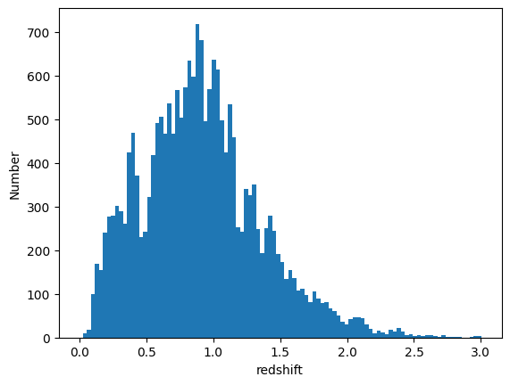
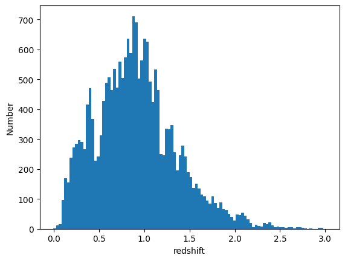

FlexZBoost PDF Representation Comparison
========================================

**Author:** Drew Oldag

**Last Run Successfully:** September 26, 2023

This notebook does a quick comparison of storage requirements for
Flexcode output using two different storage techniques. We’ll compare
``qp.interp`` (x,y interpolated) output against the native
parameterization of ``qp_flexzboost``.

.. code:: ipython3

    import os
    import matplotlib.pyplot as plt
    import numpy as np
    
    import qp
    
    from rail.core.data import TableHandle
    from rail.core.stage import RailStage
    
    %matplotlib inline 

.. code:: ipython3

    DS = RailStage.data_store
    DS.__class__.allow_overwrite = True

Create references to the training and test data.

.. code:: ipython3

    from rail.core.utils import find_rail_file
    trainFile = find_rail_file('examples_data/testdata/test_dc2_training_9816.hdf5')
    testFile = find_rail_file('examples_data/testdata/test_dc2_validation_9816.hdf5')
    training_data = DS.read_file("training_data", TableHandle, trainFile)
    test_data = DS.read_file("test_data", TableHandle, testFile)

Define the configurations for the ML model to be trained by Flexcode.
Specifically we’ll use Xgboost with a set of 35 cosine basis functions.

.. code:: ipython3

    fz_dict = dict(zmin=0.0, zmax=3.0, nzbins=301,
                   trainfrac=0.75, bumpmin=0.02, bumpmax=0.35,
                   nbump=20, sharpmin=0.7, sharpmax=2.1, nsharp=15,
                   max_basis=35, basis_system='cosine',
                   hdf5_groupname='photometry',
                   regression_params={'max_depth': 8,'objective':'reg:squarederror'})
    
    fz_modelfile = 'demo_FZB_model.pkl'

Define the RAIL stage to train the model

.. code:: ipython3

    from rail.estimation.algos.flexzboost import FlexZBoostInformer, FlexZBoostEstimator
    inform_pzflex = FlexZBoostInformer.make_stage(name='inform_fzboost', model=fz_modelfile, **fz_dict)

Then we’ll run that stage to train the model and store the result in a
file name ``demo_FZB_model.pkl``.

.. code:: ipython3

    %%time
    inform_pzflex.inform(training_data)

.. parsed-literal::

    stacking some data...
    read in training data
    fit the model...

.. parsed-literal::

    /opt/hostedtoolcache/Python/3.10.13/x64/lib/python3.10/site-packages/xgboost/core.py:160: UserWarning: [07:18:53] WARNING: /workspace/src/learner.cc:742: 
    Parameters: { "silent" } are not used.
    
      warnings.warn(smsg, UserWarning)
    /opt/hostedtoolcache/Python/3.10.13/x64/lib/python3.10/site-packages/xgboost/core.py:160: UserWarning: [07:18:53] WARNING: /workspace/src/learner.cc:742: 
    Parameters: { "silent" } are not used.
    
      warnings.warn(smsg, UserWarning)
    /opt/hostedtoolcache/Python/3.10.13/x64/lib/python3.10/site-packages/xgboost/core.py:160: UserWarning: [07:18:54] WARNING: /workspace/src/learner.cc:742: 
    Parameters: { "silent" } are not used.
    
      warnings.warn(smsg, UserWarning)
    /opt/hostedtoolcache/Python/3.10.13/x64/lib/python3.10/site-packages/xgboost/core.py:160: UserWarning: [07:18:54] WARNING: /workspace/src/learner.cc:742: 
    Parameters: { "silent" } are not used.
    
      warnings.warn(smsg, UserWarning)
    /opt/hostedtoolcache/Python/3.10.13/x64/lib/python3.10/site-packages/xgboost/core.py:160: UserWarning: [07:18:55] WARNING: /workspace/src/learner.cc:742: 
    Parameters: { "silent" } are not used.
    
      warnings.warn(smsg, UserWarning)
    /opt/hostedtoolcache/Python/3.10.13/x64/lib/python3.10/site-packages/xgboost/core.py:160: UserWarning: [07:18:55] WARNING: /workspace/src/learner.cc:742: 
    Parameters: { "silent" } are not used.
    
      warnings.warn(smsg, UserWarning)
    /opt/hostedtoolcache/Python/3.10.13/x64/lib/python3.10/site-packages/xgboost/core.py:160: UserWarning: [07:18:56] WARNING: /workspace/src/learner.cc:742: 
    Parameters: { "silent" } are not used.
    
      warnings.warn(smsg, UserWarning)
    /opt/hostedtoolcache/Python/3.10.13/x64/lib/python3.10/site-packages/xgboost/core.py:160: UserWarning: [07:18:56] WARNING: /workspace/src/learner.cc:742: 
    Parameters: { "silent" } are not used.
    
      warnings.warn(smsg, UserWarning)
    /opt/hostedtoolcache/Python/3.10.13/x64/lib/python3.10/site-packages/xgboost/core.py:160: UserWarning: [07:18:57] WARNING: /workspace/src/learner.cc:742: 
    Parameters: { "silent" } are not used.
    
      warnings.warn(smsg, UserWarning)
    /opt/hostedtoolcache/Python/3.10.13/x64/lib/python3.10/site-packages/xgboost/core.py:160: UserWarning: [07:18:57] WARNING: /workspace/src/learner.cc:742: 
    Parameters: { "silent" } are not used.
    
      warnings.warn(smsg, UserWarning)
    /opt/hostedtoolcache/Python/3.10.13/x64/lib/python3.10/site-packages/xgboost/core.py:160: UserWarning: [07:18:58] WARNING: /workspace/src/learner.cc:742: 
    Parameters: { "silent" } are not used.
    
      warnings.warn(smsg, UserWarning)
    /opt/hostedtoolcache/Python/3.10.13/x64/lib/python3.10/site-packages/xgboost/core.py:160: UserWarning: [07:18:58] WARNING: /workspace/src/learner.cc:742: 
    Parameters: { "silent" } are not used.
    
      warnings.warn(smsg, UserWarning)
    /opt/hostedtoolcache/Python/3.10.13/x64/lib/python3.10/site-packages/xgboost/core.py:160: UserWarning: [07:18:59] WARNING: /workspace/src/learner.cc:742: 
    Parameters: { "silent" } are not used.
    
      warnings.warn(smsg, UserWarning)
    /opt/hostedtoolcache/Python/3.10.13/x64/lib/python3.10/site-packages/xgboost/core.py:160: UserWarning: [07:18:59] WARNING: /workspace/src/learner.cc:742: 
    Parameters: { "silent" } are not used.
    
      warnings.warn(smsg, UserWarning)
    /opt/hostedtoolcache/Python/3.10.13/x64/lib/python3.10/site-packages/xgboost/core.py:160: UserWarning: [07:19:00] WARNING: /workspace/src/learner.cc:742: 
    Parameters: { "silent" } are not used.
    
      warnings.warn(smsg, UserWarning)
    /opt/hostedtoolcache/Python/3.10.13/x64/lib/python3.10/site-packages/xgboost/core.py:160: UserWarning: [07:19:00] WARNING: /workspace/src/learner.cc:742: 
    Parameters: { "silent" } are not used.
    
      warnings.warn(smsg, UserWarning)
    /opt/hostedtoolcache/Python/3.10.13/x64/lib/python3.10/site-packages/xgboost/core.py:160: UserWarning: [07:19:01] WARNING: /workspace/src/learner.cc:742: 
    Parameters: { "silent" } are not used.
    
      warnings.warn(smsg, UserWarning)
    /opt/hostedtoolcache/Python/3.10.13/x64/lib/python3.10/site-packages/xgboost/core.py:160: UserWarning: [07:19:01] WARNING: /workspace/src/learner.cc:742: 
    Parameters: { "silent" } are not used.
    
      warnings.warn(smsg, UserWarning)
    /opt/hostedtoolcache/Python/3.10.13/x64/lib/python3.10/site-packages/xgboost/core.py:160: UserWarning: [07:19:02] WARNING: /workspace/src/learner.cc:742: 
    Parameters: { "silent" } are not used.
    
      warnings.warn(smsg, UserWarning)
    /opt/hostedtoolcache/Python/3.10.13/x64/lib/python3.10/site-packages/xgboost/core.py:160: UserWarning: [07:19:02] WARNING: /workspace/src/learner.cc:742: 
    Parameters: { "silent" } are not used.
    
      warnings.warn(smsg, UserWarning)

.. parsed-literal::

    finding best bump thresh...
    finding best sharpen parameter...
    Retraining with full training set...

.. parsed-literal::

    /opt/hostedtoolcache/Python/3.10.13/x64/lib/python3.10/site-packages/xgboost/core.py:160: UserWarning: [07:20:14] WARNING: /workspace/src/learner.cc:742: 
    Parameters: { "silent" } are not used.
    
      warnings.warn(smsg, UserWarning)
    /opt/hostedtoolcache/Python/3.10.13/x64/lib/python3.10/site-packages/xgboost/core.py:160: UserWarning: [07:20:14] WARNING: /workspace/src/learner.cc:742: 
    Parameters: { "silent" } are not used.
    
      warnings.warn(smsg, UserWarning)
    /opt/hostedtoolcache/Python/3.10.13/x64/lib/python3.10/site-packages/xgboost/core.py:160: UserWarning: [07:20:15] WARNING: /workspace/src/learner.cc:742: 
    Parameters: { "silent" } are not used.
    
      warnings.warn(smsg, UserWarning)
    /opt/hostedtoolcache/Python/3.10.13/x64/lib/python3.10/site-packages/xgboost/core.py:160: UserWarning: [07:20:15] WARNING: /workspace/src/learner.cc:742: 
    Parameters: { "silent" } are not used.
    
      warnings.warn(smsg, UserWarning)
    /opt/hostedtoolcache/Python/3.10.13/x64/lib/python3.10/site-packages/xgboost/core.py:160: UserWarning: [07:20:16] WARNING: /workspace/src/learner.cc:742: 
    Parameters: { "silent" } are not used.
    
      warnings.warn(smsg, UserWarning)
    /opt/hostedtoolcache/Python/3.10.13/x64/lib/python3.10/site-packages/xgboost/core.py:160: UserWarning: [07:20:16] WARNING: /workspace/src/learner.cc:742: 
    Parameters: { "silent" } are not used.
    
      warnings.warn(smsg, UserWarning)
    /opt/hostedtoolcache/Python/3.10.13/x64/lib/python3.10/site-packages/xgboost/core.py:160: UserWarning: [07:20:17] WARNING: /workspace/src/learner.cc:742: 
    Parameters: { "silent" } are not used.
    
      warnings.warn(smsg, UserWarning)
    /opt/hostedtoolcache/Python/3.10.13/x64/lib/python3.10/site-packages/xgboost/core.py:160: UserWarning: [07:20:17] WARNING: /workspace/src/learner.cc:742: 
    Parameters: { "silent" } are not used.
    
      warnings.warn(smsg, UserWarning)
    /opt/hostedtoolcache/Python/3.10.13/x64/lib/python3.10/site-packages/xgboost/core.py:160: UserWarning: [07:20:18] WARNING: /workspace/src/learner.cc:742: 
    Parameters: { "silent" } are not used.
    
      warnings.warn(smsg, UserWarning)
    /opt/hostedtoolcache/Python/3.10.13/x64/lib/python3.10/site-packages/xgboost/core.py:160: UserWarning: [07:20:18] WARNING: /workspace/src/learner.cc:742: 
    Parameters: { "silent" } are not used.
    
      warnings.warn(smsg, UserWarning)
    /opt/hostedtoolcache/Python/3.10.13/x64/lib/python3.10/site-packages/xgboost/core.py:160: UserWarning: [07:20:19] WARNING: /workspace/src/learner.cc:742: 
    Parameters: { "silent" } are not used.
    
      warnings.warn(smsg, UserWarning)
    /opt/hostedtoolcache/Python/3.10.13/x64/lib/python3.10/site-packages/xgboost/core.py:160: UserWarning: [07:20:19] WARNING: /workspace/src/learner.cc:742: 
    Parameters: { "silent" } are not used.
    
      warnings.warn(smsg, UserWarning)
    /opt/hostedtoolcache/Python/3.10.13/x64/lib/python3.10/site-packages/xgboost/core.py:160: UserWarning: [07:20:20] WARNING: /workspace/src/learner.cc:742: 
    Parameters: { "silent" } are not used.
    
      warnings.warn(smsg, UserWarning)
    /opt/hostedtoolcache/Python/3.10.13/x64/lib/python3.10/site-packages/xgboost/core.py:160: UserWarning: [07:20:20] WARNING: /workspace/src/learner.cc:742: 
    Parameters: { "silent" } are not used.
    
      warnings.warn(smsg, UserWarning)
    /opt/hostedtoolcache/Python/3.10.13/x64/lib/python3.10/site-packages/xgboost/core.py:160: UserWarning: [07:20:21] WARNING: /workspace/src/learner.cc:742: 
    Parameters: { "silent" } are not used.
    
      warnings.warn(smsg, UserWarning)
    /opt/hostedtoolcache/Python/3.10.13/x64/lib/python3.10/site-packages/xgboost/core.py:160: UserWarning: [07:20:21] WARNING: /workspace/src/learner.cc:742: 
    Parameters: { "silent" } are not used.
    
      warnings.warn(smsg, UserWarning)
    /opt/hostedtoolcache/Python/3.10.13/x64/lib/python3.10/site-packages/xgboost/core.py:160: UserWarning: [07:20:22] WARNING: /workspace/src/learner.cc:742: 
    Parameters: { "silent" } are not used.
    
      warnings.warn(smsg, UserWarning)
    /opt/hostedtoolcache/Python/3.10.13/x64/lib/python3.10/site-packages/xgboost/core.py:160: UserWarning: [07:20:22] WARNING: /workspace/src/learner.cc:742: 
    Parameters: { "silent" } are not used.
    
      warnings.warn(smsg, UserWarning)
    /opt/hostedtoolcache/Python/3.10.13/x64/lib/python3.10/site-packages/xgboost/core.py:160: UserWarning: [07:20:23] WARNING: /workspace/src/learner.cc:742: 
    Parameters: { "silent" } are not used.
    
      warnings.warn(smsg, UserWarning)
    /opt/hostedtoolcache/Python/3.10.13/x64/lib/python3.10/site-packages/xgboost/core.py:160: UserWarning: [07:20:23] WARNING: /workspace/src/learner.cc:742: 
    Parameters: { "silent" } are not used.
    
      warnings.warn(smsg, UserWarning)

.. parsed-literal::

    Inserting handle into data store.  model_inform_fzboost: inprogress_demo_FZB_model.pkl, inform_fzboost
    CPU times: user 1min 2s, sys: 4.23 s, total: 1min 6s
    Wall time: 1min 31s

.. parsed-literal::

    <rail.core.data.ModelHandle at 0x7fce553830d0>

Now we configure the RAIL stage that will evaluate test data using the
saved model. Note that we specify ``qp_representation='flexzboost'``
here to instruct ``rail_flexzboost`` to store the model weights using
``qp_flexzboost``.

.. code:: ipython3

    pzflex_qp_flexzboost = FlexZBoostEstimator.make_stage(name='fzboost_flexzboost', hdf5_groupname='photometry',
                                model=inform_pzflex.get_handle('model'),
                                output='flexzboost.hdf5',
                                qp_representation='flexzboost')

Now we actually evaluate the test data, 20,449 example galaxies, using
the trained model, and then print out the size of the file that was
saved.

Note that the final output size will depend on the number of basis
functions used by the model. Again, for this experiment, we used 35
basis functions.

.. code:: ipython3

    %%time
    output_file_name = './flexzboost.hdf5'
    try:
        os.unlink(output_file_name)
    except FileNotFoundError:
        pass
    
    fzresults_qp_flexzboost = pzflex_qp_flexzboost.estimate(test_data)
    file_size = os.path.getsize(output_file_name)
    print("File Size is :", file_size, "bytes")

.. parsed-literal::

    Process 0 running estimator on chunk 0 - 10000
    Process 0 estimating PZ PDF for rows 0 - 10,000
    Inserting handle into data store.  output_fzboost_flexzboost: inprogress_flexzboost.hdf5, fzboost_flexzboost
    Process 0 running estimator on chunk 10000 - 20000
    Process 0 estimating PZ PDF for rows 10,000 - 20,000
    Process 0 running estimator on chunk 20000 - 20449
    Process 0 estimating PZ PDF for rows 20,000 - 20,449
    File Size is : 2870476 bytes
    CPU times: user 749 ms, sys: 104 ms, total: 854 ms
    Wall time: 2.27 s

Example calculating median and mode. Note that we’re using the
``%%timeit`` magic command to get an estimate of the time required for
calculating ``median``, but we’re using ``%%time`` to estimate the
``mode``. This is because ``qp`` will cache the output of the ``pdf``
function for a given grid. If we used ``%%timeit``, then the resulting
estimate would average the run time of one non-cached calculation and
N-1 cached calculations.

.. code:: ipython3

    zgrid = np.linspace(0, 3., 301)

.. code:: ipython3

    %%time
    fz_medians_qp_flexzboost = fzresults_qp_flexzboost().median()

.. parsed-literal::

    CPU times: user 12.5 s, sys: 75.4 ms, total: 12.5 s
    Wall time: 12.4 s

.. code:: ipython3

    %%time
    fz_modes_qp_flexzboost = fzresults_qp_flexzboost().mode(grid=zgrid)

.. parsed-literal::

    CPU times: user 15.2 s, sys: 189 ms, total: 15.4 s
    Wall time: 15.3 s

Plotting median values.

.. code:: ipython3

    fz_medians_qp_flexzboost = fzresults_qp_flexzboost().median()
    
    plt.hist(fz_medians_qp_flexzboost, bins=np.linspace(-.005,3.005,101));
    plt.xlabel("redshift")
    plt.ylabel("Number")
    bins = np.linspace(-5, 5, 11)

Example convertion to a ``qp.hist`` histogram representation.

.. code:: ipython3

    %%timeit
    bins = np.linspace(-5, 5, 11)
    fzresults_qp_flexzboost().convert_to(qp.hist_gen, bins=bins)

.. parsed-literal::

    11.7 s ± 86.2 ms per loop (mean ± std. dev. of 7 runs, 1 loop each)

Now we’ll repeat the experiment using ``qp.interp`` storage. Again,
we’ll define the RAIL stage to evaluate the test data using the saved
model, but instruct ``rail_flexzboost`` to store the output as x,y
interpolated values using ``qp.interp``.

.. code:: ipython3

    pzflex_qp_interp = FlexZBoostEstimator.make_stage(name='fzboost_interp', hdf5_groupname='photometry',
                                model=inform_pzflex.get_handle('model'),
                                output='interp.hdf5',
                                qp_representation='interp',
                                calculated_point_estimates=[])

Finally we evaluate the test data again using the trained model, and
then print out the size of the file that was saved using the x,y
interpolated technique.

The final file size will depend on the size of the x grid that defines
the interpolation. However, we can see that in order to match the
storage requirements of ``qp_flexzboost``, the x grid would need to be
smaller than the number of basis functions used by the model. For this
experiment, we used 35 basis functions.

.. code:: ipython3

    %%time
    output_file_name = './interp.hdf5'
    try:
        os.unlink(output_file_name)
    except FileNotFoundError:
        pass
    
    fzresults_qp_interp = pzflex_qp_interp.estimate(test_data)
    file_size = os.path.getsize(output_file_name)
    print("File Size is :", file_size, "bytes")

.. parsed-literal::

    Process 0 running estimator on chunk 0 - 10000
    Process 0 estimating PZ PDF for rows 0 - 10,000
    Inserting handle into data store.  output_fzboost_interp: inprogress_interp.hdf5, fzboost_interp
    Process 0 running estimator on chunk 10000 - 20000
    Process 0 estimating PZ PDF for rows 10,000 - 20,000
    Process 0 running estimator on chunk 20000 - 20449
    Process 0 estimating PZ PDF for rows 20,000 - 20,449
    File Size is : 49248094 bytes
    CPU times: user 16.2 s, sys: 375 ms, total: 16.6 s
    Wall time: 17.6 s

Example calculating median and mode. Note that we’re using the
``%%timeit`` magic command to get an estimate of the time required for
calculating ``median``, but we’re using ``%%time`` to estimate the
``mode``. This is because ``qp`` will cache the output of the ``pdf``
function for a given grid. If we used ``%%timeit``, then the resulting
estimate would average the run time of one non-cached calculation and
N-1 cached calculations.

.. code:: ipython3

    zgrid = np.linspace(0, 3., 301)

.. code:: ipython3

    %%timeit
    fz_medians_qp_interp = fzresults_qp_interp().median()

.. parsed-literal::

    1.15 s ± 14.3 ms per loop (mean ± std. dev. of 7 runs, 1 loop each)

.. code:: ipython3

    %%time
    fz_modes_qp_interp = fzresults_qp_interp().mode(grid=zgrid)

.. parsed-literal::

    CPU times: user 363 ms, sys: 228 ms, total: 591 ms
    Wall time: 593 ms

Plotting median values.

.. code:: ipython3

    fz_medians_qp_interp = fzresults_qp_interp().median()
    plt.hist(fz_medians_qp_interp, bins=np.linspace(-.005,3.005,101));
    plt.xlabel("redshift")
    plt.ylabel("Number")

.. parsed-literal::

    Text(0, 0.5, 'Number')

Example convertion to a ``qp.hist`` histogram representation.

.. code:: ipython3

    %%timeit
    bins = np.linspace(-5, 5, 11)
    fzresults_qp_interp().convert_to(qp.hist_gen, bins=bins)

.. parsed-literal::

    84.7 ms ± 589 µs per loop (mean ± std. dev. of 7 runs, 10 loops each)

We’ll clean up the files that were produced: the model pickle file, and
the output data file.

.. code:: ipython3

    model_file_name = 'demo_FZB_model.pkl'
    flexzboost_file_name = './flexzboost.hdf5'
    interp_file_name = './interp.hdf5'
    
    try:
        os.unlink(model_file_name)
    except FileNotFoundError:
        pass
    
    try:
        os.unlink(flexzboost_file_name)
    except FileNotFoundError:
        pass
    
    try:
        os.unlink(interp_file_name)
    except FileNotFoundError:
        pass

