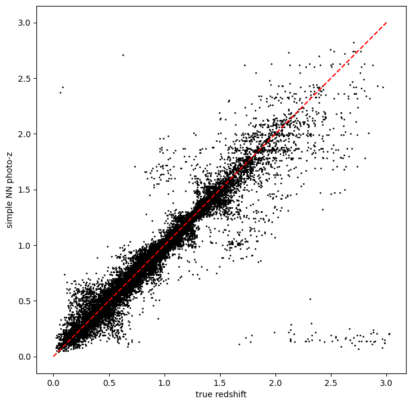
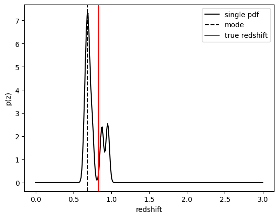
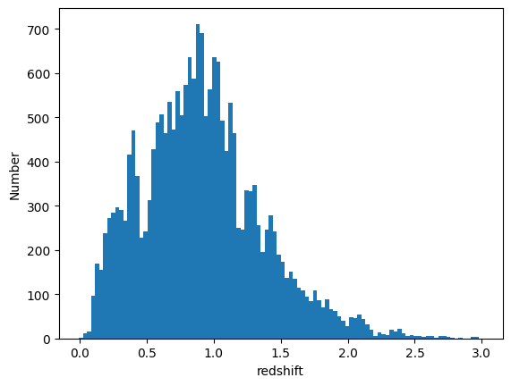
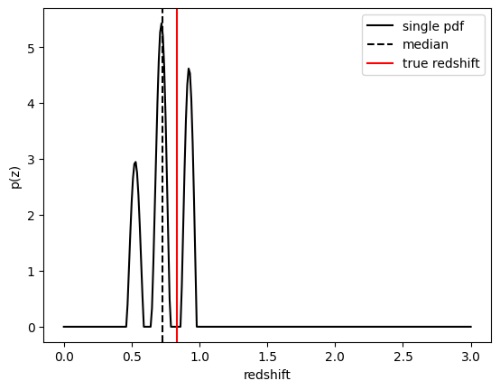
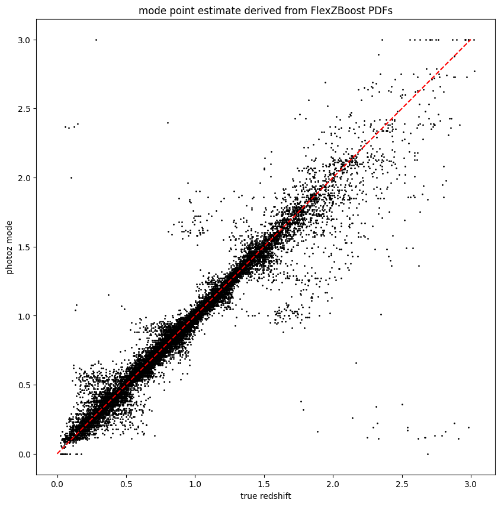

RAIL Estimation Tutorial Notebook
=================================

**Authors:** Sam Schmidt, Eric Charles, Alex Malz, others…

**Last run successfully:** August 15, 2023

This is a notebook demonstrating some of the ``estimation`` features of
the LSST-DESC ``RAIL``-iverse packages.

The ``rail.estimation`` subpackage contains infrastructure to run
multiple production-level photo-z codes. There is a minimimal superclass
that sets up some file paths and variable names. Each specific photo-z
code resides in a subclass in ``rail.estimation.algos`` with
algorithm-specific setup variables. More extensive documentation is
available on Read the Docs here:
https://rail-hub.readthedocs.io/en/latest/

.. code:: ipython3

    import os
    import matplotlib.pyplot as plt
    import numpy as np
    %matplotlib inline 

.. code:: ipython3

    import rail
    import qp
    from rail.core.data import TableHandle
    from rail.core.stage import RailStage

We’ll start by setting up the ``DataStore``. RAIL uses
```ceci`` <https://github.com/LSSTDESC/ceci>`__ as a back-end for
pipelines of RAIL stages run at the command line. The ``DataStore`` is a
workaround to enable ``ceci`` to interact with data files in an
interactive notebook environment. Some files will appear in the
``DataStore`` with the prefix “inprogress\_” as they are stored in
memory for use in the notebook, but the data will also be written out to
file with the prefix “output\_”. See the Golden Spike end-to-end demo
notebook for more details on the ``DataStore``.

.. code:: ipython3

    DS = RailStage.data_store
    DS.__class__.allow_overwrite = True

Importing all available estimators
----------------------------------

There is some handy functionality in ``rail.stages`` to import all
available stages that are installed in your environment. ``RailStage``
knows about all of the sub-types of stages. By looping through the
values in the ``RailStage.pipeline_stages`` dictionary, we can isolate
those that are sub-classes of
``rail.estimation.estimator.CatEstimator``, which operate on
catalog-like inputs. Let’s run this ``import_and_attach_all()`` command,
and then print out the subclasses that are now available for use (though
in this demo we only take advantage of two specific estimators):

.. code:: ipython3

    import rail.stages
    rail.stages.import_and_attach_all()
    
    for val in RailStage.pipeline_stages.values():
        if issubclass(val[0], rail.estimation.estimator.CatEstimator):
            print(val[0])


.. parsed-literal::

    Imported rail.astro_tools
    Imported rail.bpz
    Imported rail.cmnn
    Imported rail.core


.. parsed-literal::

    Imported rail.dsps
    Imported rail.flexzboost
    Install FSPS with the following commands:
    pip uninstall fsps
    git clone --recursive https://github.com/dfm/python-fsps.git
    cd python-fsps
    python -m pip install .
    export SPS_HOME=$(pwd)/src/fsps/libfsps
    
    Imported rail.fsps


.. parsed-literal::

    Imported rail.gpz
    Imported rail.hub
    Imported rail.interfaces
    Imported rail.pzflow
    Imported rail.sklearn


.. parsed-literal::

    Imported rail.som
    Imported rail.stages
    Attached 12 base classes and 81 fully formed stages to rail.stages
    <class 'rail.estimation.estimator.CatEstimator'>
    <class 'rail.estimation.algos.random_gauss.RandomGaussEstimator'>
    <class 'rail.estimation.algos.train_z.TrainZEstimator'>
    <class 'rail.estimation.algos.bpz_lite.BPZliteEstimator'>
    <class 'rail.estimation.algos.cmnn.CMNNEstimator'>
    <class 'rail.estimation.algos.flexzboost.FlexZBoostEstimator'>
    <class 'rail.estimation.algos.gpz.GPzEstimator'>
    <class 'rail.estimation.algos.pzflow_nf.PZFlowEstimator'>
    <class 'rail.estimation.algos.k_nearneigh.KNearNeighEstimator'>
    <class 'rail.estimation.algos.sklearn_neurnet.SklNeurNetEstimator'>
    <class 'rail.estimation.algos.nz_dir.NZDirSummarizer'>


You should see a list of the available subclasses corresponding to
specific photo-z algorithms, as printed out above. These currently
include:

-  ``bpz_lite`` is a template-based code that outputs the posterior
   estimated given a specific template set and Bayesian prior. See
   `Benitez (2000) <http://stacks.iop.org/0004-637X/536/i=2/a=571>`__
   for more details.
-  ``cmnn`` is an implementation of the "colour-matched nearest
   neighbour\` estimator described in `Graham et al
   2018 <https://ui.adsabs.harvard.edu/abs/2018AJ....155....1G/abstract>`__.
   It returns a single Gaussian for each galaxy.
-  ``delight_hybrid`` (currently ``delightPZ``) is a hybrid gaussian
   process/template-based code. See the `Leistedt & Hogg
   (2017) <https://doi.org/10.3847%2F1538-3881%2Faa91d5>`__ for more
   details.
-  ``flexzboost`` is a fully functional photo-z algorithm, implementing
   the FlexZBoost conditional density estimate method from `Izbicki, Lee
   & Freeman (2017) <https://doi.org/10.1214/16-AOAS1013>`__ that
   performed well in the LSST-DESC Photo-Z Data Challenge 1 paper
   (`Schmidt, Malz & Soo, et
   al. (2020) <https://academic.oup.com/mnras/article/499/2/1587/5905416>`__).
   FlexZBoost and some specialized metrics for it are available in
   Python and R through
   `FlexCode <https://github.com/lee-group-cmu/FlexCode>`__.
-  ``gpz`` is a Gaussian Process-based estimator. See `Almosallam et al
   2016 <https://ui.adsabs.harvard.edu/abs/2016MNRAS.462..726A/abstract>`__
   for details on the algorithm. It currently returns a single Gaussian
   for each PDF.
-  ``k_nearneigh`` is a simple implementation of a weighted k-nearest
   neighbor photo-z code. It stores each PDF as a weighted sum of
   Gaussians based on the distance from neighbors in color-space.
-  ``pzflow_nf`` uses the same normalizing flow code
   `pzflow <https://github.com/jfcrenshaw/pzflow>`__, the same one that
   appears in ``rail.creation``, to predict redshift PDFs.
-  ``random_gauss`` is a very simple class that does not actually
   predict a meaningful photo-z but can be useful for quick null tests
   when developing a pipeline. Instead it produces a randomly drawn
   Gaussian for each galaxy.
-  ``sklearn_neurnet`` is another toy model using ``sklearn``\ ’s neural
   network to predict a point estimate redshift from the training data,
   then assigns a sigma width based on the estimated redshift.
-  ``trainz`` is our “pathological” estimator. It makes a PDF from a
   histogram of the training data and assigns that PDF to every galaxy
   without considering its photometry.

Each code should have two specific classes associated with it: one to
``inform()`` using a set of training data or explicit priors and one to
``estimate()`` the per-galaxy photo-z PDFs. These should be imported
from the ``src/rail/estimation/algos/[name_of_code]`` module using the
above names. The naming pattern is ``[NameOfCode]Estimator`` for the
estimating class, and ``[NameOfCode]Informer`` for the
training/ingesting class, for example ``FlexZBoostEstimator`` and
``FlexZBoostInformer``.

For each of these two classes, we follow the pattern to first run a
``make_stage()`` method for the class in order to set up the ``ceci``
infrastructure and then invoke the ``inform()`` or ``estimate()`` method
for the class in question. We show examples of this below.

The code-specific parameters
----------------------------

Each photo-z algorithm has code-specific parameters necessary to
initialize the code. These values can be input on the command line, or
passed in via a dictionary.

Let’s start with a very simple demonstration using ``k_nearneigh``, a
RAIL wrapper around ``sklearn``\ ’s nearest neighbor (NN) method. It
calculates a normalized weight for the K nearest neighbors based on
their distance and makes a PDF as a sum of K Gaussians, each at the
redshift of the training galaxy with amplitude based on the distance
weight, and a Gaussian width set by the user. This is a toy model
estimator, but it actually performs very well for representative data
sets. There are configuration parameters for the names of columns,
random seeds, etc… in ``KNearNeighEstimator`` with best-guess sensible
defaults based on preliminary experimentation in DESC. See the
`KNearNeigh
code <https://github.com/LSSTDESC/RAIL/blob/eac-dev/rail/estimation/algos/k_nearneigh.py>`__
for more details, but here is a minimal set to run:

.. code:: ipython3

    knn_dict = dict(zmin=0.0, zmax=3.0, nzbins=301, trainfrac=0.75,
                    sigma_grid_min=0.01, sigma_grid_max=0.07, ngrid_sigma=10,
                    nneigh_min=3, nneigh_max=7, hdf5_groupname='photometry')

Here, ``trainfrac`` sets the proportion of training data to use in
training the algorithm, where the remaining fraction is used to validate
both the width of the Gaussians used in constructing the PDF and the
number of neighbors used in each PDF. The CDE Loss is a metric computed
on a grid of some width and number of neighbors, and the combination of
width and number of neighbors with the lowest CDE loss is used.
``sigma_grid_min``, ``sigma_grid_max``, and ``ngrid_sigma`` are used to
specify the grid of sigma values to test, while ``nneigh_min`` and
``nneigh_max`` are the integer values between which we will check the
loss.

``zmin``, ``zmax``, and ``nzbins`` are used to create a grid on which
the CDE Loss is computed when minimizing the loss to find the best
values for sigma and number of neighbors to use.

We will begin by training the algorithm by instantiating its
``Informer`` stage.

If any essential parameters are missing from the parameter dictionary,
they will be set to default values:

.. code:: ipython3

    from rail.estimation.algos.k_nearneigh import KNearNeighInformer, KNearNeighEstimator
    pz_train = KNearNeighInformer.make_stage(name='inform_KNN', model='demo_knn.pkl', **knn_dict)

Now, let’s load our training data, which is stored in hdf5 format. We’ll
load it into the ``DataStore`` so that the ``ceci`` stages are able to
access it.

.. code:: ipython3

    from rail.utils.path_utils import find_rail_file
    trainFile = find_rail_file('examples_data/testdata/test_dc2_training_9816.hdf5')
    testFile = find_rail_file('examples_data/testdata/test_dc2_validation_9816.hdf5')
    training_data = DS.read_file("training_data", TableHandle, trainFile)
    test_data = DS.read_file("test_data", TableHandle, testFile)

We need to train the KDTree, which is done with the ``inform()`` method
present in every ``Informer`` stage. The parameter ``model`` is the name
that the trained model object that will be saved as, in a format
specific to the estimation algorithm in question. In this case the
format is a pickle file called ``demo_knn.pkl``.

``KNearNeighInformer.inform`` finds the best sigma and NNeigh and stores
those along with the KDTree in the model.

.. code:: ipython3

    %%time
    pz_train.inform(training_data)


.. parsed-literal::

    split into 7669 training and 2556 validation samples
    finding best fit sigma and NNeigh...


.. parsed-literal::

    
    
    
    best fit values are sigma=0.023333333333333334 and numneigh=7
    
    
    
    Inserting handle into data store.  model_inform_KNN: inprogress_demo_knn.pkl, inform_KNN
    CPU times: user 8.76 s, sys: 1.94 s, total: 10.7 s
    Wall time: 10.7 s


.. parsed-literal::

    <rail.core.data.ModelHandle at 0x7f905cff2860>


We can now set up the main photo-z ``Estimator`` stage and run our
algorithm on the data to produce simple photo-z estimates. Note that we
are loading the trained model that we computed from the ``Informer``
stage:

.. code:: ipython3

    pz = KNearNeighEstimator.make_stage(name='KNN', hdf5_groupname='photometry',
                                  model=pz_train.get_handle('model'))
    results = pz.estimate(test_data)


.. parsed-literal::

    Process 0 running estimator on chunk 0 - 10000
    Process 0 estimating PZ PDF for rows 0 - 10,000


.. parsed-literal::

    Inserting handle into data store.  output_KNN: inprogress_output_KNN.hdf5, KNN
    Process 0 running estimator on chunk 10000 - 20000
    Process 0 estimating PZ PDF for rows 10,000 - 20,000


.. parsed-literal::

    Process 0 running estimator on chunk 20000 - 20449
    Process 0 estimating PZ PDF for rows 20,000 - 20,449


The output file is a ``qp.Ensemble`` containing the redshift PDFs. This
``Ensemble`` also includes a photo-z point estimate derived from the
PDFs, the mode by default (though there will soon be a keyword option to
choose a different point estimation method or to skip the calculation of
a point estimate). The modes are stored in the “ancillary” data within
the ``Ensemble``. By default it will be in an 1xM array, so you may need
to include a ``.flatten()`` to flatten the array. The zmode values in
the ancillary data can be accessed via:

.. code:: ipython3

    zmode = results().ancil['zmode'].flatten()

Let’s plot the redshift mode against the true redshifts to see how they
look:

.. code:: ipython3

    plt.figure(figsize=(8,8))
    plt.scatter(test_data()['photometry']['redshift'],zmode,s=1,c='k',label='simple NN mode')
    plt.plot([0,3],[0,3],'r--');
    plt.xlabel("true redshift")
    plt.ylabel("simple NN photo-z")


.. parsed-literal::

    Text(0, 0.5, 'simple NN photo-z')





Not bad, given our very simple estimator! For the PDFs, ``KNearNeigh``
is storing each PDF as a Gaussian mixture model parameterization where
each PDF is represented by a set of N Gaussians for each galaxy.
``qp.Ensemble`` objects have all the methods of
``scipy.stats.rv_continuous`` objects so we can evaluate the PDF on a
set of grid points with the built-in ``.pdf`` method. Let’s pick a
single galaxy from our sample and evaluate and plot the PDF, the mode,
and true redshift:

.. code:: ipython3

    zgrid = np.linspace(0, 3., 301)

.. code:: ipython3

    galid = 9529
    single_gal = np.squeeze(results()[galid].pdf(zgrid))
    single_zmode = zmode[galid]
    truez = test_data()['photometry']['redshift'][galid]
    plt.plot(zgrid,single_gal,color='k',label='single pdf')
    plt.axvline(single_zmode,color='k', ls='--', label='mode')
    plt.axvline(truez,color='r',label='true redshift')
    plt.legend(loc='upper right')
    plt.xlabel("redshift")
    plt.ylabel("p(z)")


.. parsed-literal::

    Text(0, 0.5, 'p(z)')





We see that KNearNeigh PDFs do consist of a number of discrete
Gaussians, and many have quite a bit of substructure. This is a naive
estimator, and some of these features are likely spurious.

FlexZBoost
----------

That illustrates the basics. Now let’s try the ``FlexZBoostEstimator``
estimator. FlexZBoost is available in the
`rail_flexzboost <https://github.com/LSSTDESC/rail_flexzboost/>`__ repo
and can be installed with

``pip install pz-rail-flexzboost``

on the command line or from source. Once installed, it will function the
same as any of the other estimators included in the primary ``rail``
repo.

``FlexZBoostEstimator`` approximates the conditional density estimate
for each PDF with a set of weights on a set of basis functions. This can
save space relative to a gridded parameterization, but it also leads to
residual “bumps” in the PDF intrinsic to the underlying cosine or
fourier parameterization. For this reason, ``FlexZBoostEstimator`` has a
post-processing stage where it “trims” (i.e. sets to zero) any small
peaks, or “bumps”, below a certain ``bump_thresh`` threshold.

One of the dominant features seen in our PhotoZDC1 analysis of multiple
photo-z codes (Schmidt, Malz et al. 2020) was that photo-z estimates
were often, in general, overconfident or underconfident in their overall
uncertainty in PDFs. To remedy this, ``FlexZBoostEstimator`` has an
additional post-processing step where it applies a “sharpening”
parameter ``sharpen`` that modulates the width of the PDFs according to
a power law.

A portion of the training data is held in reserve to determine best-fit
values for both ``bump_thresh`` and ``sharpening``, which we currently
find by simply calculating the CDE loss for a grid of ``bump_thresh``
and ``sharpening`` values; once those values are set FlexZBoost will
re-train its density estimate model with the full dataset. A more
sophisticated hyperparameter fitting procedure may be implemented in the
future.

We’ll start with a dictionary of setup parameters for
FlexZBoostEstimator, just as we had for the k-nearest neighbor
estimator. Some of the parameters are the same as in k-nearest neighbor
above, ``zmin``, ``zmax``, ``nzbins``. However, FlexZBoostEstimator
performs a more in depth training and as such has more input parameters
to control its behavior. These parameters are:

-  ``basis_system``: which basis system to use in the density estimate.
   The default is ``cosine`` but ``fourier`` is also an option
-  ``max_basis``: the maximum number of basis functions parameters to
   use for PDFs
-  ``regression_params``: a dictionary of options fed to ``xgboost``
   that control the maximum depth and the ``objective`` function. An
   update in ``xgboost`` means that ``objective`` should now be set to
   ``reg:squarederror`` for proper functioning.
-  ``trainfrac``: The fraction of the training data to use for training
   the density estimate. The remaining galaxies will be used for
   validation of ``bump_thresh`` and ``sharpening``.
-  ``bumpmin``: the minimum value to test in the ``bump_thresh`` grid
-  ``bumpmax``: the maximum value to test in the ``bump_thresh`` grid
-  ``nbump``: how many points to test in the ``bump_thresh`` grid
-  ``sharpmin``, ``sharpmax``, ``nsharp``: same as equivalent
   ``bump_thresh`` params, but for ``sharpening`` parameter

.. code:: ipython3

    fz_dict = dict(zmin=0.0, zmax=3.0, nzbins=301,
                   trainfrac=0.75, bumpmin=0.02, bumpmax=0.35,
                   nbump=20, sharpmin=0.7, sharpmax=2.1, nsharp=15,
                   max_basis=35, basis_system='cosine',
                   hdf5_groupname='photometry',
                   regression_params={'max_depth': 8,'objective':'reg:squarederror'})
    fz_modelfile = 'demo_FZB_model.pkl'

.. code:: ipython3

    from rail.estimation.algos.flexzboost import FlexZBoostInformer, FlexZBoostEstimator
    inform_pzflex = FlexZBoostInformer.make_stage(name='inform_fzboost', model=fz_modelfile, **fz_dict)

``FlexZBoostInformer`` operates on the training set and writes a file
containing the estimation model. ``FlexZBoost`` uses xgboost to
determine a conditional density estimate model, and also fits the
``bump_thresh`` and ``sharpen`` parameters described above.

``FlexZBoost`` is a bit more sophisticated than the earlier k-nearest
neighbor estimator, so it will take a bit longer to train, but not
drastically so, still under a minute on a semi-new laptop. We specified
the name of the model file, ``demo_FZB_model.pkl``, which will store our
trained model for use with the estimation stage.

.. code:: ipython3

    %%time
    inform_pzflex.inform(training_data)


.. parsed-literal::

    stacking some data...
    read in training data
    fit the model...


.. parsed-literal::

    /opt/hostedtoolcache/Python/3.10.15/x64/lib/python3.10/site-packages/joblib/externals/loky/backend/fork_exec.py:38: RuntimeWarning: os.fork() was called. os.fork() is incompatible with multithreaded code, and JAX is multithreaded, so this will likely lead to a deadlock.
      pid = os.fork()


.. parsed-literal::

    /opt/hostedtoolcache/Python/3.10.15/x64/lib/python3.10/site-packages/xgboost/core.py:158: UserWarning: [07:02:22] WARNING: /workspace/src/learner.cc:740: 
    Parameters: { "silent" } are not used.
    
      warnings.warn(smsg, UserWarning)
    /opt/hostedtoolcache/Python/3.10.15/x64/lib/python3.10/site-packages/xgboost/core.py:158: UserWarning: [07:02:22] WARNING: /workspace/src/learner.cc:740: 
    Parameters: { "silent" } are not used.
    
      warnings.warn(smsg, UserWarning)
    /opt/hostedtoolcache/Python/3.10.15/x64/lib/python3.10/site-packages/xgboost/core.py:158: UserWarning: [07:02:22] WARNING: /workspace/src/learner.cc:740: 
    Parameters: { "silent" } are not used.
    
      warnings.warn(smsg, UserWarning)
    /opt/hostedtoolcache/Python/3.10.15/x64/lib/python3.10/site-packages/xgboost/core.py:158: UserWarning: [07:02:22] WARNING: /workspace/src/learner.cc:740: 
    Parameters: { "silent" } are not used.
    
      warnings.warn(smsg, UserWarning)
    /opt/hostedtoolcache/Python/3.10.15/x64/lib/python3.10/site-packages/xgboost/core.py:158: UserWarning: [07:02:23] WARNING: /workspace/src/learner.cc:740: 
    Parameters: { "silent" } are not used.
    
      warnings.warn(smsg, UserWarning)


.. parsed-literal::

    /opt/hostedtoolcache/Python/3.10.15/x64/lib/python3.10/site-packages/xgboost/core.py:158: UserWarning: [07:02:23] WARNING: /workspace/src/learner.cc:740: 
    Parameters: { "silent" } are not used.
    
      warnings.warn(smsg, UserWarning)
    /opt/hostedtoolcache/Python/3.10.15/x64/lib/python3.10/site-packages/xgboost/core.py:158: UserWarning: [07:02:23] WARNING: /workspace/src/learner.cc:740: 
    Parameters: { "silent" } are not used.
    
      warnings.warn(smsg, UserWarning)
    /opt/hostedtoolcache/Python/3.10.15/x64/lib/python3.10/site-packages/xgboost/core.py:158: UserWarning: [07:02:23] WARNING: /workspace/src/learner.cc:740: 
    Parameters: { "silent" } are not used.
    
      warnings.warn(smsg, UserWarning)


.. parsed-literal::

    /opt/hostedtoolcache/Python/3.10.15/x64/lib/python3.10/site-packages/xgboost/core.py:158: UserWarning: [07:02:24] WARNING: /workspace/src/learner.cc:740: 
    Parameters: { "silent" } are not used.
    
      warnings.warn(smsg, UserWarning)
    /opt/hostedtoolcache/Python/3.10.15/x64/lib/python3.10/site-packages/xgboost/core.py:158: UserWarning: [07:02:24] WARNING: /workspace/src/learner.cc:740: 
    Parameters: { "silent" } are not used.
    
      warnings.warn(smsg, UserWarning)
    /opt/hostedtoolcache/Python/3.10.15/x64/lib/python3.10/site-packages/xgboost/core.py:158: UserWarning: [07:02:24] WARNING: /workspace/src/learner.cc:740: 
    Parameters: { "silent" } are not used.
    
      warnings.warn(smsg, UserWarning)
    /opt/hostedtoolcache/Python/3.10.15/x64/lib/python3.10/site-packages/xgboost/core.py:158: UserWarning: [07:02:24] WARNING: /workspace/src/learner.cc:740: 
    Parameters: { "silent" } are not used.
    
      warnings.warn(smsg, UserWarning)


.. parsed-literal::

    /opt/hostedtoolcache/Python/3.10.15/x64/lib/python3.10/site-packages/xgboost/core.py:158: UserWarning: [07:02:25] WARNING: /workspace/src/learner.cc:740: 
    Parameters: { "silent" } are not used.
    
      warnings.warn(smsg, UserWarning)
    /opt/hostedtoolcache/Python/3.10.15/x64/lib/python3.10/site-packages/xgboost/core.py:158: UserWarning: [07:02:25] WARNING: /workspace/src/learner.cc:740: 
    Parameters: { "silent" } are not used.
    
      warnings.warn(smsg, UserWarning)
    /opt/hostedtoolcache/Python/3.10.15/x64/lib/python3.10/site-packages/xgboost/core.py:158: UserWarning: [07:02:25] WARNING: /workspace/src/learner.cc:740: 
    Parameters: { "silent" } are not used.
    
      warnings.warn(smsg, UserWarning)
    /opt/hostedtoolcache/Python/3.10.15/x64/lib/python3.10/site-packages/xgboost/core.py:158: UserWarning: [07:02:25] WARNING: /workspace/src/learner.cc:740: 
    Parameters: { "silent" } are not used.
    
      warnings.warn(smsg, UserWarning)


.. parsed-literal::

    /opt/hostedtoolcache/Python/3.10.15/x64/lib/python3.10/site-packages/xgboost/core.py:158: UserWarning: [07:02:26] WARNING: /workspace/src/learner.cc:740: 
    Parameters: { "silent" } are not used.
    
      warnings.warn(smsg, UserWarning)


.. parsed-literal::

    /opt/hostedtoolcache/Python/3.10.15/x64/lib/python3.10/site-packages/xgboost/core.py:158: UserWarning: [07:02:26] WARNING: /workspace/src/learner.cc:740: 
    Parameters: { "silent" } are not used.
    
      warnings.warn(smsg, UserWarning)
    /opt/hostedtoolcache/Python/3.10.15/x64/lib/python3.10/site-packages/xgboost/core.py:158: UserWarning: [07:02:26] WARNING: /workspace/src/learner.cc:740: 
    Parameters: { "silent" } are not used.
    
      warnings.warn(smsg, UserWarning)


.. parsed-literal::

    /opt/hostedtoolcache/Python/3.10.15/x64/lib/python3.10/site-packages/xgboost/core.py:158: UserWarning: [07:02:26] WARNING: /workspace/src/learner.cc:740: 
    Parameters: { "silent" } are not used.
    
      warnings.warn(smsg, UserWarning)


.. parsed-literal::

    /opt/hostedtoolcache/Python/3.10.15/x64/lib/python3.10/site-packages/xgboost/core.py:158: UserWarning: [07:02:27] WARNING: /workspace/src/learner.cc:740: 
    Parameters: { "silent" } are not used.
    
      warnings.warn(smsg, UserWarning)
    /opt/hostedtoolcache/Python/3.10.15/x64/lib/python3.10/site-packages/xgboost/core.py:158: UserWarning: [07:02:27] WARNING: /workspace/src/learner.cc:740: 
    Parameters: { "silent" } are not used.
    
      warnings.warn(smsg, UserWarning)
    /opt/hostedtoolcache/Python/3.10.15/x64/lib/python3.10/site-packages/xgboost/core.py:158: UserWarning: [07:02:27] WARNING: /workspace/src/learner.cc:740: 
    Parameters: { "silent" } are not used.
    
      warnings.warn(smsg, UserWarning)


.. parsed-literal::

    /opt/hostedtoolcache/Python/3.10.15/x64/lib/python3.10/site-packages/xgboost/core.py:158: UserWarning: [07:02:27] WARNING: /workspace/src/learner.cc:740: 
    Parameters: { "silent" } are not used.
    
      warnings.warn(smsg, UserWarning)


.. parsed-literal::

    finding best bump thresh...


.. parsed-literal::

    finding best sharpen parameter...


.. parsed-literal::

    Retraining with full training set...


.. parsed-literal::

    /opt/hostedtoolcache/Python/3.10.15/x64/lib/python3.10/site-packages/xgboost/core.py:158: UserWarning: [07:03:16] WARNING: /workspace/src/learner.cc:740: 
    Parameters: { "silent" } are not used.
    
      warnings.warn(smsg, UserWarning)
    /opt/hostedtoolcache/Python/3.10.15/x64/lib/python3.10/site-packages/xgboost/core.py:158: UserWarning: [07:03:16] WARNING: /workspace/src/learner.cc:740: 
    Parameters: { "silent" } are not used.
    
      warnings.warn(smsg, UserWarning)
    /opt/hostedtoolcache/Python/3.10.15/x64/lib/python3.10/site-packages/xgboost/core.py:158: UserWarning: [07:03:16] WARNING: /workspace/src/learner.cc:740: 
    Parameters: { "silent" } are not used.
    
      warnings.warn(smsg, UserWarning)
    /opt/hostedtoolcache/Python/3.10.15/x64/lib/python3.10/site-packages/xgboost/core.py:158: UserWarning: [07:03:16] WARNING: /workspace/src/learner.cc:740: 
    Parameters: { "silent" } are not used.
    
      warnings.warn(smsg, UserWarning)


.. parsed-literal::

    /opt/hostedtoolcache/Python/3.10.15/x64/lib/python3.10/site-packages/xgboost/core.py:158: UserWarning: [07:03:17] WARNING: /workspace/src/learner.cc:740: 
    Parameters: { "silent" } are not used.
    
      warnings.warn(smsg, UserWarning)
    /opt/hostedtoolcache/Python/3.10.15/x64/lib/python3.10/site-packages/xgboost/core.py:158: UserWarning: [07:03:17] WARNING: /workspace/src/learner.cc:740: 
    Parameters: { "silent" } are not used.
    
      warnings.warn(smsg, UserWarning)
    /opt/hostedtoolcache/Python/3.10.15/x64/lib/python3.10/site-packages/xgboost/core.py:158: UserWarning: [07:03:17] WARNING: /workspace/src/learner.cc:740: 
    Parameters: { "silent" } are not used.
    
      warnings.warn(smsg, UserWarning)
    /opt/hostedtoolcache/Python/3.10.15/x64/lib/python3.10/site-packages/xgboost/core.py:158: UserWarning: [07:03:17] WARNING: /workspace/src/learner.cc:740: 
    Parameters: { "silent" } are not used.
    
      warnings.warn(smsg, UserWarning)


.. parsed-literal::

    /opt/hostedtoolcache/Python/3.10.15/x64/lib/python3.10/site-packages/xgboost/core.py:158: UserWarning: [07:03:18] WARNING: /workspace/src/learner.cc:740: 
    Parameters: { "silent" } are not used.
    
      warnings.warn(smsg, UserWarning)
    /opt/hostedtoolcache/Python/3.10.15/x64/lib/python3.10/site-packages/xgboost/core.py:158: UserWarning: [07:03:18] WARNING: /workspace/src/learner.cc:740: 
    Parameters: { "silent" } are not used.
    
      warnings.warn(smsg, UserWarning)
    /opt/hostedtoolcache/Python/3.10.15/x64/lib/python3.10/site-packages/xgboost/core.py:158: UserWarning: [07:03:18] WARNING: /workspace/src/learner.cc:740: 
    Parameters: { "silent" } are not used.
    
      warnings.warn(smsg, UserWarning)
    /opt/hostedtoolcache/Python/3.10.15/x64/lib/python3.10/site-packages/xgboost/core.py:158: UserWarning: [07:03:18] WARNING: /workspace/src/learner.cc:740: 
    Parameters: { "silent" } are not used.
    
      warnings.warn(smsg, UserWarning)


.. parsed-literal::

    /opt/hostedtoolcache/Python/3.10.15/x64/lib/python3.10/site-packages/xgboost/core.py:158: UserWarning: [07:03:19] WARNING: /workspace/src/learner.cc:740: 
    Parameters: { "silent" } are not used.
    
      warnings.warn(smsg, UserWarning)


.. parsed-literal::

    /opt/hostedtoolcache/Python/3.10.15/x64/lib/python3.10/site-packages/xgboost/core.py:158: UserWarning: [07:03:19] WARNING: /workspace/src/learner.cc:740: 
    Parameters: { "silent" } are not used.
    
      warnings.warn(smsg, UserWarning)
    /opt/hostedtoolcache/Python/3.10.15/x64/lib/python3.10/site-packages/xgboost/core.py:158: UserWarning: [07:03:19] WARNING: /workspace/src/learner.cc:740: 
    Parameters: { "silent" } are not used.
    
      warnings.warn(smsg, UserWarning)
    /opt/hostedtoolcache/Python/3.10.15/x64/lib/python3.10/site-packages/xgboost/core.py:158: UserWarning: [07:03:19] WARNING: /workspace/src/learner.cc:740: 
    Parameters: { "silent" } are not used.
    
      warnings.warn(smsg, UserWarning)


.. parsed-literal::

    /opt/hostedtoolcache/Python/3.10.15/x64/lib/python3.10/site-packages/xgboost/core.py:158: UserWarning: [07:03:20] WARNING: /workspace/src/learner.cc:740: 
    Parameters: { "silent" } are not used.
    
      warnings.warn(smsg, UserWarning)
    /opt/hostedtoolcache/Python/3.10.15/x64/lib/python3.10/site-packages/xgboost/core.py:158: UserWarning: [07:03:20] WARNING: /workspace/src/learner.cc:740: 
    Parameters: { "silent" } are not used.
    
      warnings.warn(smsg, UserWarning)
    /opt/hostedtoolcache/Python/3.10.15/x64/lib/python3.10/site-packages/xgboost/core.py:158: UserWarning: [07:03:20] WARNING: /workspace/src/learner.cc:740: 
    Parameters: { "silent" } are not used.
    
      warnings.warn(smsg, UserWarning)
    /opt/hostedtoolcache/Python/3.10.15/x64/lib/python3.10/site-packages/xgboost/core.py:158: UserWarning: [07:03:20] WARNING: /workspace/src/learner.cc:740: 
    Parameters: { "silent" } are not used.
    
      warnings.warn(smsg, UserWarning)


.. parsed-literal::

    Inserting handle into data store.  model_inform_fzboost: inprogress_demo_FZB_model.pkl, inform_fzboost
    CPU times: user 47.1 s, sys: 10.5 s, total: 57.6 s
    Wall time: 59.5 s


.. parsed-literal::

    <rail.core.data.ModelHandle at 0x7f905c8a3ee0>


Loading a pre-trained model
---------------------------

If we have an existing pretrained model, for example the one in the file
``demo_FZB_model.pkl``, we can skip this step in subsequent runs of an
estimator; that is, we load this pickled model without having to repeat
the training stage for this specific training data, and that can save
time for larger training sets that would take longer to create the
model.

There are two supported model output representations, ``interp``
(default) and ``flexzboost``. Using ``flexzboost`` will store the output
basis function weights from FlexCode, resulting in a smaller storage
size on disk and giving the user the option to tune the sharpening and
bump-removal parameters as a post-processing step. However, if you know
that you will be performing operations on PDFs evaluated on a redshift
grid that is known before performing the estimation, you can peform that
post-processing up front by employing ``interp`` to store the output as
interpolated y values for a given set of x values, requiring more
storage space but eliminating the need to evaluate the PDFs upon
downstream usage.

For additional comparisons of the approaches, see the documentation for
``qp_flexzboost`` here:
https://qp-flexzboost.readthedocs.io/en/latest/source/performance_comparison.html

.. code:: ipython3

    %%time
    pzflex = FlexZBoostEstimator.make_stage(name='fzboost', hdf5_groupname='photometry',
                                model=inform_pzflex.get_handle('model'))
    
    # For this notebook, we will use the default value of qp_representation as shown
    # above due to the additional computation time that would be required in the
    # later steps when working with the flexzboost representation.
    # Below are two examples showing the explicit use of the qp_representation argument.
    """
    pzflex = FlexZBoostEstimator.make_stage(name='fzboost', hdf5_groupname='photometry',
                                model=inform_pzflex.get_handle('model'),
                                qp_representation='interp')
    
    pzflex = FlexZBoostEstimator.make_stage(name='fzboost', hdf5_groupname='photometry',
                                model=inform_pzflex.get_handle('model'),
                                qp_representation='flexzboost')
    """


.. parsed-literal::

    CPU times: user 210 μs, sys: 0 ns, total: 210 μs
    Wall time: 214 μs


.. parsed-literal::

    "\npzflex = FlexZBoostEstimator.make_stage(name='fzboost', hdf5_groupname='photometry',\n                            model=inform_pzflex.get_handle('model'),\n                            qp_representation='interp')\n\npzflex = FlexZBoostEstimator.make_stage(name='fzboost', hdf5_groupname='photometry',\n                            model=inform_pzflex.get_handle('model'),\n                            qp_representation='flexzboost')\n"


It takes only a few seconds, so, if you are running an algorithm with a
burdensome training requirement, saving a trained copy of the model for
later repeated use can be a real time saver.

Now, let’s compute photo-z’s using with the ``estimate`` method.

.. code:: ipython3

    %%time
    fzresults = pzflex.estimate(test_data)


.. parsed-literal::

    Process 0 running estimator on chunk 0 - 10000
    Process 0 estimating PZ PDF for rows 0 - 10,000


.. parsed-literal::

    Inserting handle into data store.  output_fzboost: inprogress_output_fzboost.hdf5, fzboost
    Process 0 running estimator on chunk 10000 - 20000
    Process 0 estimating PZ PDF for rows 10,000 - 20,000


.. parsed-literal::

    Process 0 running estimator on chunk 20000 - 20449
    Process 0 estimating PZ PDF for rows 20,000 - 20,449


.. parsed-literal::

    CPU times: user 11.6 s, sys: 1.02 s, total: 12.6 s
    Wall time: 12.3 s


We can calculate the median and mode values of the PDFs and plot their
distribution (in this case the modes are already stored in the
qp.Ensemble’s ancillary data, but here is an example of computing the
point estimates via qp directly):

.. code:: ipython3

    fz_medians = fzresults().median()
    fz_modes = fzresults().mode(grid=zgrid)

.. code:: ipython3

    plt.hist(fz_medians, bins=np.linspace(-.005,3.005,101));
    plt.xlabel("redshift")
    plt.ylabel("Number")


.. parsed-literal::

    Text(0, 0.5, 'Number')





We can plot an example PDF, its median redshift, and its true redshift
from the results file:

.. code:: ipython3

    galid = 9529
    single_gal = np.squeeze(fzresults()[galid].pdf(zgrid))
    single_zmedian = fz_medians[galid]
    truez = test_data()['photometry']['redshift'][galid]
    plt.plot(zgrid,single_gal,color='k',label='single pdf')
    plt.axvline(single_zmedian,color='k', ls='--', label='median')
    plt.axvline(truez,color='r',label='true redshift')
    plt.legend(loc='upper right')
    plt.xlabel("redshift")
    plt.ylabel("p(z)")


.. parsed-literal::

    Text(0, 0.5, 'p(z)')





We can also plot a point estimaten against the truth as a visual
diagnostic:

.. code:: ipython3

    plt.figure(figsize=(10,10))
    plt.scatter(test_data()['photometry']['redshift'],fz_modes,s=1,c='k')
    plt.plot([0,3],[0,3],'r--')
    plt.xlabel("true redshift")
    plt.ylabel("photoz mode")
    plt.title("mode point estimate derived from FlexZBoost PDFs");





The results look very good! FlexZBoost is a mature algorithm, and with
representative training data we see a very tight correlation with true
redshift and few outliers due to physical degeneracies.
