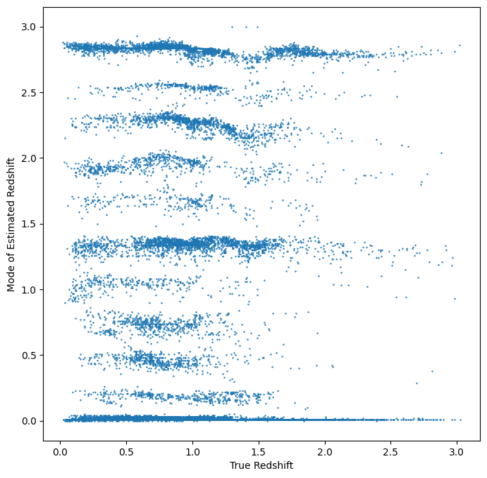

PZFlow Informer and Estimator Demo

Author: Tianqing Zhang

.. code:: ipython3

    %matplotlib inline
    import os
    import matplotlib.pyplot as plt
    import numpy as np
    import pandas as pd
    
    import rail
    from rail.core.data import TableHandle
    from rail.core.stage import RailStage
    import qp
    import tables_io
    
    from rail.estimation.algos.pzflow_nf import PZFlowInformer, PZFlowEstimator

.. code:: ipython3

    DS = RailStage.data_store
    DS.__class__.allow_overwrite = True

.. code:: ipython3

    from rail.utils.path_utils import find_rail_file
    trainFile = find_rail_file('examples_data/testdata/test_dc2_training_9816.hdf5')
    testFile = find_rail_file('examples_data/testdata/test_dc2_validation_9816.hdf5')
    training_data = DS.read_file("training_data", TableHandle, trainFile)
    test_data = DS.read_file("test_data", TableHandle, testFile)

.. code:: ipython3

    pzflow_dict = dict(hdf5_groupname='photometry',output_mode = 'not_fiducial' )

.. code:: ipython3

    
    # epoch = 200 gives a reasonable converged loss
    pzflow_train = PZFlowInformer.make_stage(name='inform_pzflow',model='demo_pzflow.pkl',num_training_epochs = 30, **pzflow_dict)

.. code:: ipython3

    # training of the pzflow
    pzflow_train.inform(training_data)

.. parsed-literal::

    /opt/hostedtoolcache/Python/3.10.15/x64/lib/python3.10/site-packages/rail/estimation/algos/pzflow_nf.py:134: FutureWarning: Setting an item of incompatible dtype is deprecated and will raise an error in a future version of pandas. Value '27.79' has dtype incompatible with float32, please explicitly cast to a compatible dtype first.
      flowdf.loc[np.isclose(flowdf[col], 99.), col] = self.config.mag_limits[col]
    /opt/hostedtoolcache/Python/3.10.15/x64/lib/python3.10/site-packages/rail/estimation/algos/pzflow_nf.py:134: FutureWarning: Setting an item of incompatible dtype is deprecated and will raise an error in a future version of pandas. Value '29.04' has dtype incompatible with float32, please explicitly cast to a compatible dtype first.
      flowdf.loc[np.isclose(flowdf[col], 99.), col] = self.config.mag_limits[col]
    /opt/hostedtoolcache/Python/3.10.15/x64/lib/python3.10/site-packages/rail/estimation/algos/pzflow_nf.py:134: FutureWarning: Setting an item of incompatible dtype is deprecated and will raise an error in a future version of pandas. Value '29.06' has dtype incompatible with float32, please explicitly cast to a compatible dtype first.
      flowdf.loc[np.isclose(flowdf[col], 99.), col] = self.config.mag_limits[col]
    /opt/hostedtoolcache/Python/3.10.15/x64/lib/python3.10/site-packages/rail/estimation/algos/pzflow_nf.py:134: FutureWarning: Setting an item of incompatible dtype is deprecated and will raise an error in a future version of pandas. Value '28.62' has dtype incompatible with float32, please explicitly cast to a compatible dtype first.
      flowdf.loc[np.isclose(flowdf[col], 99.), col] = self.config.mag_limits[col]
    /opt/hostedtoolcache/Python/3.10.15/x64/lib/python3.10/site-packages/rail/estimation/algos/pzflow_nf.py:134: FutureWarning: Setting an item of incompatible dtype is deprecated and will raise an error in a future version of pandas. Value '27.98' has dtype incompatible with float32, please explicitly cast to a compatible dtype first.
      flowdf.loc[np.isclose(flowdf[col], 99.), col] = self.config.mag_limits[col]
    /opt/hostedtoolcache/Python/3.10.15/x64/lib/python3.10/site-packages/rail/estimation/algos/pzflow_nf.py:134: FutureWarning: Setting an item of incompatible dtype is deprecated and will raise an error in a future version of pandas. Value '27.05' has dtype incompatible with float32, please explicitly cast to a compatible dtype first.
      flowdf.loc[np.isclose(flowdf[col], 99.), col] = self.config.mag_limits[col]

.. parsed-literal::

    Training 30 epochs 
    Loss:

.. parsed-literal::

    (0) inf

.. parsed-literal::

    (1) inf
    Training stopping after epoch 1 because training loss diverged.
    Inserting handle into data store.  model_inform_pzflow: inprogress_demo_pzflow.pkl, inform_pzflow

.. parsed-literal::

    <rail.tools.flow_handle.FlowHandle at 0x7fbf8eab2050>

.. code:: ipython3

    pzflow_dict = dict(hdf5_groupname='photometry')
    
    pzflow_estimator = PZFlowEstimator.make_stage(name='estimate_pzflow',model='demo_pzflow.pkl',**pzflow_dict, chunk_size = 20000)

.. code:: ipython3

    # estimate using the test data
    estimate_results = pzflow_estimator.estimate(test_data)

.. parsed-literal::

    Inserting handle into data store.  model: demo_pzflow.pkl, estimate_pzflow
    Process 0 running estimator on chunk 0 - 20000

.. parsed-literal::

    /opt/hostedtoolcache/Python/3.10.15/x64/lib/python3.10/site-packages/rail/estimation/algos/pzflow_nf.py:214: FutureWarning: Setting an item of incompatible dtype is deprecated and will raise an error in a future version of pandas. Value '27.79' has dtype incompatible with float32, please explicitly cast to a compatible dtype first.
      flow_df.loc[np.isclose(flow_df[col], 99.), col] = self.config.mag_limits[col]
    /opt/hostedtoolcache/Python/3.10.15/x64/lib/python3.10/site-packages/rail/estimation/algos/pzflow_nf.py:214: FutureWarning: Setting an item of incompatible dtype is deprecated and will raise an error in a future version of pandas. Value '29.04' has dtype incompatible with float32, please explicitly cast to a compatible dtype first.
      flow_df.loc[np.isclose(flow_df[col], 99.), col] = self.config.mag_limits[col]
    /opt/hostedtoolcache/Python/3.10.15/x64/lib/python3.10/site-packages/rail/estimation/algos/pzflow_nf.py:214: FutureWarning: Setting an item of incompatible dtype is deprecated and will raise an error in a future version of pandas. Value '29.06' has dtype incompatible with float32, please explicitly cast to a compatible dtype first.
      flow_df.loc[np.isclose(flow_df[col], 99.), col] = self.config.mag_limits[col]
    /opt/hostedtoolcache/Python/3.10.15/x64/lib/python3.10/site-packages/rail/estimation/algos/pzflow_nf.py:214: FutureWarning: Setting an item of incompatible dtype is deprecated and will raise an error in a future version of pandas. Value '28.62' has dtype incompatible with float32, please explicitly cast to a compatible dtype first.
      flow_df.loc[np.isclose(flow_df[col], 99.), col] = self.config.mag_limits[col]
    /opt/hostedtoolcache/Python/3.10.15/x64/lib/python3.10/site-packages/rail/estimation/algos/pzflow_nf.py:214: FutureWarning: Setting an item of incompatible dtype is deprecated and will raise an error in a future version of pandas. Value '27.98' has dtype incompatible with float32, please explicitly cast to a compatible dtype first.
      flow_df.loc[np.isclose(flow_df[col], 99.), col] = self.config.mag_limits[col]
    /opt/hostedtoolcache/Python/3.10.15/x64/lib/python3.10/site-packages/rail/estimation/algos/pzflow_nf.py:214: FutureWarning: Setting an item of incompatible dtype is deprecated and will raise an error in a future version of pandas. Value '27.05' has dtype incompatible with float32, please explicitly cast to a compatible dtype first.
      flow_df.loc[np.isclose(flow_df[col], 99.), col] = self.config.mag_limits[col]

.. parsed-literal::

    /opt/hostedtoolcache/Python/3.10.15/x64/lib/python3.10/site-packages/qp/interp_pdf.py:89: RuntimeWarning: invalid value encountered in divide
      self._ycumul = (self._ycumul.T / self._ycumul[:, -1]).T

.. parsed-literal::

    Inserting handle into data store.  output_estimate_pzflow: inprogress_output_estimate_pzflow.hdf5, estimate_pzflow
    Process 0 running estimator on chunk 20000 - 20449

.. parsed-literal::

    /opt/hostedtoolcache/Python/3.10.15/x64/lib/python3.10/site-packages/rail/estimation/algos/pzflow_nf.py:214: FutureWarning: Setting an item of incompatible dtype is deprecated and will raise an error in a future version of pandas. Value '27.79' has dtype incompatible with float32, please explicitly cast to a compatible dtype first.
      flow_df.loc[np.isclose(flow_df[col], 99.), col] = self.config.mag_limits[col]
    /opt/hostedtoolcache/Python/3.10.15/x64/lib/python3.10/site-packages/rail/estimation/algos/pzflow_nf.py:214: FutureWarning: Setting an item of incompatible dtype is deprecated and will raise an error in a future version of pandas. Value '29.04' has dtype incompatible with float32, please explicitly cast to a compatible dtype first.
      flow_df.loc[np.isclose(flow_df[col], 99.), col] = self.config.mag_limits[col]
    /opt/hostedtoolcache/Python/3.10.15/x64/lib/python3.10/site-packages/rail/estimation/algos/pzflow_nf.py:214: FutureWarning: Setting an item of incompatible dtype is deprecated and will raise an error in a future version of pandas. Value '29.06' has dtype incompatible with float32, please explicitly cast to a compatible dtype first.
      flow_df.loc[np.isclose(flow_df[col], 99.), col] = self.config.mag_limits[col]
    /opt/hostedtoolcache/Python/3.10.15/x64/lib/python3.10/site-packages/rail/estimation/algos/pzflow_nf.py:214: FutureWarning: Setting an item of incompatible dtype is deprecated and will raise an error in a future version of pandas. Value '28.62' has dtype incompatible with float32, please explicitly cast to a compatible dtype first.
      flow_df.loc[np.isclose(flow_df[col], 99.), col] = self.config.mag_limits[col]
    /opt/hostedtoolcache/Python/3.10.15/x64/lib/python3.10/site-packages/rail/estimation/algos/pzflow_nf.py:214: FutureWarning: Setting an item of incompatible dtype is deprecated and will raise an error in a future version of pandas. Value '27.98' has dtype incompatible with float32, please explicitly cast to a compatible dtype first.
      flow_df.loc[np.isclose(flow_df[col], 99.), col] = self.config.mag_limits[col]
    /opt/hostedtoolcache/Python/3.10.15/x64/lib/python3.10/site-packages/rail/estimation/algos/pzflow_nf.py:214: FutureWarning: Setting an item of incompatible dtype is deprecated and will raise an error in a future version of pandas. Value '27.05' has dtype incompatible with float32, please explicitly cast to a compatible dtype first.
      flow_df.loc[np.isclose(flow_df[col], 99.), col] = self.config.mag_limits[col]

.. parsed-literal::

    /opt/hostedtoolcache/Python/3.10.15/x64/lib/python3.10/site-packages/qp/interp_pdf.py:89: RuntimeWarning: invalid value encountered in divide
      self._ycumul = (self._ycumul.T / self._ycumul[:, -1]).T

.. code:: ipython3

    mode = estimate_results.read(force=True).ancil['zmode']
    truth = np.array(test_data.data['photometry']['redshift'])

.. code:: ipython3

    # visualize the prediction. 
    plt.figure(figsize = (8,8))
    plt.scatter(truth, mode, s = 0.5)
    plt.xlabel('True Redshift')
    plt.ylabel('Mode of Estimated Redshift')

.. parsed-literal::

    Text(0, 0.5, 'Mode of Estimated Redshift')

