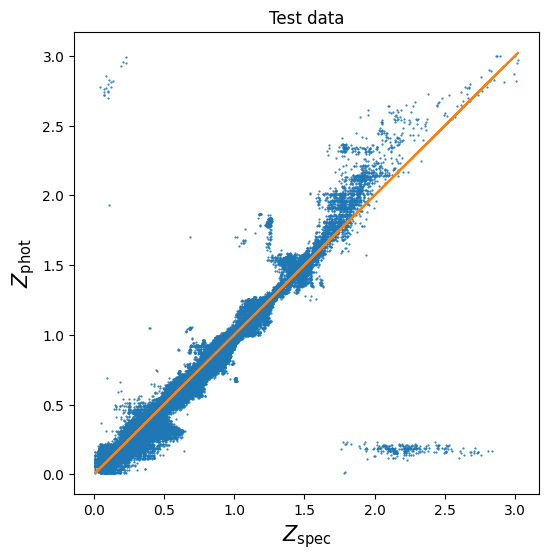
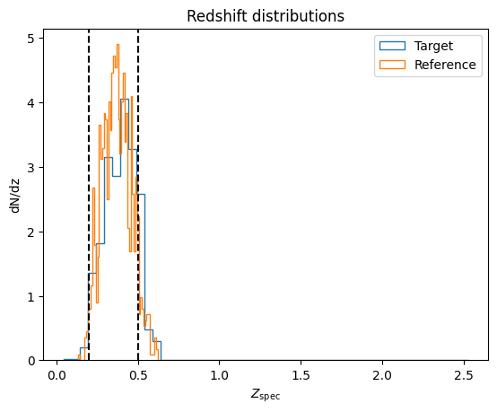
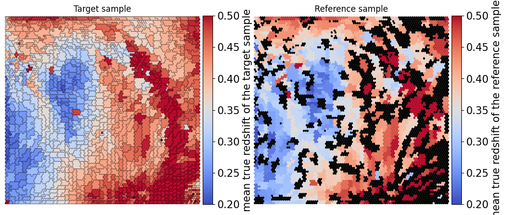
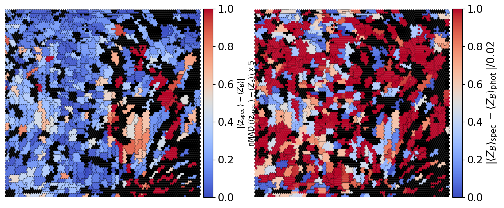
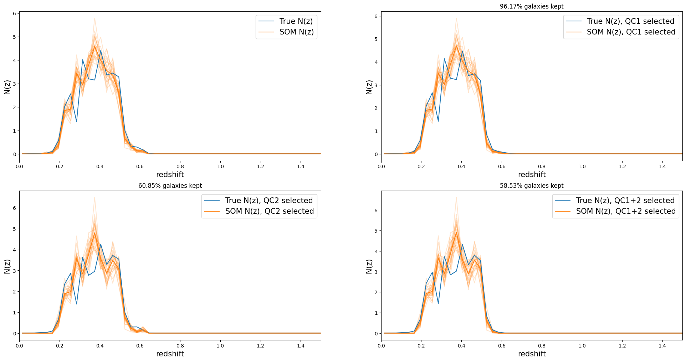
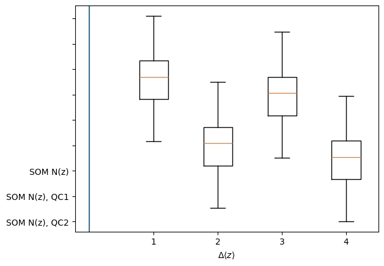
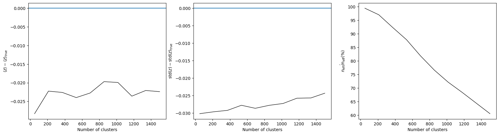

SOMocluSummarizer+Quality Control demo
======================================

Author: Ziang Yan Last successfully run: Nov 22, 2024

This notebook creats an end-to-end example for the SOM summarizer PLUS
quality controld defined in https://arxiv.org/pdf/2007.15635. Including:

1) create photometric realizations for a training and spectroscopic
   sample;
2) measuring BPZ for the training and spectroscopic samples;
3) make the same tomographic cut on the training and spec samples;
4) informing a ``rail_som`` model with the training sample and
   summarizing it with the spec sample;
5) performing two quality control (arXiv: 1909.09632);
6) summarizing the goodness of redshift calibration and compare between
   QCs;

.. code:: ipython3

    import numpy as np
    import matplotlib.pyplot as plt
    from matplotlib import cm
    import pickle
    import rail
    import os
    import qp
    from rail.core.utils import RAILDIR
    
    import tables_io
    from rail.core.data import TableHandle, ModelHandle
    from rail.core.stage import RailStage
    from rail.estimation.algos.somoclu_som import SOMocluInformer, SOMocluSummarizer
    from rail.estimation.algos.somoclu_som import get_bmus, plot_som

Next, let’s set up the Data Store, so that our RAIL module will know
where to fetch data:

.. code:: ipython3

    DS = RailStage.data_store
    DS.__class__.allow_overwrite = True

First, let’s grab some data files. For the SOM, we will want to train on
a fairly large, representative set that encompasses all of our expected
data. We’ll grab a larger data file than we typically use in our demos
to ensure that we construct a meaningful SOM.

Run this command on the command line to get the larger data file to train the SOM:
----------------------------------------------------------------------------------

``curl -O https://portal.nersc.gov/cfs/lsst/schmidt9/healpix_10326_bright_data.hdf5``

and then move the resulting file to this directory,
i.e. RAIL/examples/estimation. This data consists of ~150,000 galaxies
from a single healpix pixel of the comsoDC2 truth catalog with mock
10-year magnitude errors added. It is cut at a relatively bright i<23.5
magnitudes in order to concentrate on galaxies with particularly high
S/N rates.

First read the target and spec catalogue from a pre-trained pzflow stage.
=========================================================================

.. code:: ipython3

    training_file = "./healpix_10326_bright_data.hdf5"
    
    if not os.path.exists(training_file):
      os.system('curl -O https://portal.nersc.gov/cfs/lsst/PZ/healpix_10326_bright_data.hdf5')

.. code:: ipython3

    training_data = DS.read_file("training_data", TableHandle, training_file)

.. code:: ipython3

    pmask = (training_data.data['photometry']['mag_i_lsst'] <23.5)
    trim_test = {}
    for key in training_data.data['photometry'].keys():
        trim_test[key] = training_data.data['photometry'][key][pmask]
    trim_dict = dict(photometry=trim_test)
    target_data_all = DS.add_data("target_data_raw", trim_dict, TableHandle)

.. code:: ipython3

    from rail.utils.path_utils import find_rail_file
    
    specfile = find_rail_file("examples_data/testdata/test_dc2_validation_9816.hdf5")
    ref_data_raw = tables_io.read(specfile)['photometry']
    smask = (ref_data_raw['mag_i_lsst'] <23.5)
    trim_spec = {}
    for key in ref_data_raw.keys():
        trim_spec[key] = ref_data_raw[key][smask]
    trim_dict = dict(photometry=trim_spec)
    ref_data_all = DS.add_data("ref_data_raw", trim_dict, TableHandle)

Now measure the photometric redshifts using the ``bpz_lite``
============================================================

.. code:: ipython3

    bands = ["u", "g", "r", "i", "z", "y"]
    lsst_bands = []
    lsst_errs = []
    lsst_filts = []
    for band in bands:
        lsst_bands.append(f"mag_{band}_lsst")
        lsst_errs.append(f"mag_err_{band}_lsst")
        lsst_filts.append(f"DC2LSST_{band}")
    print(lsst_bands)
    print(lsst_filts)

.. parsed-literal::

    ['mag_u_lsst', 'mag_g_lsst', 'mag_r_lsst', 'mag_i_lsst', 'mag_z_lsst', 'mag_y_lsst']
    ['DC2LSST_u', 'DC2LSST_g', 'DC2LSST_r', 'DC2LSST_i', 'DC2LSST_z', 'DC2LSST_y']

.. code:: ipython3

    from rail.core.utils import RAILDIR
    import os
    from rail.core.utils import RAILDIR
    from rail.estimation.algos.bpz_lite import BPZliteInformer, BPZliteEstimator
    from rail.core.data import ModelHandle
    custom_data_path = RAILDIR + '/rail/examples_data/estimation_data/data'
    
    hdfnfile = os.path.join(RAILDIR, "rail/examples_data/estimation_data/data/CWW_HDFN_prior.pkl")
    sedfile = os.path.join(RAILDIR, "rail/examples_data/estimation_data/data/SED/COSMOS_seds.list")
    
    with open(hdfnfile, "rb") as f:
        hdfnmodel = pickle.load(f)
    
    custom_dict_phot = dict(hdf5_groupname="photometry",
                       output="bpz_results_phot_qc.hdf5", 
                       bands=lsst_bands, 
                       err_bands=lsst_errs,
                       filter_list=lsst_filts,
                       prior_band='mag_i_lsst',spectra_file=sedfile,
                       data_path=custom_data_path,
                       no_prior=False)
    
    custom_dict_spec = dict(hdf5_groupname="photometry",
                       output="bpz_results_spec_qc.hdf5", 
                        bands=lsst_bands, 
                       err_bands=lsst_errs,
                       filter_list=lsst_filts,
                       prior_band='mag_i_lsst',spectra_file=sedfile,
                       data_path=custom_data_path,
                       no_prior=False)
    
    cosmospriorfile = os.path.join(RAILDIR, "rail/examples_data/estimation_data/data/COSMOS31_HDFN_prior.pkl")
    cosmosprior = DS.read_file("cosmos_prior", ModelHandle, cosmospriorfile)
    
    phot_run = BPZliteEstimator.make_stage(name="rerun_bpz_phot", model=cosmosprior, **custom_dict_phot)
    spec_run = BPZliteEstimator.make_stage(name="rerun_bpz_spec", model=cosmosprior, **custom_dict_spec)

.. code:: ipython3

    from collections import OrderedDict
    phot_run.estimate(target_data_all)

.. parsed-literal::

    Process 0 running estimator on chunk 0 - 150818

.. parsed-literal::

    /opt/hostedtoolcache/Python/3.10.16/x64/lib/python3.10/site-packages/rail/estimation/algos/bpz_lite.py:482: RuntimeWarning: overflow encountered in cast
      flux_err[unobserved] = 1e108

.. parsed-literal::

    Inserting handle into data store.  output_rerun_bpz_phot: inprogress_bpz_results_phot_qc.hdf5, rerun_bpz_phot

.. parsed-literal::

    <rail.core.data.QPHandle at 0x7f8fd97ba650>

.. code:: ipython3

    spec_run.estimate(ref_data_all)

.. parsed-literal::

    Process 0 running estimator on chunk 0 - 5166

.. parsed-literal::

    Inserting handle into data store.  output_rerun_bpz_spec: inprogress_bpz_results_spec_qc.hdf5, rerun_bpz_spec

.. parsed-literal::

    <rail.core.data.QPHandle at 0x7f8fd98693c0>

.. code:: ipython3

    phot_bpz_file = 'bpz_results_phot_qc.hdf5'
    bpz_phot_all = tables_io.read(phot_bpz_file)['ancil']['zmode']
    
    spec_bpz_file = 'bpz_results_spec_qc.hdf5'
    bpz_spec_all = tables_io.read(spec_bpz_file)['ancil']['zmode']

.. code:: ipython3

    plt.figure(figsize=(6,6))
    plt.scatter(target_data_all.data['photometry']['redshift'], bpz_phot_all, s=0.3)
    plt.plot(target_data_all.data['photometry']['redshift'],target_data_all.data['photometry']['redshift'], color='C1')
    plt.title('Test data')
    plt.xlabel(r'$Z_{\mathrm{spec}}$', fontsize=15)
    plt.ylabel(r'$Z_{\mathrm{phot}}$', fontsize=15)

.. parsed-literal::

    Text(0, 0.5, '$Z_{\\mathrm{phot}}$')

.. code:: ipython3

    plt.figure(figsize=(6,6))
    plt.scatter(ref_data_all.data['photometry']['redshift'], bpz_spec_all, s=0.3)
    plt.plot(ref_data_all.data['photometry']['redshift'],ref_data_all.data['photometry']['redshift'], color='C1')
    plt.title('Spec data')
    plt.xlabel(r'$Z_{\mathrm{spec}}$', fontsize=15)
    plt.ylabel(r'$Z_{\mathrm{phot}}$', fontsize=15)

.. parsed-literal::

    Text(0, 0.5, '$Z_{\\mathrm{phot}}$')

.. image:: ../../../docs/rendered/estimation_examples/somocluSOM_cluster_qc_demo_files/../../../docs/rendered/estimation_examples/somocluSOM_cluster_qc_demo_18_1.png

cut the data to make a tomographic bin
--------------------------------------

.. code:: ipython3

    bin_low = 0.2
    bin_high = 0.5

.. code:: ipython3

    trim_data_test = {}
    
    mask_phot = ((bpz_phot_all > bin_low) & (bpz_phot_all < bin_high))
    mask_phot &= (target_data_all.data['photometry']['redshift'] > 0)
    
    bpz_phot = bpz_phot_all[mask_phot]
    
    for key in target_data_all.data['photometry'].keys():
        trim_data_test[key] = target_data_all.data['photometry'][key][mask_phot]
    trimdict_test = dict(photometry=trim_data_test)
    target_data = DS.add_data("testing_data", trimdict_test, TableHandle)

.. code:: ipython3

    trim_data_spec = {}
    
    mask_spec = ((bpz_spec_all > bin_low) & (bpz_spec_all<bin_high))
    mask_spec &= (ref_data_all.data['photometry']['redshift'] > 0)
    
    bpz_spec = bpz_spec_all[mask_spec]
    
    for key in target_data_all.data['photometry'].keys():
        trim_data_spec[key] = ref_data_all.data['photometry'][key][mask_spec]
    trimdict_spec = dict(photometry=trim_data_spec)
    ref_data = DS.add_data("ref_data", trimdict_spec, TableHandle)

.. code:: ipython3

    plt.title('Redshift distributions')
    plt.xlabel(r'$Z_{\mathrm{spec}}$')
    plt.ylabel('dN/dz')
    
    plt.hist(target_data.data['photometry']['redshift'], bins=50, density=True, histtype='step', label='Target')
    plt.hist(ref_data.data['photometry']['redshift'], bins=50, density=True, histtype='step', label='Reference')
    plt.axvline(bin_low, color='k', linestyle='--')
    plt.axvline(bin_high, color='k', linestyle='--')
    plt.legend()

.. parsed-literal::

    <matplotlib.legend.Legend at 0x7f8fd7377df0>

Now let’s train a SOM with the color from the target set
========================================================

We need to define all of our necessary initialization params, which
includes the following: ``name`` (str): the name of our estimator, as
utilized by ceci ``model`` (str): the name for the model file containing
the SOM and associated parameters that will be written by this stage
``hdf5_groupname`` (str): name of the hdf5 group (if any) where the
photometric data resides in the training file ``n_rows`` (int): the
number of dimensions in the y-direction for our 2D SOM ``m_columns``
(int): the number of dimensions in the x-direction for our 2D SOM
``som_iterations`` (int): the number of iteration steps during SOM
training. SOMs can take a while to converge, so we will use a fairly
large number of 500,000 iterations. ``std_coeff`` (float): the “radius”
of how far to spread changes in the SOM ``som_learning_rate`` (float): a
number between 0 and 1 that controls how quickly the weighting function
decreases. SOM’s are not guaranteed to converge mathematically, and so
this parameter tunes how the response drops per iteration. A typical
values we might use might be between 0.5 and 0.75. ``column_usage``
(str): this value determines what values will be used to construct the
SOM, valid choices are ``colors``, ``magandcolors``, and ``columns``. If
set to ``colors``, the code will take adjacent columns as specified in
``usecols`` to construct colors and use those as SOM inputs. If set to
``magandcolors`` it will use the single column specfied by
``ref_column_name`` and the aforementioned colors to construct the SOM.
If set to ``columns`` then it will simply take each of the columns in
``usecols`` with no modification. So, if a user wants to use K
magnitudes and L colors, they can precompute the colors and specify all
names in ``usecols``. NOTE: accompanying ``usecols`` you must have a
``nondetect_val`` dictionary that lists the replacement values for any
non-detection-valued entries for each column, see the code for an
example dictionary. WE will set ``column_usage`` to colors and use only
colors in this example notebook.

.. code:: ipython3

    dim = 101
    
    grid_type = 'hexagonal'
    inform_dict = dict(model='output_SOMoclu_model.pkl', hdf5_groupname='photometry',
                       n_rows=dim, n_columns=dim, 
                       gridtype = grid_type,
                       std_coeff=12.0, som_learning_rate=0.75,
                       column_usage='colors')
    
    inform_som = SOMocluInformer.make_stage(name='inform_som', **inform_dict)

.. code:: ipython3

    %%time
    inform_som.inform(target_data)

.. parsed-literal::

    Inserting handle into data store.  model_inform_som: inprogress_output_SOMoclu_model.pkl, inform_som
    CPU times: user 2min 11s, sys: 72.6 ms, total: 2min 11s
    Wall time: 33.8 s

.. parsed-literal::

    <rail.core.data.ModelHandle at 0x7f8fd96c91b0>

.. code:: ipython3

    def get_cont_hist(data, bins):
        hist, bin_edge = np.histogram(data, bins=bins, density=True)
        return hist, (bin_edge[1:]+bin_edge[:-1])/2

Summarize the SOM with target data and spectroscopic reference
==============================================================

.. code:: ipython3

    from scipy.stats import norm
    
    n_clusters = 1000
    
    summ_dict = dict(model="output_SOMoclu_model.pkl", hdf5_groupname='photometry',
                     spec_groupname='photometry', nzbins=101, nsamples=25,
                     output='SOM_ensemble.hdf5', single_NZ='fiducial_SOMoclu_NZ.hdf5',
                     n_clusters=n_clusters,
                     uncovered_cluster_file ='all_uncovered_cells.hdf5',
                     objid_name='id',
                     cellid_output='output_cellIDs.hdf5')
    
    som_summarizer = SOMocluSummarizer.make_stage(name='SOMoclu_summarizer', aliases=dict(model="model_somoclu__"), **summ_dict)
    som_summarizer.summarize(target_data, ref_data)

.. parsed-literal::

    Inserting handle into data store.  model_somoclu__: output_SOMoclu_model.pkl, SOMoclu_summarizer

.. parsed-literal::

    Process 0 running summarizer on chunk 0 - 30141

.. parsed-literal::

    Inserting handle into data store.  cellid_output_SOMoclu_summarizer: inprogress_output_cellIDs.hdf5, SOMoclu_summarizer
    the following clusters contain photometric data but not spectroscopic data:
    {np.int64(1), np.int64(2), np.int64(4), np.int64(5), np.int64(6), np.int64(9), np.int64(11), np.int64(17), np.int64(18), np.int64(19), np.int64(24), np.int64(35), np.int64(37), np.int64(40), np.int64(47), np.int64(48), np.int64(49), np.int64(50), np.int64(52), np.int64(54), np.int64(56), np.int64(65), np.int64(67), np.int64(72), np.int64(73), np.int64(74), np.int64(75), np.int64(81), np.int64(86), np.int64(89), np.int64(92), np.int64(101), np.int64(104), np.int64(108), np.int64(116), np.int64(120), np.int64(123), np.int64(124), np.int64(125), np.int64(126), np.int64(128), np.int64(134), np.int64(135), np.int64(140), np.int64(142), np.int64(143), np.int64(144), np.int64(145), np.int64(149), np.int64(158), np.int64(162), np.int64(167), np.int64(169), np.int64(172), np.int64(176), np.int64(181), np.int64(183), np.int64(185), np.int64(187), np.int64(189), np.int64(190), np.int64(195), np.int64(199), np.int64(202), np.int64(203), np.int64(206), np.int64(210), np.int64(215), np.int64(218), np.int64(221), np.int64(222), np.int64(223), np.int64(225), np.int64(229), np.int64(230), np.int64(232), np.int64(233), np.int64(234), np.int64(238), np.int64(239), np.int64(241), np.int64(242), np.int64(243), np.int64(244), np.int64(246), np.int64(251), np.int64(259), np.int64(260), np.int64(261), np.int64(263), np.int64(264), np.int64(265), np.int64(267), np.int64(268), np.int64(269), np.int64(272), np.int64(273), np.int64(276), np.int64(277), np.int64(281), np.int64(282), np.int64(284), np.int64(287), np.int64(296), np.int64(301), np.int64(303), np.int64(304), np.int64(308), np.int64(309), np.int64(316), np.int64(317), np.int64(319), np.int64(332), np.int64(334), np.int64(335), np.int64(337), np.int64(339), np.int64(345), np.int64(346), np.int64(356), np.int64(358), np.int64(360), np.int64(365), np.int64(366), np.int64(367), np.int64(372), np.int64(373), np.int64(380), np.int64(383), np.int64(385), np.int64(386), np.int64(389), np.int64(391), np.int64(394), np.int64(396), np.int64(397), np.int64(398), np.int64(402), np.int64(403), np.int64(405), np.int64(406), np.int64(414), np.int64(422), np.int64(424), np.int64(425), np.int64(427), np.int64(428), np.int64(432), np.int64(434), np.int64(438), np.int64(442), np.int64(444), np.int64(448), np.int64(450), np.int64(455), np.int64(457), np.int64(458), np.int64(459), np.int64(460), np.int64(462), np.int64(463), np.int64(467), np.int64(469), np.int64(471), np.int64(473), np.int64(474), np.int64(475), np.int64(476), np.int64(478), np.int64(481), np.int64(485), np.int64(486), np.int64(487), np.int64(492), np.int64(493), np.int64(504), np.int64(505), np.int64(508), np.int64(510), np.int64(511), np.int64(513), np.int64(516), np.int64(518), np.int64(521), np.int64(522), np.int64(524), np.int64(525), np.int64(526), np.int64(527), np.int64(530), np.int64(532), np.int64(533), np.int64(535), np.int64(536), np.int64(539), np.int64(540), np.int64(543), np.int64(544), np.int64(546), np.int64(547), np.int64(550), np.int64(554), np.int64(555), np.int64(559), np.int64(560), np.int64(561), np.int64(562), np.int64(565), np.int64(566), np.int64(570), np.int64(573), np.int64(574), np.int64(575), np.int64(576), np.int64(577), np.int64(578), np.int64(580), np.int64(582), np.int64(585), np.int64(588), np.int64(590), np.int64(591), np.int64(592), np.int64(593), np.int64(594), np.int64(598), np.int64(599), np.int64(600), np.int64(601), np.int64(603), np.int64(604), np.int64(605), np.int64(607), np.int64(608), np.int64(609), np.int64(610), np.int64(614), np.int64(618), np.int64(623), np.int64(624), np.int64(625), np.int64(628), np.int64(633), np.int64(639), np.int64(641), np.int64(642), np.int64(644), np.int64(645), np.int64(646), np.int64(647), np.int64(648), np.int64(649), np.int64(650), np.int64(651), np.int64(655), np.int64(656), np.int64(657), np.int64(661), np.int64(664), np.int64(665), np.int64(666), np.int64(668), np.int64(669), np.int64(670), np.int64(673), np.int64(675), np.int64(679), np.int64(681), np.int64(683), np.int64(686), np.int64(687), np.int64(689), np.int64(693), np.int64(694), np.int64(695), np.int64(696), np.int64(697), np.int64(699), np.int64(701), np.int64(704), np.int64(706), np.int64(708), np.int64(712), np.int64(713), np.int64(714), np.int64(719), np.int64(720), np.int64(721), np.int64(724), np.int64(725), np.int64(726), np.int64(729), np.int64(730), np.int64(731), np.int64(732), np.int64(733), np.int64(736), np.int64(737), np.int64(739), np.int64(741), np.int64(742), np.int64(743), np.int64(745), np.int64(748), np.int64(751), np.int64(752), np.int64(753), np.int64(757), np.int64(758), np.int64(759), np.int64(760), np.int64(762), np.int64(763), np.int64(764), np.int64(766), np.int64(767), np.int64(769), np.int64(770), np.int64(773), np.int64(776), np.int64(777), np.int64(781), np.int64(782), np.int64(783), np.int64(786), np.int64(787), np.int64(789), np.int64(790), np.int64(791), np.int64(793), np.int64(794), np.int64(797), np.int64(800), np.int64(801), np.int64(802), np.int64(803), np.int64(806), np.int64(808), np.int64(809), np.int64(811), np.int64(813), np.int64(814), np.int64(815), np.int64(816), np.int64(818), np.int64(822), np.int64(823), np.int64(824), np.int64(825), np.int64(828), np.int64(829), np.int64(830), np.int64(835), np.int64(836), np.int64(837), np.int64(839), np.int64(840), np.int64(842), np.int64(843), np.int64(844), np.int64(846), np.int64(847), np.int64(849), np.int64(853), np.int64(854), np.int64(855), np.int64(857), np.int64(860), np.int64(862), np.int64(863), np.int64(865), np.int64(868), np.int64(869), np.int64(873), np.int64(875), np.int64(877), np.int64(879), np.int64(881), np.int64(884), np.int64(885), np.int64(890), np.int64(892), np.int64(893), np.int64(899), np.int64(901), np.int64(905), np.int64(906), np.int64(907), np.int64(909), np.int64(911), np.int64(912), np.int64(913), np.int64(914), np.int64(915), np.int64(917), np.int64(918), np.int64(919), np.int64(921), np.int64(924), np.int64(926), np.int64(927), np.int64(928), np.int64(929), np.int64(930), np.int64(931), np.int64(932), np.int64(933), np.int64(936), np.int64(937), np.int64(939), np.int64(940), np.int64(941), np.int64(942), np.int64(943), np.int64(945), np.int64(946), np.int64(947), np.int64(948), np.int64(949), np.int64(951), np.int64(952), np.int64(953), np.int64(954), np.int64(955), np.int64(956), np.int64(957), np.int64(958), np.int64(959), np.int64(963), np.int64(967), np.int64(968), np.int64(969), np.int64(970), np.int64(972), np.int64(974), np.int64(975), np.int64(976), np.int64(980), np.int64(982), np.int64(985), np.int64(986), np.int64(989), np.int64(990), np.int64(992), np.int64(995), np.int64(996), np.int64(999)}

.. parsed-literal::

    549 out of 1000 have usable data
    Inserting handle into data store.  output_SOMoclu_summarizer: inprogress_SOM_ensemble.hdf5, SOMoclu_summarizer
    Inserting handle into data store.  single_NZ_SOMoclu_summarizer: inprogress_fiducial_SOMoclu_NZ.hdf5, SOMoclu_summarizer
    Inserting handle into data store.  uncovered_cluster_file_SOMoclu_summarizer: inprogress_all_uncovered_cells.hdf5, SOMoclu_summarizer

.. parsed-literal::

    NOTE/WARNING: Expected output file all_uncovered_cells.hdf5 was not generated.

.. parsed-literal::

    <rail.core.data.QPHandle at 0x7f8fd7231ea0>

We can calculate the best SOM cell using the get_bmus() function defined
in somocluSOM.py, which will return the 2D SOM coordinates for each
galaxy. Then we group the SOM cells into hierarchical clusters and
calculate the occupation and mean redshift in each cluster.

To do this, we first get the colors for the reference and target sample.

.. code:: ipython3

    bands = ['u','g','r','i','z','y']
    bandnames = [f"mag_{band}_lsst" for band in bands]
    
    ngal_ref = len(ref_data.data['photometry']['mag_i_lsst'])
    ngal_target = len(target_data.data['photometry']['mag_i_lsst'])
    
    ref_colors = np.zeros([5, ngal_ref])
    target_colors = np.zeros([5, ngal_target])
    for i in range(5):
    
        ref_colors[i] = ref_data.data['photometry'][bandnames[i]] - ref_data.data['photometry'][bandnames[i+1]]
        target_colors[i] = target_data.data['photometry'][bandnames[i]] - target_data.data['photometry'][bandnames[i+1]]

.. code:: ipython3

    with open("output_SOMoclu_model.pkl", "rb") as f:
        model = pickle.load(f)

Now we call the ``get_bmus`` function to get the best matching units for
the reference and target data.

.. code:: ipython3

    SOM = model['som']
    ref_bmu_coordinates = get_bmus(SOM, ref_colors.T, 1000).T
    target_bmu_coordinates = get_bmus(SOM, target_colors.T, 1000).T

Find the cluster index for each galaxy in the reference and target data

.. code:: ipython3

    import sklearn.cluster as sc
    
    algorithm = sc.AgglomerativeClustering(n_clusters=n_clusters, linkage='complete')
    SOM.cluster(algorithm)
    som_cluster_inds = SOM.clusters.reshape(-1)
    
    ref_pixel_coords = np.ravel_multi_index(ref_bmu_coordinates, (dim, dim))
    ref_som_clusterind = som_cluster_inds[ref_pixel_coords]
    
    target_pixel_coords = np.ravel_multi_index(target_bmu_coordinates, (dim, dim))
    target_som_clusterind = som_cluster_inds[target_pixel_coords]

The next cell defines some functions to plot cluster boundaries on a SOM
grid. This function will be added to rail_som in a subsequent update.

.. code:: ipython3

    def plot_cluster_boundaries(ax, SOM, n_clusters, cluster_inds=None, topology='hexagonal'):
        dim = SOM.codebook.shape[0]
        som_cluster_ind = SOM.clusters.reshape(-1)
        som_centers = find_cell_centers(dim, topology=topology)
        som_centers_l = np.array([som_centers.T[0]-dim*1, som_centers.T[1]]).T
        som_centers_r = np.array([som_centers.T[0]+dim*1, som_centers.T[1]]).T
        som_centers_u = np.array([som_centers.T[0], som_centers.T[1]+dim*np.sqrt(3)/2]).T
        som_centers_b = np.array([som_centers.T[0], som_centers.T[1]-dim*np.sqrt(3)/2]).T
        if cluster_inds is None:
            cluster_inds = np.arange(n_clusters)
        for i in (cluster_inds):
            centers = (np.vstack([som_centers[np.where(som_cluster_ind==i)[0]],
                             som_centers_l[np.where(som_cluster_ind==i)[0]], som_centers_u[np.where(som_cluster_ind==i)[0]], 
                             som_centers_r[np.where(som_cluster_ind==i)[0]], som_centers_b[np.where(som_cluster_ind==i)[0]]]))
            linep = get_manycells_boundary(centers, topology='hexagonal')
            for points in linep:
                if points.T[0].min() < som_centers.T[0].min()-1 or points.T[0].max() > som_centers.T[0].max()+1 or points.T[1].min() < som_centers.T[1].min()-np.sqrt(3)/2 or points.T[1].max() > som_centers.T[1].max()+np.sqrt(3)/2:
                #plt.plot(points.T[0], points.T[1], color='blue')
                    continue
                ax.plot(points.T[0], points.T[1], color='k', lw=0.2)
        return
    
    def find_cell_centers(dim, topology='rectangular'):
        if topology == 'rectangular':
            x = np.arange(dim) + 0.5
            y = np.arange(dim) + 0.5
            xx, yy = np.meshgrid(x, y)
            xx = xx.reshape(-1)
            yy = yy.reshape(-1)
            centers = np.array([xx, yy]).T
        if topology == 'hexagonal':
            yy, xx= np.meshgrid(np.arange(dim), np.arange(dim))
            shift = np.zeros(dim)
            shift[::2]=-0.5
            xx = xx + shift
            yy = yy * (np.sqrt(3) / 2)
            centers = np.array([xx.reshape(-1), yy.reshape(-1)]).T
        return centers
    
    def get_cell_boundary(center, topology='rectangular'):
        if topology == 'rectangular':
            points = [np.array([[center[0]-0.5, center[1]-0.5], [center[0]-0.5, center[1]+0.5]]),
                     np.array([[center[0]-0.5, center[1]+0.5], [center[0]+0.5, center[1]+0.5]]),
                    np.array([[center[0]+0.5, center[1]-0.5], [center[0]+0.5, center[1]+0.5]]),
                     np.array([[center[0]-0.5, center[1]-0.5], [center[0]+0.5, center[1]-0.5]])]
            return points
        elif topology == 'hexagonal':
            dx = 0.5
            dy = np.sqrt(3)/6
            points = [np.array([[center[0]-dx, center[1]+dy], [center[0], center[1]+2*dy]]),
                      np.array([[center[0], center[1]+2*dy], [center[0]+dx, center[1]+dy]]),
                     np.array([[center[0]+dx, center[1]-dy], [center[0]+dx, center[1]+dy]]),
                     np.array([[center[0], center[1]-2*dy], [center[0]+dx, center[1]-dy]]),
                     np.array([[center[0]-dx, center[1]-dy], [center[0], center[1]-2*dy]]),
                     np.array([[center[0]-dx, center[1]-dy], [center[0]-dx, center[1]+dy]])]
        return points
    
    def get_manycells_boundary(centers, topology='rectangular'):
        points=[]
        for center in centers:
            points+=get_cell_boundary(center, topology)
        points_unique, counts = np.unique(np.round(np.array(points),4), axis=0, return_counts=True)
        return points_unique[counts==1]

Now we calculate and plot the SOM grid color-coded by the average true
redshift of the target sample (left panel) and the reference sample
(right panel) to show the reference sample is indeed representing the
redshift of the target galaxies

.. code:: ipython3

    mean_photZ_ref = np.zeros_like(SOM.umatrix).reshape(-1)  # mean photometric redshift of reference data in each cell/cluster
    mean_specZ_ref = np.zeros_like(SOM.umatrix).reshape(-1)  # mean spectroscopic redshift of reference data in each cell/cluster
    
    mean_photZ_target = np.zeros_like(SOM.umatrix).reshape(-1)   # mean photometric redshift of target data in each cell/cluster
    mean_specZ_target = np.zeros_like(SOM.umatrix).reshape(-1)   # mean spectroscopic redshift of target data in each cell/cluster
    
    for i in range(n_clusters):
        
        mean_photZ_ref[som_cluster_inds==i] = np.median(bpz_spec[ref_som_clusterind==i])
        mean_specZ_ref[som_cluster_inds==i] = np.median(ref_data.data['photometry']['redshift'][ref_som_clusterind==i])
        
        mean_photZ_target[som_cluster_inds==i] = np.median(bpz_phot[target_som_clusterind==i])
        mean_specZ_target[som_cluster_inds==i] = np.median(target_data.data['photometry']['redshift'][target_som_clusterind==i])

.. parsed-literal::

    /opt/hostedtoolcache/Python/3.10.16/x64/lib/python3.10/site-packages/numpy/_core/fromnumeric.py:3860: RuntimeWarning: Mean of empty slice.
      return _methods._mean(a, axis=axis, dtype=dtype,
    /opt/hostedtoolcache/Python/3.10.16/x64/lib/python3.10/site-packages/numpy/_core/_methods.py:145: RuntimeWarning: invalid value encountered in scalar divide
      ret = ret.dtype.type(ret / rcount)

.. code:: ipython3

    fig, ax = plt.subplots(nrows=1, ncols=2, figsize=(12,5))
    plot_som(ax[0], mean_specZ_target.reshape(dim, dim), grid_type=grid_type, colormap=cm.coolwarm, cbar_name='mean true redshift of the target sample', vmin=bin_low, vmax=bin_high)
    ax[0].set_title('Target sample')
    
    plot_som(ax[1], mean_specZ_ref.reshape(dim, dim), grid_type=grid_type, colormap=cm.coolwarm, cbar_name='mean true redshift of the reference sample', vmin=bin_low, vmax=bin_high)
    
    ax[1].set_title('Reference sample')
    plot_cluster_boundaries(ax[0], SOM, n_clusters)

Now let’s do the quality control.
=================================

Quality control means selecting a subset of the clusters/SOM cells where
the target galaxies are well represented by the reference sample. We
evaluate the “goodness-of-reference” by the two criteria given by
https://arxiv.org/pdf/2007.15635

Quality cut 1 (QC1):

:math:`\frac{\left|\left\langle z_{\text {spec }}\right\rangle-\left\langle Z_{\mathrm{B}}\right\rangle\right|}{\operatorname{nMAD}\left(\left\langle z_{\text {spec }}\right\rangle-\left\langle Z_{\mathrm{B}}\right\rangle\right)}>5`

This QC will remove outliers in the distribution of photo-:math:`z`.

Quality cut 2 (QC2):

:math:`\left|\left\langle Z_B\right\rangle_{\text {spec }}-\left\langle Z_B\right\rangle_{\text {phot }}\right|>0.02`

This QC will remove clusters in which the target and reference sample
have very different photo-:math:`z`, which means the reference galaxies
are not representative.

We also try to combine these two QCs.

.. code:: ipython3

    from scipy.stats import median_abs_deviation
    
    zmean_diff_cluster_qc1 = np.zeros(n_clusters)
    zmean_diff_cluster_qccombined = np.zeros(n_clusters)
    
    for i in range(n_clusters):   
        
        zmean_diff_cluster_qc1[i] = np.fabs(np.median(ref_data.data['photometry']['redshift'][ref_som_clusterind==i]) - np.median(bpz_phot[target_som_clusterind==i]))
            
        zmean_diff_cluster_qccombined[i] = np.fabs(np.median(bpz_phot[target_som_clusterind==i])-np.median(bpz_spec[ref_som_clusterind==i]))
        
    
    cluster_ind_good = np.where(~np.isnan(zmean_diff_cluster_qccombined))
    cluster_ind_good_qc1 = np.where(zmean_diff_cluster_qc1<max(median_abs_deviation((mean_specZ_ref-mean_photZ_ref)[~np.isnan(mean_specZ_ref-mean_photZ_ref)])*5, 0))
    cluster_ind_good_qc2 = np.where(zmean_diff_cluster_qccombined<0.02)
    
    cluster_ind_good_qccombined = np.intersect1d(cluster_ind_good_qc2, cluster_ind_good_qc1)

Here is the cluster occupation distribution:

And here is the mean redshift per cluster:

.. code:: ipython3

    fig, ax = plt.subplots(nrows=1, ncols=2, figsize=(12,5))
    
    plot_som(ax[0], np.fabs(mean_specZ_ref-mean_photZ_target).reshape(dim,dim)/max(median_abs_deviation((mean_specZ_ref-mean_photZ_ref)[~np.isnan(mean_specZ_ref-mean_photZ_ref)])*5, 0), grid_type=grid_type, colormap=cm.coolwarm, cbar_name=r'$\frac{\left|\left\langle z_{\text {spec }}\right\rangle-\left\langle Z_{\mathrm{B}}\right\rangle\right|}{\operatorname{nMAD}\left(\left\langle z_{\text {spec }}\right\rangle-\left\langle Z_{\mathrm{B}}\right\rangle\right)\times 5}$', vmin=0, vmax=1)
    
    plot_cluster_boundaries(ax[0], SOM, n_clusters, cluster_inds=cluster_ind_good_qc1[0])
    
    zmean_diff = np.fabs(mean_specZ_target - mean_specZ_ref).reshape(dim, dim)
    
    plot_som(ax[1], (zmean_diff)/0.02, grid_type=grid_type, colormap=cm.coolwarm, cbar_name=r'$\left|\left\langle Z_B\right\rangle_{\text {spec }}-\left\langle Z_B\right\rangle_{\text {phot }}\right|/0.02$', vmin=0, vmax=1)
    
    plot_cluster_boundaries(ax[1], SOM, n_clusters, cluster_inds=cluster_ind_good_qc2[0])

| Now that we have illustrated what exactly we have constructed, let’s
  use the SOM to predict the redshift distribution for a set of
  photometric objects.
| We first summarize the case withouth QC, then the three QCs (QC1, QC2,
  QC1+QC2)

Note that we have removed the ‘photometry’ group, we will specify the
``phot_groupname`` as “” in the parameters below. As before, let us
specify our initialization params for the SOMocluSummarizer stage,
including: ``model``: name of the pickled model that we created, in this
case “output_SOM_model.pkl” ``hdf5_groupname`` (str): hdf5 group for our
photometric data (in our case ““) ``objid_name`` (str): string
specifying the name of the ID column, if present photom data, will be
written out to cellid_output file ``spec_groupname`` (str): hdf5 group
for the spectroscopic data ``nzbins`` (int): number of bins to use in
our histogram ensemble ``n_clusters`` (int): number of hierarchical
clusters ``nsamples`` (int): number of bootstrap samples to generate
``output`` (str): name of the output qp file with N samples
``single_NZ`` (str): name of the qp file with fiducial distribution
``uncovered_cell_file`` (str): name of hdf5 file containing a list of
all of the cells with phot data but no spec-z objects: photometric
objects in these cells will *not* be accounted for in the final N(z),
and should really be removed from the sample before running the
summarizer. Note that we return a single integer that is constructed
from the pairs of SOM cell indices via
``np.ravel_multi_index``\ (indices).

Now let’s initialize and run the summarizer. One feature of the SOM: if
any SOM cells contain photometric data but do not contain any redshifts
values in the spectroscopic set, then no reasonable redshift estimate
for those objects is defined, and they are skipped. The method currently
prints the indices of uncovered cells, we may modify the algorithm to
actually output the uncovered galaxies in a separate file in the future.

Let’s open the fiducial N(z) file, plot it, and see how it looks, and
compare it to the true tomographic bin file:

.. code:: ipython3

    boot_ens = qp.read('SOM_ensemble.hdf5')
    
    target_nz_hist, zbin = get_cont_hist(target_data.data['photometry']['redshift'][np.in1d(target_som_clusterind, cluster_ind_good)], np.linspace(0,3,101))
    
    fid_ens = qp.read('fiducial_SOMoclu_NZ.hdf5')
    som_nz_hist = np.squeeze(fid_ens.pdf(zbin))
    
    full_ens = qp.read("SOM_ensemble.hdf5")
    full_means = full_ens.mean().flatten()
    full_stds = full_ens.std().flatten()
    true_full_mean = np.mean(target_data.data['photometry']['redshift'][np.in1d(target_som_clusterind, cluster_ind_good)])
    true_full_std = np.std(target_data.data['photometry']['redshift'][np.in1d(target_som_clusterind, cluster_ind_good)])
    # mean and width of bootstraps
    full_mu = np.mean(full_means)
    full_sig = np.std(full_means)
    full_norm = norm(loc=full_mu, scale=full_sig)
    grid = np.linspace(0, .7, 301)
    full_uncert = full_norm.pdf(grid)*2.51*full_sig
    
    print('===========This is the fiducial case==================')
    
    print("The mean redshift of the SOM ensemble is: "+str(round(np.mean(full_means),4)) + '+-' + str(round(np.std(full_means),4)))
    print("The mean redshift of the real data is: "+str(round(true_full_mean,4)))
    print("The bias of mean redshift is:"+str(round(np.mean(full_means)-true_full_mean,4)) + '+-' + str(round(np.std(full_means),4)))

.. parsed-literal::

    ===========This is the fiducial case==================
    The mean redshift of the SOM ensemble is: 0.3703+-0.0025
    The mean redshift of the real data is: 0.3793
    The bias of mean redshift is:-0.009+-0.0025

.. parsed-literal::

    /tmp/ipykernel_7733/1549956096.py:3: DeprecationWarning: `in1d` is deprecated. Use `np.isin` instead.
      target_nz_hist, zbin = get_cont_hist(target_data.data['photometry']['redshift'][np.in1d(target_som_clusterind, cluster_ind_good)], np.linspace(0,3,101))
    /tmp/ipykernel_7733/1549956096.py:11: DeprecationWarning: `in1d` is deprecated. Use `np.isin` instead.
      true_full_mean = np.mean(target_data.data['photometry']['redshift'][np.in1d(target_som_clusterind, cluster_ind_good)])
    /tmp/ipykernel_7733/1549956096.py:12: DeprecationWarning: `in1d` is deprecated. Use `np.isin` instead.
      true_full_std = np.std(target_data.data['photometry']['redshift'][np.in1d(target_som_clusterind, cluster_ind_good)])

.. code:: ipython3

    som_model_qc1=DS.read_file('som_model_qc1',  ModelHandle, "output_SOMoclu_model.pkl",)
    
    summ_dict_qc1 = dict(model=som_model_qc1, hdf5_groupname='photometry',
                     spec_groupname='photometry', nzbins=101, nsamples=25,
                     output='SOM_ensemble_qc1.hdf5', single_NZ='fiducial_SOMoclu_NZ_qc1.hdf5',
                     n_clusters=n_clusters,
                     uncovered_cell_file='all_uncovered_cells_qc1.hdf5',
                     objid_name='id',
                     cellid_output='output_cellIDs_qc1.hdf5', useful_clusters=cluster_ind_good_qc1[0])
    
    som_summarizer_qc1 = SOMocluSummarizer.make_stage(name='SOMoclu_summarizer_qc1', **summ_dict_qc1)
    som_summarizer_qc1.summarize(target_data, ref_data)
    
    fid_ens_qc1 = qp.read("fiducial_SOMoclu_NZ_qc1.hdf5")
    boot_ens_qc1 = qp.read('SOM_ensemble_qc1.hdf5')
    target_nz_hist_qc1, zbin_qc1 = get_cont_hist(target_data.data['photometry']['redshift'], np.linspace(0,3,101))
    som_nz_hist_qc1 = np.squeeze(fid_ens_qc1.pdf(zbin))
    
    target_nz_hist_qc1_true, zbin = get_cont_hist(target_data.data['photometry']['redshift'][np.in1d(target_som_clusterind, cluster_ind_good_qc1)], np.linspace(0,3,101))
    
    full_ens_qc1 = qp.read("SOM_ensemble_qc1.hdf5")
    full_means_qc1 = full_ens_qc1.mean().flatten()
    full_stds_qc1 = full_ens_qc1.std().flatten()
    true_full_mean_qc1 = np.mean(target_data.data['photometry']['redshift'][np.in1d(target_som_clusterind, cluster_ind_good_qc1)])
    true_full_std_qc1 = np.std(target_data.data['photometry']['redshift'][np.in1d(target_som_clusterind, cluster_ind_good_qc1)])
    # mean and width of bootstraps
    full_mu_qc1 = np.mean(full_means_qc1)
    full_sig_qc1 = np.std(full_means_qc1)
    full_norm_qc1 = norm(loc=full_mu_qc1, scale=full_sig_qc1)
    grid = np.linspace(0, .7, 301)
    full_uncert_qc1 = full_norm_qc1.pdf(grid)*2.51*full_sig_qc1
    
    print('\n\n===========This is the QC1 case==================')
    
    print("The mean redshift of the SOM ensemble is: "+str(round(np.mean(full_means_qc1),4)) + '+-' + str(round(np.std(full_means_qc1),4)))
    print("The mean redshift of the real data is: "+str(round(true_full_mean_qc1,4)))
    print("The bias of mean redshift is:"+str(round(np.mean(full_means_qc1)-true_full_mean_qc1,4)) + '+-' + str(round(np.std(full_means_qc1),4)))

.. parsed-literal::

    Process 0 running summarizer on chunk 0 - 30141

.. parsed-literal::

    Inserting handle into data store.  cellid_output_SOMoclu_summarizer_qc1: inprogress_output_cellIDs_qc1.hdf5, SOMoclu_summarizer_qc1
    the following clusters contain photometric data but not spectroscopic data:
    {np.int64(1), np.int64(2), np.int64(4), np.int64(5), np.int64(6), np.int64(9), np.int64(11), np.int64(17), np.int64(18), np.int64(19), np.int64(24), np.int64(35), np.int64(37), np.int64(40), np.int64(47), np.int64(48), np.int64(49), np.int64(50), np.int64(52), np.int64(54), np.int64(56), np.int64(65), np.int64(67), np.int64(72), np.int64(73), np.int64(74), np.int64(75), np.int64(81), np.int64(86), np.int64(89), np.int64(92), np.int64(101), np.int64(104), np.int64(108), np.int64(116), np.int64(120), np.int64(123), np.int64(124), np.int64(125), np.int64(126), np.int64(128), np.int64(134), np.int64(135), np.int64(140), np.int64(142), np.int64(143), np.int64(144), np.int64(145), np.int64(149), np.int64(158), np.int64(162), np.int64(167), np.int64(169), np.int64(172), np.int64(176), np.int64(181), np.int64(183), np.int64(185), np.int64(187), np.int64(189), np.int64(190), np.int64(195), np.int64(199), np.int64(202), np.int64(203), np.int64(206), np.int64(210), np.int64(215), np.int64(218), np.int64(221), np.int64(222), np.int64(223), np.int64(225), np.int64(229), np.int64(230), np.int64(232), np.int64(233), np.int64(234), np.int64(238), np.int64(239), np.int64(241), np.int64(242), np.int64(243), np.int64(244), np.int64(246), np.int64(251), np.int64(259), np.int64(260), np.int64(261), np.int64(263), np.int64(264), np.int64(265), np.int64(267), np.int64(268), np.int64(269), np.int64(272), np.int64(273), np.int64(276), np.int64(277), np.int64(281), np.int64(282), np.int64(284), np.int64(287), np.int64(296), np.int64(301), np.int64(303), np.int64(304), np.int64(308), np.int64(309), np.int64(316), np.int64(317), np.int64(319), np.int64(332), np.int64(334), np.int64(335), np.int64(337), np.int64(339), np.int64(345), np.int64(346), np.int64(356), np.int64(358), np.int64(360), np.int64(365), np.int64(366), np.int64(367), np.int64(372), np.int64(373), np.int64(380), np.int64(383), np.int64(385), np.int64(386), np.int64(389), np.int64(391), np.int64(394), np.int64(396), np.int64(397), np.int64(398), np.int64(402), np.int64(403), np.int64(405), np.int64(406), np.int64(414), np.int64(422), np.int64(424), np.int64(425), np.int64(427), np.int64(428), np.int64(432), np.int64(434), np.int64(438), np.int64(442), np.int64(444), np.int64(448), np.int64(450), np.int64(455), np.int64(457), np.int64(458), np.int64(459), np.int64(460), np.int64(462), np.int64(463), np.int64(467), np.int64(469), np.int64(471), np.int64(473), np.int64(474), np.int64(475), np.int64(476), np.int64(478), np.int64(481), np.int64(485), np.int64(486), np.int64(487), np.int64(492), np.int64(493), np.int64(504), np.int64(505), np.int64(508), np.int64(510), np.int64(511), np.int64(513), np.int64(516), np.int64(518), np.int64(521), np.int64(522), np.int64(524), np.int64(525), np.int64(526), np.int64(527), np.int64(530), np.int64(532), np.int64(533), np.int64(535), np.int64(536), np.int64(539), np.int64(540), np.int64(543), np.int64(544), np.int64(546), np.int64(547), np.int64(550), np.int64(554), np.int64(555), np.int64(559), np.int64(560), np.int64(561), np.int64(562), np.int64(565), np.int64(566), np.int64(570), np.int64(573), np.int64(574), np.int64(575), np.int64(576), np.int64(577), np.int64(578), np.int64(580), np.int64(582), np.int64(585), np.int64(588), np.int64(590), np.int64(591), np.int64(592), np.int64(593), np.int64(594), np.int64(598), np.int64(599), np.int64(600), np.int64(601), np.int64(603), np.int64(604), np.int64(605), np.int64(607), np.int64(608), np.int64(609), np.int64(610), np.int64(614), np.int64(618), np.int64(623), np.int64(624), np.int64(625), np.int64(628), np.int64(633), np.int64(639), np.int64(641), np.int64(642), np.int64(644), np.int64(645), np.int64(646), np.int64(647), np.int64(648), np.int64(649), np.int64(650), np.int64(651), np.int64(655), np.int64(656), np.int64(657), np.int64(661), np.int64(664), np.int64(665), np.int64(666), np.int64(668), np.int64(669), np.int64(670), np.int64(673), np.int64(675), np.int64(679), np.int64(681), np.int64(683), np.int64(686), np.int64(687), np.int64(689), np.int64(693), np.int64(694), np.int64(695), np.int64(696), np.int64(697), np.int64(699), np.int64(701), np.int64(704), np.int64(706), np.int64(708), np.int64(712), np.int64(713), np.int64(714), np.int64(719), np.int64(720), np.int64(721), np.int64(724), np.int64(725), np.int64(726), np.int64(729), np.int64(730), np.int64(731), np.int64(732), np.int64(733), np.int64(736), np.int64(737), np.int64(739), np.int64(741), np.int64(742), np.int64(743), np.int64(745), np.int64(748), np.int64(751), np.int64(752), np.int64(753), np.int64(757), np.int64(758), np.int64(759), np.int64(760), np.int64(762), np.int64(763), np.int64(764), np.int64(766), np.int64(767), np.int64(769), np.int64(770), np.int64(773), np.int64(776), np.int64(777), np.int64(781), np.int64(782), np.int64(783), np.int64(786), np.int64(787), np.int64(789), np.int64(790), np.int64(791), np.int64(793), np.int64(794), np.int64(797), np.int64(800), np.int64(801), np.int64(802), np.int64(803), np.int64(806), np.int64(808), np.int64(809), np.int64(811), np.int64(813), np.int64(814), np.int64(815), np.int64(816), np.int64(818), np.int64(822), np.int64(823), np.int64(824), np.int64(825), np.int64(828), np.int64(829), np.int64(830), np.int64(835), np.int64(836), np.int64(837), np.int64(839), np.int64(840), np.int64(842), np.int64(843), np.int64(844), np.int64(846), np.int64(847), np.int64(849), np.int64(853), np.int64(854), np.int64(855), np.int64(857), np.int64(860), np.int64(862), np.int64(863), np.int64(865), np.int64(868), np.int64(869), np.int64(873), np.int64(875), np.int64(877), np.int64(879), np.int64(881), np.int64(884), np.int64(885), np.int64(890), np.int64(892), np.int64(893), np.int64(899), np.int64(901), np.int64(905), np.int64(906), np.int64(907), np.int64(909), np.int64(911), np.int64(912), np.int64(913), np.int64(914), np.int64(915), np.int64(917), np.int64(918), np.int64(919), np.int64(921), np.int64(924), np.int64(926), np.int64(927), np.int64(928), np.int64(929), np.int64(930), np.int64(931), np.int64(932), np.int64(933), np.int64(936), np.int64(937), np.int64(939), np.int64(940), np.int64(941), np.int64(942), np.int64(943), np.int64(945), np.int64(946), np.int64(947), np.int64(948), np.int64(949), np.int64(951), np.int64(952), np.int64(953), np.int64(954), np.int64(955), np.int64(956), np.int64(957), np.int64(958), np.int64(959), np.int64(963), np.int64(967), np.int64(968), np.int64(969), np.int64(970), np.int64(972), np.int64(974), np.int64(975), np.int64(976), np.int64(980), np.int64(982), np.int64(985), np.int64(986), np.int64(989), np.int64(990), np.int64(992), np.int64(995), np.int64(996), np.int64(999)}

.. parsed-literal::

    512 out of 1000 have usable data
    Inserting handle into data store.  output_SOMoclu_summarizer_qc1: inprogress_SOM_ensemble_qc1.hdf5, SOMoclu_summarizer_qc1
    Inserting handle into data store.  single_NZ_SOMoclu_summarizer_qc1: inprogress_fiducial_SOMoclu_NZ_qc1.hdf5, SOMoclu_summarizer_qc1
    Inserting handle into data store.  uncovered_cluster_file_SOMoclu_summarizer_qc1: inprogress_uncovered_cluster_file_SOMoclu_summarizer_qc1, SOMoclu_summarizer_qc1
    
    
    ===========This is the QC1 case==================
    The mean redshift of the SOM ensemble is: 0.3667+-0.0026
    The mean redshift of the real data is: 0.3743
    The bias of mean redshift is:-0.0076+-0.0026

.. parsed-literal::

    NOTE/WARNING: Expected output file uncovered_cluster_file_SOMoclu_summarizer_qc1 was not generated.
    /tmp/ipykernel_7733/4069415879.py:19: DeprecationWarning: `in1d` is deprecated. Use `np.isin` instead.
      target_nz_hist_qc1_true, zbin = get_cont_hist(target_data.data['photometry']['redshift'][np.in1d(target_som_clusterind, cluster_ind_good_qc1)], np.linspace(0,3,101))
    /tmp/ipykernel_7733/4069415879.py:24: DeprecationWarning: `in1d` is deprecated. Use `np.isin` instead.
      true_full_mean_qc1 = np.mean(target_data.data['photometry']['redshift'][np.in1d(target_som_clusterind, cluster_ind_good_qc1)])
    /tmp/ipykernel_7733/4069415879.py:25: DeprecationWarning: `in1d` is deprecated. Use `np.isin` instead.
      true_full_std_qc1 = np.std(target_data.data['photometry']['redshift'][np.in1d(target_som_clusterind, cluster_ind_good_qc1)])

.. code:: ipython3

    from scipy.stats import norm
    
    som_model_qc2=DS.read_file('som_model_qc2',  ModelHandle, "output_SOMoclu_model.pkl",)
    
    summ_dict_qc2 = dict(model=som_model_qc2, hdf5_groupname='photometry',
                     spec_groupname='photometry', nzbins=101, nsamples=25,
                     output='SOM_ensemble_qc2.hdf5', single_NZ='fiducial_SOMoclu_NZ_qc2.hdf5',
                     n_clusters=n_clusters,
                     uncovered_cell_file='all_uncovered_cells_qc2.hdf5',
                     objid_name='id',
                     cellid_output='output_cellIDs_qc2.hdf5', useful_clusters=cluster_ind_good_qc2[0])
    
    som_summarizer_qc2 = SOMocluSummarizer.make_stage(name='SOMoclu_summarizer_qc2', **summ_dict_qc2)
    som_summarizer_qc2.summarize(target_data, ref_data)
    
    fid_ens_qc2 = qp.read("fiducial_SOMoclu_NZ_qc2.hdf5")
    boot_ens_qc2 = qp.read('SOM_ensemble_qc2.hdf5')
    target_nz_hist_qc2, zbin_qc2 = get_cont_hist(target_data.data['photometry']['redshift'], np.linspace(0,3,101))
    som_nz_hist_qc2 = np.squeeze(fid_ens_qc2.pdf(zbin))
    target_nz_hist_qc2_true, zbin = get_cont_hist(target_data.data['photometry']['redshift'][np.in1d(target_som_clusterind, cluster_ind_good_qc2)], np.linspace(0,3,101))
    
    full_ens_qc2 = qp.read("SOM_ensemble_qc2.hdf5")
    full_means_qc2 = full_ens_qc2.mean().flatten()
    full_stds_qc2 = full_ens_qc2.std().flatten()
    true_full_mean_qc2 = np.mean(target_data.data['photometry']['redshift'][np.in1d(target_som_clusterind, cluster_ind_good_qc2)])
    true_full_std_qc2 = np.std(target_data.data['photometry']['redshift'][np.in1d(target_som_clusterind, cluster_ind_good_qc2)])
    # mean and width of bootstraps
    full_mu_qc2 = np.mean(full_means_qc2)
    full_sig_qc2 = np.std(full_means_qc2)
    full_norm_qc2 = norm(loc=full_mu_qc2, scale=full_sig_qc2)
    grid = np.linspace(0, .7, 301)
    full_uncert_qc2 = full_norm_qc2.pdf(grid)*2.51*full_sig_qc2
    
    print("\n\n===========This is the QC2 case==================")
    
    print("The mean redshift of the SOM ensemble is: "+str(round(np.mean(full_means_qc2),4)) + '+-' + str(round(np.std(full_means_qc2),4)))
    print("The mean redshift of the real data is: "+str(round(true_full_mean_qc2,4)))
    print("The bias of mean redshift is:"+str(round(np.mean(full_means_qc2)-true_full_mean_qc2,4)) + '+-' + str(round(np.std(full_means_qc2),4)))

.. parsed-literal::

    Process 0 running summarizer on chunk 0 - 30141

.. parsed-literal::

    Inserting handle into data store.  cellid_output_SOMoclu_summarizer_qc2: inprogress_output_cellIDs_qc2.hdf5, SOMoclu_summarizer_qc2
    the following clusters contain photometric data but not spectroscopic data:
    {np.int64(1), np.int64(2), np.int64(4), np.int64(5), np.int64(6), np.int64(9), np.int64(11), np.int64(17), np.int64(18), np.int64(19), np.int64(24), np.int64(35), np.int64(37), np.int64(40), np.int64(47), np.int64(48), np.int64(49), np.int64(50), np.int64(52), np.int64(54), np.int64(56), np.int64(65), np.int64(67), np.int64(72), np.int64(73), np.int64(74), np.int64(75), np.int64(81), np.int64(86), np.int64(89), np.int64(92), np.int64(101), np.int64(104), np.int64(108), np.int64(116), np.int64(120), np.int64(123), np.int64(124), np.int64(125), np.int64(126), np.int64(128), np.int64(134), np.int64(135), np.int64(140), np.int64(142), np.int64(143), np.int64(144), np.int64(145), np.int64(149), np.int64(158), np.int64(162), np.int64(167), np.int64(169), np.int64(172), np.int64(176), np.int64(181), np.int64(183), np.int64(185), np.int64(187), np.int64(189), np.int64(190), np.int64(195), np.int64(199), np.int64(202), np.int64(203), np.int64(206), np.int64(210), np.int64(215), np.int64(218), np.int64(221), np.int64(222), np.int64(223), np.int64(225), np.int64(229), np.int64(230), np.int64(232), np.int64(233), np.int64(234), np.int64(238), np.int64(239), np.int64(241), np.int64(242), np.int64(243), np.int64(244), np.int64(246), np.int64(251), np.int64(259), np.int64(260), np.int64(261), np.int64(263), np.int64(264), np.int64(265), np.int64(267), np.int64(268), np.int64(269), np.int64(272), np.int64(273), np.int64(276), np.int64(277), np.int64(281), np.int64(282), np.int64(284), np.int64(287), np.int64(296), np.int64(301), np.int64(303), np.int64(304), np.int64(308), np.int64(309), np.int64(316), np.int64(317), np.int64(319), np.int64(332), np.int64(334), np.int64(335), np.int64(337), np.int64(339), np.int64(345), np.int64(346), np.int64(356), np.int64(358), np.int64(360), np.int64(365), np.int64(366), np.int64(367), np.int64(372), np.int64(373), np.int64(380), np.int64(383), np.int64(385), np.int64(386), np.int64(389), np.int64(391), np.int64(394), np.int64(396), np.int64(397), np.int64(398), np.int64(402), np.int64(403), np.int64(405), np.int64(406), np.int64(414), np.int64(422), np.int64(424), np.int64(425), np.int64(427), np.int64(428), np.int64(432), np.int64(434), np.int64(438), np.int64(442), np.int64(444), np.int64(448), np.int64(450), np.int64(455), np.int64(457), np.int64(458), np.int64(459), np.int64(460), np.int64(462), np.int64(463), np.int64(467), np.int64(469), np.int64(471), np.int64(473), np.int64(474), np.int64(475), np.int64(476), np.int64(478), np.int64(481), np.int64(485), np.int64(486), np.int64(487), np.int64(492), np.int64(493), np.int64(504), np.int64(505), np.int64(508), np.int64(510), np.int64(511), np.int64(513), np.int64(516), np.int64(518), np.int64(521), np.int64(522), np.int64(524), np.int64(525), np.int64(526), np.int64(527), np.int64(530), np.int64(532), np.int64(533), np.int64(535), np.int64(536), np.int64(539), np.int64(540), np.int64(543), np.int64(544), np.int64(546), np.int64(547), np.int64(550), np.int64(554), np.int64(555), np.int64(559), np.int64(560), np.int64(561), np.int64(562), np.int64(565), np.int64(566), np.int64(570), np.int64(573), np.int64(574), np.int64(575), np.int64(576), np.int64(577), np.int64(578), np.int64(580), np.int64(582), np.int64(585), np.int64(588), np.int64(590), np.int64(591), np.int64(592), np.int64(593), np.int64(594), np.int64(598), np.int64(599), np.int64(600), np.int64(601), np.int64(603), np.int64(604), np.int64(605), np.int64(607), np.int64(608), np.int64(609), np.int64(610), np.int64(614), np.int64(618), np.int64(623), np.int64(624), np.int64(625), np.int64(628), np.int64(633), np.int64(639), np.int64(641), np.int64(642), np.int64(644), np.int64(645), np.int64(646), np.int64(647), np.int64(648), np.int64(649), np.int64(650), np.int64(651), np.int64(655), np.int64(656), np.int64(657), np.int64(661), np.int64(664), np.int64(665), np.int64(666), np.int64(668), np.int64(669), np.int64(670), np.int64(673), np.int64(675), np.int64(679), np.int64(681), np.int64(683), np.int64(686), np.int64(687), np.int64(689), np.int64(693), np.int64(694), np.int64(695), np.int64(696), np.int64(697), np.int64(699), np.int64(701), np.int64(704), np.int64(706), np.int64(708), np.int64(712), np.int64(713), np.int64(714), np.int64(719), np.int64(720), np.int64(721), np.int64(724), np.int64(725), np.int64(726), np.int64(729), np.int64(730), np.int64(731), np.int64(732), np.int64(733), np.int64(736), np.int64(737), np.int64(739), np.int64(741), np.int64(742), np.int64(743), np.int64(745), np.int64(748), np.int64(751), np.int64(752), np.int64(753), np.int64(757), np.int64(758), np.int64(759), np.int64(760), np.int64(762), np.int64(763), np.int64(764), np.int64(766), np.int64(767), np.int64(769), np.int64(770), np.int64(773), np.int64(776), np.int64(777), np.int64(781), np.int64(782), np.int64(783), np.int64(786), np.int64(787), np.int64(789), np.int64(790), np.int64(791), np.int64(793), np.int64(794), np.int64(797), np.int64(800), np.int64(801), np.int64(802), np.int64(803), np.int64(806), np.int64(808), np.int64(809), np.int64(811), np.int64(813), np.int64(814), np.int64(815), np.int64(816), np.int64(818), np.int64(822), np.int64(823), np.int64(824), np.int64(825), np.int64(828), np.int64(829), np.int64(830), np.int64(835), np.int64(836), np.int64(837), np.int64(839), np.int64(840), np.int64(842), np.int64(843), np.int64(844), np.int64(846), np.int64(847), np.int64(849), np.int64(853), np.int64(854), np.int64(855), np.int64(857), np.int64(860), np.int64(862), np.int64(863), np.int64(865), np.int64(868), np.int64(869), np.int64(873), np.int64(875), np.int64(877), np.int64(879), np.int64(881), np.int64(884), np.int64(885), np.int64(890), np.int64(892), np.int64(893), np.int64(899), np.int64(901), np.int64(905), np.int64(906), np.int64(907), np.int64(909), np.int64(911), np.int64(912), np.int64(913), np.int64(914), np.int64(915), np.int64(917), np.int64(918), np.int64(919), np.int64(921), np.int64(924), np.int64(926), np.int64(927), np.int64(928), np.int64(929), np.int64(930), np.int64(931), np.int64(932), np.int64(933), np.int64(936), np.int64(937), np.int64(939), np.int64(940), np.int64(941), np.int64(942), np.int64(943), np.int64(945), np.int64(946), np.int64(947), np.int64(948), np.int64(949), np.int64(951), np.int64(952), np.int64(953), np.int64(954), np.int64(955), np.int64(956), np.int64(957), np.int64(958), np.int64(959), np.int64(963), np.int64(967), np.int64(968), np.int64(969), np.int64(970), np.int64(972), np.int64(974), np.int64(975), np.int64(976), np.int64(980), np.int64(982), np.int64(985), np.int64(986), np.int64(989), np.int64(990), np.int64(992), np.int64(995), np.int64(996), np.int64(999)}

.. parsed-literal::

    314 out of 1000 have usable data
    Inserting handle into data store.  output_SOMoclu_summarizer_qc2: inprogress_SOM_ensemble_qc2.hdf5, SOMoclu_summarizer_qc2
    Inserting handle into data store.  single_NZ_SOMoclu_summarizer_qc2: inprogress_fiducial_SOMoclu_NZ_qc2.hdf5, SOMoclu_summarizer_qc2
    Inserting handle into data store.  uncovered_cluster_file_SOMoclu_summarizer_qc2: inprogress_uncovered_cluster_file_SOMoclu_summarizer_qc2, SOMoclu_summarizer_qc2
    
    
    ===========This is the QC2 case==================
    The mean redshift of the SOM ensemble is: 0.3699+-0.003
    The mean redshift of the real data is: 0.3782
    The bias of mean redshift is:-0.0084+-0.003

.. parsed-literal::

    NOTE/WARNING: Expected output file uncovered_cluster_file_SOMoclu_summarizer_qc2 was not generated.
    /tmp/ipykernel_7733/2860531574.py:20: DeprecationWarning: `in1d` is deprecated. Use `np.isin` instead.
      target_nz_hist_qc2_true, zbin = get_cont_hist(target_data.data['photometry']['redshift'][np.in1d(target_som_clusterind, cluster_ind_good_qc2)], np.linspace(0,3,101))
    /tmp/ipykernel_7733/2860531574.py:25: DeprecationWarning: `in1d` is deprecated. Use `np.isin` instead.
      true_full_mean_qc2 = np.mean(target_data.data['photometry']['redshift'][np.in1d(target_som_clusterind, cluster_ind_good_qc2)])
    /tmp/ipykernel_7733/2860531574.py:26: DeprecationWarning: `in1d` is deprecated. Use `np.isin` instead.
      true_full_std_qc2 = np.std(target_data.data['photometry']['redshift'][np.in1d(target_som_clusterind, cluster_ind_good_qc2)])

.. code:: ipython3

    som_model_qccombined=DS.read_file('som_model_qccombined',  ModelHandle, "output_SOMoclu_model.pkl",)
    
    summ_dict_qccombined = dict(model=som_model_qccombined, hdf5_groupname='photometry',
                     spec_groupname='photometry', nzbins=101, nsamples=25,
                     output='SOM_ensemble_qccombined.hdf5', single_NZ='fiducial_SOMoclu_NZ_qccombined.hdf5',
                     n_clusters=n_clusters,
                     uncovered_cell_file='all_uncovered_cells_qccombined.hdf5',
                     objid_name='id',
                     cellid_output='output_cellIDs_qccombined.hdf5', useful_clusters=cluster_ind_good_qccombined)
    
    som_summarizer_qccombined = SOMocluSummarizer.make_stage(name='SOMoclu_summarizer_qccombined', **summ_dict_qccombined)
    som_summarizer_qccombined.summarize(target_data, ref_data)
    
    fid_ens_qccombined = qp.read("fiducial_SOMoclu_NZ_qccombined.hdf5")
    boot_ens_qccombined = qp.read('SOM_ensemble_qccombined.hdf5')
    target_nz_hist_qccombined, zbin_qccombined = get_cont_hist(target_data.data['photometry']['redshift'], np.linspace(0,3,101))
    som_nz_hist_qccombined = np.squeeze(fid_ens_qccombined.pdf(zbin))
    target_nz_hist_qccombined_true, zbin = get_cont_hist(target_data.data['photometry']['redshift'][np.in1d(target_som_clusterind, cluster_ind_good_qccombined)], np.linspace(0,3,101))
    
    full_ens_qccombined = qp.read("SOM_ensemble_qccombined.hdf5")
    full_means_qccombined = full_ens_qccombined.mean().flatten()
    full_stds_qccombined = full_ens_qccombined.std().flatten()
    true_full_mean_qccombined = np.mean(target_data.data['photometry']['redshift'][np.in1d(target_som_clusterind, cluster_ind_good_qccombined)])
    true_full_std_qccombined = np.std(target_data.data['photometry']['redshift'][np.in1d(target_som_clusterind, cluster_ind_good_qccombined)])
    # mean and width of bootstraps
    full_mu_qccombined = np.mean(full_means_qccombined)
    full_sig_qccombined = np.std(full_means_qccombined)
    full_norm_qccombined = norm(loc=full_mu_qccombined, scale=full_sig_qccombined)
    grid = np.linspace(0, .7, 301)
    full_uncert_qccombined = full_norm_qccombined.pdf(grid)*2.51*full_sig_qccombined
    
    print("\n\n===========This is the QC1+QC2 case==================")
    
    print("The mean redshift of the SOM ensemble is: "+str(round(np.mean(full_means_qccombined),4)) + '+-' + str(round(np.std(full_means_qccombined),4)))
    print("The mean redshift of the real data is: "+str(round(true_full_mean_qccombined,4)))
    print("The bias of mean redshift is:"+str(round(np.mean(full_means_qccombined)-true_full_mean_qccombined,4)) + '+-' + str(round(np.std(full_means_qccombined),4)))

.. parsed-literal::

    Process 0 running summarizer on chunk 0 - 30141

.. parsed-literal::

    Inserting handle into data store.  cellid_output_SOMoclu_summarizer_qccombined: inprogress_output_cellIDs_qccombined.hdf5, SOMoclu_summarizer_qccombined
    the following clusters contain photometric data but not spectroscopic data:
    {np.int64(1), np.int64(2), np.int64(4), np.int64(5), np.int64(6), np.int64(9), np.int64(11), np.int64(17), np.int64(18), np.int64(19), np.int64(24), np.int64(35), np.int64(37), np.int64(40), np.int64(47), np.int64(48), np.int64(49), np.int64(50), np.int64(52), np.int64(54), np.int64(56), np.int64(65), np.int64(67), np.int64(72), np.int64(73), np.int64(74), np.int64(75), np.int64(81), np.int64(86), np.int64(89), np.int64(92), np.int64(101), np.int64(104), np.int64(108), np.int64(116), np.int64(120), np.int64(123), np.int64(124), np.int64(125), np.int64(126), np.int64(128), np.int64(134), np.int64(135), np.int64(140), np.int64(142), np.int64(143), np.int64(144), np.int64(145), np.int64(149), np.int64(158), np.int64(162), np.int64(167), np.int64(169), np.int64(172), np.int64(176), np.int64(181), np.int64(183), np.int64(185), np.int64(187), np.int64(189), np.int64(190), np.int64(195), np.int64(199), np.int64(202), np.int64(203), np.int64(206), np.int64(210), np.int64(215), np.int64(218), np.int64(221), np.int64(222), np.int64(223), np.int64(225), np.int64(229), np.int64(230), np.int64(232), np.int64(233), np.int64(234), np.int64(238), np.int64(239), np.int64(241), np.int64(242), np.int64(243), np.int64(244), np.int64(246), np.int64(251), np.int64(259), np.int64(260), np.int64(261), np.int64(263), np.int64(264), np.int64(265), np.int64(267), np.int64(268), np.int64(269), np.int64(272), np.int64(273), np.int64(276), np.int64(277), np.int64(281), np.int64(282), np.int64(284), np.int64(287), np.int64(296), np.int64(301), np.int64(303), np.int64(304), np.int64(308), np.int64(309), np.int64(316), np.int64(317), np.int64(319), np.int64(332), np.int64(334), np.int64(335), np.int64(337), np.int64(339), np.int64(345), np.int64(346), np.int64(356), np.int64(358), np.int64(360), np.int64(365), np.int64(366), np.int64(367), np.int64(372), np.int64(373), np.int64(380), np.int64(383), np.int64(385), np.int64(386), np.int64(389), np.int64(391), np.int64(394), np.int64(396), np.int64(397), np.int64(398), np.int64(402), np.int64(403), np.int64(405), np.int64(406), np.int64(414), np.int64(422), np.int64(424), np.int64(425), np.int64(427), np.int64(428), np.int64(432), np.int64(434), np.int64(438), np.int64(442), np.int64(444), np.int64(448), np.int64(450), np.int64(455), np.int64(457), np.int64(458), np.int64(459), np.int64(460), np.int64(462), np.int64(463), np.int64(467), np.int64(469), np.int64(471), np.int64(473), np.int64(474), np.int64(475), np.int64(476), np.int64(478), np.int64(481), np.int64(485), np.int64(486), np.int64(487), np.int64(492), np.int64(493), np.int64(504), np.int64(505), np.int64(508), np.int64(510), np.int64(511), np.int64(513), np.int64(516), np.int64(518), np.int64(521), np.int64(522), np.int64(524), np.int64(525), np.int64(526), np.int64(527), np.int64(530), np.int64(532), np.int64(533), np.int64(535), np.int64(536), np.int64(539), np.int64(540), np.int64(543), np.int64(544), np.int64(546), np.int64(547), np.int64(550), np.int64(554), np.int64(555), np.int64(559), np.int64(560), np.int64(561), np.int64(562), np.int64(565), np.int64(566), np.int64(570), np.int64(573), np.int64(574), np.int64(575), np.int64(576), np.int64(577), np.int64(578), np.int64(580), np.int64(582), np.int64(585), np.int64(588), np.int64(590), np.int64(591), np.int64(592), np.int64(593), np.int64(594), np.int64(598), np.int64(599), np.int64(600), np.int64(601), np.int64(603), np.int64(604), np.int64(605), np.int64(607), np.int64(608), np.int64(609), np.int64(610), np.int64(614), np.int64(618), np.int64(623), np.int64(624), np.int64(625), np.int64(628), np.int64(633), np.int64(639), np.int64(641), np.int64(642), np.int64(644), np.int64(645), np.int64(646), np.int64(647), np.int64(648), np.int64(649), np.int64(650), np.int64(651), np.int64(655), np.int64(656), np.int64(657), np.int64(661), np.int64(664), np.int64(665), np.int64(666), np.int64(668), np.int64(669), np.int64(670), np.int64(673), np.int64(675), np.int64(679), np.int64(681), np.int64(683), np.int64(686), np.int64(687), np.int64(689), np.int64(693), np.int64(694), np.int64(695), np.int64(696), np.int64(697), np.int64(699), np.int64(701), np.int64(704), np.int64(706), np.int64(708), np.int64(712), np.int64(713), np.int64(714), np.int64(719), np.int64(720), np.int64(721), np.int64(724), np.int64(725), np.int64(726), np.int64(729), np.int64(730), np.int64(731), np.int64(732), np.int64(733), np.int64(736), np.int64(737), np.int64(739), np.int64(741), np.int64(742), np.int64(743), np.int64(745), np.int64(748), np.int64(751), np.int64(752), np.int64(753), np.int64(757), np.int64(758), np.int64(759), np.int64(760), np.int64(762), np.int64(763), np.int64(764), np.int64(766), np.int64(767), np.int64(769), np.int64(770), np.int64(773), np.int64(776), np.int64(777), np.int64(781), np.int64(782), np.int64(783), np.int64(786), np.int64(787), np.int64(789), np.int64(790), np.int64(791), np.int64(793), np.int64(794), np.int64(797), np.int64(800), np.int64(801), np.int64(802), np.int64(803), np.int64(806), np.int64(808), np.int64(809), np.int64(811), np.int64(813), np.int64(814), np.int64(815), np.int64(816), np.int64(818), np.int64(822), np.int64(823), np.int64(824), np.int64(825), np.int64(828), np.int64(829), np.int64(830), np.int64(835), np.int64(836), np.int64(837), np.int64(839), np.int64(840), np.int64(842), np.int64(843), np.int64(844), np.int64(846), np.int64(847), np.int64(849), np.int64(853), np.int64(854), np.int64(855), np.int64(857), np.int64(860), np.int64(862), np.int64(863), np.int64(865), np.int64(868), np.int64(869), np.int64(873), np.int64(875), np.int64(877), np.int64(879), np.int64(881), np.int64(884), np.int64(885), np.int64(890), np.int64(892), np.int64(893), np.int64(899), np.int64(901), np.int64(905), np.int64(906), np.int64(907), np.int64(909), np.int64(911), np.int64(912), np.int64(913), np.int64(914), np.int64(915), np.int64(917), np.int64(918), np.int64(919), np.int64(921), np.int64(924), np.int64(926), np.int64(927), np.int64(928), np.int64(929), np.int64(930), np.int64(931), np.int64(932), np.int64(933), np.int64(936), np.int64(937), np.int64(939), np.int64(940), np.int64(941), np.int64(942), np.int64(943), np.int64(945), np.int64(946), np.int64(947), np.int64(948), np.int64(949), np.int64(951), np.int64(952), np.int64(953), np.int64(954), np.int64(955), np.int64(956), np.int64(957), np.int64(958), np.int64(959), np.int64(963), np.int64(967), np.int64(968), np.int64(969), np.int64(970), np.int64(972), np.int64(974), np.int64(975), np.int64(976), np.int64(980), np.int64(982), np.int64(985), np.int64(986), np.int64(989), np.int64(990), np.int64(992), np.int64(995), np.int64(996), np.int64(999)}

.. parsed-literal::

    293 out of 1000 have usable data
    Inserting handle into data store.  output_SOMoclu_summarizer_qccombined: inprogress_SOM_ensemble_qccombined.hdf5, SOMoclu_summarizer_qccombined
    Inserting handle into data store.  single_NZ_SOMoclu_summarizer_qccombined: inprogress_fiducial_SOMoclu_NZ_qccombined.hdf5, SOMoclu_summarizer_qccombined
    Inserting handle into data store.  uncovered_cluster_file_SOMoclu_summarizer_qccombined: inprogress_uncovered_cluster_file_SOMoclu_summarizer_qccombined, SOMoclu_summarizer_qccombined
    
    
    ===========This is the QC1+QC2 case==================
    The mean redshift of the SOM ensemble is: 0.3664+-0.0031
    The mean redshift of the real data is: 0.373
    The bias of mean redshift is:-0.0066+-0.0031

.. parsed-literal::

    NOTE/WARNING: Expected output file uncovered_cluster_file_SOMoclu_summarizer_qccombined was not generated.
    /tmp/ipykernel_7733/2929519640.py:18: DeprecationWarning: `in1d` is deprecated. Use `np.isin` instead.
      target_nz_hist_qccombined_true, zbin = get_cont_hist(target_data.data['photometry']['redshift'][np.in1d(target_som_clusterind, cluster_ind_good_qccombined)], np.linspace(0,3,101))
    /tmp/ipykernel_7733/2929519640.py:23: DeprecationWarning: `in1d` is deprecated. Use `np.isin` instead.
      true_full_mean_qccombined = np.mean(target_data.data['photometry']['redshift'][np.in1d(target_som_clusterind, cluster_ind_good_qccombined)])
    /tmp/ipykernel_7733/2929519640.py:24: DeprecationWarning: `in1d` is deprecated. Use `np.isin` instead.
      true_full_std_qccombined = np.std(target_data.data['photometry']['redshift'][np.in1d(target_som_clusterind, cluster_ind_good_qccombined)])

Now we plot the true/calibrated redshift distributions of the four cases

.. code:: ipython3

    fig, ax = plt.subplots(2,2, figsize=(24,12))
    ax = ax.flatten()
    ax[0].set_xlabel("redshift", fontsize=15)
    ax[0].set_ylabel("N(z)", fontsize=15)
    ax[0].plot(zbin, target_nz_hist, label='True N(z)')
    ax[0].plot(zbin, som_nz_hist,  color='C1',label='SOM N(z)')
    
    for i in range(boot_ens.npdf):
        #ax = plt.subplot(2,3,i+1)
        pdf = np.squeeze(boot_ens[i].pdf(zbin))
        if i == 0:        
            ax[0].plot(zbin, pdf, color='C1',zorder=0, alpha=0.2)
        else:
            ax[0].plot(zbin, pdf, color='C1',zorder=0, alpha=0.2)
    
    ax[1].set_title(f'{round(som_summarizer_qc1.neff_p_to_neff / som_summarizer.neff_p_to_neff*100, 2)}% galaxies kept')
    ax[1].plot(zbin_qc1, target_nz_hist_qc1_true, color='C0',label='True N(z), QC1 selected')
    ax[1].plot(zbin_qc1, som_nz_hist_qc1, color='C1',label='SOM N(z), QC1 selected')
    ax[1].set_xlabel("redshift", fontsize=15)
    ax[1].set_ylabel("N(z)", fontsize=15)
    for i in range(boot_ens.npdf):
        #ax = plt.subplot(2,3,i+1)
        pdf = np.squeeze(boot_ens_qc1[i].pdf(zbin))
        if i == 0:        
            ax[1].plot(zbin, pdf, color='C1',zorder=0, alpha=0.2)
        else:
            ax[1].plot(zbin, pdf, color='C1',zorder=0, alpha=0.2)
    
    ax[2].set_title(f'{round(som_summarizer_qc2.neff_p_to_neff / som_summarizer.neff_p_to_neff*100, 2)}% galaxies kept')
    ax[2].plot(zbin_qc2, target_nz_hist_qc2_true, color='C0',label='True N(z), QC2 selected')
    ax[2].plot(zbin_qc2, som_nz_hist_qc2, color='C1',label='SOM N(z), QC2 selected')
    ax[2].set_xlabel("redshift", fontsize=15)
    ax[2].set_ylabel("N(z)", fontsize=15)
    for i in range(boot_ens.npdf):
        #ax = plt.subplot(2,3,i+1)
        pdf = np.squeeze(boot_ens_qc2[i].pdf(zbin))
        if i == 0:        
            ax[2].plot(zbin, pdf, color='C1',zorder=0, alpha=0.2)
        else:
            ax[2].plot(zbin, pdf, color='C1',zorder=0, alpha=0.2)
    
    ax[3].set_title(f'{round(som_summarizer_qccombined.neff_p_to_neff / som_summarizer.neff_p_to_neff*100, 2)}% galaxies kept')
    ax[3].plot(zbin_qccombined, target_nz_hist_qccombined_true, color='C0',label='True N(z), QC1+2 selected')
    ax[3].plot(zbin_qccombined, som_nz_hist_qccombined, color='C1',label='SOM N(z), QC1+2 selected')
    ax[3].set_xlabel("redshift", fontsize=15)
    ax[3].set_ylabel("N(z)", fontsize=15)
    for i in range(boot_ens.npdf):
        #ax = plt.subplot(2,3,i+1)
        pdf = np.squeeze(boot_ens_qccombined[i].pdf(zbin))
        if i == 0:        
            ax[3].plot(zbin, pdf, color='C1',zorder=0, alpha=0.2)
        else:
            ax[3].plot(zbin, pdf, color='C1',zorder=0, alpha=0.2)
    
    ax[0].legend(fontsize=15)
    ax[1].legend(fontsize=15)
    ax[2].legend(fontsize=15)
    ax[3].legend(fontsize=15)
    ax[0].set_xlim(0,1.5)
    ax[1].set_xlim(0,1.5)
    ax[2].set_xlim(0,1.5)
    ax[3].set_xlim(0,1.5)

.. parsed-literal::

    (0.0, 1.5)

The following box plot summarizes the bias in the redshift estimation
for the four cases

.. code:: ipython3

    data = [full_means_qccombined-true_full_mean_qccombined, full_means_qc2-true_full_mean_qc2, full_means_qc1-true_full_mean_qc1, full_means-true_full_mean]
    
    #plt.boxplot(data)
    fig, ax = plt.subplots(1,1)
    ax.boxplot(data, vert = 0)
    ax.axvline(0,1,0, color='C0')
    ax.set_xlabel(r'$\Delta\left\langle z \right\rangle$')
    ax.set_yticklabels(['SOM N(z), QC1+QC2', 'SOM N(z), QC2','SOM N(z), QC1', 'SOM N(z)'])

.. parsed-literal::

    /tmp/ipykernel_7733/2502127049.py:8: UserWarning: set_ticklabels() should only be used with a fixed number of ticks, i.e. after set_ticks() or using a FixedLocator.
      ax.set_yticklabels(['SOM N(z), QC1+QC2', 'SOM N(z), QC2','SOM N(z), QC1', 'SOM N(z)'])

.. parsed-literal::

    [Text(0, -0.018000000000000002, 'SOM N(z), QC1+QC2'),
     Text(0, -0.016, 'SOM N(z), QC2'),
     Text(0, -0.014000000000000002, 'SOM N(z), QC1'),
     Text(0, -0.012000000000000002, 'SOM N(z)'),
     Text(0, -0.010000000000000002, ''),
     Text(0, -0.008000000000000002, ''),
     Text(0, -0.006000000000000002, ''),
     Text(0, -0.004000000000000002, ''),
     Text(0, -0.0020000000000000018, ''),
     Text(0, 0.0, '')]

.. code:: ipython3

    import sys
    #sys.path.append('/net/home/fohlen14/yanza21/research/src/RAIL_branches/RAIL/src/rail/estimation')
    
    #from algos.somocluSOM import SOMocluSummarizer
    
    n_clusterss = np.linspace(50, 1500, 10, dtype=int)
    
    true_full_mean = np.mean(target_data.data['photometry']['redshift'])
    true_full_std = np.std(target_data.data['photometry']['redshift'])
    mu_diff = np.zeros(n_clusterss.size)
    means_diff = np.zeros((n_clusterss.size, 50))
    
    std_diff_mean = np.zeros(n_clusterss.size)
    neff_p_to_neff = np.zeros(n_clusterss.size)
    #neff_p_to_neff = np.zeros((n_clusterss.size, 25))
    std_diff = np.zeros((n_clusterss.size, 50))
    for i, n_clusters_ in enumerate(n_clusterss):
        summ_dict = dict(model="output_SOMoclu_model.pkl", hdf5_groupname='photometry',
                     spec_groupname='photometry', nzbins=101, nsamples=50,
                     output='SOM_ensemble.hdf5', single_NZ='fiducial_SOMoclu_NZ.hdf5',
                     n_clusters=n_clusters_,
                     uncovered_cluster_file ='all_uncovered_cells.hdf5',
                     objid_name='id',
                     cellid_output='output_cellIDs.hdf5')
        som_summarizer = SOMocluSummarizer.make_stage(name='SOMoclu_summarizer', aliases=dict(model="model_somoclu"), **summ_dict)    
        som_summarizer.summarize(target_data, ref_data)
        
        full_ens = qp.read("SOM_ensemble.hdf5")
        full_means = full_ens.mean().flatten()
        full_stds = full_ens.std().flatten()
        
        # mean and width of bootstraps
        mu_diff[i] = np.mean(full_means) - true_full_mean
        means_diff[i] = full_means - true_full_mean
        
        std_diff_mean[i] = np.mean(full_stds) - true_full_std
        std_diff[i] = full_stds - true_full_std
        neff_p_to_neff[i] = som_summarizer.neff_p_to_neff
        #neff_p_to_neff_mean[i] = np.mean(som_summarizer.neff_p_to_neff)
        full_sig = np.std(full_means)
        

.. parsed-literal::

    Inserting handle into data store.  model_somoclu: output_SOMoclu_model.pkl, SOMoclu_summarizer

.. parsed-literal::

    Process 0 running summarizer on chunk 0 - 30141

.. parsed-literal::

    Inserting handle into data store.  cellid_output_SOMoclu_summarizer: inprogress_output_cellIDs.hdf5, SOMoclu_summarizer
    the following clusters contain photometric data but not spectroscopic data:
    {np.int64(1), np.int64(34), np.int64(35), np.int64(39), np.int64(42), np.int64(24), np.int64(27)}
    43 out of 50 have usable data
    Inserting handle into data store.  output_SOMoclu_summarizer: inprogress_SOM_ensemble.hdf5, SOMoclu_summarizer
    Inserting handle into data store.  single_NZ_SOMoclu_summarizer: inprogress_fiducial_SOMoclu_NZ.hdf5, SOMoclu_summarizer
    Inserting handle into data store.  uncovered_cluster_file_SOMoclu_summarizer: inprogress_all_uncovered_cells.hdf5, SOMoclu_summarizer

.. parsed-literal::

    NOTE/WARNING: Expected output file all_uncovered_cells.hdf5 was not generated.

.. parsed-literal::

    Process 0 running summarizer on chunk 0 - 30141

.. parsed-literal::

    Inserting handle into data store.  cellid_output_SOMoclu_summarizer: inprogress_output_cellIDs.hdf5, SOMoclu_summarizer
    the following clusters contain photometric data but not spectroscopic data:
    {np.int64(129), np.int64(130), np.int64(135), np.int64(8), np.int64(141), np.int64(142), np.int64(143), np.int64(22), np.int64(29), np.int64(30), np.int64(158), np.int64(160), np.int64(163), np.int64(165), np.int64(166), np.int64(168), np.int64(177), np.int64(179), np.int64(180), np.int64(53), np.int64(187), np.int64(190), np.int64(203), np.int64(204), np.int64(77), np.int64(80), np.int64(208), np.int64(85), np.int64(95), np.int64(111), np.int64(114), np.int64(115), np.int64(121), np.int64(124), np.int64(127)}

.. parsed-literal::

    175 out of 211 have usable data
    Inserting handle into data store.  output_SOMoclu_summarizer: inprogress_SOM_ensemble.hdf5, SOMoclu_summarizer
    Inserting handle into data store.  single_NZ_SOMoclu_summarizer: inprogress_fiducial_SOMoclu_NZ.hdf5, SOMoclu_summarizer
    Inserting handle into data store.  uncovered_cluster_file_SOMoclu_summarizer: inprogress_all_uncovered_cells.hdf5, SOMoclu_summarizer

.. parsed-literal::

    NOTE/WARNING: Expected output file all_uncovered_cells.hdf5 was not generated.

.. parsed-literal::

    Process 0 running summarizer on chunk 0 - 30141

.. parsed-literal::

    Inserting handle into data store.  cellid_output_SOMoclu_summarizer: inprogress_output_cellIDs.hdf5, SOMoclu_summarizer
    the following clusters contain photometric data but not spectroscopic data:
    {np.int64(0), np.int64(2), np.int64(4), np.int64(10), np.int64(15), np.int64(18), np.int64(27), np.int64(44), np.int64(46), np.int64(55), np.int64(59), np.int64(61), np.int64(72), np.int64(82), np.int64(86), np.int64(92), np.int64(99), np.int64(109), np.int64(111), np.int64(125), np.int64(158), np.int64(159), np.int64(160), np.int64(163), np.int64(164), np.int64(165), np.int64(168), np.int64(171), np.int64(174), np.int64(177), np.int64(179), np.int64(180), np.int64(183), np.int64(187), np.int64(190), np.int64(192), np.int64(196), np.int64(200), np.int64(203), np.int64(204), np.int64(208), np.int64(209), np.int64(213), np.int64(222), np.int64(224), np.int64(226), np.int64(229), np.int64(232), np.int64(239), np.int64(240), np.int64(242), np.int64(243), np.int64(244), np.int64(246), np.int64(251), np.int64(252), np.int64(256), np.int64(258), np.int64(259), np.int64(261), np.int64(268), np.int64(269), np.int64(271), np.int64(273), np.int64(274), np.int64(277), np.int64(284), np.int64(285), np.int64(287), np.int64(299), np.int64(301), np.int64(302), np.int64(303), np.int64(315), np.int64(327), np.int64(330), np.int64(331), np.int64(333), np.int64(334), np.int64(343), np.int64(345), np.int64(346), np.int64(352), np.int64(356), np.int64(358), np.int64(360), np.int64(361), np.int64(365), np.int64(366)}

.. parsed-literal::

    282 out of 372 have usable data
    Inserting handle into data store.  output_SOMoclu_summarizer: inprogress_SOM_ensemble.hdf5, SOMoclu_summarizer
    Inserting handle into data store.  single_NZ_SOMoclu_summarizer: inprogress_fiducial_SOMoclu_NZ.hdf5, SOMoclu_summarizer
    Inserting handle into data store.  uncovered_cluster_file_SOMoclu_summarizer: inprogress_all_uncovered_cells.hdf5, SOMoclu_summarizer

.. parsed-literal::

    NOTE/WARNING: Expected output file all_uncovered_cells.hdf5 was not generated.

.. parsed-literal::

    Process 0 running summarizer on chunk 0 - 30141

.. parsed-literal::

    Inserting handle into data store.  cellid_output_SOMoclu_summarizer: inprogress_output_cellIDs.hdf5, SOMoclu_summarizer
    the following clusters contain photometric data but not spectroscopic data:
    {np.int64(513), np.int64(515), np.int64(4), np.int64(516), np.int64(518), np.int64(8), np.int64(520), np.int64(522), np.int64(12), np.int64(524), np.int64(14), np.int64(527), np.int64(529), np.int64(18), np.int64(530), np.int64(531), np.int64(532), np.int64(30), np.int64(40), np.int64(43), np.int64(47), np.int64(52), np.int64(54), np.int64(59), np.int64(64), np.int64(85), np.int64(86), np.int64(88), np.int64(91), np.int64(93), np.int64(106), np.int64(109), np.int64(111), np.int64(119), np.int64(121), np.int64(125), np.int64(126), np.int64(141), np.int64(150), np.int64(159), np.int64(164), np.int64(165), np.int64(166), np.int64(174), np.int64(175), np.int64(176), np.int64(180), np.int64(189), np.int64(191), np.int64(196), np.int64(203), np.int64(207), np.int64(209), np.int64(211), np.int64(226), np.int64(227), np.int64(229), np.int64(232), np.int64(236), np.int64(237), np.int64(242), np.int64(252), np.int64(258), np.int64(260), np.int64(265), np.int64(266), np.int64(268), np.int64(269), np.int64(271), np.int64(273), np.int64(274), np.int64(277), np.int64(285), np.int64(287), np.int64(302), np.int64(303), np.int64(304), np.int64(315), np.int64(316), np.int64(327), np.int64(330), np.int64(331), np.int64(333), np.int64(341), np.int64(343), np.int64(345), np.int64(346), np.int64(356), np.int64(359), np.int64(360), np.int64(361), np.int64(363), np.int64(365), np.int64(366), np.int64(371), np.int64(372), np.int64(373), np.int64(375), np.int64(378), np.int64(380), np.int64(381), np.int64(385), np.int64(390), np.int64(392), np.int64(394), np.int64(395), np.int64(396), np.int64(398), np.int64(402), np.int64(404), np.int64(405), np.int64(406), np.int64(407), np.int64(408), np.int64(409), np.int64(411), np.int64(417), np.int64(418), np.int64(419), np.int64(421), np.int64(422), np.int64(424), np.int64(426), np.int64(429), np.int64(438), np.int64(442), np.int64(445), np.int64(446), np.int64(448), np.int64(449), np.int64(450), np.int64(457), np.int64(458), np.int64(459), np.int64(467), np.int64(469), np.int64(470), np.int64(471), np.int64(476), np.int64(477), np.int64(478), np.int64(485), np.int64(486), np.int64(487), np.int64(490), np.int64(493), np.int64(494), np.int64(496), np.int64(499), np.int64(503), np.int64(505), np.int64(508), np.int64(509), np.int64(510)}

.. parsed-literal::

    378 out of 533 have usable data
    Inserting handle into data store.  output_SOMoclu_summarizer: inprogress_SOM_ensemble.hdf5, SOMoclu_summarizer
    Inserting handle into data store.  single_NZ_SOMoclu_summarizer: inprogress_fiducial_SOMoclu_NZ.hdf5, SOMoclu_summarizer
    Inserting handle into data store.  uncovered_cluster_file_SOMoclu_summarizer: inprogress_all_uncovered_cells.hdf5, SOMoclu_summarizer

.. parsed-literal::

    NOTE/WARNING: Expected output file all_uncovered_cells.hdf5 was not generated.

.. parsed-literal::

    Process 0 running summarizer on chunk 0 - 30141

.. parsed-literal::

    Inserting handle into data store.  cellid_output_SOMoclu_summarizer: inprogress_output_cellIDs.hdf5, SOMoclu_summarizer
    the following clusters contain photometric data but not spectroscopic data:
    {np.int64(513), np.int64(2), np.int64(515), np.int64(4), np.int64(5), np.int64(516), np.int64(518), np.int64(520), np.int64(522), np.int64(524), np.int64(525), np.int64(527), np.int64(529), np.int64(530), np.int64(19), np.int64(20), np.int64(531), np.int64(532), np.int64(533), np.int64(534), np.int64(536), np.int64(538), np.int64(539), np.int64(540), np.int64(29), np.int64(30), np.int64(543), np.int64(33), np.int64(34), np.int64(546), np.int64(547), np.int64(550), np.int64(43), np.int64(555), np.int64(559), np.int64(565), np.int64(566), np.int64(570), np.int64(573), np.int64(62), np.int64(574), np.int64(575), np.int64(576), np.int64(577), np.int64(580), np.int64(582), np.int64(74), np.int64(75), np.int64(588), np.int64(590), np.int64(591), np.int64(592), np.int64(593), np.int64(594), np.int64(85), np.int64(599), np.int64(600), np.int64(89), np.int64(601), np.int64(603), np.int64(604), np.int64(93), np.int64(605), np.int64(607), np.int64(608), np.int64(609), np.int64(610), np.int64(614), np.int64(106), np.int64(618), np.int64(620), np.int64(111), np.int64(112), np.int64(623), np.int64(114), np.int64(625), np.int64(628), np.int64(119), np.int64(123), np.int64(639), np.int64(129), np.int64(641), np.int64(642), np.int64(644), np.int64(134), np.int64(135), np.int64(646), np.int64(648), np.int64(649), np.int64(650), np.int64(140), np.int64(651), np.int64(143), np.int64(144), np.int64(655), np.int64(656), np.int64(147), np.int64(657), np.int64(658), np.int64(661), np.int64(151), np.int64(152), np.int64(664), np.int64(665), np.int64(666), np.int64(157), np.int64(669), np.int64(670), np.int64(673), np.int64(163), np.int64(675), np.int64(676), np.int64(166), np.int64(679), np.int64(681), np.int64(171), np.int64(683), np.int64(686), np.int64(689), np.int64(691), np.int64(693), np.int64(182), np.int64(186), np.int64(189), np.int64(196), np.int64(197), np.int64(200), np.int64(202), np.int64(203), np.int64(205), np.int64(207), np.int64(208), np.int64(209), np.int64(211), np.int64(217), np.int64(222), np.int64(223), np.int64(227), np.int64(232), np.int64(234), np.int64(236), np.int64(237), np.int64(238), np.int64(242), np.int64(243), np.int64(246), np.int64(252), np.int64(254), np.int64(258), np.int64(265), np.int64(266), np.int64(267), np.int64(269), np.int64(271), np.int64(272), np.int64(273), np.int64(281), np.int64(282), np.int64(287), np.int64(292), np.int64(297), np.int64(298), np.int64(302), np.int64(303), np.int64(305), np.int64(316), np.int64(317), np.int64(325), np.int64(328), np.int64(329), np.int64(331), np.int64(332), np.int64(336), np.int64(339), np.int64(345), np.int64(346), np.int64(348), np.int64(353), np.int64(356), np.int64(359), np.int64(360), np.int64(361), np.int64(362), np.int64(363), np.int64(365), np.int64(366), np.int64(371), np.int64(372), np.int64(373), np.int64(375), np.int64(378), np.int64(380), np.int64(381), np.int64(384), np.int64(385), np.int64(390), np.int64(391), np.int64(392), np.int64(394), np.int64(395), np.int64(398), np.int64(400), np.int64(402), np.int64(404), np.int64(405), np.int64(406), np.int64(407), np.int64(408), np.int64(409), np.int64(413), np.int64(414), np.int64(417), np.int64(421), np.int64(422), np.int64(424), np.int64(426), np.int64(429), np.int64(438), np.int64(442), np.int64(444), np.int64(446), np.int64(448), np.int64(449), np.int64(457), np.int64(458), np.int64(459), np.int64(460), np.int64(461), np.int64(462), np.int64(463), np.int64(467), np.int64(469), np.int64(470), np.int64(471), np.int64(476), np.int64(477), np.int64(485), np.int64(486), np.int64(487), np.int64(490), np.int64(493), np.int64(496), np.int64(499), np.int64(501), np.int64(503), np.int64(505), np.int64(508), np.int64(510)}

.. parsed-literal::

    445 out of 694 have usable data
    Inserting handle into data store.  output_SOMoclu_summarizer: inprogress_SOM_ensemble.hdf5, SOMoclu_summarizer
    Inserting handle into data store.  single_NZ_SOMoclu_summarizer: inprogress_fiducial_SOMoclu_NZ.hdf5, SOMoclu_summarizer
    Inserting handle into data store.  uncovered_cluster_file_SOMoclu_summarizer: inprogress_all_uncovered_cells.hdf5, SOMoclu_summarizer

.. parsed-literal::

    NOTE/WARNING: Expected output file all_uncovered_cells.hdf5 was not generated.

.. parsed-literal::

    Process 0 running summarizer on chunk 0 - 30141

.. parsed-literal::

    Inserting handle into data store.  cellid_output_SOMoclu_summarizer: inprogress_output_cellIDs.hdf5, SOMoclu_summarizer
    the following clusters contain photometric data but not spectroscopic data:
    {np.int64(1), np.int64(8), np.int64(11), np.int64(18), np.int64(21), np.int64(27), np.int64(31), np.int64(32), np.int64(37), np.int64(40), np.int64(42), np.int64(50), np.int64(58), np.int64(59), np.int64(62), np.int64(63), np.int64(64), np.int64(74), np.int64(75), np.int64(89), np.int64(98), np.int64(99), np.int64(100), np.int64(101), np.int64(103), np.int64(106), np.int64(110), np.int64(114), np.int64(118), np.int64(120), np.int64(121), np.int64(123), np.int64(124), np.int64(126), np.int64(128), np.int64(132), np.int64(134), np.int64(135), np.int64(138), np.int64(140), np.int64(144), np.int64(145), np.int64(151), np.int64(152), np.int64(155), np.int64(163), np.int64(164), np.int64(166), np.int64(169), np.int64(171), np.int64(172), np.int64(176), np.int64(179), np.int64(185), np.int64(186), np.int64(189), np.int64(192), np.int64(195), np.int64(201), np.int64(202), np.int64(203), np.int64(204), np.int64(206), np.int64(207), np.int64(209), np.int64(210), np.int64(211), np.int64(217), np.int64(222), np.int64(223), np.int64(225), np.int64(230), np.int64(233), np.int64(234), np.int64(243), np.int64(246), np.int64(250), np.int64(265), np.int64(266), np.int64(268), np.int64(269), np.int64(271), np.int64(272), np.int64(273), np.int64(281), np.int64(282), np.int64(284), np.int64(287), np.int64(288), np.int64(294), np.int64(296), np.int64(297), np.int64(298), np.int64(299), np.int64(301), np.int64(303), np.int64(305), np.int64(308), np.int64(317), np.int64(319), np.int64(325), np.int64(328), np.int64(332), np.int64(336), np.int64(337), np.int64(339), np.int64(345), np.int64(346), np.int64(348), np.int64(356), np.int64(358), np.int64(363), np.int64(365), np.int64(367), np.int64(372), np.int64(373), np.int64(375), np.int64(380), np.int64(382), np.int64(383), np.int64(391), np.int64(394), np.int64(397), np.int64(398), np.int64(400), np.int64(402), np.int64(405), np.int64(406), np.int64(407), np.int64(414), np.int64(422), np.int64(424), np.int64(438), np.int64(439), np.int64(442), np.int64(444), np.int64(448), np.int64(449), np.int64(450), np.int64(456), np.int64(457), np.int64(458), np.int64(459), np.int64(460), np.int64(462), np.int64(463), np.int64(465), np.int64(466), np.int64(467), np.int64(469), np.int64(470), np.int64(471), np.int64(475), np.int64(476), np.int64(477), np.int64(479), np.int64(483), np.int64(485), np.int64(486), np.int64(487), np.int64(493), np.int64(496), np.int64(499), np.int64(503), np.int64(504), np.int64(508), np.int64(510), np.int64(513), np.int64(516), np.int64(518), np.int64(520), np.int64(521), np.int64(522), np.int64(524), np.int64(525), np.int64(527), np.int64(529), np.int64(530), np.int64(531), np.int64(532), np.int64(533), np.int64(535), np.int64(536), np.int64(539), np.int64(540), np.int64(543), np.int64(546), np.int64(547), np.int64(550), np.int64(555), np.int64(559), np.int64(561), np.int64(562), np.int64(565), np.int64(566), np.int64(570), np.int64(573), np.int64(574), np.int64(575), np.int64(576), np.int64(577), np.int64(580), np.int64(582), np.int64(585), np.int64(588), np.int64(591), np.int64(592), np.int64(593), np.int64(594), np.int64(599), np.int64(600), np.int64(601), np.int64(603), np.int64(604), np.int64(605), np.int64(607), np.int64(608), np.int64(609), np.int64(610), np.int64(614), np.int64(618), np.int64(620), np.int64(623), np.int64(625), np.int64(628), np.int64(633), np.int64(639), np.int64(641), np.int64(642), np.int64(644), np.int64(646), np.int64(647), np.int64(648), np.int64(649), np.int64(650), np.int64(651), np.int64(655), np.int64(656), np.int64(657), np.int64(658), np.int64(661), np.int64(664), np.int64(665), np.int64(666), np.int64(669), np.int64(670), np.int64(673), np.int64(675), np.int64(679), np.int64(681), np.int64(683), np.int64(686), np.int64(689), np.int64(691), np.int64(693), np.int64(694), np.int64(695), np.int64(696), np.int64(697), np.int64(699), np.int64(701), np.int64(704), np.int64(708), np.int64(712), np.int64(713), np.int64(714), np.int64(719), np.int64(720), np.int64(721), np.int64(724), np.int64(725), np.int64(726), np.int64(729), np.int64(731), np.int64(732), np.int64(733), np.int64(736), np.int64(738), np.int64(739), np.int64(741), np.int64(742), np.int64(743), np.int64(745), np.int64(748), np.int64(751), np.int64(752), np.int64(753), np.int64(757), np.int64(758), np.int64(759), np.int64(760), np.int64(762), np.int64(763), np.int64(764), np.int64(766), np.int64(767), np.int64(769), np.int64(770), np.int64(771), np.int64(773), np.int64(776), np.int64(777), np.int64(779), np.int64(781), np.int64(782), np.int64(783), np.int64(786), np.int64(787), np.int64(789), np.int64(790), np.int64(791), np.int64(793), np.int64(794), np.int64(797), np.int64(800), np.int64(801), np.int64(802), np.int64(803), np.int64(806), np.int64(808), np.int64(809), np.int64(811), np.int64(813), np.int64(814), np.int64(815), np.int64(816), np.int64(818), np.int64(822), np.int64(823), np.int64(824), np.int64(828), np.int64(829), np.int64(830), np.int64(835), np.int64(836), np.int64(837), np.int64(839), np.int64(840), np.int64(842), np.int64(843), np.int64(844), np.int64(846), np.int64(849), np.int64(852), np.int64(853), np.int64(854)}

.. parsed-literal::

    506 out of 855 have usable data
    Inserting handle into data store.  output_SOMoclu_summarizer: inprogress_SOM_ensemble.hdf5, SOMoclu_summarizer
    Inserting handle into data store.  single_NZ_SOMoclu_summarizer: inprogress_fiducial_SOMoclu_NZ.hdf5, SOMoclu_summarizer
    Inserting handle into data store.  uncovered_cluster_file_SOMoclu_summarizer: inprogress_all_uncovered_cells.hdf5, SOMoclu_summarizer

.. parsed-literal::

    NOTE/WARNING: Expected output file all_uncovered_cells.hdf5 was not generated.

.. parsed-literal::

    Process 0 running summarizer on chunk 0 - 30141

.. parsed-literal::

    Inserting handle into data store.  cellid_output_SOMoclu_summarizer: inprogress_output_cellIDs.hdf5, SOMoclu_summarizer
    the following clusters contain photometric data but not spectroscopic data:
    {np.int64(3), np.int64(5), np.int64(8), np.int64(12), np.int64(17), np.int64(23), np.int64(35), np.int64(37), np.int64(40), np.int64(42), np.int64(45), np.int64(47), np.int64(50), np.int64(54), np.int64(55), np.int64(56), np.int64(59), np.int64(65), np.int64(67), np.int64(70), np.int64(72), np.int64(73), np.int64(74), np.int64(79), np.int64(81), np.int64(89), np.int64(97), np.int64(100), np.int64(101), np.int64(104), np.int64(108), np.int64(116), np.int64(120), np.int64(121), np.int64(123), np.int64(124), np.int64(125), np.int64(126), np.int64(128), np.int64(134), np.int64(135), np.int64(140), np.int64(141), np.int64(143), np.int64(144), np.int64(145), np.int64(149), np.int64(158), np.int64(162), np.int64(167), np.int64(169), np.int64(172), np.int64(174), np.int64(176), np.int64(181), np.int64(183), np.int64(185), np.int64(187), np.int64(189), np.int64(190), np.int64(195), np.int64(199), np.int64(200), np.int64(202), np.int64(203), np.int64(206), np.int64(210), np.int64(215), np.int64(218), np.int64(221), np.int64(222), np.int64(223), np.int64(225), np.int64(229), np.int64(230), np.int64(232), np.int64(233), np.int64(234), np.int64(238), np.int64(239), np.int64(241), np.int64(244), np.int64(246), np.int64(251), np.int64(259), np.int64(260), np.int64(261), np.int64(263), np.int64(264), np.int64(265), np.int64(267), np.int64(268), np.int64(269), np.int64(272), np.int64(273), np.int64(276), np.int64(277), np.int64(281), np.int64(282), np.int64(286), np.int64(287), np.int64(296), np.int64(301), np.int64(303), np.int64(304), np.int64(306), np.int64(308), np.int64(309), np.int64(316), np.int64(317), np.int64(319), np.int64(332), np.int64(334), np.int64(335), np.int64(337), np.int64(339), np.int64(345), np.int64(346), np.int64(356), np.int64(358), np.int64(360), np.int64(365), np.int64(366), np.int64(367), np.int64(372), np.int64(373), np.int64(380), np.int64(383), np.int64(385), np.int64(386), np.int64(389), np.int64(394), np.int64(396), np.int64(397), np.int64(398), np.int64(403), np.int64(405), np.int64(414), np.int64(422), np.int64(424), np.int64(425), np.int64(427), np.int64(428), np.int64(430), np.int64(432), np.int64(434), np.int64(438), np.int64(442), np.int64(444), np.int64(450), np.int64(455), np.int64(457), np.int64(458), np.int64(459), np.int64(460), np.int64(462), np.int64(463), np.int64(467), np.int64(469), np.int64(471), np.int64(473), np.int64(474), np.int64(475), np.int64(476), np.int64(478), np.int64(481), np.int64(485), np.int64(486), np.int64(487), np.int64(488), np.int64(492), np.int64(493), np.int64(500), np.int64(505), np.int64(508), np.int64(510), np.int64(511), np.int64(513), np.int64(516), np.int64(518), np.int64(521), np.int64(522), np.int64(524), np.int64(525), np.int64(526), np.int64(527), np.int64(530), np.int64(532), np.int64(533), np.int64(535), np.int64(536), np.int64(539), np.int64(540), np.int64(543), np.int64(544), np.int64(546), np.int64(547), np.int64(550), np.int64(554), np.int64(555), np.int64(559), np.int64(560), np.int64(561), np.int64(562), np.int64(565), np.int64(566), np.int64(569), np.int64(570), np.int64(573), np.int64(574), np.int64(575), np.int64(576), np.int64(577), np.int64(578), np.int64(580), np.int64(582), np.int64(585), np.int64(588), np.int64(590), np.int64(591), np.int64(592), np.int64(593), np.int64(594), np.int64(598), np.int64(599), np.int64(600), np.int64(601), np.int64(603), np.int64(604), np.int64(605), np.int64(607), np.int64(608), np.int64(609), np.int64(610), np.int64(614), np.int64(618), np.int64(623), np.int64(624), np.int64(625), np.int64(626), np.int64(628), np.int64(633), np.int64(639), np.int64(641), np.int64(642), np.int64(644), np.int64(645), np.int64(646), np.int64(647), np.int64(648), np.int64(649), np.int64(650), np.int64(651), np.int64(655), np.int64(656), np.int64(657), np.int64(661), np.int64(664), np.int64(665), np.int64(666), np.int64(668), np.int64(669), np.int64(670), np.int64(673), np.int64(675), np.int64(679), np.int64(681), np.int64(683), np.int64(686), np.int64(687), np.int64(689), np.int64(693), np.int64(694), np.int64(695), np.int64(696), np.int64(697), np.int64(699), np.int64(701), np.int64(704), np.int64(706), np.int64(708), np.int64(712), np.int64(713), np.int64(714), np.int64(719), np.int64(720), np.int64(721), np.int64(724), np.int64(725), np.int64(726), np.int64(729), np.int64(730), np.int64(731), np.int64(732), np.int64(733), np.int64(736), np.int64(737), np.int64(739), np.int64(741), np.int64(742), np.int64(743), np.int64(745), np.int64(748), np.int64(751), np.int64(752), np.int64(753), np.int64(757), np.int64(758), np.int64(759), np.int64(760), np.int64(762), np.int64(763), np.int64(764), np.int64(766), np.int64(767), np.int64(769), np.int64(770), np.int64(773), np.int64(776), np.int64(777), np.int64(781), np.int64(782), np.int64(783), np.int64(786), np.int64(787), np.int64(789), np.int64(790), np.int64(791), np.int64(793), np.int64(794), np.int64(797), np.int64(800), np.int64(801), np.int64(802), np.int64(803), np.int64(805), np.int64(806), np.int64(808), np.int64(809), np.int64(811), np.int64(813), np.int64(814), np.int64(815), np.int64(816), np.int64(818), np.int64(822), np.int64(823), np.int64(824), np.int64(825), np.int64(828), np.int64(829), np.int64(830), np.int64(835), np.int64(836), np.int64(837), np.int64(838), np.int64(839), np.int64(840), np.int64(842), np.int64(843), np.int64(844), np.int64(846), np.int64(847), np.int64(849), np.int64(853), np.int64(854), np.int64(855), np.int64(857), np.int64(860), np.int64(862), np.int64(863), np.int64(865), np.int64(868), np.int64(869), np.int64(873), np.int64(875), np.int64(877), np.int64(879), np.int64(881), np.int64(884), np.int64(885), np.int64(890), np.int64(892), np.int64(893), np.int64(899), np.int64(901), np.int64(905), np.int64(906), np.int64(907), np.int64(909), np.int64(911), np.int64(912), np.int64(913), np.int64(914), np.int64(915), np.int64(917), np.int64(918), np.int64(919), np.int64(921), np.int64(924), np.int64(926), np.int64(927), np.int64(928), np.int64(929), np.int64(930), np.int64(931), np.int64(932), np.int64(933), np.int64(936), np.int64(937), np.int64(939), np.int64(940), np.int64(941), np.int64(942), np.int64(943), np.int64(945), np.int64(946), np.int64(947), np.int64(948), np.int64(949), np.int64(951), np.int64(952), np.int64(953), np.int64(954), np.int64(955), np.int64(956), np.int64(957), np.int64(958), np.int64(959), np.int64(963), np.int64(967), np.int64(968), np.int64(969), np.int64(970), np.int64(972), np.int64(974), np.int64(975), np.int64(976), np.int64(980), np.int64(982), np.int64(985), np.int64(986), np.int64(989), np.int64(990), np.int64(992), np.int64(995), np.int64(996), np.int64(999), np.int64(1002), np.int64(1003), np.int64(1004), np.int64(1005), np.int64(1006), np.int64(1007), np.int64(1008), np.int64(1009), np.int64(1010), np.int64(1011), np.int64(1012), np.int64(1015)}

.. parsed-literal::

    552 out of 1016 have usable data
    Inserting handle into data store.  output_SOMoclu_summarizer: inprogress_SOM_ensemble.hdf5, SOMoclu_summarizer
    Inserting handle into data store.  single_NZ_SOMoclu_summarizer: inprogress_fiducial_SOMoclu_NZ.hdf5, SOMoclu_summarizer
    Inserting handle into data store.  uncovered_cluster_file_SOMoclu_summarizer: inprogress_all_uncovered_cells.hdf5, SOMoclu_summarizer

.. parsed-literal::

    NOTE/WARNING: Expected output file all_uncovered_cells.hdf5 was not generated.

.. parsed-literal::

    Process 0 running summarizer on chunk 0 - 30141

.. parsed-literal::

    Inserting handle into data store.  cellid_output_SOMoclu_summarizer: inprogress_output_cellIDs.hdf5, SOMoclu_summarizer
    the following clusters contain photometric data but not spectroscopic data:
    {np.int64(2), np.int64(3), np.int64(6), np.int64(10), np.int64(13), np.int64(15), np.int64(17), np.int64(20), np.int64(24), np.int64(27), np.int64(30), np.int64(35), np.int64(36), np.int64(37), np.int64(39), np.int64(41), np.int64(44), np.int64(49), np.int64(51), np.int64(57), np.int64(60), np.int64(67), np.int64(71), np.int64(72), np.int64(75), np.int64(78), np.int64(80), np.int64(85), np.int64(87), np.int64(88), np.int64(96), np.int64(97), np.int64(99), np.int64(102), np.int64(105), np.int64(116), np.int64(117), np.int64(118), np.int64(120), np.int64(121), np.int64(122), np.int64(130), np.int64(132), np.int64(139), np.int64(140), np.int64(146), np.int64(149), np.int64(151), np.int64(152), np.int64(155), np.int64(157), np.int64(165), np.int64(169), np.int64(172), np.int64(174), np.int64(177), np.int64(183), np.int64(185), np.int64(188), np.int64(189), np.int64(190), np.int64(196), np.int64(197), np.int64(198), np.int64(202), np.int64(203), np.int64(210), np.int64(214), np.int64(215), np.int64(218), np.int64(221), np.int64(224), np.int64(228), np.int64(229), np.int64(230), np.int64(231), np.int64(232), np.int64(233), np.int64(234), np.int64(236), np.int64(239), np.int64(240), np.int64(241), np.int64(251), np.int64(255), np.int64(258), np.int64(263), np.int64(264), np.int64(265), np.int64(267), np.int64(268), np.int64(273), np.int64(276), np.int64(277), np.int64(278), np.int64(286), np.int64(287), np.int64(288), np.int64(293), np.int64(296), np.int64(299), np.int64(301), np.int64(303), np.int64(304), np.int64(309), np.int64(310), np.int64(311), np.int64(313), np.int64(316), np.int64(317), np.int64(319), np.int64(322), np.int64(327), np.int64(332), np.int64(334), np.int64(335), np.int64(337), np.int64(339), np.int64(344), np.int64(346), np.int64(356), np.int64(360), np.int64(364), np.int64(365), np.int64(366), np.int64(367), np.int64(370), np.int64(372), np.int64(373), np.int64(375), np.int64(378), np.int64(380), np.int64(383), np.int64(385), np.int64(386), np.int64(389), np.int64(391), np.int64(394), np.int64(395), np.int64(396), np.int64(397), np.int64(401), np.int64(403), np.int64(410), np.int64(414), np.int64(416), np.int64(418), np.int64(419), np.int64(420), np.int64(422), np.int64(427), np.int64(429), np.int64(430), np.int64(432), np.int64(434), np.int64(435), np.int64(441), np.int64(442), np.int64(443), np.int64(445), np.int64(450), np.int64(451), np.int64(455), np.int64(458), np.int64(459), np.int64(460), np.int64(462), np.int64(467), np.int64(469), np.int64(471), np.int64(472), np.int64(473), np.int64(474), np.int64(475), np.int64(476), np.int64(477), np.int64(478), np.int64(485), np.int64(486), np.int64(487), np.int64(488), np.int64(492), np.int64(493), np.int64(494), np.int64(497), np.int64(500), np.int64(501), np.int64(505), np.int64(511), np.int64(518), np.int64(519), np.int64(523), np.int64(524), np.int64(525), np.int64(526), np.int64(530), np.int64(533), np.int64(534), np.int64(536), np.int64(539), np.int64(540), np.int64(543), np.int64(544), np.int64(546), np.int64(549), np.int64(550), np.int64(551), np.int64(552), np.int64(554), np.int64(555), np.int64(559), np.int64(560), np.int64(562), np.int64(565), np.int64(568), np.int64(569), np.int64(573), np.int64(574), np.int64(576), np.int64(577), np.int64(579), np.int64(580), np.int64(582), np.int64(584), np.int64(587), np.int64(588), np.int64(591), np.int64(592), np.int64(593), np.int64(594), np.int64(598), np.int64(601), np.int64(603), np.int64(604), np.int64(605), np.int64(607), np.int64(608), np.int64(609), np.int64(610), np.int64(614), np.int64(615), np.int64(618), np.int64(622), np.int64(625), np.int64(626), np.int64(628), np.int64(633), np.int64(639), np.int64(641), np.int64(642), np.int64(644), np.int64(645), np.int64(646), np.int64(647), np.int64(648), np.int64(649), np.int64(650), np.int64(651), np.int64(655), np.int64(657), np.int64(660), np.int64(661), np.int64(664), np.int64(666), np.int64(667), np.int64(668), np.int64(669), np.int64(670), np.int64(673), np.int64(675), np.int64(678), np.int64(679), np.int64(681), np.int64(683), np.int64(686), np.int64(687), np.int64(689), np.int64(693), np.int64(694), np.int64(695), np.int64(696), np.int64(697), np.int64(699), np.int64(701), np.int64(704), np.int64(706), np.int64(707), np.int64(708), np.int64(712), np.int64(713), np.int64(714), np.int64(718), np.int64(719), np.int64(720), np.int64(721), np.int64(724), np.int64(725), np.int64(726), np.int64(728), np.int64(729), np.int64(730), np.int64(731), np.int64(732), np.int64(733), np.int64(736), np.int64(737), np.int64(739), np.int64(741), np.int64(742), np.int64(743), np.int64(745), np.int64(748), np.int64(750), np.int64(752), np.int64(753), np.int64(759), np.int64(760), np.int64(762), np.int64(763), np.int64(764), np.int64(766), np.int64(767), np.int64(769), np.int64(770), np.int64(773), np.int64(776), np.int64(777), np.int64(779), np.int64(781), np.int64(782), np.int64(783), np.int64(786), np.int64(788), np.int64(789), np.int64(791), np.int64(793), np.int64(794), np.int64(797), np.int64(798), np.int64(800), np.int64(801), np.int64(802), np.int64(805), np.int64(806), np.int64(808), np.int64(809), np.int64(811), np.int64(813), np.int64(814), np.int64(815), np.int64(816), np.int64(818), np.int64(820), np.int64(822), np.int64(823), np.int64(824), np.int64(825), np.int64(828), np.int64(829), np.int64(830), np.int64(835), np.int64(836), np.int64(837), np.int64(838), np.int64(839), np.int64(840), np.int64(842), np.int64(843), np.int64(844), np.int64(846), np.int64(847), np.int64(849), np.int64(850), np.int64(852), np.int64(853), np.int64(854), np.int64(855), np.int64(857), np.int64(862), np.int64(863), np.int64(865), np.int64(868), np.int64(869), np.int64(873), np.int64(875), np.int64(877), np.int64(878), np.int64(879), np.int64(881), np.int64(884), np.int64(885), np.int64(890), np.int64(891), np.int64(892), np.int64(893), np.int64(894), np.int64(899), np.int64(901), np.int64(905), np.int64(906), np.int64(907), np.int64(908), np.int64(909), np.int64(911), np.int64(912), np.int64(913), np.int64(914), np.int64(915), np.int64(916), np.int64(917), np.int64(918), np.int64(919), np.int64(921), np.int64(924), np.int64(926), np.int64(927), np.int64(928), np.int64(929), np.int64(930), np.int64(931), np.int64(932), np.int64(933), np.int64(937), np.int64(939), np.int64(940), np.int64(941), np.int64(942), np.int64(943), np.int64(946), np.int64(947), np.int64(948), np.int64(949), np.int64(951), np.int64(952), np.int64(953), np.int64(954), np.int64(955), np.int64(956), np.int64(957), np.int64(958), np.int64(959), np.int64(963), np.int64(967), np.int64(968), np.int64(969), np.int64(970), np.int64(972), np.int64(974), np.int64(975), np.int64(976), np.int64(980), np.int64(982), np.int64(985), np.int64(986), np.int64(989), np.int64(990), np.int64(992), np.int64(995), np.int64(996), np.int64(997), np.int64(999), np.int64(1002), np.int64(1003), np.int64(1004), np.int64(1005), np.int64(1006), np.int64(1007), np.int64(1008), np.int64(1009), np.int64(1010), np.int64(1011), np.int64(1012), np.int64(1014), np.int64(1015), np.int64(1017), np.int64(1018), np.int64(1021), np.int64(1022), np.int64(1023), np.int64(1027), np.int64(1028), np.int64(1031), np.int64(1032), np.int64(1033), np.int64(1037), np.int64(1043), np.int64(1045), np.int64(1046), np.int64(1048), np.int64(1049), np.int64(1050), np.int64(1051), np.int64(1052), np.int64(1054), np.int64(1055), np.int64(1056), np.int64(1057), np.int64(1058), np.int64(1059), np.int64(1062), np.int64(1064), np.int64(1065), np.int64(1066), np.int64(1067), np.int64(1068), np.int64(1070), np.int64(1071), np.int64(1075), np.int64(1076), np.int64(1077), np.int64(1079), np.int64(1080), np.int64(1081), np.int64(1082), np.int64(1083), np.int64(1084), np.int64(1085), np.int64(1086), np.int64(1089), np.int64(1090), np.int64(1094), np.int64(1095), np.int64(1097), np.int64(1098), np.int64(1099), np.int64(1100), np.int64(1103), np.int64(1106), np.int64(1107), np.int64(1108), np.int64(1109), np.int64(1111), np.int64(1112), np.int64(1114), np.int64(1115), np.int64(1116), np.int64(1117), np.int64(1119), np.int64(1121), np.int64(1125), np.int64(1129), np.int64(1132), np.int64(1134), np.int64(1137), np.int64(1138), np.int64(1140), np.int64(1141), np.int64(1143), np.int64(1145), np.int64(1147), np.int64(1149), np.int64(1151), np.int64(1154), np.int64(1155), np.int64(1156), np.int64(1157), np.int64(1158), np.int64(1159), np.int64(1160), np.int64(1162), np.int64(1163), np.int64(1164), np.int64(1165), np.int64(1166), np.int64(1167), np.int64(1168), np.int64(1169), np.int64(1170), np.int64(1171), np.int64(1174), np.int64(1175)}

.. parsed-literal::

    601 out of 1177 have usable data
    Inserting handle into data store.  output_SOMoclu_summarizer: inprogress_SOM_ensemble.hdf5, SOMoclu_summarizer
    Inserting handle into data store.  single_NZ_SOMoclu_summarizer: inprogress_fiducial_SOMoclu_NZ.hdf5, SOMoclu_summarizer
    Inserting handle into data store.  uncovered_cluster_file_SOMoclu_summarizer: inprogress_all_uncovered_cells.hdf5, SOMoclu_summarizer

.. parsed-literal::

    NOTE/WARNING: Expected output file all_uncovered_cells.hdf5 was not generated.

.. parsed-literal::

    Process 0 running summarizer on chunk 0 - 30141

.. parsed-literal::

    Inserting handle into data store.  cellid_output_SOMoclu_summarizer: inprogress_output_cellIDs.hdf5, SOMoclu_summarizer
    the following clusters contain photometric data but not spectroscopic data:
    {np.int64(2), np.int64(3), np.int64(4), np.int64(5), np.int64(6), np.int64(11), np.int64(13), np.int64(18), np.int64(19), np.int64(22), np.int64(34), np.int64(36), np.int64(37), np.int64(40), np.int64(43), np.int64(45), np.int64(46), np.int64(48), np.int64(51), np.int64(52), np.int64(53), np.int64(56), np.int64(57), np.int64(58), np.int64(59), np.int64(64), np.int64(65), np.int64(69), np.int64(72), np.int64(74), np.int64(75), np.int64(81), np.int64(82), np.int64(91), np.int64(98), np.int64(100), np.int64(104), np.int64(108), np.int64(113), np.int64(114), np.int64(115), np.int64(116), np.int64(118), np.int64(127), np.int64(131), np.int64(136), np.int64(137), np.int64(138), np.int64(144), np.int64(145), np.int64(150), np.int64(151), np.int64(154), np.int64(155), np.int64(156), np.int64(167), np.int64(169), np.int64(172), np.int64(174), np.int64(179), np.int64(181), np.int64(182), np.int64(185), np.int64(188), np.int64(190), np.int64(191), np.int64(194), np.int64(196), np.int64(197), np.int64(200), np.int64(202), np.int64(207), np.int64(209), np.int64(210), np.int64(214), np.int64(215), np.int64(217), np.int64(221), np.int64(222), np.int64(224), np.int64(227), np.int64(230), np.int64(234), np.int64(235), np.int64(236), np.int64(237), np.int64(240), np.int64(241), np.int64(242), np.int64(244), np.int64(245), np.int64(246), np.int64(250), np.int64(251), np.int64(254), np.int64(257), np.int64(258), np.int64(261), np.int64(262), np.int64(264), np.int64(265), np.int64(266), np.int64(267), np.int64(268), np.int64(269), np.int64(272), np.int64(274), np.int64(277), np.int64(278), np.int64(279), np.int64(284), np.int64(286), np.int64(287), np.int64(288), np.int64(289), np.int64(293), np.int64(296), np.int64(299), np.int64(301), np.int64(303), np.int64(304), np.int64(307), np.int64(308), np.int64(310), np.int64(313), np.int64(316), np.int64(319), np.int64(322), np.int64(323), np.int64(324), np.int64(325), np.int64(327), np.int64(328), np.int64(334), np.int64(337), np.int64(340), np.int64(343), np.int64(344), np.int64(346), np.int64(348), np.int64(355), np.int64(356), np.int64(361), np.int64(364), np.int64(365), np.int64(366), np.int64(370), np.int64(373), np.int64(374), np.int64(375), np.int64(376), np.int64(378), np.int64(379), np.int64(380), np.int64(381), np.int64(385), np.int64(386), np.int64(391), np.int64(394), np.int64(396), np.int64(397), np.int64(398), np.int64(403), np.int64(408), np.int64(409), np.int64(410), np.int64(411), np.int64(413), np.int64(414), np.int64(418), np.int64(419), np.int64(426), np.int64(427), np.int64(430), np.int64(432), np.int64(434), np.int64(435), np.int64(436), np.int64(437), np.int64(440), np.int64(441), np.int64(442), np.int64(443), np.int64(450), np.int64(451), np.int64(455), np.int64(458), np.int64(460), np.int64(463), np.int64(464), np.int64(466), np.int64(467), np.int64(471), np.int64(472), np.int64(473), np.int64(474), np.int64(475), np.int64(476), np.int64(477), np.int64(478), np.int64(485), np.int64(487), np.int64(488), np.int64(492), np.int64(494), np.int64(497), np.int64(498), np.int64(500), np.int64(501), np.int64(502), np.int64(505), np.int64(511), np.int64(515), np.int64(518), np.int64(523), np.int64(525), np.int64(526), np.int64(528), np.int64(530), np.int64(533), np.int64(534), np.int64(536), np.int64(539), np.int64(540), np.int64(543), np.int64(544), np.int64(549), np.int64(550), np.int64(551), np.int64(552), np.int64(553), np.int64(554), np.int64(555), np.int64(559), np.int64(560), np.int64(562), np.int64(565), np.int64(566), np.int64(568), np.int64(569), np.int64(573), np.int64(574), np.int64(576), np.int64(577), np.int64(580), np.int64(581), np.int64(584), np.int64(587), np.int64(588), np.int64(591), np.int64(593), np.int64(598), np.int64(600), np.int64(601), np.int64(602), np.int64(605), np.int64(607), np.int64(608), np.int64(609), np.int64(610), np.int64(612), np.int64(614), np.int64(618), np.int64(620), np.int64(622), np.int64(623), np.int64(625), np.int64(626), np.int64(629), np.int64(633), np.int64(636), np.int64(639), np.int64(641), np.int64(642), np.int64(644), np.int64(645), np.int64(647), np.int64(648), np.int64(649), np.int64(651), np.int64(655), np.int64(658), np.int64(660), np.int64(664), np.int64(666), np.int64(667), np.int64(668), np.int64(669), np.int64(670), np.int64(673), np.int64(674), np.int64(675), np.int64(678), np.int64(679), np.int64(680), np.int64(681), np.int64(683), np.int64(686), np.int64(687), np.int64(688), np.int64(689), np.int64(693), np.int64(694), np.int64(695), np.int64(696), np.int64(699), np.int64(701), np.int64(704), np.int64(706), np.int64(707), np.int64(708), np.int64(713), np.int64(714), np.int64(718), np.int64(719), np.int64(720), np.int64(721), np.int64(722), np.int64(724), np.int64(725), np.int64(726), np.int64(728), np.int64(730), np.int64(731), np.int64(732), np.int64(733), np.int64(736), np.int64(737), np.int64(738), np.int64(739), np.int64(741), np.int64(742), np.int64(743), np.int64(745), np.int64(748), np.int64(752), np.int64(753), np.int64(759), np.int64(760), np.int64(762), np.int64(763), np.int64(764), np.int64(766), np.int64(767), np.int64(769), np.int64(770), np.int64(773), np.int64(776), np.int64(777), np.int64(778), np.int64(779), np.int64(781), np.int64(782), np.int64(783), np.int64(786), np.int64(788), np.int64(789), np.int64(791), np.int64(793), np.int64(794), np.int64(797), np.int64(800), np.int64(801), np.int64(802), np.int64(805), np.int64(806), np.int64(808), np.int64(809), np.int64(811), np.int64(813), np.int64(814), np.int64(815), np.int64(816), np.int64(820), np.int64(822), np.int64(823), np.int64(824), np.int64(825), np.int64(828), np.int64(829), np.int64(830), np.int64(835), np.int64(836), np.int64(837), np.int64(838), np.int64(839), np.int64(840), np.int64(841), np.int64(842), np.int64(843), np.int64(844), np.int64(845), np.int64(846), np.int64(847), np.int64(849), np.int64(850), np.int64(852), np.int64(854), np.int64(855), np.int64(857), np.int64(858), np.int64(860), np.int64(862), np.int64(863), np.int64(865), np.int64(868), np.int64(869), np.int64(873), np.int64(877), np.int64(878), np.int64(879), np.int64(881), np.int64(884), np.int64(885), np.int64(890), np.int64(891), np.int64(892), np.int64(893), np.int64(894), np.int64(898), np.int64(899), np.int64(901), np.int64(905), np.int64(906), np.int64(907), np.int64(908), np.int64(909), np.int64(911), np.int64(912), np.int64(913), np.int64(914), np.int64(915), np.int64(916), np.int64(917), np.int64(918), np.int64(919), np.int64(921), np.int64(924), np.int64(925), np.int64(926), np.int64(927), np.int64(928), np.int64(929), np.int64(930), np.int64(931), np.int64(932), np.int64(933), np.int64(937), np.int64(938), np.int64(939), np.int64(940), np.int64(941), np.int64(942), np.int64(943), np.int64(946), np.int64(947), np.int64(948), np.int64(949), np.int64(951), np.int64(952), np.int64(953), np.int64(954), np.int64(955), np.int64(956), np.int64(957), np.int64(958), np.int64(959), np.int64(961), np.int64(963), np.int64(967), np.int64(968), np.int64(969), np.int64(970), np.int64(972), np.int64(974), np.int64(975), np.int64(976), np.int64(980), np.int64(981), np.int64(982), np.int64(985), np.int64(986), np.int64(988), np.int64(989), np.int64(990), np.int64(992), np.int64(995), np.int64(996), np.int64(999), np.int64(1000), np.int64(1002), np.int64(1004), np.int64(1005), np.int64(1006), np.int64(1007), np.int64(1008), np.int64(1009), np.int64(1010), np.int64(1011), np.int64(1012), np.int64(1014), np.int64(1015), np.int64(1017), np.int64(1018), np.int64(1019), np.int64(1021), np.int64(1022), np.int64(1023), np.int64(1027), np.int64(1028), np.int64(1031), np.int64(1032), np.int64(1033), np.int64(1037), np.int64(1043), np.int64(1045), np.int64(1046), np.int64(1048), np.int64(1049), np.int64(1050), np.int64(1051), np.int64(1052), np.int64(1054), np.int64(1055), np.int64(1056), np.int64(1057), np.int64(1059), np.int64(1062), np.int64(1064), np.int64(1065), np.int64(1066), np.int64(1067), np.int64(1068), np.int64(1070), np.int64(1071), np.int64(1075), np.int64(1076), np.int64(1077), np.int64(1079), np.int64(1081), np.int64(1082), np.int64(1083), np.int64(1084), np.int64(1085), np.int64(1086), np.int64(1089), np.int64(1090), np.int64(1094), np.int64(1095), np.int64(1096), np.int64(1097), np.int64(1098), np.int64(1099), np.int64(1100), np.int64(1103), np.int64(1106), np.int64(1108), np.int64(1109), np.int64(1111), np.int64(1112), np.int64(1114), np.int64(1115), np.int64(1116), np.int64(1117), np.int64(1119), np.int64(1121), np.int64(1125), np.int64(1129), np.int64(1132), np.int64(1134), np.int64(1137), np.int64(1138), np.int64(1140), np.int64(1141), np.int64(1143), np.int64(1145), np.int64(1147), np.int64(1149), np.int64(1151), np.int64(1154), np.int64(1155), np.int64(1156), np.int64(1157), np.int64(1158), np.int64(1159), np.int64(1160), np.int64(1162), np.int64(1163), np.int64(1164), np.int64(1165), np.int64(1166), np.int64(1167), np.int64(1168), np.int64(1169), np.int64(1170), np.int64(1171), np.int64(1174), np.int64(1175), np.int64(1178), np.int64(1179), np.int64(1181), np.int64(1182), np.int64(1183), np.int64(1185), np.int64(1188), np.int64(1189), np.int64(1191), np.int64(1192), np.int64(1193), np.int64(1194), np.int64(1195), np.int64(1197), np.int64(1198), np.int64(1199), np.int64(1203), np.int64(1204), np.int64(1206), np.int64(1208), np.int64(1209), np.int64(1212), np.int64(1215), np.int64(1216), np.int64(1217), np.int64(1219), np.int64(1221), np.int64(1228), np.int64(1229), np.int64(1234), np.int64(1236), np.int64(1237), np.int64(1240), np.int64(1241), np.int64(1242), np.int64(1243), np.int64(1244), np.int64(1246), np.int64(1247), np.int64(1250), np.int64(1251), np.int64(1252), np.int64(1255), np.int64(1256), np.int64(1257), np.int64(1258), np.int64(1259), np.int64(1262), np.int64(1267), np.int64(1268), np.int64(1269), np.int64(1271), np.int64(1273), np.int64(1275), np.int64(1278), np.int64(1279), np.int64(1282), np.int64(1283), np.int64(1285), np.int64(1286), np.int64(1287), np.int64(1291), np.int64(1292), np.int64(1293), np.int64(1294), np.int64(1297), np.int64(1298), np.int64(1299), np.int64(1300), np.int64(1302), np.int64(1303), np.int64(1306), np.int64(1307), np.int64(1308), np.int64(1309), np.int64(1310), np.int64(1311), np.int64(1312), np.int64(1313), np.int64(1315), np.int64(1316), np.int64(1318), np.int64(1322), np.int64(1324), np.int64(1325), np.int64(1326), np.int64(1327), np.int64(1328), np.int64(1330), np.int64(1331), np.int64(1332), np.int64(1333), np.int64(1335), np.int64(1336), np.int64(1337)}

.. parsed-literal::

    636 out of 1338 have usable data
    Inserting handle into data store.  output_SOMoclu_summarizer: inprogress_SOM_ensemble.hdf5, SOMoclu_summarizer
    Inserting handle into data store.  single_NZ_SOMoclu_summarizer: inprogress_fiducial_SOMoclu_NZ.hdf5, SOMoclu_summarizer
    Inserting handle into data store.  uncovered_cluster_file_SOMoclu_summarizer: inprogress_all_uncovered_cells.hdf5, SOMoclu_summarizer

.. parsed-literal::

    NOTE/WARNING: Expected output file all_uncovered_cells.hdf5 was not generated.

.. parsed-literal::

    Process 0 running summarizer on chunk 0 - 30141

.. parsed-literal::

    Inserting handle into data store.  cellid_output_SOMoclu_summarizer: inprogress_output_cellIDs.hdf5, SOMoclu_summarizer
    the following clusters contain photometric data but not spectroscopic data:
    {np.int64(1), np.int64(6), np.int64(7), np.int64(12), np.int64(14), np.int64(16), np.int64(18), np.int64(28), np.int64(31), np.int64(32), np.int64(33), np.int64(36), np.int64(38), np.int64(42), np.int64(45), np.int64(47), np.int64(48), np.int64(50), np.int64(51), np.int64(54), np.int64(56), np.int64(57), np.int64(58), np.int64(65), np.int64(67), np.int64(70), np.int64(71), np.int64(72), np.int64(73), np.int64(74), np.int64(75), np.int64(76), np.int64(81), np.int64(83), np.int64(84), np.int64(85), np.int64(89), np.int64(90), np.int64(94), np.int64(98), np.int64(100), np.int64(101), np.int64(102), np.int64(108), np.int64(111), np.int64(114), np.int64(119), np.int64(120), np.int64(122), np.int64(123), np.int64(124), np.int64(128), np.int64(130), np.int64(131), np.int64(134), np.int64(136), np.int64(138), np.int64(141), np.int64(144), np.int64(145), np.int64(148), np.int64(151), np.int64(154), np.int64(156), np.int64(160), np.int64(161), np.int64(166), np.int64(169), np.int64(173), np.int64(175), np.int64(177), np.int64(178), np.int64(181), np.int64(182), np.int64(183), np.int64(184), np.int64(185), np.int64(186), np.int64(187), np.int64(189), np.int64(190), np.int64(192), np.int64(194), np.int64(196), np.int64(197), np.int64(198), np.int64(202), np.int64(204), np.int64(205), np.int64(206), np.int64(207), np.int64(209), np.int64(210), np.int64(213), np.int64(215), np.int64(216), np.int64(217), np.int64(219), np.int64(220), np.int64(224), np.int64(227), np.int64(228), np.int64(231), np.int64(233), np.int64(235), np.int64(236), np.int64(237), np.int64(238), np.int64(242), np.int64(243), np.int64(244), np.int64(245), np.int64(246), np.int64(249), np.int64(250), np.int64(254), np.int64(257), np.int64(258), np.int64(262), np.int64(264), np.int64(265), np.int64(266), np.int64(267), np.int64(268), np.int64(269), np.int64(271), np.int64(272), np.int64(275), np.int64(276), np.int64(277), np.int64(278), np.int64(279), np.int64(282), np.int64(284), np.int64(286), np.int64(287), np.int64(289), np.int64(293), np.int64(295), np.int64(299), np.int64(300), np.int64(301), np.int64(303), np.int64(304), np.int64(308), np.int64(310), np.int64(312), np.int64(315), np.int64(319), np.int64(322), np.int64(323), np.int64(324), np.int64(325), np.int64(328), np.int64(333), np.int64(334), np.int64(337), np.int64(343), np.int64(344), np.int64(349), np.int64(353), np.int64(355), np.int64(356), np.int64(359), np.int64(361), np.int64(362), np.int64(363), np.int64(364), np.int64(365), np.int64(369), np.int64(370), np.int64(373), np.int64(375), np.int64(376), np.int64(378), np.int64(379), np.int64(381), np.int64(384), np.int64(385), np.int64(386), np.int64(391), np.int64(394), np.int64(396), np.int64(399), np.int64(402), np.int64(403), np.int64(408), np.int64(411), np.int64(413), np.int64(414), np.int64(418), np.int64(419), np.int64(421), np.int64(422), np.int64(425), np.int64(426), np.int64(430), np.int64(432), np.int64(435), np.int64(436), np.int64(437), np.int64(438), np.int64(440), np.int64(441), np.int64(442), np.int64(445), np.int64(446), np.int64(450), np.int64(451), np.int64(453), np.int64(455), np.int64(458), np.int64(459), np.int64(460), np.int64(461), np.int64(463), np.int64(464), np.int64(466), np.int64(470), np.int64(471), np.int64(472), np.int64(473), np.int64(474), np.int64(475), np.int64(476), np.int64(477), np.int64(478), np.int64(484), np.int64(485), np.int64(487), np.int64(488), np.int64(492), np.int64(494), np.int64(495), np.int64(497), np.int64(498), np.int64(500), np.int64(501), np.int64(502), np.int64(503), np.int64(504), np.int64(505), np.int64(506), np.int64(511), np.int64(515), np.int64(523), np.int64(524), np.int64(525), np.int64(526), np.int64(528), np.int64(530), np.int64(533), np.int64(534), np.int64(538), np.int64(539), np.int64(540), np.int64(544), np.int64(549), np.int64(550), np.int64(552), np.int64(553), np.int64(554), np.int64(555), np.int64(559), np.int64(560), np.int64(562), np.int64(565), np.int64(566), np.int64(568), np.int64(569), np.int64(574), np.int64(576), np.int64(577), np.int64(578), np.int64(580), np.int64(581), np.int64(584), np.int64(587), np.int64(588), np.int64(596), np.int64(597), np.int64(599), np.int64(600), np.int64(601), np.int64(606), np.int64(607), np.int64(608), np.int64(609), np.int64(612), np.int64(614), np.int64(616), np.int64(618), np.int64(622), np.int64(623), np.int64(625), np.int64(628), np.int64(629), np.int64(633), np.int64(636), np.int64(638), np.int64(639), np.int64(641), np.int64(642), np.int64(644), np.int64(645), np.int64(647), np.int64(649), np.int64(651), np.int64(653), np.int64(654), np.int64(655), np.int64(656), np.int64(658), np.int64(660), np.int64(661), np.int64(664), np.int64(666), np.int64(667), np.int64(670), np.int64(674), np.int64(675), np.int64(677), np.int64(679), np.int64(680), np.int64(681), np.int64(683), np.int64(686), np.int64(687), np.int64(688), np.int64(689), np.int64(691), np.int64(692), np.int64(693), np.int64(694), np.int64(695), np.int64(696), np.int64(698), np.int64(700), np.int64(701), np.int64(704), np.int64(705), np.int64(708), np.int64(712), np.int64(713), np.int64(714), np.int64(717), np.int64(718), np.int64(722), np.int64(724), np.int64(725), np.int64(726), np.int64(728), np.int64(730), np.int64(731), np.int64(732), np.int64(733), np.int64(738), np.int64(741), np.int64(742), np.int64(743), np.int64(745), np.int64(747), np.int64(752), np.int64(753), np.int64(755), np.int64(756), np.int64(759), np.int64(760), np.int64(761), np.int64(762), np.int64(763), np.int64(764), np.int64(766), np.int64(767), np.int64(769), np.int64(770), np.int64(776), np.int64(777), np.int64(778), np.int64(779), np.int64(781), np.int64(782), np.int64(783), np.int64(785), np.int64(786), np.int64(788), np.int64(789), np.int64(791), np.int64(793), np.int64(794), np.int64(797), np.int64(800), np.int64(801), np.int64(802), np.int64(805), np.int64(808), np.int64(809), np.int64(811), np.int64(813), np.int64(814), np.int64(815), np.int64(816), np.int64(820), np.int64(821), np.int64(822), np.int64(823), np.int64(824), np.int64(825), np.int64(828), np.int64(829), np.int64(830), np.int64(835), np.int64(836), np.int64(837), np.int64(838), np.int64(839), np.int64(840), np.int64(841), np.int64(842), np.int64(843), np.int64(845), np.int64(847), np.int64(849), np.int64(850), np.int64(852), np.int64(854), np.int64(855), np.int64(857), np.int64(858), np.int64(859), np.int64(860), np.int64(862), np.int64(863), np.int64(865), np.int64(868), np.int64(869), np.int64(873), np.int64(877), np.int64(878), np.int64(879), np.int64(881), np.int64(885), np.int64(890), np.int64(891), np.int64(892), np.int64(893), np.int64(894), np.int64(895), np.int64(898), np.int64(899), np.int64(905), np.int64(906), np.int64(907), np.int64(909), np.int64(911), np.int64(912), np.int64(913), np.int64(914), np.int64(915), np.int64(916), np.int64(917), np.int64(918), np.int64(919), np.int64(921), np.int64(925), np.int64(926), np.int64(927), np.int64(928), np.int64(929), np.int64(930), np.int64(931), np.int64(932), np.int64(933), np.int64(937), np.int64(938), np.int64(939), np.int64(940), np.int64(942), np.int64(943), np.int64(946), np.int64(947), np.int64(948), np.int64(949), np.int64(951), np.int64(952), np.int64(953), np.int64(954), np.int64(955), np.int64(956), np.int64(957), np.int64(958), np.int64(959), np.int64(961), np.int64(963), np.int64(967), np.int64(968), np.int64(969), np.int64(970), np.int64(972), np.int64(974), np.int64(975), np.int64(976), np.int64(980), np.int64(981), np.int64(982), np.int64(985), np.int64(986), np.int64(988), np.int64(989), np.int64(990), np.int64(994), np.int64(995), np.int64(996), np.int64(999), np.int64(1000), np.int64(1002), np.int64(1004), np.int64(1005), np.int64(1006), np.int64(1008), np.int64(1009), np.int64(1012), np.int64(1014), np.int64(1015), np.int64(1017), np.int64(1018), np.int64(1019), np.int64(1021), np.int64(1022), np.int64(1023), np.int64(1026), np.int64(1027), np.int64(1028), np.int64(1031), np.int64(1032), np.int64(1033), np.int64(1037), np.int64(1038), np.int64(1042), np.int64(1043), np.int64(1045), np.int64(1046), np.int64(1048), np.int64(1049), np.int64(1050), np.int64(1051), np.int64(1052), np.int64(1054), np.int64(1055), np.int64(1056), np.int64(1057), np.int64(1059), np.int64(1062), np.int64(1064), np.int64(1065), np.int64(1066), np.int64(1067), np.int64(1068), np.int64(1070), np.int64(1071), np.int64(1075), np.int64(1077), np.int64(1079), np.int64(1081), np.int64(1082), np.int64(1083), np.int64(1084), np.int64(1085), np.int64(1086), np.int64(1089), np.int64(1090), np.int64(1094), np.int64(1095), np.int64(1096), np.int64(1097), np.int64(1098), np.int64(1099), np.int64(1100), np.int64(1103), np.int64(1106), np.int64(1108), np.int64(1109), np.int64(1111), np.int64(1112), np.int64(1114), np.int64(1115), np.int64(1116), np.int64(1117), np.int64(1119), np.int64(1121), np.int64(1125), np.int64(1127), np.int64(1129), np.int64(1132), np.int64(1134), np.int64(1137), np.int64(1138), np.int64(1140), np.int64(1141), np.int64(1143), np.int64(1145), np.int64(1147), np.int64(1149), np.int64(1151), np.int64(1154), np.int64(1155), np.int64(1156), np.int64(1157), np.int64(1159), np.int64(1160), np.int64(1162), np.int64(1163), np.int64(1164), np.int64(1165), np.int64(1166), np.int64(1167), np.int64(1168), np.int64(1169), np.int64(1170), np.int64(1171), np.int64(1174), np.int64(1175), np.int64(1178), np.int64(1179), np.int64(1181), np.int64(1182), np.int64(1183), np.int64(1184), np.int64(1185), np.int64(1188), np.int64(1189), np.int64(1191), np.int64(1192), np.int64(1193), np.int64(1194), np.int64(1195), np.int64(1197), np.int64(1198), np.int64(1199), np.int64(1203), np.int64(1204), np.int64(1206), np.int64(1208), np.int64(1209), np.int64(1212), np.int64(1215), np.int64(1216), np.int64(1219), np.int64(1221), np.int64(1228), np.int64(1229), np.int64(1234), np.int64(1236), np.int64(1237), np.int64(1240), np.int64(1241), np.int64(1242), np.int64(1243), np.int64(1244), np.int64(1246), np.int64(1247), np.int64(1250), np.int64(1251), np.int64(1252), np.int64(1255), np.int64(1256), np.int64(1257), np.int64(1259), np.int64(1262), np.int64(1267), np.int64(1268), np.int64(1269), np.int64(1271), np.int64(1273), np.int64(1275), np.int64(1276), np.int64(1278), np.int64(1279), np.int64(1282), np.int64(1283), np.int64(1285), np.int64(1286), np.int64(1287), np.int64(1291), np.int64(1292), np.int64(1293), np.int64(1294), np.int64(1297), np.int64(1298), np.int64(1299), np.int64(1300), np.int64(1302), np.int64(1303), np.int64(1306), np.int64(1307), np.int64(1308), np.int64(1309), np.int64(1310), np.int64(1311), np.int64(1312), np.int64(1313), np.int64(1314), np.int64(1315), np.int64(1316), np.int64(1318), np.int64(1322), np.int64(1324), np.int64(1325), np.int64(1326), np.int64(1327), np.int64(1328), np.int64(1330), np.int64(1331), np.int64(1332), np.int64(1333), np.int64(1335), np.int64(1336), np.int64(1337), np.int64(1340), np.int64(1341), np.int64(1342), np.int64(1344), np.int64(1345), np.int64(1347), np.int64(1348), np.int64(1349), np.int64(1350), np.int64(1351), np.int64(1352), np.int64(1355), np.int64(1356), np.int64(1358), np.int64(1363), np.int64(1364), np.int64(1365), np.int64(1366), np.int64(1367), np.int64(1369), np.int64(1371), np.int64(1372), np.int64(1374), np.int64(1376), np.int64(1377), np.int64(1378), np.int64(1379), np.int64(1380), np.int64(1382), np.int64(1386), np.int64(1387), np.int64(1388), np.int64(1389), np.int64(1390), np.int64(1391), np.int64(1392), np.int64(1394), np.int64(1396), np.int64(1399), np.int64(1401), np.int64(1404), np.int64(1405), np.int64(1409), np.int64(1410), np.int64(1412), np.int64(1414), np.int64(1415), np.int64(1418), np.int64(1419), np.int64(1420), np.int64(1421), np.int64(1423), np.int64(1424), np.int64(1426), np.int64(1427), np.int64(1430), np.int64(1431), np.int64(1432), np.int64(1434), np.int64(1437), np.int64(1438), np.int64(1439), np.int64(1440), np.int64(1441), np.int64(1442), np.int64(1443), np.int64(1444), np.int64(1446), np.int64(1449), np.int64(1452), np.int64(1453), np.int64(1454), np.int64(1456), np.int64(1457), np.int64(1458), np.int64(1460), np.int64(1461), np.int64(1462), np.int64(1463), np.int64(1464), np.int64(1465), np.int64(1466), np.int64(1467), np.int64(1468), np.int64(1469), np.int64(1471), np.int64(1473), np.int64(1476), np.int64(1477), np.int64(1478), np.int64(1479), np.int64(1480), np.int64(1483), np.int64(1484), np.int64(1485), np.int64(1487), np.int64(1490), np.int64(1491), np.int64(1492), np.int64(1496), np.int64(1498), np.int64(1499)}

.. parsed-literal::

    669 out of 1500 have usable data
    Inserting handle into data store.  output_SOMoclu_summarizer: inprogress_SOM_ensemble.hdf5, SOMoclu_summarizer
    Inserting handle into data store.  single_NZ_SOMoclu_summarizer: inprogress_fiducial_SOMoclu_NZ.hdf5, SOMoclu_summarizer
    Inserting handle into data store.  uncovered_cluster_file_SOMoclu_summarizer: inprogress_all_uncovered_cells.hdf5, SOMoclu_summarizer

.. parsed-literal::

    NOTE/WARNING: Expected output file all_uncovered_cells.hdf5 was not generated.

.. code:: ipython3

    fig, axes = plt.subplots(ncols=3, nrows=1, figsize=(20,5))
    
    '''for i in range(25):
        axes[0].plot(n_clusterss, means_diff.T[i], lw=0.2, color='C1')'''
    axes[0].plot(n_clusterss, mu_diff, lw=1, color='k')
    axes[0].axhline(0,1,0)
    axes[0].set_xlabel('Number of clusters')
    axes[0].set_ylabel(r'$\left\langle z \right\rangle - \left\langle z \right\rangle_{\mathrm{true}}$')
    
    '''for i in range(25):
        axes[1].plot(n_clusterss, std_diff.T[i], lw=0.2, color='C1')'''
    axes[1].plot(n_clusterss, std_diff_mean, lw=1, color='k')
    axes[1].axhline(0,1,0)
    
    axes[1].set_xlabel('Number of clusters')
    axes[1].set_ylabel(r'$\mathrm{std}(z) - \mathrm{std}(z)_{\mathrm{true}}$')
    
    
    '''for i in range(25):
        axes[2].plot(n_clusterss, neff_p_to_neff.T[i]*100, lw=0.2, color='C1')'''
    axes[2].plot(n_clusterss, neff_p_to_neff*100, lw=1, color='k')
    
    axes[2].set_xlabel('Number of clusters')
    axes[2].set_ylabel(r'$n_{\mathrm{eff}}\'/n_{\mathrm{eff}}$(%)')

.. parsed-literal::

    Text(0, 0.5, "$n_{\\mathrm{eff}}\\'/n_{\\mathrm{eff}}$(%)")

