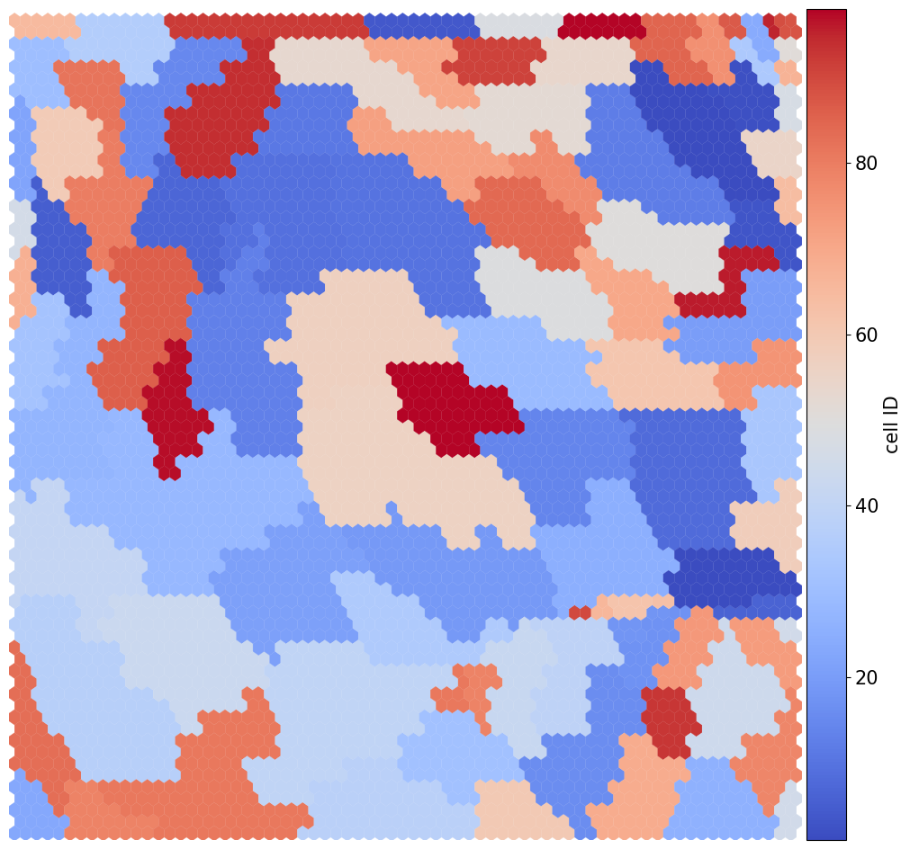
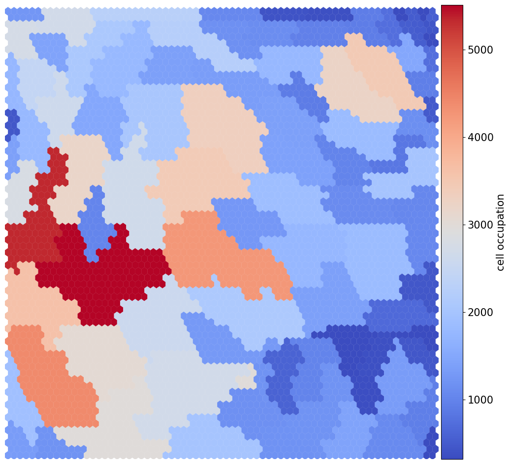
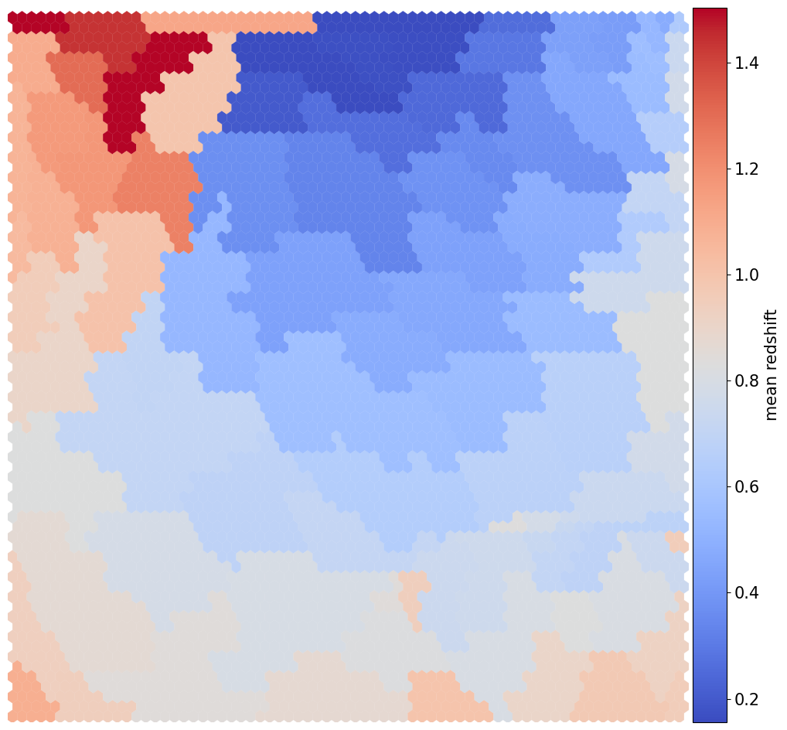
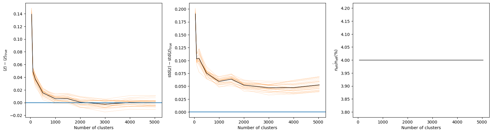
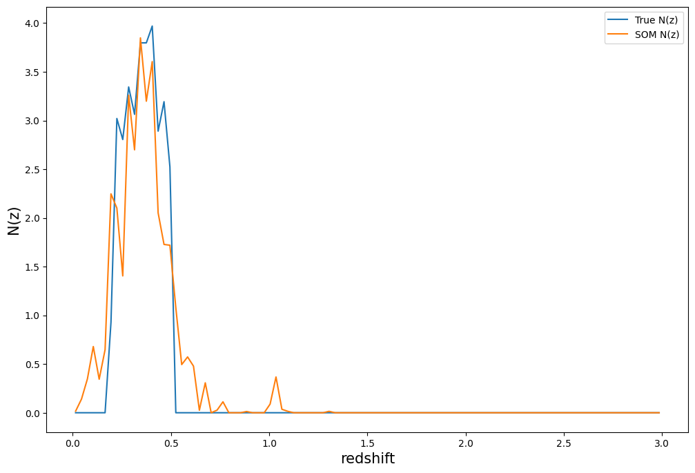
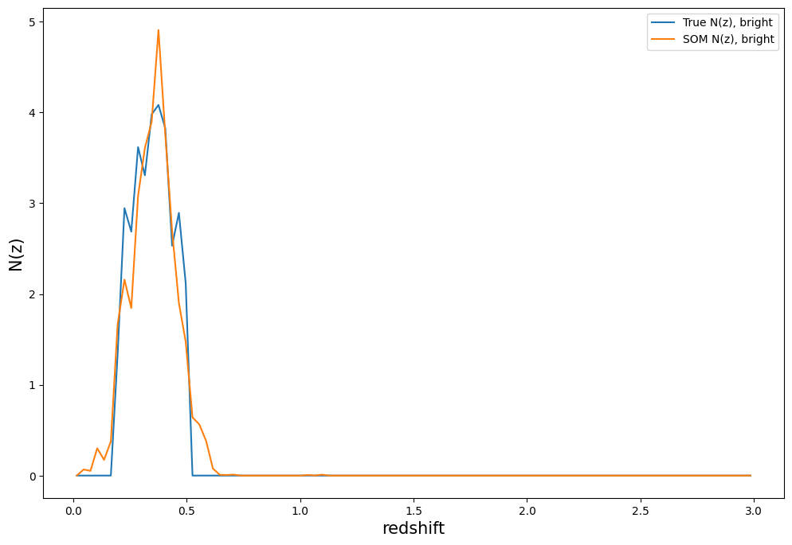
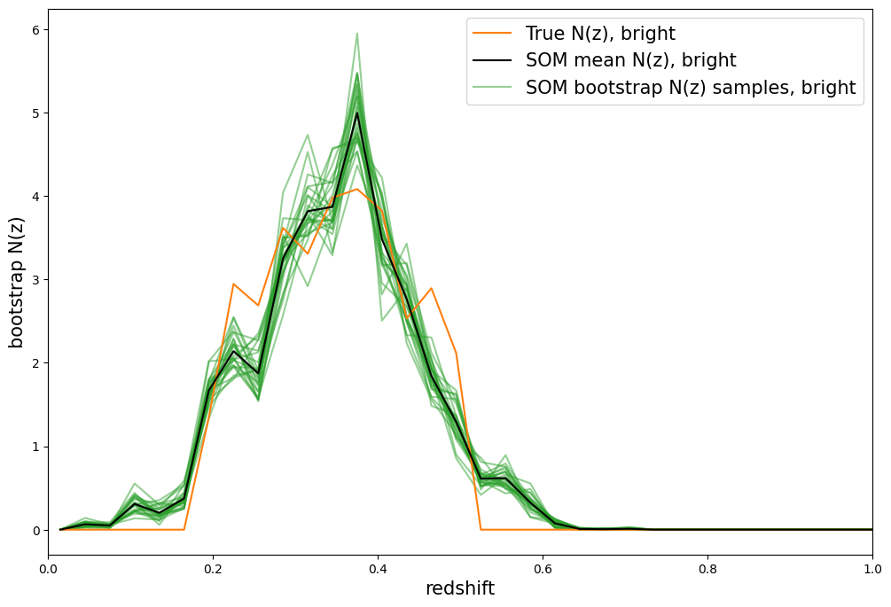
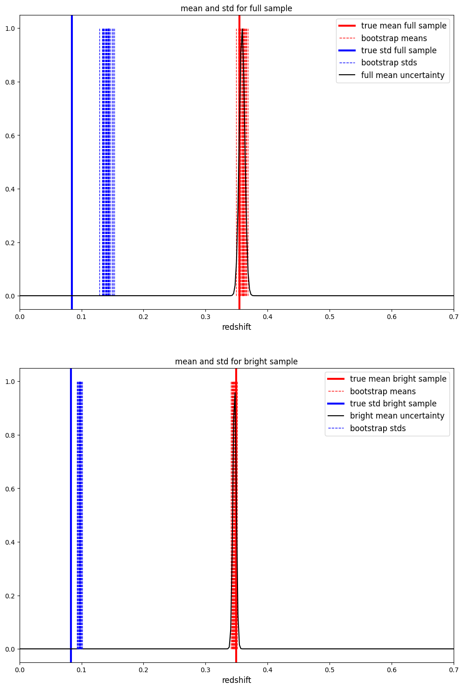

SomocluSOMSummarizer demo
=========================

Author: Ziang Yan, Sam Schmidt Last successfully run: June 16, 2023

This notebook shows a quick demonstration of the use of the
``SOMocluSummarizer`` summarization module. Algorithmically, this module
is not very different from the NZDir estimator/summarizer. NZDir
operates by finding neighboring photometric points around spectroscopic
objects. SOMocluSummarizer takes a large training set of data in the
``Inform_SOMocluUmmarizer`` stage and trains a self-organized map (SOM)
(using code from the ``somoclu`` package available at:
https://github.com/peterwittek/somoclu/). Once the SOM is set up, the
“best match unit” are determined for both the photometric/unknown data
and a set of spectroscopic data with known redshifts. For each SOM cell,
the algorithm constructs a histogram using the spectroscopic members
mapped to that cell, and weights these by the number of photometric
galaxies in that cell. Both the photometric and spectroscopic datasets
can also employ an optional weight per-galaxy.

The summarizer also identifies SOM cells that contain photometric data
but do not contain and galaxies with a measured spec-z, and thus do not
have an obvious redshift estimate. It writes out the (raveled) SOM cell
indices that contain “uncovered”/uncalibratable data to the file
specified by the ``uncovered_cell_file`` option as a list of integers.
The cellIDs and galaxy/objIDs for all photometric galaxies will be
written out to the file specified by the ``cellid_output`` parameter.
Any galaxies in these cells should really be removed, and thus some
iteration may be necessary in defining bin membership by looking at the
properties of objects in these uncovered cells before a final N(z) is
estimated, as otherwise a bias may be present.

The shape and number of cells used in constructing the SOM affects
performance, as do several tuning parameters. This paper,
http://www.giscience2010.org/pdfs/paper_230.pdf gives a rough guideline
that the number of cells should be of the order ~ 5 x sqrt (number of
data rows x number of column rows), though this is a rough guide. Some
studies have found a 2D SOM that is more elongated in one direction to
be preferential, while others claim that a square layout is optimal, the
user can set the number of cells in each SOM dimension via the
``n_rows`` and ``n_cols`` parameters. For more discussion on SOMs see
the Appendices of this KiDS paper: http://arxiv.org/abs/1909.09632.

As with the other RAIL summarizers, we bootstrap the spectroscopic
sample and return N bootstraps in an ensemble, along with a single
fiducial N(z) estimate.

More specific details of the algorithm’s set up will be described in the
course of this notebook, along with some illustrative plots.

Let’s set up our dependencies:

.. code:: ipython3

    import numpy as np
    import matplotlib.pyplot as plt
    from matplotlib import cm
    import pickle
    import rail
    import os
    import qp
    import tables_io
    from rail.core.data import TableHandle
    from rail.core.stage import RailStage
    from rail.core.utils import RAILDIR
    from rail.estimation.algos.somoclu_som import SOMocluInformer, SOMocluSummarizer
    from rail.estimation.algos.somoclu_som import get_bmus, plot_som

Next, let’s set up the Data Store, so that our RAIL module will know
where to fetch data:

.. code:: ipython3

    DS = RailStage.data_store
    DS.__class__.allow_overwrite = True

First, let’s grab some data files. For the SOM, we will want to train on
a fairly large, representative set that encompasses all of our expected
data. We’ll grab a larger data file than we typically use in our demos
to ensure that we construct a meaningful SOM.

This data consists of ~150,000 galaxies from a single healpix pixel of
the comsoDC2 truth catalog with mock 10-year magnitude errors added. It
is cut at a relatively bright i<23.5 magnitudes in order to concentrate
on galaxies with particularly high S/N rates.

.. code:: ipython3

    training_file = "./healpix_10326_bright_data.hdf5"
    
    if not os.path.exists(training_file):
      os.system('curl -O https://portal.nersc.gov/cfs/lsst/PZ/healpix_10326_bright_data.hdf5')

.. code:: ipython3

    # way to get big data file
    training_data = DS.read_file("training_data", TableHandle, training_file)

Now, let’s set up the inform stage for our summarizer

We need to define all of our necessary initialization params, which
includes the following: ``name`` (str): the name of our estimator, as
utilized by ceci ``model`` (str): the name for the model file containing
the SOM and associated parameters that will be written by this stage
``hdf5_groupname`` (str): name of the hdf5 group (if any) where the
photometric data resides in the training file ``n_rows`` (int): the
number of dimensions in the y-direction for our 2D SOM ``m_columns``
(int): the number of dimensions in the x-direction for our 2D SOM
``som_iterations`` (int): the number of iteration steps during SOM
training. SOMs can take a while to converge, so we will use a fairly
large number of 500,000 iterations. ``std_coeff`` (float): the “radius”
of how far to spread changes in the SOM ``som_learning_rate`` (float): a
number between 0 and 1 that controls how quickly the weighting function
decreases. SOM’s are not guaranteed to converge mathematically, and so
this parameter tunes how the response drops per iteration. A typical
values we might use might be between 0.5 and 0.75. ``column_usage``
(str): this value determines what values will be used to construct the
SOM, valid choices are ``colors``, ``magandcolors``, and ``columns``. If
set to ``colors``, the code will take adjacent columns as specified in
``usecols`` to construct colors and use those as SOM inputs. If set to
``magandcolors`` it will use the single column specfied by
``ref_column_name`` and the aforementioned colors to construct the SOM.
If set to ``columns`` then it will simply take each of the columns in
``usecols`` with no modification. So, if a user wants to use K
magnitudes and L colors, they can precompute the colors and specify all
names in ``usecols``. NOTE: accompanying ``usecols`` you must have a
``nondetect_val`` dictionary that lists the replacement values for any
non-detection-valued entries for each column, see the code for an
example dictionary. WE will set ``column_usage`` to colors and use only
colors in this example notebook.

.. code:: ipython3

    grid_type = 'hexagonal'
    inform_dict = dict(model='output_SOMoclu_model.pkl', hdf5_groupname='photometry',
                       n_rows=71, n_columns=71, 
                       gridtype = grid_type,
                       std_coeff=12.0, som_learning_rate=0.75,
                       column_usage='colors')

.. code:: ipython3

    inform_som = SOMocluInformer.make_stage(name='inform_som', **inform_dict)

Let’s run our stage, which will write out a file called
``output_SOM_model.pkl``

**NOTE for those using M1 Macs:** you may get an error like
``wrap_train not found`` when running the inform stage in the cell just
below here. If so, this can be solved by reinstalling somoclu from conda
rather than pip with the command:

::

   conda install -c conda-forge somoclu

.. code:: ipython3

    %%time
    inform_som.inform(training_data)

.. parsed-literal::

    Inserting handle into data store.  model_inform_som: inprogress_output_SOMoclu_model.pkl, inform_som
    CPU times: user 5min 24s, sys: 417 ms, total: 5min 24s
    Wall time: 2min 47s

.. parsed-literal::

    <rail.core.data.ModelHandle at 0x7fa5e81fbaf0>

Running the stage took ~1 minute wall time on a desktop Mac and ~3.5
minutes on NERSC Jupyter lab. Remember, however, that in many production
cases we would likely load a pre-trained SOM specifically tuned to the
given dataset, and this inform stage would not be run each time. Let’s
read in the SOM model file, which contains our som model and several of
the parameters used in constructing the SOM, and needed by our
summarization model.

.. code:: ipython3

    with open("output_SOMoclu_model.pkl", "rb") as f:
        model = pickle.load(f)

To visualize our SOM, let’s calculate the cell occupation of our
training sample, as well as the mean redshift of the galaxies in each
cell. The SOM took colors as inputs, so we will need to construct the
colors for our training set galaxie:

.. code:: ipython3

    bands = ['u','g','r','i','z','y']
    bandnames = [f"mag_{band}_lsst" for band in bands]
    ngal = len(training_data.data['photometry']['mag_i_lsst'])
    colors = np.zeros([5, ngal])
    for i in range(5):
        colors[i] = training_data.data['photometry'][bandnames[i]] - training_data.data['photometry'][bandnames[i+1]]

We can calculate the best SOM cell using the get_bmus() function defined
in somoclu_som.py, which will return the 2D SOM coordinates for each
galaxy. Then we group the SOM cells into 100 hierarchical clusters and
calculate the occupation and mean redshift in each cluster.

.. code:: ipython3

    SOM = model['som']
    bmu_coordinates = get_bmus(SOM, colors.T, 1000).T

.. code:: ipython3

    import sklearn.cluster as sc
    
    n_clusters = 100
    algorithm = sc.AgglomerativeClustering(n_clusters=n_clusters, linkage='complete')
    SOM.cluster(algorithm)
    som_cluster_inds = SOM.clusters.reshape(-1)
    phot_pixel_coords = np.ravel_multi_index(bmu_coordinates, (71, 71))
    
    phot_som_clusterind = som_cluster_inds[phot_pixel_coords]

First, let’s visualize our hierarchical clusters by plotting the SOM
cells grouped into each cluster number:

.. code:: ipython3

    cellid = np.zeros_like(SOM.umatrix).reshape(-1)
    for i in range(n_clusters):
        cellid[som_cluster_inds==i] = i
    cellid = cellid.reshape(SOM.umatrix.shape)
    
    fig, ax = plt.subplots(nrows=1, ncols=1, figsize=(12,12))
    plot_som(ax, cellid.T, grid_type=grid_type, colormap=cm.coolwarm, cbar_name='cell ID')

we see variations in number of cells in each grouping and geometry, but
mostly nice contiguous cell chunks. Next, let’s plot the cell occupation
and mean redshift:

.. code:: ipython3

    meanszs = np.zeros_like(SOM.umatrix).reshape(-1)
    cellocc = np.zeros_like(SOM.umatrix).reshape(-1)
    
    for i in range(n_clusters):
        meanszs[som_cluster_inds==i] = np.mean(training_data.data['photometry']['redshift'][phot_som_clusterind==i])
        cellocc[som_cluster_inds==i] = (phot_som_clusterind==i).sum()
    meanszs = meanszs.reshape(SOM.umatrix.shape)
    cellocc = cellocc.reshape(SOM.umatrix.shape)

Here is the cluster occupation distribution:

.. code:: ipython3

    fig, ax = plt.subplots(nrows=1, ncols=1, figsize=(12,12))
    plot_som(ax, cellocc.T, grid_type=grid_type, colormap=cm.coolwarm, cbar_name='cell occupation')

And here is the mean redshift per cluster:

.. code:: ipython3

    fig, ax = plt.subplots(nrows=1, ncols=1, figsize=(12,12))
    plot_som(ax, meanszs.T, grid_type=grid_type, colormap=cm.coolwarm, cbar_name='mean redshift')

Now that we have illustrated what exactly we have constructed, let’s use
the SOM to predict the redshift distribution for a set of photometric
objects. We will make a simple cut in spectroscopic redshift to create a
compact redshift bin. In more realistic circumstances we would likely be
using color cuts or photometric redshift estimates to define our test
bin(s). We will cut our photometric sample to only include galaxies in
0.5<specz<0.9.

We will need to trim both our spec-z set to i<23.5 to match our trained
SOM:

.. code:: ipython3

    testfile = os.path.join(RAILDIR, 'rail/examples_data/testdata/test_dc2_training_9816.hdf5')
    data = tables_io.read(testfile)['photometry']
    mask = ((data['redshift'] > 0.2) & (data['redshift']<0.5))
    brightmask = ((mask) & (data['mag_i_lsst']<23.5))
    trim_data = {}
    bright_data = {}
    for key in data.keys():
        trim_data[key] = data[key][mask]
        bright_data[key] = data[key][brightmask]
    trimdict = dict(photometry=trim_data)
    brightdict = dict(photometry=bright_data)
    # add data to data store
    test_data = DS.add_data("tomo_bin", trimdict, TableHandle)
    bright_data = DS.add_data("bright_bin", brightdict, TableHandle)

.. code:: ipython3

    specfile = os.path.join(RAILDIR, "rail/examples_data/testdata/test_dc2_validation_9816.hdf5")
    spec_data = tables_io.read(specfile)['photometry']
    smask = (spec_data['mag_i_lsst'] <23.5)
    trim_spec = {}
    for key in spec_data.keys():
        trim_spec[key] = spec_data[key][smask]
    trim_dict = dict(photometry=trim_spec)
    spec_data = DS.add_data("spec_data", trim_dict, TableHandle)

Note that we have removed the ‘photometry’ group, we will specify the
``phot_groupname`` as "" in the parameters below. As before, let us
specify our initialization params for the SomocluSOMSummarizer stage,
including: ``model``: name of the pickled model that we created, in this
case “output_SOM_model.pkl” ``hdf5_groupname`` (str): hdf5 group for our
photometric data (in our case "") ``objid_name`` (str): string
specifying the name of the ID column, if present photom data, will be
written out to cellid_output file ``spec_groupname`` (str): hdf5 group
for the spectroscopic data ``nzbins`` (int): number of bins to use in
our histogram ensemble ``n_clusters`` (int): number of hierarchical
clusters ``nsamples`` (int): number of bootstrap samples to generate
``output`` (str): name of the output qp file with N samples
``single_NZ`` (str): name of the qp file with fiducial distribution
``uncovered_cell_file`` (str): name of hdf5 file containing a list of
all of the cells with phot data but no spec-z objects: photometric
objects in these cells will *not* be accounted for in the final N(z),
and should really be removed from the sample before running the
summarizer. Note that we return a single integer that is constructed
from the pairs of SOM cell indices via
``np.ravel_multi_index``\ (indices).

Now let’s initialize and run the summarizer. One feature of the SOM: if
any SOM cells contain photometric data but do not contain any redshifts
values in the spectroscopic set, then no reasonable redshift estimate
for those objects is defined, and they are skipped. The method currently
prints the indices of uncovered cells, we may modify the algorithm to
actually output the uncovered galaxies in a separate file in the future.

Let’s open the fiducial N(z) file, plot it, and see how it looks, and
compare it to the true tomographic bin file:

.. code:: ipython3

    summ_dict = dict(model="output_SOMoclu_model.pkl", hdf5_groupname='photometry',
                     spec_groupname='photometry', nzbins=101, nsamples=25,
                     output='SOM_ensemble.hdf5', single_NZ='fiducial_SOMoclu_NZ.hdf5',
                     uncovered_cell_file='all_uncovered_cells.hdf5',
                     objid_name='id',
                     cellid_output='output_cellIDs.hdf5')
    som_summarizer = SOMocluSummarizer.make_stage(name='SOMoclu_summarizer', **summ_dict)    
    som_summarizer.summarize(test_data, spec_data)

.. parsed-literal::

    Inserting handle into data store.  model: output_SOMoclu_model.pkl, SOMoclu_summarizer
    Warning: number of clusters is not provided. The SOM will NOT be grouped into clusters.
    Process 0 running summarizer on chunk 0 - 1545
    Inserting handle into data store.  cellid_output_SOMoclu_summarizer: inprogress_output_cellIDs.hdf5, SOMoclu_summarizer
    the following clusters contain photometric data but not spectroscopic data:
    {3585, 3, 5, 1030, 7, 3079, 1033, 2061, 1037, 19, 2068, 21, 1044, 1558, 24, 25, 2586, 27, 4124, 3100, 2078, 1053, 1564, 2085, 1063, 556, 4652, 3116, 2100, 2101, 53, 1083, 2109, 4158, 1087, 64, 1604, 1095, 587, 1100, 83, 3156, 4182, 598, 600, 1111, 3673, 2139, 1117, 4089, 1632, 609, 1634, 1125, 615, 3689, 1131, 1136, 625, 3696, 1650, 1140, 1142, 1143, 3190, 1145, 1658, 636, 4222, 128, 640, 1666, 4227, 2179, 644, 1668, 647, 137, 650, 657, 1682, 147, 1172, 1174, 663, 671, 1183, 2209, 673, 4769, 1185, 677, 1191, 680, 1707, 1708, 1198, 687, 1200, 1201, 178, 3250, 692, 3251, 1711, 1209, 4284, 701, 1213, 1741, 723, 1237, 1750, 4825, 731, 733, 223, 3296, 1253, 744, 238, 1775, 1776, 2802, 1779, 3829, 1272, 3321, 3322, 1275, 766, 769, 4354, 259, 2307, 1796, 774, 1287, 1290, 267, 269, 781, 783, 1295, 1808, 2325, 278, 789, 2838, 281, 4377, 1303, 1307, 1813, 1815, 799, 2848, 3864, 802, 806, 1831, 1833, 1322, 811, 300, 814, 1839, 1329, 1841, 307, 308, 309, 1332, 1847, 824, 314, 1340, 829, 1858, 4419, 2372, 840, 4940, 334, 336, 1362, 3413, 1381, 2407, 2409, 1901, 880, 881, 882, 3954, 1907, 885, 887, 890, 3452, 893, 2431, 3969, 1921, 899, 1411, 1412, 1925, 391, 908, 1933, 398, 1934, 912, 2453, 2454, 3481, 1945, 1435, 3486, 1438, 1950, 417, 1951, 419, 1955, 5031, 1961, 1450, 427, 1963, 429, 1964, 944, 4016, 3506, 1969, 437, 4534, 1975, 2488, 1471, 1472, 3520, 1983, 1984, 1989, 967, 1479, 458, 459, 1486, 1489, 2003, 3028, 1493, 4053, 4567, 472, 985, 1495, 2009, 988, 2010, 3040, 3553, 2017, 997, 488, 489, 1000, 1001, 3049, 3565, 2542, 3055, 2024, 2028, 1522, 499, 2549, 3576, 1017, 2045}
    527 out of 5041 have usable data
    Inserting handle into data store.  output_SOMoclu_summarizer: inprogress_SOM_ensemble.hdf5, SOMoclu_summarizer
    Inserting handle into data store.  single_NZ_SOMoclu_summarizer: inprogress_fiducial_SOMoclu_NZ.hdf5, SOMoclu_summarizer
    Inserting handle into data store.  uncovered_cluster_file_SOMoclu_summarizer: inprogress_uncovered_cluster_file_SOMoclu_summarizer, SOMoclu_summarizer

.. parsed-literal::

    NOTE/WARNING: Expected output file uncovered_cluster_file_SOMoclu_summarizer was not generated.

.. parsed-literal::

    <rail.core.data.QPHandle at 0x7fa59e19fe50>

.. code:: ipython3

    fid_ens = qp.read("fiducial_SOMoclu_NZ.hdf5")

.. code:: ipython3

    def get_cont_hist(data, bins):
        hist, bin_edge = np.histogram(data, bins=bins, density=True)
        return hist, (bin_edge[1:]+bin_edge[:-1])/2

.. code:: ipython3

    test_nz_hist, zbin = get_cont_hist(test_data.data['photometry']['redshift'], np.linspace(0,3,101))
    som_nz_hist = np.squeeze(fid_ens.pdf(zbin))

Now we try to group SOM cells together with hierarchical clustering
method. To do this, we simply specify ``n_cluster`` in the input dict.
We want to test how many hierarchical clusters are optimal for the
redshift calibration task. We evaluate the performance by three values:
the difference between mean redshifts of the phot and spec catalog; the
difference between standard deviations; the ratio between effective
number density of represented photometric sources and the whole
photometric sample.

.. code:: ipython3

    n_clusterss = np.array([50, 100, 200, 500, 1000, 1500, 2000, 3000, 4000, 71*71])
    true_full_mean = np.mean(test_data.data['photometry']['redshift'])
    true_full_std = np.std(test_data.data['photometry']['redshift'])
    mu_diff = np.zeros(n_clusterss.size)
    means_diff = np.zeros((n_clusterss.size, 25))
    
    std_diff_mean = np.zeros(n_clusterss.size)
    neff_p_to_neff = np.zeros(n_clusterss.size)
    std_diff = np.zeros((n_clusterss.size, 25))
    for i, n_clusters in enumerate(n_clusterss):
        summ_dict = dict(model="output_SOMoclu_model.pkl", hdf5_groupname='photometry',
                     spec_groupname='photometry', nzbins=101, nsamples=25,
                     output='SOM_ensemble.hdf5', single_NZ='fiducial_SOMoclu_NZ.hdf5',
                     n_clusters=n_clusters,
                     uncovered_cell_file='all_uncovered_cells.hdf5',
                     objid_name='id',
                     cellid_output='output_cellIDs.hdf5')
        som_summarizer = SOMocluSummarizer.make_stage(name='SOMoclu_summarizer', **summ_dict)    
        som_summarizer.summarize(test_data, spec_data)
        
        full_ens = qp.read("SOM_ensemble.hdf5")
        full_means = full_ens.mean().flatten()
        full_stds = full_ens.std().flatten()
        
        # mean and width of bootstraps
        mu_diff[i] = np.mean(full_means) - true_full_mean
        means_diff[i] = full_means - true_full_mean
        
        std_diff_mean[i] = np.mean(full_stds) - true_full_std
        std_diff[i] = full_stds - true_full_std
        neff_p_to_neff[i] = som_summarizer.neff_p_to_neff
        full_sig = np.std(full_means)
        

.. parsed-literal::

    Process 0 running summarizer on chunk 0 - 1545
    Inserting handle into data store.  cellid_output_SOMoclu_summarizer: inprogress_output_cellIDs.hdf5, SOMoclu_summarizer
    the following clusters contain photometric data but not spectroscopic data:
    set()
    31 out of 50 have usable data
    Inserting handle into data store.  output_SOMoclu_summarizer: inprogress_SOM_ensemble.hdf5, SOMoclu_summarizer
    Inserting handle into data store.  single_NZ_SOMoclu_summarizer: inprogress_fiducial_SOMoclu_NZ.hdf5, SOMoclu_summarizer
    Inserting handle into data store.  uncovered_cluster_file_SOMoclu_summarizer: inprogress_uncovered_cluster_file_SOMoclu_summarizer, SOMoclu_summarizer

.. parsed-literal::

    NOTE/WARNING: Expected output file uncovered_cluster_file_SOMoclu_summarizer was not generated.

.. parsed-literal::

    Process 0 running summarizer on chunk 0 - 1545
    Inserting handle into data store.  cellid_output_SOMoclu_summarizer: inprogress_output_cellIDs.hdf5, SOMoclu_summarizer
    the following clusters contain photometric data but not spectroscopic data:
    set()
    47 out of 100 have usable data
    Inserting handle into data store.  output_SOMoclu_summarizer: inprogress_SOM_ensemble.hdf5, SOMoclu_summarizer
    Inserting handle into data store.  single_NZ_SOMoclu_summarizer: inprogress_fiducial_SOMoclu_NZ.hdf5, SOMoclu_summarizer
    Inserting handle into data store.  uncovered_cluster_file_SOMoclu_summarizer: inprogress_uncovered_cluster_file_SOMoclu_summarizer, SOMoclu_summarizer

.. parsed-literal::

    NOTE/WARNING: Expected output file uncovered_cluster_file_SOMoclu_summarizer was not generated.

.. parsed-literal::

    Process 0 running summarizer on chunk 0 - 1545
    Inserting handle into data store.  cellid_output_SOMoclu_summarizer: inprogress_output_cellIDs.hdf5, SOMoclu_summarizer
    the following clusters contain photometric data but not spectroscopic data:
    set()
    87 out of 200 have usable data
    Inserting handle into data store.  output_SOMoclu_summarizer: inprogress_SOM_ensemble.hdf5, SOMoclu_summarizer
    Inserting handle into data store.  single_NZ_SOMoclu_summarizer: inprogress_fiducial_SOMoclu_NZ.hdf5, SOMoclu_summarizer
    Inserting handle into data store.  uncovered_cluster_file_SOMoclu_summarizer: inprogress_uncovered_cluster_file_SOMoclu_summarizer, SOMoclu_summarizer

.. parsed-literal::

    NOTE/WARNING: Expected output file uncovered_cluster_file_SOMoclu_summarizer was not generated.

.. parsed-literal::

    Process 0 running summarizer on chunk 0 - 1545
    Inserting handle into data store.  cellid_output_SOMoclu_summarizer: inprogress_output_cellIDs.hdf5, SOMoclu_summarizer
    the following clusters contain photometric data but not spectroscopic data:
    set()
    177 out of 500 have usable data
    Inserting handle into data store.  output_SOMoclu_summarizer: inprogress_SOM_ensemble.hdf5, SOMoclu_summarizer
    Inserting handle into data store.  single_NZ_SOMoclu_summarizer: inprogress_fiducial_SOMoclu_NZ.hdf5, SOMoclu_summarizer
    Inserting handle into data store.  uncovered_cluster_file_SOMoclu_summarizer: inprogress_uncovered_cluster_file_SOMoclu_summarizer, SOMoclu_summarizer

.. parsed-literal::

    NOTE/WARNING: Expected output file uncovered_cluster_file_SOMoclu_summarizer was not generated.

.. parsed-literal::

    Process 0 running summarizer on chunk 0 - 1545
    Inserting handle into data store.  cellid_output_SOMoclu_summarizer: inprogress_output_cellIDs.hdf5, SOMoclu_summarizer
    the following clusters contain photometric data but not spectroscopic data:
    {387, 882, 563, 855, 824, 473, 475, 636}
    310 out of 1000 have usable data
    Inserting handle into data store.  output_SOMoclu_summarizer: inprogress_SOM_ensemble.hdf5, SOMoclu_summarizer
    Inserting handle into data store.  single_NZ_SOMoclu_summarizer: inprogress_fiducial_SOMoclu_NZ.hdf5, SOMoclu_summarizer
    Inserting handle into data store.  uncovered_cluster_file_SOMoclu_summarizer: inprogress_uncovered_cluster_file_SOMoclu_summarizer, SOMoclu_summarizer

.. parsed-literal::

    NOTE/WARNING: Expected output file uncovered_cluster_file_SOMoclu_summarizer was not generated.

.. parsed-literal::

    Process 0 running summarizer on chunk 0 - 1545
    Inserting handle into data store.  cellid_output_SOMoclu_summarizer: inprogress_output_cellIDs.hdf5, SOMoclu_summarizer
    the following clusters contain photometric data but not spectroscopic data:
    {270, 1173, 1304, 1197, 685, 1335, 824, 58, 571, 827, 317, 1086, 705, 1482, 1357, 1233, 1492, 1237, 855, 1497, 475, 862, 1127, 1000, 1130, 1260, 1266, 754, 882, 374, 630, 511}
    380 out of 1500 have usable data
    Inserting handle into data store.  output_SOMoclu_summarizer: inprogress_SOM_ensemble.hdf5, SOMoclu_summarizer
    Inserting handle into data store.  single_NZ_SOMoclu_summarizer: inprogress_fiducial_SOMoclu_NZ.hdf5, SOMoclu_summarizer
    Inserting handle into data store.  uncovered_cluster_file_SOMoclu_summarizer: inprogress_uncovered_cluster_file_SOMoclu_summarizer, SOMoclu_summarizer

.. parsed-literal::

    NOTE/WARNING: Expected output file uncovered_cluster_file_SOMoclu_summarizer was not generated.

.. parsed-literal::

    Process 0 running summarizer on chunk 0 - 1545
    Inserting handle into data store.  cellid_output_SOMoclu_summarizer: inprogress_output_cellIDs.hdf5, SOMoclu_summarizer
    the following clusters contain photometric data but not spectroscopic data:
    {1792, 644, 1288, 394, 1682, 1684, 1173, 1304, 1944, 1690, 667, 542, 1694, 672, 1950, 1187, 1788, 1066, 556, 1197, 1836, 1586, 1587, 1845, 1335, 1847, 1721, 1975, 187, 571, 827, 1086, 66, 1482, 1738, 205, 1357, 1485, 463, 1233, 1490, 1492, 1237, 342, 1876, 855, 1497, 219, 475, 987, 352, 97, 1892, 1765, 1254, 1127, 1130, 1266, 499, 629, 630, 1274, 1659, 763, 255}
    433 out of 2000 have usable data
    Inserting handle into data store.  output_SOMoclu_summarizer: inprogress_SOM_ensemble.hdf5, SOMoclu_summarizer
    Inserting handle into data store.  single_NZ_SOMoclu_summarizer: inprogress_fiducial_SOMoclu_NZ.hdf5, SOMoclu_summarizer
    Inserting handle into data store.  uncovered_cluster_file_SOMoclu_summarizer: inprogress_uncovered_cluster_file_SOMoclu_summarizer, SOMoclu_summarizer

.. parsed-literal::

    NOTE/WARNING: Expected output file uncovered_cluster_file_SOMoclu_summarizer was not generated.

.. parsed-literal::

    Process 0 running summarizer on chunk 0 - 1545
    Inserting handle into data store.  cellid_output_SOMoclu_summarizer: inprogress_output_cellIDs.hdf5, SOMoclu_summarizer
    the following clusters contain photometric data but not spectroscopic data:
    {523, 1547, 2061, 2576, 2581, 2070, 2582, 1558, 2586, 2591, 2080, 32, 1060, 1061, 1063, 1065, 1068, 1072, 2101, 1079, 2616, 570, 2109, 62, 1605, 582, 2124, 593, 1115, 98, 2659, 1127, 632, 2682, 1659, 128, 2690, 1154, 644, 1155, 134, 2698, 2188, 1681, 1684, 149, 155, 675, 676, 166, 2726, 1707, 1200, 2230, 2742, 1721, 186, 2236, 2247, 713, 1225, 203, 2764, 1738, 1232, 2771, 2261, 1237, 1239, 1240, 1752, 2270, 1246, 1250, 229, 2283, 237, 2286, 2802, 2807, 1786, 1788, 1792, 2308, 1796, 2838, 792, 2848, 292, 1836, 2865, 2872, 316, 2877, 2372, 325, 1348, 2375, 844, 1357, 846, 1362, 1876, 855, 2396, 2404, 1892, 1382, 2408, 2412, 2414, 1392, 370, 882, 1913, 1915, 381, 2431, 2946, 1411, 2439, 395, 2961, 1944, 414, 2974, 1950, 419, 2467, 2981, 1959, 2475, 1465, 2504, 1482, 2508, 461, 1489, 2002, 1492, 1493, 2519, 987, 481, 2546, 2549, 2551, 2043}
    495 out of 3000 have usable data
    Inserting handle into data store.  output_SOMoclu_summarizer: inprogress_SOM_ensemble.hdf5, SOMoclu_summarizer
    Inserting handle into data store.  single_NZ_SOMoclu_summarizer: inprogress_fiducial_SOMoclu_NZ.hdf5, SOMoclu_summarizer
    Inserting handle into data store.  uncovered_cluster_file_SOMoclu_summarizer: inprogress_uncovered_cluster_file_SOMoclu_summarizer, SOMoclu_summarizer

.. parsed-literal::

    NOTE/WARNING: Expected output file uncovered_cluster_file_SOMoclu_summarizer was not generated.

.. parsed-literal::

    Process 0 running summarizer on chunk 0 - 1545
    Inserting handle into data store.  cellid_output_SOMoclu_summarizer: inprogress_output_cellIDs.hdf5, SOMoclu_summarizer
    the following clusters contain photometric data but not spectroscopic data:
    {3585, 514, 1540, 519, 3079, 1034, 3594, 1550, 2576, 3601, 2581, 2582, 1022, 1558, 2586, 1050, 3100, 1563, 2591, 1568, 1567, 551, 1063, 3116, 1068, 3628, 2608, 561, 1072, 2101, 2616, 2108, 2109, 2110, 1087, 1599, 2113, 577, 1606, 2124, 3156, 1623, 3673, 3162, 1629, 96, 1632, 3680, 1634, 1127, 104, 3689, 1134, 111, 624, 3696, 3190, 2168, 2682, 1660, 637, 1666, 138, 2698, 2188, 3210, 144, 154, 2202, 1187, 2726, 168, 1707, 684, 1708, 1711, 2224, 1200, 690, 1201, 1203, 3251, 2230, 695, 2233, 2236, 1213, 192, 2753, 3782, 2252, 2764, 1232, 1233, 213, 1237, 1239, 1752, 1754, 3296, 2274, 228, 3300, 3301, 2282, 2283, 1772, 2286, 1775, 1776, 2802, 1779, 2292, 1781, 3829, 2807, 3321, 1788, 1795, 2308, 264, 2825, 3338, 272, 2325, 2838, 1302, 1815, 281, 3864, 1818, 798, 2848, 1825, 1315, 3363, 806, 3366, 1831, 1833, 811, 1838, 2865, 1329, 310, 1847, 2872, 1339, 2877, 3901, 1344, 833, 1858, 835, 2372, 1348, 3912, 1356, 846, 337, 1362, 3923, 2901, 3413, 855, 859, 2396, 2404, 1385, 2412, 2414, 880, 881, 882, 3954, 1907, 3957, 892, 3452, 2431, 895, 3969, 2946, 1411, 1921, 1413, 1925, 2439, 3979, 1933, 1934, 2960, 1936, 919, 3481, 1945, 3484, 414, 2974, 1951, 2981, 1448, 2475, 1963, 2992, 945, 3506, 1969, 1971, 1463, 1975, 1465, 1468, 957, 446, 1471, 3520, 1983, 1984, 2504, 1480, 2508, 977, 1489, 979, 3028, 1492, 1493, 2519, 2003, 477, 3040, 3553, 997, 3046, 1000, 1001, 3049, 3565, 2546, 2548, 2549, 3576, 3068, 510}
    520 out of 4000 have usable data
    Inserting handle into data store.  output_SOMoclu_summarizer: inprogress_SOM_ensemble.hdf5, SOMoclu_summarizer
    Inserting handle into data store.  single_NZ_SOMoclu_summarizer: inprogress_fiducial_SOMoclu_NZ.hdf5, SOMoclu_summarizer
    Inserting handle into data store.  uncovered_cluster_file_SOMoclu_summarizer: inprogress_uncovered_cluster_file_SOMoclu_summarizer, SOMoclu_summarizer

.. parsed-literal::

    NOTE/WARNING: Expected output file uncovered_cluster_file_SOMoclu_summarizer was not generated.

.. parsed-literal::

    Process 0 running summarizer on chunk 0 - 1545
    Inserting handle into data store.  cellid_output_SOMoclu_summarizer: inprogress_output_cellIDs.hdf5, SOMoclu_summarizer
    the following clusters contain photometric data but not spectroscopic data:
    {3585, 3, 5, 1030, 7, 3079, 1033, 2061, 1037, 19, 2068, 21, 1044, 1558, 24, 25, 2586, 27, 4124, 3100, 2078, 1053, 1564, 2085, 1063, 556, 4652, 3116, 2100, 2101, 53, 1083, 2109, 4158, 1087, 64, 1604, 1095, 587, 1100, 83, 3156, 4182, 598, 600, 1111, 3673, 2139, 1117, 4089, 1632, 609, 1634, 1125, 615, 3689, 1131, 1136, 625, 3696, 1650, 1140, 1142, 1143, 3190, 1145, 1658, 636, 4222, 128, 640, 1666, 4227, 2179, 644, 1668, 647, 137, 650, 657, 1682, 147, 1172, 1174, 663, 671, 1183, 2209, 673, 4769, 1185, 677, 1191, 680, 1707, 1708, 1198, 687, 1200, 1201, 178, 3250, 692, 3251, 1711, 1209, 4284, 701, 1213, 1741, 723, 1237, 1750, 4825, 731, 733, 223, 3296, 1253, 744, 238, 1775, 1776, 2802, 1779, 3829, 1272, 3321, 3322, 1275, 766, 769, 4354, 259, 2307, 1796, 774, 1287, 1290, 267, 269, 781, 783, 1295, 1808, 2325, 278, 789, 2838, 281, 4377, 1303, 1307, 1813, 1815, 799, 2848, 3864, 802, 806, 1831, 1833, 1322, 811, 300, 814, 1839, 1329, 1841, 307, 308, 309, 1332, 1847, 824, 314, 1340, 829, 1858, 4419, 2372, 840, 4940, 334, 336, 1362, 3413, 1381, 2407, 2409, 1901, 880, 881, 882, 3954, 1907, 885, 887, 890, 3452, 893, 2431, 3969, 1921, 899, 1411, 1412, 1925, 391, 908, 1933, 398, 1934, 912, 2453, 2454, 3481, 1945, 1435, 3486, 1438, 1950, 417, 1951, 419, 1955, 5031, 1961, 1450, 427, 1963, 429, 1964, 944, 4016, 3506, 1969, 437, 4534, 1975, 2488, 1471, 1472, 3520, 1983, 1984, 1989, 967, 1479, 458, 459, 1486, 1489, 2003, 3028, 1493, 4053, 4567, 472, 985, 1495, 2009, 988, 2010, 3040, 3553, 2017, 997, 488, 489, 1000, 1001, 3049, 3565, 2542, 3055, 2024, 2028, 1522, 499, 2549, 3576, 1017, 2045}
    527 out of 5041 have usable data
    Inserting handle into data store.  output_SOMoclu_summarizer: inprogress_SOM_ensemble.hdf5, SOMoclu_summarizer
    Inserting handle into data store.  single_NZ_SOMoclu_summarizer: inprogress_fiducial_SOMoclu_NZ.hdf5, SOMoclu_summarizer
    Inserting handle into data store.  uncovered_cluster_file_SOMoclu_summarizer: inprogress_uncovered_cluster_file_SOMoclu_summarizer, SOMoclu_summarizer

.. parsed-literal::

    NOTE/WARNING: Expected output file uncovered_cluster_file_SOMoclu_summarizer was not generated.

.. code:: ipython3

    fig, axes = plt.subplots(ncols=3, nrows=1, figsize=(20,5))
    
    for i in range(25):
        axes[0].plot(n_clusterss, means_diff.T[i], lw=0.2, color='C1')
    axes[0].plot(n_clusterss, mu_diff, lw=1, color='k')
    axes[0].axhline(0,1,0)
    axes[0].set_xlabel('Number of clusters')
    axes[0].set_ylabel(r'$\left\langle z \right\rangle - \left\langle z \right\rangle_{\mathrm{true}}$')
    
    for i in range(25):
        axes[1].plot(n_clusterss, std_diff.T[i], lw=0.2, color='C1')
    axes[1].plot(n_clusterss, std_diff_mean, lw=1, color='k')
    axes[1].axhline(0,1,0)
    
    axes[1].set_xlabel('Number of clusters')
    axes[1].set_ylabel(r'$\mathrm{std}(z) - \mathrm{std}(z)_{\mathrm{true}}$')
    
    
    axes[2].plot(n_clusterss, neff_p_to_neff*100, lw=1, color='k')
    
    axes[2].set_xlabel('Number of clusters')
    axes[2].set_ylabel(r'$n_{\mathrm{eff}}\'/n_{\mathrm{eff}}$(%)')

.. parsed-literal::

    Text(0, 0.5, "$n_{\\mathrm{eff}}\\'/n_{\\mathrm{eff}}$(%)")

From the three plots above, we can see that when n_cluster>1000, the
redshift bias is within ~0.01 and the difference in standard deviation
does not change significantly, but the effective number density
continues to decrease. This is because when we have more clusters, the
risk that a cluster does not contain a spectroscopic source becomes
higher. Therefore, we might choose ~1000 clusters for the calibration in
this practice, so that we can keep as many galaxies as possible while
minimize the bias in average and standard deviation of galaxy redshifts.

.. code:: ipython3

    summ_dict = dict(model="output_SOMoclu_model.pkl", hdf5_groupname='photometry',
                     spec_groupname='photometry', nzbins=101, nsamples=25,
                     output='SOM_ensemble.hdf5', single_NZ='fiducial_SOMoclu_NZ.hdf5',
                     n_clusters=1000,
                     uncovered_cell_file='all_uncovered_cells.hdf5',
                     objid_name='id',
                     cellid_output='output_cellIDs.hdf5')
    
    som_summarizer = SOMocluSummarizer.make_stage(name='SOMoclu_summarizer', **summ_dict)
    som_summarizer.summarize(test_data, spec_data)
    
    test_nz_hist, zbin = get_cont_hist(test_data.data['photometry']['redshift'], np.linspace(0,3,101))
    som_nz_hist = np.squeeze(fid_ens.pdf(zbin))

.. parsed-literal::

    Process 0 running summarizer on chunk 0 - 1545
    Inserting handle into data store.  cellid_output_SOMoclu_summarizer: inprogress_output_cellIDs.hdf5, SOMoclu_summarizer
    the following clusters contain photometric data but not spectroscopic data:
    {387, 882, 563, 855, 824, 473, 475, 636}
    310 out of 1000 have usable data
    Inserting handle into data store.  output_SOMoclu_summarizer: inprogress_SOM_ensemble.hdf5, SOMoclu_summarizer
    Inserting handle into data store.  single_NZ_SOMoclu_summarizer: inprogress_fiducial_SOMoclu_NZ.hdf5, SOMoclu_summarizer
    Inserting handle into data store.  uncovered_cluster_file_SOMoclu_summarizer: inprogress_uncovered_cluster_file_SOMoclu_summarizer, SOMoclu_summarizer

.. parsed-literal::

    NOTE/WARNING: Expected output file uncovered_cluster_file_SOMoclu_summarizer was not generated.

.. code:: ipython3

    fig, ax = plt.subplots(1,1, figsize=(12,8))
    ax.set_xlabel("redshift", fontsize=15)
    ax.set_ylabel("N(z)", fontsize=15)
    ax.plot(zbin, test_nz_hist, label='True N(z)')
    ax.plot(zbin, som_nz_hist, label='SOM N(z)')
    plt.legend()

.. parsed-literal::

    <matplotlib.legend.Legend at 0x7fa59e540e20>

Seems fine, roughly the correct redshift range for the lower redshift
peak, but a few secondary peaks at large z tail. What if we try the
bright dataset that we made?

.. code:: ipython3

    bright_dict = dict(model="output_SOMoclu_model.pkl", hdf5_groupname='photometry',
                       spec_groupname='photometry', nzbins=101, nsamples=25,
                       output='BRIGHT_SOMoclu_ensemble.hdf5', single_NZ='BRIGHT_fiducial_SOMoclu_NZ.hdf5',
                       uncovered_cell_file="BRIGHT_uncovered_cells.hdf5",
                       n_clusters=1000,
                       objid_name='id',
                       cellid_output='BRIGHT_output_cellIDs.hdf5')
    bright_summarizer = SOMocluSummarizer.make_stage(name='bright_summarizer', **bright_dict)

.. code:: ipython3

    bright_summarizer.summarize(bright_data, spec_data)

.. parsed-literal::

    Process 0 running summarizer on chunk 0 - 645
    Inserting handle into data store.  cellid_output_bright_summarizer: inprogress_BRIGHT_output_cellIDs.hdf5, bright_summarizer
    the following clusters contain photometric data but not spectroscopic data:
    {563, 636, 475}
    242 out of 1000 have usable data
    Inserting handle into data store.  output_bright_summarizer: inprogress_BRIGHT_SOMoclu_ensemble.hdf5, bright_summarizer
    Inserting handle into data store.  single_NZ_bright_summarizer: inprogress_BRIGHT_fiducial_SOMoclu_NZ.hdf5, bright_summarizer
    Inserting handle into data store.  uncovered_cluster_file_bright_summarizer: inprogress_uncovered_cluster_file_bright_summarizer, bright_summarizer

.. parsed-literal::

    NOTE/WARNING: Expected output file uncovered_cluster_file_bright_summarizer was not generated.

.. parsed-literal::

    <rail.core.data.QPHandle at 0x7fa59e3fd1e0>

.. code:: ipython3

    bright_fid_ens = qp.read("BRIGHT_fiducial_SOMoclu_NZ.hdf5")

.. code:: ipython3

    bright_nz_hist, zbin = get_cont_hist(bright_data.data['photometry']['redshift'], np.linspace(0,3,101))
    bright_som_nz_hist = np.squeeze(bright_fid_ens.pdf(zbin))

.. code:: ipython3

    fig, ax = plt.subplots(1,1, figsize=(12,8))
    ax.set_xlabel("redshift", fontsize=15)
    ax.set_ylabel("N(z)", fontsize=15)
    ax.plot(zbin, bright_nz_hist, label='True N(z), bright')
    ax.plot(zbin, bright_som_nz_hist, label='SOM N(z), bright')
    plt.legend()

.. parsed-literal::

    <matplotlib.legend.Legend at 0x7fa59e543070>

Looks better, we’ve eliminated the secondary peak. Now, SOMs are a bit
touchy to train, and are highly dependent on the dataset used to train
them. This demo used a relatively small dataset (~150,000 DC2 galaxies
from one healpix pixel) to train the SOM, and even smaller photometric
and spectroscopic datasets of 10,000 and 20,000 galaxies. We should
expect slightly better results with more data, at least in cells where
the spectroscopic data is representative.

However, there is a caveat that SOMs are not guaranteed to converge, and
are very sensitive to both the input data and tunable parameters of the
model. So, users should do some verification tests before trusting the
SOM is going to give accurate results.

Finally, let’s load up our bootstrap ensembles and overplot N(z) of
bootstrap samples:

.. code:: ipython3

    boot_ens = qp.read("BRIGHT_SOMoclu_ensemble.hdf5")

.. code:: ipython3

    fig, ax=plt.subplots(1,1,figsize=(12, 8))
    ax.set_xlim((0,1))
    ax.set_xlabel("redshift", fontsize=15)
    ax.set_ylabel("bootstrap N(z)", fontsize=15)
    ax.legend(loc='upper right', fontsize=13);
    
    ax.plot(zbin, bright_nz_hist, label='True N(z), bright', color='C1', zorder=1)
    ax.plot(zbin, bright_som_nz_hist, label='SOM mean N(z), bright', color='k', zorder=2)
    
    for i in range(boot_ens.npdf):
        #ax = plt.subplot(2,3,i+1)
        pdf = np.squeeze(boot_ens[i].pdf(zbin))
        if i == 0:        
            ax.plot(zbin, pdf, color='C2',zorder=0, alpha=0.5, label='SOM bootstrap N(z) samples, bright')
        else:
            ax.plot(zbin, pdf, color='C2',zorder=0, alpha=0.5)
        #boot_ens[i].plot_native(axes=ax, label=f'SOM bootstrap {i}')
    plt.legend(fontsize=15)

.. parsed-literal::

    No artists with labels found to put in legend.  Note that artists whose label start with an underscore are ignored when legend() is called with no argument.

.. parsed-literal::

    <matplotlib.legend.Legend at 0x7fa59719b2e0>

quantitative metrics
====================

Let’s look at how we’ve done at estimating the mean redshift and “width”
(via standard deviation) of our tomographic bin compared to the true
redshift and “width” for both our “full” sample and “bright” i<23.5
samples. We will plot the mean and std dev for the full and bright
distributions compared to the true mean and width, and show the Gaussian
uncertainty approximation given the scatter in the bootstraps for the
mean:

.. code:: ipython3

    from scipy.stats import norm

.. code:: ipython3

    full_ens = qp.read("SOM_ensemble.hdf5")
    full_means = full_ens.mean().flatten()
    full_stds = full_ens.std().flatten()
    true_full_mean = np.mean(test_data.data['photometry']['redshift'])
    true_full_std = np.std(test_data.data['photometry']['redshift'])
    # mean and width of bootstraps
    full_mu = np.mean(full_means)
    full_sig = np.std(full_means)
    full_norm = norm(loc=full_mu, scale=full_sig)
    grid = np.linspace(0, .7, 301)
    full_uncert = full_norm.pdf(grid)*2.51*full_sig

Let’s check the accuracy and precision of mean readshift:

.. code:: ipython3

    print("The mean redshift of the SOM ensemble is: "+str(round(np.mean(full_means),4)) + '+-' + str(round(np.std(full_means),4)))
    print("The mean redshift of the real data is: "+str(round(true_full_mean,4)))
    print("The bias of mean redshift is:"+str(round(np.mean(full_means)-true_full_mean,4)) + '+-' + str(round(np.std(full_means),4)))

.. parsed-literal::

    The mean redshift of the SOM ensemble is: 0.3607+-0.0041
    The mean redshift of the real data is: 0.3547
    The bias of mean redshift is:0.0061+-0.0041

.. code:: ipython3

    bright_means = boot_ens.mean().flatten()
    bright_stds = boot_ens.std().flatten()
    true_bright_mean = np.mean(bright_data.data['photometry']['redshift'])
    true_bright_std = np.std(bright_data.data['photometry']['redshift'])
    bright_uncert = np.std(bright_means)
    # mean and width of bootstraps
    bright_mu = np.mean(bright_means)
    bright_sig = np.std(bright_means)
    bright_norm = norm(loc=bright_mu, scale=bright_sig)
    bright_uncert = bright_norm.pdf(grid)*2.51*bright_sig

.. code:: ipython3

    print("The mean redshift of the SOM ensemble is: "+str(round(np.mean(bright_means),4)) + '+-' + str(round(np.std(bright_means),4)))
    print("The mean redshift of the real data is: "+str(round(true_bright_mean,4)))
    print("The bias of mean redshift is:"+str(round(np.mean(bright_means)-true_bright_mean, 4)) + '+-' + str(round(np.std(bright_means),4)))

.. parsed-literal::

    The mean redshift of the SOM ensemble is: 0.3487+-0.0026
    The mean redshift of the real data is: 0.3493
    The bias of mean redshift is:-0.0007+-0.0026

.. code:: ipython3

    plt.figure(figsize=(12,18))
    ax0 = plt.subplot(2, 1, 1)
    ax0.set_xlim(0.0, 0.7)
    ax0.axvline(true_full_mean, color='r', lw=3, label='true mean full sample')
    ax0.vlines(full_means, ymin=0, ymax=1, color='r', ls='--', lw=1, label='bootstrap means')
    ax0.axvline(true_full_std, color='b', lw=3, label='true std full sample')
    ax0.vlines(full_stds, ymin=0, ymax=1, lw=1, color='b', ls='--', label='bootstrap stds')
    ax0.plot(grid, full_uncert, c='k', label='full mean uncertainty')
    ax0.legend(loc='upper right', fontsize=12)
    ax0.set_xlabel('redshift', fontsize=12)
    ax0.set_title('mean and std for full sample', fontsize=12)
    
    ax1 = plt.subplot(2, 1, 2)
    ax1.set_xlim(0.0, 0.7)
    ax1.axvline(true_bright_mean, color='r', lw=3, label='true mean bright sample')
    ax1.vlines(bright_means, ymin=0, ymax=1, color='r', ls='--', lw=1, label='bootstrap means')
    ax1.axvline(true_bright_std, color='b', lw=3, label='true std bright sample')
    ax1.plot(grid, bright_uncert, c='k', label='bright mean uncertainty')
    ax1.vlines(bright_stds, ymin=0, ymax=1, ls='--', lw=1, color='b', label='bootstrap stds')
    ax1.legend(loc='upper right', fontsize=12)
    ax1.set_xlabel('redshift', fontsize=12)
    ax1.set_title('mean and std for bright sample', fontsize=12);

For both cases, the mean redshifts seem to be pretty precise and
accurate (bright sample seems more precise). For the full sample, the
SOM N(z) are slightly wider, while for the bright sample the widths are
also fairly accurate. For both cases, the errors in mean redshift are at
levels of ~0.005, close to the tolerance for cosmological analysis.
However, we have not consider the photometric error in magnitudes and
colors, as well as additional color selections. Our sample is also
limited. This demo only serves as a preliminary implementation of SOM in
RAIL.

