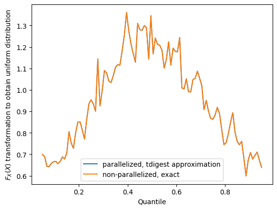
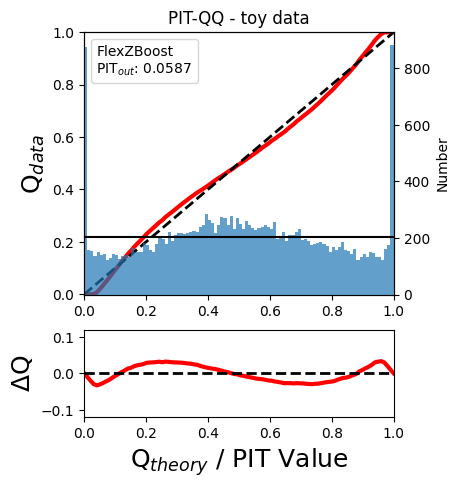
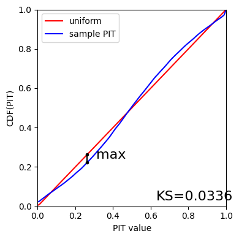

Demo: RAIL Evaluation
=====================

**Authors:** Drew Oldag, Eric Charles, Sam Schmidt, Alex Malz, Julia
Gschwend, others…

**Last run successfully:** April 10, 2024

The purpose of this notebook is to demonstrate the application of the
metrics scripts to be used on the photo-z PDF catalogs produced by the
PZ working group. The first implementation of the *evaluation* module is
based on the refactoring of the code used in `Schmidt et
al. 2020 <https://arxiv.org/pdf/2001.03621.pdf>`__, available on Github
repository `PZDC1paper <https://github.com/LSSTDESC/PZDC1paper>`__.

To run this notebook, you must install qp and have the notebook in the
same directory as ``utils.py`` (available in RAIL’s examples
directrory). You must also have installed all RAIL dependencies,
particularly for the estimation codes that you want to run, as well as
ceci, qp, tables_io, etc… See the RAIL installation instructions for
more info.

.. code:: ipython3

    import tables_io
    import qp
    import numpy as np
    
    from rail.evaluation.dist_to_dist_evaluator import DistToDistEvaluator
    from rail.evaluation.dist_to_point_evaluator import DistToPointEvaluator
    from rail.evaluation.point_to_point_evaluator import PointToPointEvaluator
    from rail.evaluation.single_evaluator import SingleEvaluator
    from rail.core.stage import RailStage
    from rail.core.data import QPHandle, TableHandle, Hdf5Handle, QPOrTableHandle
    
    DS = RailStage.data_store
    DS.__class__.allow_overwrite = True

Load example Data
=================

This will load (and download if needed) two files:

1. output_fzboost.hdf5: a ``qp`` ensemble with the output of running the
   FZBoost alogrithm to estimate redshifts
2. test_dc2_validation_9816.hdf5: a ``hdf5`` file with a table with the
   photometric data used to generate the first file

.. code:: ipython3

    import os
    from rail.utils.path_utils import find_rail_file
    possible_local_file = './examples_data/evaluation_data/data/output_fzboost.hdf5'
    if os.path.exists(possible_local_file):
        pdfs_file = os.path.abspath(possible_local_file)
    else:
        pdfs_file = 'examples_data/evaluation_data/data/output_fzboost.hdf5'
        try:
            os.makedirs(os.path.dirname(pdfs_file))
        except FileExistsError:
            pass
        curl_com = f"curl -o {pdfs_file} https://portal.nersc.gov/cfs/lsst/PZ/output_fzboost.hdf5"
        os.system(curl_com)
    
    ztrue_file = find_rail_file('examples_data/testdata/test_dc2_validation_9816.hdf5')

.. code:: ipython3

    ensemble = DS.read_file(key='pdfs_data', handle_class=QPHandle, path=pdfs_file)
    ztrue_data = DS.read_file('ztrue_data', TableHandle, ztrue_file)
    #truth = DS.add_data('truth', ztrue_data()['photometry'], TableHandle, path=ztrue_file)
    #truth_points = DS.add_data('truth_points', ztrue_data()['photometry']['redshift'], TableHandle, path=ztrue_file)

Dist to Dist Evaluation
=======================

The DistToDistEvaluator is for evaluating metrics that compare
distributions to distributions.

To test it we are going to compare a generated p(z) distribution to
itself.

Note that there are two modes in which this can be run. The default mode
is to allow evaluation of the metric in parallel across many nodes. This
is much faster, can avoid potential issues with overflowing the memory
for huge input data sets, however, when computing quantiles or medians
the computation will not be exact (however, with the default parameters
it will be very close in almost all cases). However, if the force_exact
configuration variable is set, it will only run on a single node,
allowing for an exact calculation, but with the drawback of being slower
and more memory intensive.

Here we implement both types, and compare the results.

We will run 5 different estimates, follow the links to get more
information about each: 1. cvm: `Cramer-von
Mises <https://en.wikipedia.org/wiki/Cram%C3%A9r%E2%80%93von_Mises_criterion>`__
2. ks:
`Kolmogorov-Smirnov <https://en.wikipedia.org/wiki/Kolmogorov%E2%80%93Smirnov_test>`__
3. rmse: `Root-mean-square
error <https://en.wikipedia.org/wiki/Root_mean_square>`__ 4. kld:
`Kullback-Leibler
Divergence <https://en.wikipedia.org/wiki/Kullback%E2%80%93Leibler_divergence>`__
5. ad:
`Anderson-Darling <https://en.wikipedia.org/wiki/Anderson%E2%80%93Darling_test>`__

.. code:: ipython3

    stage_dict = dict(
        metrics=['cvm', 'ks', 'rmse', 'kld', 'ad'],
        _random_state=None,
    )
    
    dtd_stage = DistToDistEvaluator.make_stage(name='dist_to_dist', **stage_dict)
    dtd_stage_single = DistToDistEvaluator.make_stage(name='dist_to_dist', force_exact=True, **stage_dict)

.. code:: ipython3

    # Parallelized implementation
    dtd_results = dtd_stage.evaluate(ensemble, ensemble)

.. parsed-literal::

    Inserting handle into data store.  input: None, dist_to_dist
    Inserting handle into data store.  truth: None, dist_to_dist
    Requested metrics: ['cvm', 'ks', 'rmse', 'kld', 'ad']
    Processing 0 running evaluator on chunk 0 - 10000.

.. parsed-literal::

    Inserting handle into data store.  output_dist_to_dist: inprogress_output_dist_to_dist.hdf5, dist_to_dist
    Processing 0 running evaluator on chunk 10000 - 20000.

.. parsed-literal::

    Processing 0 running evaluator on chunk 20000 - 20449.

.. parsed-literal::

    Inserting handle into data store.  summary_dist_to_dist: inprogress_summary_dist_to_dist.hdf5, dist_to_dist
    Inserting handle into data store.  single_distribution_summary_dist_to_dist: inprogress_single_distribution_summary_dist_to_dist.hdf5, dist_to_dist

.. parsed-literal::

    NOTE/WARNING: Expected output file single_distribution_summary_dist_to_dist.hdf5 was not generated.

.. code:: ipython3

    # Non-parallelized, exact implementation
    dtd_results_single = dtd_stage_single.evaluate(ensemble, ensemble)

.. parsed-literal::

    Requested metrics: ['cvm', 'ks', 'rmse', 'kld', 'ad']

.. parsed-literal::

    Inserting handle into data store.  output_dist_to_dist: inprogress_output_dist_to_dist.hdf5, dist_to_dist
    Inserting handle into data store.  summary_dist_to_dist: inprogress_summary_dist_to_dist.hdf5, dist_to_dist
    Inserting handle into data store.  single_distribution_summary_dist_to_dist: inprogress_single_distribution_summary_dist_to_dist.hdf5, dist_to_dist

.. parsed-literal::

    NOTE/WARNING: Expected output file single_distribution_summary_dist_to_dist.hdf5 was not generated.

.. code:: ipython3

    # Note that stage produces a few different outputs:
    print(dtd_results.keys())

.. parsed-literal::

    dict_keys(['output', 'summary', 'single_distribution_summary'])

Here we compare the output data tables. ``dtd_results['output']``
returns a DataHandle object, which we can ask for the data themselves,
i.e., ``dtd_results['output']()``

We use the ``tables_io.convertObj`` function to convert the output
tables to pandas DataFrame objects for better display

.. code:: ipython3

    results_df = tables_io.convertObj(dtd_results['output'](), tables_io.types.PD_DATAFRAME)
    results_df_single = tables_io.convertObj(dtd_results_single['output'](), tables_io.types.PD_DATAFRAME)

.. code:: ipython3

    # Render the table for the parallel processing version
    results_df

.. raw:: html

    

    
    <table border="1" class="dataframe">
      <thead>
        <tr style="text-align: right;">
          <th></th>
          <th>ad</th>
          <th>cvm</th>
          <th>kld</th>
          <th>ks</th>
          <th>rmse</th>
        </tr>
      </thead>
      <tbody>
        <tr>
          <th>0</th>
          <td>0.966994</td>
          <td>0.057731</td>
          <td>0.0</td>
          <td>0.093227</td>
          <td>0.0</td>
        </tr>
        <tr>
          <th>1</th>
          <td>1.025587</td>
          <td>0.211492</td>
          <td>0.0</td>
          <td>0.086585</td>
          <td>0.0</td>
        </tr>
        <tr>
          <th>2</th>
          <td>1.233816</td>
          <td>0.096406</td>
          <td>0.0</td>
          <td>0.155065</td>
          <td>0.0</td>
        </tr>
        <tr>
          <th>3</th>
          <td>0.895859</td>
          <td>0.354180</td>
          <td>0.0</td>
          <td>0.079772</td>
          <td>0.0</td>
        </tr>
        <tr>
          <th>4</th>
          <td>0.588364</td>
          <td>0.033077</td>
          <td>0.0</td>
          <td>0.163602</td>
          <td>0.0</td>
        </tr>
        <tr>
          <th>...</th>
          <td>...</td>
          <td>...</td>
          <td>...</td>
          <td>...</td>
          <td>...</td>
        </tr>
        <tr>
          <th>20444</th>
          <td>0.992103</td>
          <td>0.256873</td>
          <td>0.0</td>
          <td>0.065768</td>
          <td>0.0</td>
        </tr>
        <tr>
          <th>20445</th>
          <td>0.804500</td>
          <td>0.046136</td>
          <td>0.0</td>
          <td>0.055045</td>
          <td>0.0</td>
        </tr>
        <tr>
          <th>20446</th>
          <td>0.835343</td>
          <td>0.068135</td>
          <td>0.0</td>
          <td>0.059314</td>
          <td>0.0</td>
        </tr>
        <tr>
          <th>20447</th>
          <td>0.466316</td>
          <td>0.274077</td>
          <td>0.0</td>
          <td>0.077149</td>
          <td>0.0</td>
        </tr>
        <tr>
          <th>20448</th>
          <td>0.242718</td>
          <td>0.092822</td>
          <td>0.0</td>
          <td>0.049685</td>
          <td>0.0</td>
        </tr>
      </tbody>
    </table>
    
20449 rows × 5 columns

    

.. code:: ipython3

    # Render the table for the exact processing version
    results_df_single

.. raw:: html

    

    
    <table border="1" class="dataframe">
      <thead>
        <tr style="text-align: right;">
          <th></th>
          <th>cvm</th>
          <th>ks</th>
          <th>rmse</th>
          <th>kld</th>
          <th>ad</th>
        </tr>
      </thead>
      <tbody>
        <tr>
          <th>0</th>
          <td>0.057731</td>
          <td>0.093227</td>
          <td>0.0</td>
          <td>0.0</td>
          <td>0.966994</td>
        </tr>
        <tr>
          <th>1</th>
          <td>0.211492</td>
          <td>0.086585</td>
          <td>0.0</td>
          <td>0.0</td>
          <td>1.025587</td>
        </tr>
        <tr>
          <th>2</th>
          <td>0.096406</td>
          <td>0.155065</td>
          <td>0.0</td>
          <td>0.0</td>
          <td>1.233816</td>
        </tr>
        <tr>
          <th>3</th>
          <td>0.354180</td>
          <td>0.079772</td>
          <td>0.0</td>
          <td>0.0</td>
          <td>0.895859</td>
        </tr>
        <tr>
          <th>4</th>
          <td>0.033077</td>
          <td>0.163602</td>
          <td>0.0</td>
          <td>0.0</td>
          <td>0.588364</td>
        </tr>
        <tr>
          <th>...</th>
          <td>...</td>
          <td>...</td>
          <td>...</td>
          <td>...</td>
          <td>...</td>
        </tr>
        <tr>
          <th>20444</th>
          <td>0.256873</td>
          <td>0.065768</td>
          <td>0.0</td>
          <td>0.0</td>
          <td>0.992103</td>
        </tr>
        <tr>
          <th>20445</th>
          <td>0.046136</td>
          <td>0.055045</td>
          <td>0.0</td>
          <td>0.0</td>
          <td>0.804500</td>
        </tr>
        <tr>
          <th>20446</th>
          <td>0.068135</td>
          <td>0.059314</td>
          <td>0.0</td>
          <td>0.0</td>
          <td>0.835343</td>
        </tr>
        <tr>
          <th>20447</th>
          <td>0.274077</td>
          <td>0.077149</td>
          <td>0.0</td>
          <td>0.0</td>
          <td>0.466316</td>
        </tr>
        <tr>
          <th>20448</th>
          <td>0.092822</td>
          <td>0.049685</td>
          <td>0.0</td>
          <td>0.0</td>
          <td>0.242718</td>
        </tr>
      </tbody>
    </table>
    
20449 rows × 5 columns

    

Dist to Point Evaluation
========================

The DistToPointEvaluator is for evaluating metrics that compare
distributions (for the p(z)) estimate to point values (for the reference
or truth).

To test it we are going to compare a generated p(z) distribution to true
redshifts.

Note that as for the DistToDistEvaluator this can be run in parallel or
forced to run on a single node for exact results.

We will run 3 different estimates, follow the links to get more
information about each: 1. cdeloss: `Conditional Density
Estimation <https://vitaliset.github.io/conditional-density-estimation/>`__
2. pit: `Probability Integral
Transform <https://en.wikipedia.org/wiki/Probability_integral_transform>`__
3. brier: `Brier Score <https://en.wikipedia.org/wiki/Brier_score>`__

.. code:: ipython3

    stage_dict = dict(
        metrics=['cdeloss', 'pit', 'brier'],
        _random_state=None,
        metric_config={
            'brier': {'limits':(0,3.1)},
            'pit':{'tdigest_compression': 1000},
        }
    )
    dtp_stage = DistToPointEvaluator.make_stage(name='dist_to_point', **stage_dict)
    dtp_stage_single = DistToPointEvaluator.make_stage(name='dist_to_point', force_exact=True, **stage_dict)

.. code:: ipython3

    dtp_results = dtp_stage.evaluate(ensemble, ztrue_data)
    # The summary results are in a table, which we can convert to a pandas.DataFrame, note that here
    # we can a single number for the entire ensemble, rather that one number per PDF
    results_df = tables_io.convertObj(dtp_results['summary'](), tables_io.types.PD_DATAFRAME)
    results_df

.. parsed-literal::

    Requested metrics: ['cdeloss', 'pit', 'brier']
    Processing 0 running evaluator on chunk 0 - 10000.

.. parsed-literal::

    WARNING:root:Input predictions do not sum to 1.

.. parsed-literal::

    Inserting handle into data store.  output_dist_to_point: inprogress_output_dist_to_point.hdf5, dist_to_point
    Processing 0 running evaluator on chunk 10000 - 20000.

.. parsed-literal::

    WARNING:root:Input predictions do not sum to 1.

.. parsed-literal::

    WARNING:root:Input predictions do not sum to 1.

.. parsed-literal::

    Processing 0 running evaluator on chunk 20000 - 20449.
    Inserting handle into data store.  summary_dist_to_point: inprogress_summary_dist_to_point.hdf5, dist_to_point
    Inserting handle into data store.  single_distribution_summary_dist_to_point: inprogress_single_distribution_summary_dist_to_point.hdf5, dist_to_point

.. raw:: html

    

    
    <table border="1" class="dataframe">
      <thead>
        <tr style="text-align: right;">
          <th></th>
          <th>cdeloss</th>
          <th>brier</th>
        </tr>
      </thead>
      <tbody>
        <tr>
          <th>0</th>
          <td>-6.751813</td>
          <td>732.133867</td>
        </tr>
      </tbody>
    </table>
    

.. code:: ipython3

    dtp_results_single = dtp_stage_single.evaluate(ensemble, ztrue_data)
    results_df_single = tables_io.convertObj(dtp_results_single['summary'](), tables_io.types.PD_DATAFRAME)
    
    results_df_single

.. parsed-literal::

    Requested metrics: ['cdeloss', 'pit', 'brier']

.. parsed-literal::

    WARNING:root:Input predictions do not sum to 1.

.. parsed-literal::

    Inserting handle into data store.  output_dist_to_point: inprogress_output_dist_to_point.hdf5, dist_to_point
    Inserting handle into data store.  summary_dist_to_point: inprogress_summary_dist_to_point.hdf5, dist_to_point
    Inserting handle into data store.  single_distribution_summary_dist_to_point: inprogress_single_distribution_summary_dist_to_point.hdf5, dist_to_point

.. raw:: html

    

    
    <table border="1" class="dataframe">
      <thead>
        <tr style="text-align: right;">
          <th></th>
          <th>cdeloss</th>
          <th>brier</th>
        </tr>
      </thead>
      <tbody>
        <tr>
          <th>0</th>
          <td>-6.751813</td>
          <td>732.133867</td>
        </tr>
      </tbody>
    </table>
    

.. code:: ipython3

    # Another type of output is a distritubion, for example the PIT or probability integral transform
    dtp_pit = dtp_stage.get_handle('single_distribution_summary').read()['pit']
    dtp_pit_single = dtp_stage_single.get_handle('single_distribution_summary').read()['pit']

.. code:: ipython3

    import matplotlib.pyplot as plt
    
    xgrid = np.linspace(0.05,0.95,100)
    a_pdf = dtp_pit.pdf(xgrid)
    b_pdf = dtp_pit_single.pdf(xgrid)
    
    plt.figure()
    plt.plot(xgrid, np.squeeze(a_pdf), label='parallelized, tdigest approximation')
    plt.plot(xgrid, np.squeeze(b_pdf), label='non-parallelized, exact')
    plt.xlabel("Quantile")
    plt.ylabel(r"$F_X(X)$ transformation to obtain uniform distribution")
    plt.legend()
    plt.show()

Point to Point Evaluation
=========================

The {pomtToPointEvaluator is for evaluating metrics that compare point
estimates (for the p(z)) to point values (for the reference or truth).

To test it we are going to compare the mode of p(z) distribution to true
redshifts.

Note that as for the DistToDistEvaluator this can be run in parallel or
forced to run on a single node for exact results.

We will run 5 different estimates, follow the links to get more
information about each: 1. point_stats_ez:
``(estimate - reference) / (1.0 + reference)`` 2. point_stats_iqr:
‘Interquatile range from 0.25 to 0.75’, i.e., the middle 50% of the
distribution of point_stats_ez 3. point_bias: Median of point_stats_ez
4. point_outlier_rate: Fraction of distribution outside of 3 sigma 5.
point_stats_sigma_mad: Sigma of the median absolute deviation

.. code:: ipython3

    stage_dict = dict(
        metrics=['point_stats_ez', 'point_stats_iqr', 'point_bias', 'point_outlier_rate', 'point_stats_sigma_mad'],
        _random_state=None,
        hdf5_groupname='photometry',
        point_estimate_key='zmode',
        chunk_size=10000,
        metric_config={
            'point_stats_iqr':{'tdigest_compression': 100},
        }
    )
    ptp_stage = PointToPointEvaluator.make_stage(name='point_to_point', **stage_dict)
    ptp_stage_single = PointToPointEvaluator.make_stage(name='point_to_point', force_exact=True, **stage_dict)

.. code:: ipython3

    ptp_results = ptp_stage.evaluate(ensemble, ztrue_data)
    results_summary = tables_io.convertObj(ptp_stage.get_handle('summary')(), tables_io.types.PD_DATAFRAME)
    results_summary

.. parsed-literal::

    Requested metrics: ['point_stats_ez', 'point_stats_iqr', 'point_bias', 'point_outlier_rate', 'point_stats_sigma_mad']
    Processing 0 running evaluator on chunk 0 - 10000.
    Inserting handle into data store.  output_point_to_point: inprogress_output_point_to_point.hdf5, point_to_point
    Processing 0 running evaluator on chunk 10000 - 20000.
    Processing 0 running evaluator on chunk 20000 - 20449.

.. parsed-literal::

    Inserting handle into data store.  summary_point_to_point: inprogress_summary_point_to_point.hdf5, point_to_point
    Inserting handle into data store.  single_distribution_summary_point_to_point: inprogress_single_distribution_summary_point_to_point.hdf5, point_to_point

.. parsed-literal::

    NOTE/WARNING: Expected output file single_distribution_summary_point_to_point.hdf5 was not generated.

.. raw:: html

    

    
    <table border="1" class="dataframe">
      <thead>
        <tr style="text-align: right;">
          <th></th>
          <th>point_stats_iqr</th>
          <th>point_bias</th>
          <th>point_outlier_rate</th>
          <th>point_stats_sigma_mad</th>
        </tr>
      </thead>
      <tbody>
        <tr>
          <th>0</th>
          <td>0.021287</td>
          <td>0.000208</td>
          <td>0.107829</td>
          <td>0.020918</td>
        </tr>
      </tbody>
    </table>
    

.. code:: ipython3

    ptp_results_single = ptp_stage_single.evaluate(ensemble, ztrue_data)
    results_summary_single = tables_io.convertObj(ptp_stage_single.get_handle('summary')(), tables_io.types.PD_DATAFRAME)
    results_summary_single

.. parsed-literal::

    Requested metrics: ['point_stats_ez', 'point_stats_iqr', 'point_bias', 'point_outlier_rate', 'point_stats_sigma_mad']
    Inserting handle into data store.  output_point_to_point: inprogress_output_point_to_point.hdf5, point_to_point
    Inserting handle into data store.  summary_point_to_point: inprogress_summary_point_to_point.hdf5, point_to_point
    Inserting handle into data store.  single_distribution_summary_point_to_point: inprogress_single_distribution_summary_point_to_point.hdf5, point_to_point

.. parsed-literal::

    NOTE/WARNING: Expected output file single_distribution_summary_point_to_point.hdf5 was not generated.

.. raw:: html

    

    
    <table border="1" class="dataframe">
      <thead>
        <tr style="text-align: right;">
          <th></th>
          <th>point_stats_iqr</th>
          <th>point_bias</th>
          <th>point_outlier_rate</th>
          <th>point_stats_sigma_mad</th>
        </tr>
      </thead>
      <tbody>
        <tr>
          <th>0</th>
          <td>0.020847</td>
          <td>0.000266</td>
          <td>0.107096</td>
          <td>0.020865</td>
        </tr>
      </tbody>
    </table>
    

Above we see the effect of the approximation used when running in
parallel. Here we are to do the computation in qp to confirm the exact
value is correct.

.. code:: ipython3

    truth = ztrue_data()['photometry']['redshift']
    estimates = np.squeeze(ensemble().ancil['zmode'])
    #truth_points = DS.add_data('truth_points', ztrue_data()['photometry']['redshift'], TableHandle, path=ztrue_file)

.. code:: ipython3

    check_iqr = qp.metrics.point_estimate_metric_classes.PointSigmaIQR().evaluate(estimates, truth)

.. code:: ipython3

    check_iqr

.. parsed-literal::

    np.float64(0.02084700447796729)

Setting up a RailPipeline with an evaluation stage
~~~~~~~~~~~~~~~~~~~~~~~~~~~~~~~~~~~~~~~~~~~~~~~~~~

.. code:: ipython3

    inputs = {
        'pdfs_data':'examples_data/evaluation_data/data/output_fzboost.hdf5',
        'ztrue_data':'examples_data/test_dc2_validation_9816.hdf5',
    }
    outputs = {
        'output':'output.hdf5',
        'summary':'summary.hdf5',
    }

.. code:: ipython3

    from rail.core import RailPipeline

.. code:: ipython3

    pipe = RailPipeline()

.. code:: ipython3

    pipe.add_stage(ptp_stage)

.. parsed-literal::

    {'output_point_to_point': './output_point_to_point.hdf5',
     'summary_point_to_point': './summary_point_to_point.hdf5',
     'single_distribution_summary_point_to_point': './single_distribution_summary_point_to_point.hdf5'}

.. code:: ipython3

    pipe.initialize(overall_inputs=inputs, run_config={'output_dir':'.', 'log_dir':'.', 'resume':False}, stages_config=None)

.. parsed-literal::

    (({'point_to_point': <Job point_to_point>},
      [<rail.evaluation.point_to_point_evaluator.PointToPointEvaluator at 0x7fa33c38b550>]),
     {'output_dir': '.', 'log_dir': '.', 'resume': False})

.. code:: ipython3

    pipe.save('eval_pipe.yaml')

Single Evaluator
----------------

The SingletEvaluator is will computate all of the metrics that it can
for the inputs that it is given.

It will check to see if the estimate and reference inputs are point
estimates or distributions, (or potentially both, e.g., if the use asks
to use the mode or median of the distribution as a point estimate.)

To test it we are going to compare a generated p(z) distribution to true
redshifts.

Note that as for the DistToDistEvaluator this can be run in parallel or
forced to run on a single node for exact results.

.. code:: ipython3

    stage_dict = dict(
        metrics=['cvm', 'ks', 'omega', 'kld', 'cdeloss', 'point_stats_ez', 'point_stats_iqr'],
        _random_state=None,
        hdf5_groupname='photometry',
        point_estimates=['zmode'],
        truth_point_estimates=['redshift'],
        chunk_size=1000,
    )
    ensemble_d = DS.read_file('pdfs_data_2', QPOrTableHandle, path=pdfs_file)
    ztrue_data_d = DS.read_file('ztrue_data_2', QPOrTableHandle, path=ztrue_file)
    
    single_stage = SingleEvaluator.make_stage(name='single', **stage_dict)
    single_stage_single = SingleEvaluator.make_stage(name='single', force_exact=True, **stage_dict)

.. parsed-literal::

    This is not a qp file because 'meta'

.. code:: ipython3

    single_results = single_stage.evaluate(ensemble_d, ztrue_data_d)

.. parsed-literal::

    This is not a qp file because 'meta'
    Unsupported metric requested: 'omega'.  Available metrics are: ['ad', 'brier', 'cdeloss', 'cvm', 'kld', 'ks', 'moment', 'outlier', 'pit', 'point_bias', 'point_outlier_rate', 'point_stats_ez', 'point_stats_iqr', 'point_stats_sigma_mad', 'rbpe', 'rmse']
    Requested metrics: ['cvm', 'ks', 'kld', 'cdeloss', 'point_stats_ez', 'point_stats_iqr']
    This is not a qp file because 'meta'
    This is not a qp file because 'meta'
    This is not a qp file because 'meta'
    Processing 0 running evaluator on chunk 0 - 1000.
    skipping cvm PdfOrValue.both MetricInputType.dist_to_dist
    skipping ks PdfOrValue.both MetricInputType.dist_to_dist
    skipping kld PdfOrValue.both MetricInputType.dist_to_dist
    Inserting handle into data store.  output_single: inprogress_output_single.hdf5, single
    Processing 0 running evaluator on chunk 1000 - 2000.
    skipping cvm PdfOrValue.both MetricInputType.dist_to_dist
    skipping ks PdfOrValue.both MetricInputType.dist_to_dist
    skipping kld PdfOrValue.both MetricInputType.dist_to_dist
    Processing 0 running evaluator on chunk 2000 - 3000.
    skipping cvm PdfOrValue.both MetricInputType.dist_to_dist
    skipping ks PdfOrValue.both MetricInputType.dist_to_dist
    skipping kld PdfOrValue.both MetricInputType.dist_to_dist
    Processing 0 running evaluator on chunk 3000 - 4000.
    skipping cvm PdfOrValue.both MetricInputType.dist_to_dist
    skipping ks PdfOrValue.both MetricInputType.dist_to_dist
    skipping kld PdfOrValue.both MetricInputType.dist_to_dist
    Processing 0 running evaluator on chunk 4000 - 5000.
    skipping cvm PdfOrValue.both MetricInputType.dist_to_dist
    skipping ks PdfOrValue.both MetricInputType.dist_to_dist
    skipping kld PdfOrValue.both MetricInputType.dist_to_dist
    Processing 0 running evaluator on chunk 5000 - 6000.
    skipping cvm PdfOrValue.both MetricInputType.dist_to_dist
    skipping ks PdfOrValue.both MetricInputType.dist_to_dist
    skipping kld PdfOrValue.both MetricInputType.dist_to_dist
    Processing 0 running evaluator on chunk 6000 - 7000.
    skipping cvm PdfOrValue.both MetricInputType.dist_to_dist
    skipping ks PdfOrValue.both MetricInputType.dist_to_dist
    skipping kld PdfOrValue.both MetricInputType.dist_to_dist
    Processing 0 running evaluator on chunk 7000 - 8000.
    skipping cvm PdfOrValue.both MetricInputType.dist_to_dist
    skipping ks PdfOrValue.both MetricInputType.dist_to_dist
    skipping kld PdfOrValue.both MetricInputType.dist_to_dist
    Processing 0 running evaluator on chunk 8000 - 9000.
    skipping cvm PdfOrValue.both MetricInputType.dist_to_dist
    skipping ks PdfOrValue.both MetricInputType.dist_to_dist
    skipping kld PdfOrValue.both MetricInputType.dist_to_dist
    Processing 0 running evaluator on chunk 9000 - 10000.
    skipping cvm PdfOrValue.both MetricInputType.dist_to_dist
    skipping ks PdfOrValue.both MetricInputType.dist_to_dist
    skipping kld PdfOrValue.both MetricInputType.dist_to_dist

.. parsed-literal::

    Processing 0 running evaluator on chunk 10000 - 11000.
    skipping cvm PdfOrValue.both MetricInputType.dist_to_dist
    skipping ks PdfOrValue.both MetricInputType.dist_to_dist
    skipping kld PdfOrValue.both MetricInputType.dist_to_dist
    Processing 0 running evaluator on chunk 11000 - 12000.
    skipping cvm PdfOrValue.both MetricInputType.dist_to_dist
    skipping ks PdfOrValue.both MetricInputType.dist_to_dist
    skipping kld PdfOrValue.both MetricInputType.dist_to_dist
    Processing 0 running evaluator on chunk 12000 - 13000.
    skipping cvm PdfOrValue.both MetricInputType.dist_to_dist
    skipping ks PdfOrValue.both MetricInputType.dist_to_dist
    skipping kld PdfOrValue.both MetricInputType.dist_to_dist
    Processing 0 running evaluator on chunk 13000 - 14000.
    skipping cvm PdfOrValue.both MetricInputType.dist_to_dist
    skipping ks PdfOrValue.both MetricInputType.dist_to_dist
    skipping kld PdfOrValue.both MetricInputType.dist_to_dist
    Processing 0 running evaluator on chunk 14000 - 15000.
    skipping cvm PdfOrValue.both MetricInputType.dist_to_dist
    skipping ks PdfOrValue.both MetricInputType.dist_to_dist
    skipping kld PdfOrValue.both MetricInputType.dist_to_dist
    Processing 0 running evaluator on chunk 15000 - 16000.
    skipping cvm PdfOrValue.both MetricInputType.dist_to_dist
    skipping ks PdfOrValue.both MetricInputType.dist_to_dist
    skipping kld PdfOrValue.both MetricInputType.dist_to_dist
    Processing 0 running evaluator on chunk 16000 - 17000.
    skipping cvm PdfOrValue.both MetricInputType.dist_to_dist
    skipping ks PdfOrValue.both MetricInputType.dist_to_dist
    skipping kld PdfOrValue.both MetricInputType.dist_to_dist
    Processing 0 running evaluator on chunk 17000 - 18000.
    skipping cvm PdfOrValue.both MetricInputType.dist_to_dist
    skipping ks PdfOrValue.both MetricInputType.dist_to_dist
    skipping kld PdfOrValue.both MetricInputType.dist_to_dist
    Processing 0 running evaluator on chunk 18000 - 19000.
    skipping cvm PdfOrValue.both MetricInputType.dist_to_dist
    skipping ks PdfOrValue.both MetricInputType.dist_to_dist
    skipping kld PdfOrValue.both MetricInputType.dist_to_dist
    Processing 0 running evaluator on chunk 19000 - 20000.
    skipping cvm PdfOrValue.both MetricInputType.dist_to_dist
    skipping ks PdfOrValue.both MetricInputType.dist_to_dist
    skipping kld PdfOrValue.both MetricInputType.dist_to_dist
    Processing 0 running evaluator on chunk 20000 - 20449.
    skipping cvm PdfOrValue.both MetricInputType.dist_to_dist
    skipping ks PdfOrValue.both MetricInputType.dist_to_dist
    skipping kld PdfOrValue.both MetricInputType.dist_to_dist
    Inserting handle into data store.  summary_single: inprogress_summary_single.hdf5, single
    Inserting handle into data store.  single_distribution_summary_single: inprogress_single_distribution_summary_single.hdf5, single

.. parsed-literal::

    NOTE/WARNING: Expected output file single_distribution_summary_single.hdf5 was not generated.

.. code:: ipython3

    single_results_single = single_stage_single.evaluate(ensemble_d, ztrue_data_d)

.. parsed-literal::

    This is not a qp file because 'meta'
    Unsupported metric requested: 'omega'.  Available metrics are: ['ad', 'brier', 'cdeloss', 'cvm', 'kld', 'ks', 'moment', 'outlier', 'pit', 'point_bias', 'point_outlier_rate', 'point_stats_ez', 'point_stats_iqr', 'point_stats_sigma_mad', 'rbpe', 'rmse']
    Requested metrics: ['cvm', 'ks', 'kld', 'cdeloss', 'point_stats_ez', 'point_stats_iqr']

.. parsed-literal::

    Inserting handle into data store.  output_single: inprogress_output_single.hdf5, single
    Inserting handle into data store.  summary_single: inprogress_summary_single.hdf5, single
    Inserting handle into data store.  single_distribution_summary_single: inprogress_single_distribution_summary_single.hdf5, single

.. parsed-literal::

    NOTE/WARNING: Expected output file single_distribution_summary_single.hdf5 was not generated.

.. code:: ipython3

    single_stage.get_handle('output')()

.. parsed-literal::

    {'point_stats_ez_zmode_redshift': array([[-0.02252694, -0.0214079 , -0.04232273, ..., -0.75130654,
             -0.74880937, -0.74742172],
            [-0.02252694, -0.0214079 , -0.04232273, ..., -0.75130654,
             -0.74880937, -0.74742172],
            [-0.02252694, -0.0214079 , -0.04232273, ..., -0.75130654,
             -0.74880937, -0.74742172],
            ...,
            [ 2.90989226,  2.91436839,  2.83070909, ..., -0.00522614,
              0.00476253,  0.0103131 ],
            [ 2.67529872,  2.67950628,  2.60086655, ..., -0.06491258,
             -0.05552322, -0.05030568],
            [ 2.90989226,  2.91436839,  2.83070909, ..., -0.00522614,
              0.00476253,  0.0103131 ]], shape=(20449, 20449))}

.. code:: ipython3

    single_stage.get_handle('summary')()

.. parsed-literal::

    {'cdeloss_redshift': array([-6.75181317]),
     'point_stats_iqr_zmode_redshift': array([0.33537443])}

.. code:: ipython3

    single_stage_single.get_handle('output')()

.. parsed-literal::

    {'point_stats_ez_zmode_redshift': array([[-0.02252694, -0.0214079 , -0.04232273, ..., -0.75130654,
             -0.74880937, -0.74742172],
            [-0.02252694, -0.0214079 , -0.04232273, ..., -0.75130654,
             -0.74880937, -0.74742172],
            [-0.02252694, -0.0214079 , -0.04232273, ..., -0.75130654,
             -0.74880937, -0.74742172],
            ...,
            [ 2.90989226,  2.91436839,  2.83070909, ..., -0.00522614,
              0.00476253,  0.0103131 ],
            [ 2.67529872,  2.67950628,  2.60086655, ..., -0.06491258,
             -0.05552322, -0.05030568],
            [ 2.90989226,  2.91436839,  2.83070909, ..., -0.00522614,
              0.00476253,  0.0103131 ]], shape=(20449, 20449))}

.. code:: ipython3

    single_stage_single.get_handle('summary')()

.. parsed-literal::

    {'cdeloss_redshift': array([-6.75181317]),
     'point_stats_iqr_zmode_redshift': array([0.33537443])}

CDF-based Metrics
=================

PIT
~~~

The Probability Integral Transform (PIT), is the Cumulative Distribution
Function (CDF) of the photo-z PDF

.. math::  \mathrm{CDF}(f, q)\ =\ \int_{-\infty}^{q}\ f(z)\ dz 

evaluated at the galaxy’s true redshift for every galaxy :math:`i` in
the catalog.

.. math::  \mathrm{PIT}(p_{i}(z);\ z_{i})\ =\ \int_{-\infty}^{z^{true}_{i}}\ p_{i}(z)\ dz 

.. code:: ipython3

    fzdata = DS.read_file('pdfs_data', QPHandle, pdfs_file)
    ztrue_data = DS.read_file('ztrue_data', TableHandle, ztrue_file)
    ztrue = ztrue_data()['photometry']['redshift']
    zgrid = fzdata().metadata['xvals'].ravel()
    photoz_mode = fzdata().mode(grid=zgrid)

.. code:: ipython3

    from qp.metrics.pit import PIT
    pitobj = PIT(fzdata(), ztrue)
    quant_ens = pitobj.pit
    metamets = pitobj.calculate_pit_meta_metrics()

.. parsed-literal::

    /opt/hostedtoolcache/Python/3.10.18/x64/lib/python3.10/site-packages/qp/metrics/array_metrics.py:27: UserWarning: p-value floored: true value smaller than 0.001. Consider specifying `method` (e.g. `method=stats.PermutationMethod()`.)
      return stats.anderson_ksamp([p_random_variables, q_random_variables], **kwargs)

The evaluate method PIT class returns two objects, a quantile
distribution based on the full set of PIT values (a frozen distribution
object), and a dictionary of meta metrics associated to PIT (to be
detailed below).

.. code:: ipython3

    quant_ens

.. parsed-literal::

    Ensemble(the_class=quant,shape=(1, 96))

.. code:: ipython3

    metamets

.. parsed-literal::

    {'ad': Anderson_ksampResult(statistic=np.float64(84.95623553609381), critical_values=array([0.325, 1.226, 1.961, 2.718, 3.752, 4.592, 6.546]), pvalue=np.float64(0.001)),
     'cvm': CramerVonMisesResult(statistic=9.62335199605935, pvalue=9.265039846440004e-10),
     'ks': KstestResult(statistic=np.float64(0.033590049370962216), pvalue=np.float64(1.7621068075751534e-20), statistic_location=np.float64(0.9921210288809627), statistic_sign=np.int8(-1)),
     'outlier_rate': np.float64(0.05873797877466336)}

.. code:: ipython3

    pit_vals = np.array(pitobj.pit_samps)
    pit_vals

.. parsed-literal::

    array([0.19392947, 0.36675619, 0.52017547, ..., 1.        , 0.93189232,
           0.4674437 ], shape=(20449,))

.. code:: ipython3

    pit_out_rate = metamets['outlier_rate']
    print(f"PIT outlier rate of this sample: {pit_out_rate:.6f}") 
    pit_out_rate = pitobj.evaluate_PIT_outlier_rate()
    print(f"PIT outlier rate of this sample: {pit_out_rate:.6f}") 

.. parsed-literal::

    PIT outlier rate of this sample: 0.058738
    PIT outlier rate of this sample: 0.058738

PIT-QQ plot
~~~~~~~~~~~

The histogram of PIT values is a useful tool for a qualitative
assessment of PDFs quality. It shows whether the PDFs are: \* biased
(tilted PIT histogram) \* under-dispersed (excess counts close to the
boudaries 0 and 1) \* over-dispersed (lack of counts close the boudaries
0 and 1) \* well-calibrated (flat histogram)

Following the standards in DC1 paper, the PIT histogram is accompanied
by the quantile-quantile (QQ), which can be used to compare
qualitatively the PIT distribution obtained with the PDFs agaist the
ideal case (uniform distribution). The closer the QQ plot is to the
diagonal, the better is the PDFs calibration.

.. code:: ipython3

    from utils import plot_pit_qq, ks_plot
    pdfs = fzdata.data.objdata['yvals']
    plot_pit_qq(pdfs, zgrid, ztrue, title="PIT-QQ - toy data", code="FlexZBoost",
                    pit_out_rate=pit_out_rate, savefig=False)

The black horizontal line represents the ideal case where the PIT
histogram would behave as a uniform distribution U(0,1).

Summary statistics of CDF-based metrics
---------------------------------------

To evaluate globally the quality of PDFs estimates, ``rail.evaluation``
provides a set of metrics to compare the empirical distributions of PIT
values with the reference uniform distribution, U(0,1).

Kolmogorov-Smirnov
~~~~~~~~~~~~~~~~~~

Let’s start with the traditional Kolmogorov-Smirnov (KS) statistic test,
which is the maximum difference between the empirical and the expected
cumulative distributions of PIT values:

.. math::

   \mathrm{KS} \equiv \max_{PIT} \Big( \left| \ \mathrm{CDF} \small[ \hat{f}, z \small] - \mathrm{CDF} \small[ \tilde{f}, z \small] \  \right| \Big)

Where :math:`\hat{f}` is the PIT distribution and :math:`\tilde{f}` is
U(0,1). Therefore, the smaller value of KS the closer the PIT
distribution is to be uniform. The ``evaluate`` method of the PITKS
class returns a named tuple with the statistic and p-value.

.. code:: ipython3

    ks_stat_and_pval = metamets['ks']
    print(f"PIT KS stat and pval: {ks_stat_and_pval}") 
    ks_stat_and_pval = pitobj.evaluate_PIT_KS()
    print(f"PIT KS stat and pval: {ks_stat_and_pval}") 

.. parsed-literal::

    PIT KS stat and pval: KstestResult(statistic=np.float64(0.033590049370962216), pvalue=np.float64(1.7621068075751534e-20), statistic_location=np.float64(0.9921210288809627), statistic_sign=np.int8(-1))
    PIT KS stat and pval: KstestResult(statistic=np.float64(0.033590049370962216), pvalue=np.float64(1.7621068075751534e-20), statistic_location=np.float64(0.9921210288809627), statistic_sign=np.int8(-1))

.. code:: ipython3

    ks_plot(pitobj)

.. code:: ipython3

    print(f"KS metric of this sample: {ks_stat_and_pval.statistic:.4f}") 

.. parsed-literal::

    KS metric of this sample: 0.0336

Cramer-von Mises
~~~~~~~~~~~~~~~~

Similarly, let’s calculate the Cramer-von Mises (CvM) test, a variant of
the KS statistic defined as the mean-square difference between the CDFs
of an empirical PDF and the true PDFs:

.. math::  \mathrm{CvM}^2 \equiv \int_{-\infty}^{\infty} \Big( \mathrm{CDF} \small[ \hat{f}, z \small] \ - \ \mathrm{CDF} \small[ \tilde{f}, z \small] \Big)^{2} \mathrm{dCDF}(\tilde{f}, z) 

on the distribution of PIT values, which should be uniform if the PDFs
are perfect.

.. code:: ipython3

    cvm_stat_and_pval = metamets['cvm']
    print(f"PIT CvM stat and pval: {cvm_stat_and_pval}") 
    cvm_stat_and_pval = pitobj.evaluate_PIT_CvM()
    print(f"PIT CvM stat and pval: {cvm_stat_and_pval}")

.. parsed-literal::

    PIT CvM stat and pval: CramerVonMisesResult(statistic=9.62335199605935, pvalue=9.265039846440004e-10)
    PIT CvM stat and pval: CramerVonMisesResult(statistic=9.62335199605935, pvalue=9.265039846440004e-10)

.. code:: ipython3

    print(f"CvM metric of this sample: {cvm_stat_and_pval.statistic:.4f}") 

.. parsed-literal::

    CvM metric of this sample: 9.6234

Anderson-Darling
~~~~~~~~~~~~~~~~

Another variation of the KS statistic is the Anderson-Darling (AD) test,
a weighted mean-squared difference featuring enhanced sensitivity to
discrepancies in the tails of the distribution.

.. math::  \mathrm{AD}^2 \equiv N_{tot} \int_{-\infty}^{\infty} \frac{\big( \mathrm{CDF} \small[ \hat{f}, z \small] \ - \ \mathrm{CDF} \small[ \tilde{f}, z \small] \big)^{2}}{\mathrm{CDF} \small[ \tilde{f}, z \small] \big( 1 \ - \ \mathrm{CDF} \small[ \tilde{f}, z \small] \big)}\mathrm{dCDF}(\tilde{f}, z) 

.. code:: ipython3

    ad_stat_crit_sig = metamets['ad']
    print(f"PIT AD stat and pval: {ad_stat_crit_sig}") 
    ad_stat_crit_sig = pitobj.evaluate_PIT_anderson_ksamp()
    print(f"PIT AD stat and pval: {ad_stat_crit_sig}")

.. parsed-literal::

    PIT AD stat and pval: Anderson_ksampResult(statistic=np.float64(84.95623553609381), critical_values=array([0.325, 1.226, 1.961, 2.718, 3.752, 4.592, 6.546]), pvalue=np.float64(0.001))

.. parsed-literal::

    PIT AD stat and pval: Anderson_ksampResult(statistic=np.float64(84.95623553609381), critical_values=array([0.325, 1.226, 1.961, 2.718, 3.752, 4.592, 6.546]), pvalue=np.float64(0.001))

.. parsed-literal::

    /opt/hostedtoolcache/Python/3.10.18/x64/lib/python3.10/site-packages/qp/metrics/array_metrics.py:27: UserWarning: p-value floored: true value smaller than 0.001. Consider specifying `method` (e.g. `method=stats.PermutationMethod()`.)
      return stats.anderson_ksamp([p_random_variables, q_random_variables], **kwargs)

.. code:: ipython3

    print(f"AD metric of this sample: {ad_stat_crit_sig.statistic:.4f}") 

.. parsed-literal::

    AD metric of this sample: 84.9562

It is possible to remove catastrophic outliers before calculating the
integral for the sake of preserving numerical instability. For instance,
Schmidt et al. computed the Anderson-Darling statistic within the
interval (0.01, 0.99).

.. code:: ipython3

    ad_stat_crit_sig_cut = pitobj.evaluate_PIT_anderson_ksamp(pit_min=0.01, pit_max=0.99)
    print(f"AD metric of this sample: {ad_stat_crit_sig.statistic:.4f}") 
    print(f"AD metric for 0.01 < PIT < 0.99: {ad_stat_crit_sig_cut.statistic:.4f}") 

.. parsed-literal::

    WARNING:root:Removed 1760 PITs from the sample.

.. parsed-literal::

    AD metric of this sample: 84.9562
    AD metric for 0.01 < PIT < 0.99: 89.9826

CDE Loss
--------

In the absence of true photo-z posteriors, the metric used to evaluate
individual PDFs is the **Conditional Density Estimate (CDE) Loss**, a
metric analogue to the root-mean-squared-error:

.. math::  L(f, \hat{f}) \equiv  \int \int {\big(f(z | x) - \hat{f}(z | x) \big)}^{2} dzdP(x), 

where :math:`f(z | x)` is the true photo-z PDF and
:math:`\hat{f}(z | x)` is the estimated PDF in terms of the photometry
:math:`x`. Since :math:`f(z | x)` is unknown, we estimate the **CDE
Loss** as described in `Izbicki & Lee, 2017
(arXiv:1704.08095) <https://arxiv.org/abs/1704.08095>`__. :

.. math::  \mathrm{CDE} = \mathbb{E}\big(  \int{{\hat{f}(z | X)}^2 dz} \big) - 2{\mathbb{E}}_{X, Z}\big(\hat{f}(Z, X) \big) + K_{f},  

where the first term is the expectation value of photo-z posterior with
respect to the marginal distribution of the covariates X, and the second
term is the expectation value with respect to the joint distribution of
observables X and the space Z of all possible redshifts (in practice,
the centroids of the PDF bins), and the third term is a constant
depending on the true conditional densities :math:`f(z | x)`.

.. code:: ipython3

    from rail.evaluation.metrics.cdeloss import *
    cdelossobj = CDELoss(fzdata.data, zgrid, ztrue)

.. code:: ipython3

    cde_stat_and_pval = cdelossobj.evaluate()
    cde_stat_and_pval

.. parsed-literal::

    stat_and_pval(statistic=np.float64(-6.725602928688286), p_value=nan)

.. code:: ipython3

    print(f"CDE loss of this sample: {cde_stat_and_pval.statistic:.2f}") 

.. parsed-literal::

    CDE loss of this sample: -6.73

