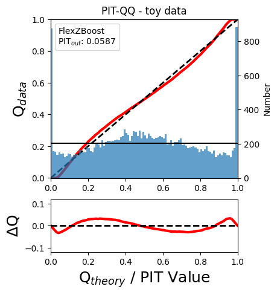
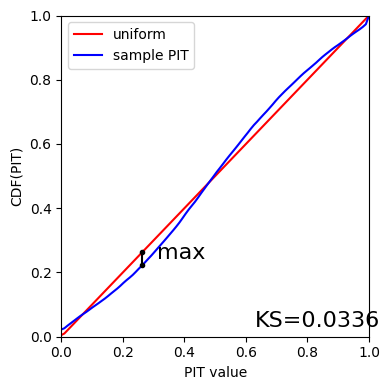

Demo: RAIL Evaluation
=====================

Author: Sam Schmidt, Alex Malz, Julia Gschwend, others…

last run successfully: June 16, 2023 (with qp-prob >= 0.8.2)

The purpose of this notebook is to demonstrate the application of the
metrics scripts to be used on the photo-z PDF catalogs produced by the
PZ working group. The first implementation of the *evaluation* module is
based on the refactoring of the code used in `Schmidt et
al. 2020 <https://arxiv.org/pdf/2001.03621.pdf>`__, available on Github
repository `PZDC1paper <https://github.com/LSSTDESC/PZDC1paper>`__.

To run this notebook, you must install qp and have the notebook in the
same directory as ``utils.py`` (available in RAIL’s examples
directrory). You must also have installed all RAIL dependencies,
particularly for the estimation codes that you want to run, as well as
ceci, qp, tables_io, etc… See the RAIL installation instructions for
more info.

.. code:: ipython3

    import rail
    from rail.evaluation.metrics.cdeloss import *
    from rail.evaluation.evaluator import Evaluator
    from rail.core.data import QPHandle, TableHandle
    from rail.core.stage import RailStage
    from utils import plot_pit_qq, ks_plot
    import qp 
    import os
    %matplotlib inline
    %reload_ext autoreload
    %autoreload 2

Let’s set up the data store, for more information on the data store, see
the golden spike example notebook in
``RAIL/examples/goldenspike_examples/goldenspike.ipynb``

.. code:: ipython3

    DS = RailStage.data_store
    DS.__class__.allow_overwrite = True

Data
----

To compute the photo-z metrics of a given test sample, it is necessary
to read the output of a photo-z code containing galaxies’ photo-z PDFs.
Let’s use the toy data available in ``tests/data/``
(**test_dc2_training_9816.hdf5** and **test_dc2_validation_9816.hdf5**)
to generate a small sample of photo-z PDFs using the **FlexZBoost**
algorithm available on RAIL’s *estimation* module.

Photo-z Results
~~~~~~~~~~~~~~~

Run FlexZBoost
^^^^^^^^^^^^^^

If you have run the notebook ``RAIL_estimation_demo.ipynb``, this will
produce a file ``output_fzboost.hdf5``, writen at the location:
``<your_path>/RAIL/examples/estimation_examples/output_fzboost.hdf5``.

Otherwise we can download the file from NERSC

Next we need to set up some paths for the Data Store:

.. code:: ipython3

    from rail.core.utils import RAILDIR
    pdfs_file = os.path.join(RAILDIR, 'rail/examples_data/evaluation_data/data/output_fzboost.hdf5')
    ztrue_file = os.path.join(RAILDIR, 'rail/examples_data/testdata/test_dc2_validation_9816.hdf5')

.. code:: ipython3

    if not os.path.exists(pdfs_file):
        try:
            os.makedirs(os.path.dirname(pdfs_file))
        except FileExistsError:
            pass
        curl_com = f"curl -o {pdfs_file} https://portal.nersc.gov/cfs/lsst/PZ/output_fzboost.hdf5"
        os.system(curl_com)

.. parsed-literal::

      % Total    % Received % Xferd  Average Speed   Time    Time     Time  Current
                                     Dload  Upload   Total   Spent    Left  Speed
    100 47.1M  100 47.1M    0     0  24.6M      0  0:00:01  0:00:01 --:--:-- 24.6M

Read the data in, note that the fzdata is a ``qp`` Ensemble, and thus we
should read it in as a ``QPHandle`` type file, while the ztrue_data is
tabular data, and should be read in as a ``Tablehandle`` when adding to
the data store

.. code:: ipython3

    fzdata = DS.read_file('pdfs_data', QPHandle, pdfs_file)
    ztrue_data = DS.read_file('ztrue_data', TableHandle, ztrue_file)

.. code:: ipython3

    ztrue = ztrue_data()['photometry']['redshift']
    zgrid = fzdata().metadata()['xvals'].ravel()
    photoz_mode = fzdata().mode(grid=zgrid)

.. code:: ipython3

    truth = DS.add_data('truth', ztrue_data()['photometry'], TableHandle)
    ensemble = DS.add_data('ensemble', fzdata, QPHandle)

.. code:: ipython3

    DS.keys()

.. parsed-literal::

    dict_keys(['pdfs_data', 'ztrue_data', 'truth', 'ensemble'])

Make an evaulator stage
-----------------------

Now let’s set up the Evaluator stage to compute our metrics for the
FlexZBoost results

.. code:: ipython3

    FZB_eval = Evaluator.make_stage(name='FZB_eval', truth=truth)

.. code:: ipython3

    FZB_results = FZB_eval.evaluate(ensemble(), truth)

.. parsed-literal::

    /opt/hostedtoolcache/Python/3.10.13/x64/lib/python3.10/site-packages/qp/metrics/array_metrics.py:26: UserWarning: p-value floored: true value smaller than 0.001
      return stats.anderson_ksamp([p_random_variables, q_random_variables], **kwargs)

.. parsed-literal::

    Inserting handle into data store.  output_FZB_eval: inprogress_output_FZB_eval.hdf5, FZB_eval

We can view the results as a pandas dataframe:

.. code:: ipython3

    import tables_io
    results_df= tables_io.convertObj(FZB_results(), tables_io.types.PD_DATAFRAME)
    results_df

.. raw:: html

    

    
    <table border="1" class="dataframe">
      <thead>
        <tr style="text-align: right;">
          <th></th>
          <th>PIT_AD_stat</th>
          <th>PIT_AD_pval</th>
          <th>PIT_AD_significance_level</th>
          <th>PIT_CvM_stat</th>
          <th>PIT_CvM_pval</th>
          <th>PIT_CvM_significance_level</th>
          <th>PIT_KS_stat</th>
          <th>PIT_KS_pval</th>
          <th>PIT_KS_significance_level</th>
          <th>PIT_OutRate_stat</th>
          <th>PIT_OutRate_pval</th>
          <th>PIT_OutRate_significance_level</th>
          <th>POINT_SimgaIQR</th>
          <th>POINT_Bias</th>
          <th>POINT_OutlierRate</th>
          <th>POINT_SigmaMAD</th>
          <th>CDE_stat</th>
          <th>CDE_pval</th>
        </tr>
      </thead>
      <tbody>
        <tr>
          <th>0</th>
          <td>84.956236</td>
          <td>NaN</td>
          <td>0.001</td>
          <td>9.623352</td>
          <td>NaN</td>
          <td>NaN</td>
          <td>0.03359</td>
          <td>NaN</td>
          <td>NaN</td>
          <td>NaN</td>
          <td>NaN</td>
          <td>NaN</td>
          <td>0.020859</td>
          <td>0.00027</td>
          <td>0.106167</td>
          <td>0.020891</td>
          <td>-6.74027</td>
          <td>NaN</td>
        </tr>
      </tbody>
    </table>
    

So, there we have it, a way to generate all of our summary statistics
for FZBoost. And note also that the results file has been written out to
``output_FZB_eval.hdf5``, the name we specified when we ran
``make_stage`` (with output\_ prepended).

As an alternative, and to allow for a little more explanation for each
individual metric, we can calculate the metrics using functions from the
evaluation class separate from the stage infrastructure. Here are some
examples below.

CDF-based Metrics
-----------------

PIT
~~~

The Probability Integral Transform (PIT), is the Cumulative Distribution
Function (CDF) of the photo-z PDF

.. math::  \mathrm{CDF}(f, q)\ =\ \int_{-\infty}^{q}\ f(z)\ dz 

evaluated at the galaxy’s true redshift for every galaxy :math:`i` in
the catalog.

.. math::  \mathrm{PIT}(p_{i}(z);\ z_{i})\ =\ \int_{-\infty}^{z^{true}_{i}}\ p_{i}(z)\ dz 

.. code:: ipython3

    from qp.metrics.pit import PIT
    pitobj = PIT(fzdata(), ztrue)
    quant_ens = pitobj.pit
    metamets = pitobj.calculate_pit_meta_metrics()

.. parsed-literal::

    /opt/hostedtoolcache/Python/3.10.13/x64/lib/python3.10/site-packages/qp/metrics/array_metrics.py:26: UserWarning: p-value floored: true value smaller than 0.001
      return stats.anderson_ksamp([p_random_variables, q_random_variables], **kwargs)

The *evaluate* method PIT class returns two objects, a quantile
distribution based on the full set of PIT values (a frozen distribution
object), and a dictionary of meta metrics associated to PIT (to be
detailed below).

.. code:: ipython3

    quant_ens

.. parsed-literal::

    <qp.ensemble.Ensemble at 0x7fc9b9a2e6e0>

.. code:: ipython3

    metamets

.. parsed-literal::

    {'ad': Anderson_ksampResult(statistic=84.95623553609381, critical_values=array([0.325, 1.226, 1.961, 2.718, 3.752, 4.592, 6.546]), pvalue=0.001),
     'cvm': CramerVonMisesResult(statistic=9.62335199605935, pvalue=9.265037625993955e-10),
     'ks': KstestResult(statistic=0.033590049370962216, pvalue=1.7621068075751534e-20, statistic_location=0.9921210288809627, statistic_sign=-1),
     'outlier_rate': 0.05873797877466336}

PIT values

.. code:: ipython3

    pit_vals = np.array(pitobj.pit_samps)
    pit_vals

.. parsed-literal::

    array([0.19392947, 0.36675619, 0.52017547, ..., 1.        , 0.93189232,
           0.4674437 ])

PIT outlier rate
~~~~~~~~~~~~~~~~

The PIT outlier rate is a global metric defined as the fraction of
galaxies in the sample with extreme PIT values. The lower and upper
limits for considering a PIT as outlier are optional parameters set at
the Metrics instantiation (default values are: PIT :math:`<10^{-4}` or
PIT :math:`>0.9999`).

.. code:: ipython3

    pit_out_rate = metamets['outlier_rate']
    print(f"PIT outlier rate of this sample: {pit_out_rate:.6f}") 
    pit_out_rate = pitobj.evaluate_PIT_outlier_rate()
    print(f"PIT outlier rate of this sample: {pit_out_rate:.6f}") 

.. parsed-literal::

    PIT outlier rate of this sample: 0.058738
    PIT outlier rate of this sample: 0.058738

PIT-QQ plot
~~~~~~~~~~~

The histogram of PIT values is a useful tool for a qualitative
assessment of PDFs quality. It shows whether the PDFs are: \* biased
(tilted PIT histogram) \* under-dispersed (excess counts close to the
boudaries 0 and 1) \* over-dispersed (lack of counts close the boudaries
0 and 1) \* well-calibrated (flat histogram)

Following the standards in DC1 paper, the PIT histogram is accompanied
by the quantile-quantile (QQ), which can be used to compare
qualitatively the PIT distribution obtained with the PDFs agaist the
ideal case (uniform distribution). The closer the QQ plot is to the
diagonal, the better is the PDFs calibration.

.. code:: ipython3

    pdfs = fzdata.data.objdata()['yvals']
    plot_pit_qq(pdfs, zgrid, ztrue, title="PIT-QQ - toy data", code="FlexZBoost",
                    pit_out_rate=pit_out_rate, savefig=False)

The black horizontal line represents the ideal case where the PIT
histogram would behave as a uniform distribution U(0,1).

Summary statistics of CDF-based metrics
---------------------------------------

To evaluate globally the quality of PDFs estimates, ``rail.evaluation``
provides a set of metrics to compare the empirical distributions of PIT
values with the reference uniform distribution, U(0,1).

Kolmogorov-Smirnov
~~~~~~~~~~~~~~~~~~

Let’s start with the traditional Kolmogorov-Smirnov (KS) statistic test,
which is the maximum difference between the empirical and the expected
cumulative distributions of PIT values:

.. math::

   \mathrm{KS} \equiv \max_{PIT} \Big( \left| \ \mathrm{CDF} \small[ \hat{f}, z \small] - \mathrm{CDF} \small[ \tilde{f}, z \small] \  \right| \Big)

Where :math:`\hat{f}` is the PIT distribution and :math:`\tilde{f}` is
U(0,1). Therefore, the smaller value of KS the closer the PIT
distribution is to be uniform. The ``evaluate`` method of the PITKS
class returns a named tuple with the statistic and p-value.

.. code:: ipython3

    ks_stat_and_pval = metamets['ks']
    print(f"PIT KS stat and pval: {ks_stat_and_pval}") 
    ks_stat_and_pval = pitobj.evaluate_PIT_KS()
    print(f"PIT KS stat and pval: {ks_stat_and_pval}") 

.. parsed-literal::

    PIT KS stat and pval: KstestResult(statistic=0.033590049370962216, pvalue=1.7621068075751534e-20, statistic_location=0.9921210288809627, statistic_sign=-1)
    PIT KS stat and pval: KstestResult(statistic=0.033590049370962216, pvalue=1.7621068075751534e-20, statistic_location=0.9921210288809627, statistic_sign=-1)

Visual interpretation of the KS statistic:

.. code:: ipython3

    ks_plot(pitobj)

.. code:: ipython3

    print(f"KS metric of this sample: {ks_stat_and_pval.statistic:.4f}") 

.. parsed-literal::

    KS metric of this sample: 0.0336

Cramer-von Mises
~~~~~~~~~~~~~~~~

Similarly, let’s calculate the Cramer-von Mises (CvM) test, a variant of
the KS statistic defined as the mean-square difference between the CDFs
of an empirical PDF and the true PDFs:

.. math::  \mathrm{CvM}^2 \equiv \int_{-\infty}^{\infty} \Big( \mathrm{CDF} \small[ \hat{f}, z \small] \ - \ \mathrm{CDF} \small[ \tilde{f}, z \small] \Big)^{2} \mathrm{dCDF}(\tilde{f}, z) 

on the distribution of PIT values, which should be uniform if the PDFs
are perfect.

.. code:: ipython3

    cvm_stat_and_pval = metamets['cvm']
    print(f"PIT CvM stat and pval: {cvm_stat_and_pval}") 
    cvm_stat_and_pval = pitobj.evaluate_PIT_CvM()
    print(f"PIT CvM stat and pval: {cvm_stat_and_pval}")

.. parsed-literal::

    PIT CvM stat and pval: CramerVonMisesResult(statistic=9.62335199605935, pvalue=9.265037625993955e-10)
    PIT CvM stat and pval: CramerVonMisesResult(statistic=9.62335199605935, pvalue=9.265037625993955e-10)

.. code:: ipython3

    print(f"CvM metric of this sample: {cvm_stat_and_pval.statistic:.4f}") 

.. parsed-literal::

    CvM metric of this sample: 9.6234

Anderson-Darling
~~~~~~~~~~~~~~~~

Another variation of the KS statistic is the Anderson-Darling (AD) test,
a weighted mean-squared difference featuring enhanced sensitivity to
discrepancies in the tails of the distribution.

.. math::  \mathrm{AD}^2 \equiv N_{tot} \int_{-\infty}^{\infty} \frac{\big( \mathrm{CDF} \small[ \hat{f}, z \small] \ - \ \mathrm{CDF} \small[ \tilde{f}, z \small] \big)^{2}}{\mathrm{CDF} \small[ \tilde{f}, z \small] \big( 1 \ - \ \mathrm{CDF} \small[ \tilde{f}, z \small] \big)}\mathrm{dCDF}(\tilde{f}, z) 

.. code:: ipython3

    ad_stat_crit_sig = metamets['ad']
    print(f"PIT AD stat and pval: {ad_stat_crit_sig}") 
    ad_stat_crit_sig = pitobj.evaluate_PIT_anderson_ksamp()
    print(f"PIT AD stat and pval: {ad_stat_crit_sig}")

.. parsed-literal::

    PIT AD stat and pval: Anderson_ksampResult(statistic=84.95623553609381, critical_values=array([0.325, 1.226, 1.961, 2.718, 3.752, 4.592, 6.546]), pvalue=0.001)
    PIT AD stat and pval: Anderson_ksampResult(statistic=84.95623553609381, critical_values=array([0.325, 1.226, 1.961, 2.718, 3.752, 4.592, 6.546]), pvalue=0.001)

.. code:: ipython3

    print(f"AD metric of this sample: {ad_stat_crit_sig.statistic:.4f}") 

.. parsed-literal::

    AD metric of this sample: 84.9562

It is possible to remove catastrophic outliers before calculating the
integral for the sake of preserving numerical instability. For instance,
Schmidt et al. computed the Anderson-Darling statistic within the
interval (0.01, 0.99).

.. code:: ipython3

    ad_stat_crit_sig_cut = pitobj.evaluate_PIT_anderson_ksamp(pit_min=0.01, pit_max=0.99)
    print(f"AD metric of this sample: {ad_stat_crit_sig.statistic:.4f}") 
    print(f"AD metric for 0.01 < PIT < 0.99: {ad_stat_crit_sig_cut.statistic:.4f}") 

.. parsed-literal::

    WARNING:root:Removed 1760 PITs from the sample.

.. parsed-literal::

    AD metric of this sample: 84.9562
    AD metric for 0.01 < PIT < 0.99: 89.9826

CDE Loss
--------

In the absence of true photo-z posteriors, the metric used to evaluate
individual PDFs is the **Conditional Density Estimate (CDE) Loss**, a
metric analogue to the root-mean-squared-error:

.. math::  L(f, \hat{f}) \equiv  \int \int {\big(f(z | x) - \hat{f}(z | x) \big)}^{2} dzdP(x), 

where :math:`f(z | x)` is the true photo-z PDF and
:math:`\hat{f}(z | x)` is the estimated PDF in terms of the photometry
:math:`x`. Since :math:`f(z | x)` is unknown, we estimate the **CDE
Loss** as described in `Izbicki & Lee, 2017
(arXiv:1704.08095) <https://arxiv.org/abs/1704.08095>`__. :

.. math::  \mathrm{CDE} = \mathbb{E}\big(  \int{{\hat{f}(z | X)}^2 dz} \big) - 2{\mathbb{E}}_{X, Z}\big(\hat{f}(Z, X) \big) + K_{f},  

where the first term is the expectation value of photo-z posterior with
respect to the marginal distribution of the covariates X, and the second
term is the expectation value with respect to the joint distribution of
observables X and the space Z of all possible redshifts (in practice,
the centroids of the PDF bins), and the third term is a constant
depending on the true conditional densities :math:`f(z | x)`.

.. code:: ipython3

    cdelossobj = CDELoss(fzdata.data, zgrid, ztrue)

.. code:: ipython3

    cde_stat_and_pval = cdelossobj.evaluate()
    cde_stat_and_pval

.. parsed-literal::

    stat_and_pval(statistic=-6.725602928688286, p_value=nan)

.. code:: ipython3

    print(f"CDE loss of this sample: {cde_stat_and_pval.statistic:.2f}") 

.. parsed-literal::

    CDE loss of this sample: -6.73

We note that all of the quantities as run individually are identical to
the quantities in our summary table - a nice check that things have run
properly.
