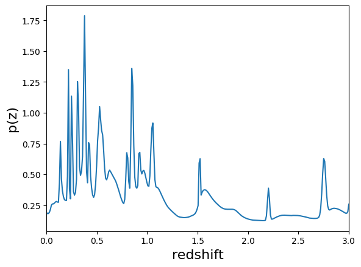

Goldenspike: an example of an end-to-end analysis using RAIL
============================================================

**Authors:** Sam Schmidt, Eric Charles, Alex Malz, John Franklin
Crenshaw, others…

**Last run successfully:** Oct 23, 2023

This notebook demonstrates how to use a the various RAIL Modules to draw
synthetic samples of fluxes by color, apply physical effects to them,
train photo-Z estimators on the samples, test and validate the
preformance of those estimators, and to use the RAIL summarization
modules to obtain n(z) estimates based on the p(z) estimates.

**Creation**

Note that in the parlance of the Creation Module, “degradation” is any
post-processing that occurs to the “true” sample generated by the create
Engine. This can include adding photometric errors, applying quality
cuts, introducing systematic biases, etc.

In this notebook, we will draw both test and training samples from a
RAIL Engine object. Then we will demonstrate how to use RAIL degraders
to apply effects to those samples.

**Training and Estimation**

The RAIL Informer modules “train” or “inform” models used to estimate
p(z) given band fluxes (and potentially other information).

The RAIL Estimation modules then use those same models to actually apply
the model and extract the p(z) estimates.

**p(z) Validation**

The RAIL Validator module applies various metrics.

**p(z) to n(z) Summarization**

The RAIL Summarization modules convert per-galaxy p(z) posteriors to
ensemble n(z) estimates.

Imports
-------

.. code:: ipython3

    # Prerquisites: os, numpy, pathlib, pzflow, tables_io
    import os
    import numpy as np
    from pathlib import Path
    from pzflow.examples import get_galaxy_data
    import tables_io

.. code:: ipython3

    # Various rail modules
    import rail
    from rail.creation.degradation.lsst_error_model import LSSTErrorModel
    from rail.creation.degradation.spectroscopic_degraders import (
        InvRedshiftIncompleteness,
        LineConfusion,
    )
    from rail.creation.degradation.quantityCut import QuantityCut
    from rail.creation.engines.flowEngine import FlowModeler, FlowCreator, FlowPosterior
    from rail.core.data import TableHandle
    from rail.core.stage import RailStage
    from rail.core.util_stages import ColumnMapper, TableConverter
    
    from rail.estimation.algos.bpz_lite import BPZliteInformer, BPZliteEstimator
    from rail.estimation.algos.k_nearneigh import KNearNeighInformer, KNearNeighEstimator
    from rail.estimation.algos.flexzboost import FlexZBoostInformer, FlexZBoostEstimator
    
    from rail.estimation.algos.naive_stack import NaiveStackSummarizer
    from rail.estimation.algos.point_est_hist import PointEstHistSummarizer
    
    from rail.evaluation.evaluator import Evaluator

RAIL now uses ceci as a back-end, which takes care of a lot of file I/O
decisions to be consistent with other choices in DESC.

The data_store commands in the cell below effectively override a ceci
default to prevent overwriting previous results, generally good but not
necessary for this demo.

The ``DataStore`` uses ``DataHandle`` objects to keep track of the
connections between the various stages. When one stage returns a
``DataHandle`` and then you pass that ``DataHandle`` to another stage,
the underlying code can establish the connections needed to build a
reproducilble pipeline.

.. code:: ipython3

    DS = RailStage.data_store
    DS.__class__.allow_overwrite = True

Here we need a few configuration parameters to deal with differences in
data schema between existing PZ codes.

.. code:: ipython3

    bands = ["u", "g", "r", "i", "z", "y"]
    band_dict = {band: f"mag_{band}_lsst" for band in bands}
    rename_dict = {f"mag_{band}_lsst_err": f"mag_err_{band}_lsst" for band in bands}

Train the Flow Engine
---------------------

First we need to train the normalizing flow that will serve as the
engine for the notebook.

In the cell below, we load the example galaxy catalog from PZFlow and
save it so that it can be used to train the flow. We also set the path
where we will save the flow.

.. code:: ipython3

    DATA_DIR = Path().resolve() / "data"
    DATA_DIR.mkdir(exist_ok=True)
    
    catalog_file = DATA_DIR / "base_catalog.pq"
    catalog = get_galaxy_data().rename(band_dict, axis=1)
    tables_io.write(catalog, str(catalog_file.with_suffix("")), catalog_file.suffix[1:])
    
    catalog_file = str(catalog_file)
    flow_file = str(DATA_DIR / "trained_flow.pkl")

Now we set the parameters for the FlowModeler, i.e. the pipeline stage
that trains the flow:

.. code:: ipython3

    flow_modeler_params = {
        "name": "flow_modeler",
        "input": catalog_file,
        "model": flow_file,
        "seed": 0,
        "phys_cols": {"redshift": [0, 3]},
        "phot_cols": {
            "mag_u_lsst": [17, 35],
            "mag_g_lsst": [16, 32],
            "mag_r_lsst": [15, 30],
            "mag_i_lsst": [15, 30],
            "mag_z_lsst": [14, 29],
            "mag_y_lsst": [14, 28],
        },
        "calc_colors": {"ref_column_name": "mag_i_lsst"},
    }

Now we will create the flow and train it

.. code:: ipython3

    flow_modeler = FlowModeler.make_stage(**flow_modeler_params)

.. code:: ipython3

    flow_modeler.fit_model()

.. parsed-literal::

    Inserting handle into data store.  input: /home/runner/work/rail_notebooks/rail_notebooks/rail/examples/goldenspike_examples/data/base_catalog.pq, flow_modeler
    column_list None
    Training 30 epochs 
    Loss:

.. parsed-literal::

    (0) 21.3266

.. parsed-literal::

    (1) 4.4446

.. parsed-literal::

    (2) 3.1045

.. parsed-literal::

    (3) 3.4380

.. parsed-literal::

    (4) 1.4711

.. parsed-literal::

    (5) -0.3120

.. parsed-literal::

    (6) 2.0674

.. parsed-literal::

    (7) -0.7039

.. parsed-literal::

    (8) -0.3325

.. parsed-literal::

    (9) -0.4658

.. parsed-literal::

    (10) -1.3314

.. parsed-literal::

    (11) -1.1386

.. parsed-literal::

    (12) 3402823273761818485311871060541440.0000

.. parsed-literal::

    (13) inf
    Training stopping after epoch 13 because training loss diverged.
    Inserting handle into data store.  model_flow_modeler: /home/runner/work/rail_notebooks/rail_notebooks/rail/examples/goldenspike_examples/data/inprogress_trained_flow.pkl, flow_modeler

.. parsed-literal::

    <rail.tools.flow_handle.FlowHandle at 0x7fed4d46bca0>

Make mock data
--------------

Now we will use the trained flow to create training and test data for
the photo-z estimators.

For both the training and test data we will:

1. Use the Flow to produce some synthetic data
2. Use the LSSTErrorModel to add photometric errors
3. Use the FlowPosterior to estimate the redshift posteriors for the
   degraded sample
4. Use the ColumnMapper to rename the error columns so that they match
   the names in DC2.
5. Use the TableConverter to convert the data to a numpy dictionary,
   which will be stored in a hdf5 file with the same schema as the DC2
   data

Training sample
~~~~~~~~~~~~~~~

For the training data we are going to apply a couple of extra
degradation effects to the data beyond what we do to create test data,
as the training data will have some spectroscopic incompleteness. This
will allow us to see how the trained models perform with imperfect
training data.

More details about the degraders are available in the
``rail/examples/creation_examples/degradation_demo.ipynb`` notebook.

.. code:: ipython3

    flow_creator_train = FlowCreator.make_stage(
        name="flow_creator_train",
        model=flow_modeler.get_handle("model"),
        n_samples=50,
        seed=1235,
    )
    
    lsst_error_model_train = LSSTErrorModel.make_stage(
        name="lsst_error_model_train",
        renameDict=band_dict,
        ndFlag=np.nan,
        seed=29,
    )
    
    inv_redshift = InvRedshiftIncompleteness.make_stage(
        name="inv_redshift",
        pivot_redshift=1.0,
    )
    
    line_confusion = LineConfusion.make_stage(
        name="line_confusion",
        true_wavelen=5007.0,
        wrong_wavelen=3727.0,
        frac_wrong=0.05,
    )
    
    quantity_cut = QuantityCut.make_stage(
        name="quantity_cut",
        cuts={"mag_i_lsst": 25.0},
    )
    
    col_remapper_train = ColumnMapper.make_stage(
        name="col_remapper_train",
        columns=rename_dict,
    )
    
    table_conv_train = TableConverter.make_stage(
        name="table_conv_train",
        output_format="numpyDict",
    )

.. code:: ipython3

    train_data_orig = flow_creator_train.sample(150, 1235)
    train_data_errs = lsst_error_model_train(train_data_orig, seed=66)
    train_data_inc = inv_redshift(train_data_errs)
    train_data_conf = line_confusion(train_data_inc)
    train_data_cut = quantity_cut(train_data_conf)
    train_data_pq = col_remapper_train(train_data_cut)
    train_data = table_conv_train(train_data_pq)

.. parsed-literal::

    Inserting handle into data store.  output_flow_creator_train: inprogress_output_flow_creator_train.pq, flow_creator_train
    Inserting handle into data store.  output_lsst_error_model_train: inprogress_output_lsst_error_model_train.pq, lsst_error_model_train
    Inserting handle into data store.  output_inv_redshift: inprogress_output_inv_redshift.pq, inv_redshift
    Inserting handle into data store.  output_line_confusion: inprogress_output_line_confusion.pq, line_confusion
    Inserting handle into data store.  output_quantity_cut: inprogress_output_quantity_cut.pq, quantity_cut
    Inserting handle into data store.  output_col_remapper_train: inprogress_output_col_remapper_train.pq, col_remapper_train
    Inserting handle into data store.  output_table_conv_train: inprogress_output_table_conv_train.hdf5, table_conv_train

Let’s examine the quantities that we’ve generated, we’ll use the handy
``tables_io`` package to temporarily write to a pandas dataframe for
quick writeout of the columns:

.. code:: ipython3

    train_table = tables_io.convertObj(train_data.data, tables_io.types.PD_DATAFRAME)
    train_table.head()

.. raw:: html

    

    
    <table border="1" class="dataframe">
      <thead>
        <tr style="text-align: right;">
          <th></th>
          <th>redshift</th>
          <th>mag_u_lsst</th>
          <th>mag_err_u_lsst</th>
          <th>mag_g_lsst</th>
          <th>mag_err_g_lsst</th>
          <th>mag_r_lsst</th>
          <th>mag_err_r_lsst</th>
          <th>mag_i_lsst</th>
          <th>mag_err_i_lsst</th>
          <th>mag_z_lsst</th>
          <th>mag_err_z_lsst</th>
          <th>mag_y_lsst</th>
          <th>mag_err_y_lsst</th>
        </tr>
      </thead>
      <tbody>
        <tr>
          <th>0</th>
          <td>0.954230</td>
          <td>24.745544</td>
          <td>0.086710</td>
          <td>24.413403</td>
          <td>0.022223</td>
          <td>23.597637</td>
          <td>0.010348</td>
          <td>22.671664</td>
          <td>0.008192</td>
          <td>13.484402</td>
          <td>0.005000</td>
          <td>13.035244</td>
          <td>0.005000</td>
        </tr>
        <tr>
          <th>1</th>
          <td>0.150525</td>
          <td>24.389893</td>
          <td>0.063448</td>
          <td>23.749938</td>
          <td>0.012953</td>
          <td>23.407938</td>
          <td>0.009134</td>
          <td>22.980543</td>
          <td>0.009909</td>
          <td>23.006380</td>
          <td>0.017686</td>
          <td>22.948343</td>
          <td>0.037257</td>
        </tr>
        <tr>
          <th>2</th>
          <td>0.460116</td>
          <td>26.885697</td>
          <td>0.504835</td>
          <td>25.988831</td>
          <td>0.088728</td>
          <td>25.008382</td>
          <td>0.032751</td>
          <td>24.734852</td>
          <td>0.041953</td>
          <td>24.538844</td>
          <td>0.067567</td>
          <td>24.427757</td>
          <td>0.137181</td>
        </tr>
        <tr>
          <th>3</th>
          <td>0.778629</td>
          <td>24.787426</td>
          <td>0.089947</td>
          <td>24.451912</td>
          <td>0.022967</td>
          <td>24.124344</td>
          <td>0.015396</td>
          <td>23.482975</td>
          <td>0.014348</td>
          <td>23.334890</td>
          <td>0.023368</td>
          <td>23.367871</td>
          <td>0.054049</td>
        </tr>
        <tr>
          <th>4</th>
          <td>0.199185</td>
          <td>25.505917</td>
          <td>0.167332</td>
          <td>24.769269</td>
          <td>0.030234</td>
          <td>24.521851</td>
          <td>0.021446</td>
          <td>24.693851</td>
          <td>0.040455</td>
          <td>24.635133</td>
          <td>0.073577</td>
          <td>24.877415</td>
          <td>0.201213</td>
        </tr>
      </tbody>
    </table>
    

You see that we’ve generated redshifts, ugrizy magnitudes, and magnitude
errors with names that match those in the cosmoDC2_v1.1.4_image data.

Testing sample
~~~~~~~~~~~~~~

For the test sample we will:

1. Use the Flow to produce some synthetic data
2. Use the LSSTErrorModel to smear the data
3. Use the FlowPosterior to estimate the redshift posteriors for the
   degraded sample
4. Use ColumnMapper to rename some of the columns to match DC2
5. Use the TableConverter to convert the data to a numpy dictionary,
   which will be stored in a hdf5 file with the same schema as the DC2
   data

.. code:: ipython3

    flow_creator_test = FlowCreator.make_stage(
        name="flow_creator_test",
        model=flow_modeler.get_handle("model"),
        n_samples=50,
    )
    
    lsst_error_model_test = LSSTErrorModel.make_stage(
        name="lsst_error_model_test",
        renameDict=band_dict,
        ndFlag=np.nan,
    )
    
    flow_post_test = FlowPosterior.make_stage(
        name="flow_post_test",
        model=flow_modeler.get_handle("model"),
        column="redshift",
        grid=np.linspace(0.0, 5.0, 21),
    )
    
    col_remapper_test = ColumnMapper.make_stage(
        name="col_remapper_test",
        columns=rename_dict,
        hdf5_groupname="",
    )
    
    table_conv_test = TableConverter.make_stage(
        name="table_conv_test",
        output_format="numpyDict",
    )

.. code:: ipython3

    test_data_orig = flow_creator_test.sample(150, 1234)
    test_data_errs = lsst_error_model_test(test_data_orig, seed=58)
    test_data_post = flow_post_test.get_posterior(test_data_errs, err_samples=None)
    test_data_pq = col_remapper_test(test_data_errs)
    test_data = table_conv_test(test_data_pq)

.. parsed-literal::

    Inserting handle into data store.  output_flow_creator_test: inprogress_output_flow_creator_test.pq, flow_creator_test
    Inserting handle into data store.  output_lsst_error_model_test: inprogress_output_lsst_error_model_test.pq, lsst_error_model_test

.. parsed-literal::

    Inserting handle into data store.  output_flow_post_test: inprogress_output_flow_post_test.hdf5, flow_post_test
    Inserting handle into data store.  output_col_remapper_test: inprogress_output_col_remapper_test.pq, col_remapper_test
    Inserting handle into data store.  output_table_conv_test: inprogress_output_table_conv_test.hdf5, table_conv_test

.. parsed-literal::

    /opt/hostedtoolcache/Python/3.10.13/x64/lib/python3.10/site-packages/qp/interp_pdf.py:89: RuntimeWarning: invalid value encountered in divide
      self._ycumul = (self._ycumul.T / self._ycumul[:, -1]).T

.. code:: ipython3

    test_table = tables_io.convertObj(test_data.data, tables_io.types.PD_DATAFRAME)
    test_table.head()

.. raw:: html

    

    
    <table border="1" class="dataframe">
      <thead>
        <tr style="text-align: right;">
          <th></th>
          <th>redshift</th>
          <th>mag_u_lsst</th>
          <th>mag_err_u_lsst</th>
          <th>mag_g_lsst</th>
          <th>mag_err_g_lsst</th>
          <th>mag_r_lsst</th>
          <th>mag_err_r_lsst</th>
          <th>mag_i_lsst</th>
          <th>mag_err_i_lsst</th>
          <th>mag_z_lsst</th>
          <th>mag_err_z_lsst</th>
          <th>mag_y_lsst</th>
          <th>mag_err_y_lsst</th>
        </tr>
      </thead>
      <tbody>
        <tr>
          <th>0</th>
          <td>0.129672</td>
          <td>23.107949</td>
          <td>0.020881</td>
          <td>21.779267</td>
          <td>0.005465</td>
          <td>21.167156</td>
          <td>0.005127</td>
          <td>20.605325</td>
          <td>0.005124</td>
          <td>20.417654</td>
          <td>0.005298</td>
          <td>20.276114</td>
          <td>0.006037</td>
        </tr>
        <tr>
          <th>1</th>
          <td>0.509848</td>
          <td>23.549516</td>
          <td>0.030395</td>
          <td>22.744066</td>
          <td>0.007024</td>
          <td>21.860144</td>
          <td>0.005380</td>
          <td>21.296090</td>
          <td>0.005372</td>
          <td>21.113129</td>
          <td>0.005909</td>
          <td>20.949475</td>
          <td>0.007895</td>
        </tr>
        <tr>
          <th>2</th>
          <td>1.174490</td>
          <td>30.210907</td>
          <td>2.837428</td>
          <td>26.622267</td>
          <td>0.153829</td>
          <td>24.987166</td>
          <td>0.032144</td>
          <td>24.051801</td>
          <td>0.023037</td>
          <td>23.372578</td>
          <td>0.024140</td>
          <td>22.874560</td>
          <td>0.034905</td>
        </tr>
        <tr>
          <th>3</th>
          <td>0.446364</td>
          <td>27.752482</td>
          <td>0.911114</td>
          <td>27.656482</td>
          <td>0.360604</td>
          <td>26.420259</td>
          <td>0.114015</td>
          <td>25.964685</td>
          <td>0.124156</td>
          <td>25.523472</td>
          <td>0.159631</td>
          <td>26.335472</td>
          <td>0.625511</td>
        </tr>
        <tr>
          <th>4</th>
          <td>1.852743</td>
          <td>26.910133</td>
          <td>0.513975</td>
          <td>26.113566</td>
          <td>0.098985</td>
          <td>25.838725</td>
          <td>0.068367</td>
          <td>25.101439</td>
          <td>0.058089</td>
          <td>24.307817</td>
          <td>0.055050</td>
          <td>23.994057</td>
          <td>0.094020</td>
        </tr>
      </tbody>
    </table>
    

“Inform” some estimators
------------------------

More details about the process of “informing” or “training” the models
used by the estimators is available in the
``rail/examples/estimation_examples/RAIL_estimation_demo.ipynb``
notebook.

We use “inform” rather than “train” to generically refer to the
preprocessing of any prior information. For a machine learning
estimator, that prior information is a training set, but it can also be
an SED template library for a template-fitting or hybrid estimator.

.. code:: ipython3

    inform_bpz = BPZliteInformer.make_stage(
        name="inform_bpz",
        nondetect_val=np.nan,
        model="bpz.pkl",
        hdf5_groupname="",
    )
    
    inform_knn = KNearNeighInformer.make_stage(
        name="inform_knn",
        nondetect_val=np.nan,
        model="knnpz.pkl",
        hdf5_groupname="",
    )
    
    inform_fzboost = FlexZBoostInformer.make_stage(
        name="inform_FZBoost",
        nondetect_val=np.nan,
        model="fzboost.pkl",
        hdf5_groupname="",
    )

.. code:: ipython3

    train_data_errs.data.keys()

.. parsed-literal::

    Index(['redshift', 'mag_u_lsst', 'mag_u_lsst_err', 'mag_g_lsst',
           'mag_g_lsst_err', 'mag_r_lsst', 'mag_r_lsst_err', 'mag_i_lsst',
           'mag_i_lsst_err', 'mag_z_lsst', 'mag_z_lsst_err', 'mag_y_lsst',
           'mag_y_lsst_err'],
          dtype='object')

.. code:: ipython3

    inform_bpz.inform(train_data)
    inform_knn.inform(train_data)
    inform_fzboost.inform(train_data)

.. parsed-literal::

    using 51 galaxies in calculation
    best values for fo and kt:
    [1.]
    [0.3]
    minimizing for type 0
    best fit z0, alpha, km for type 0: [0.33583541 1.56708666 0.05336341]
    Inserting handle into data store.  model_inform_bpz: inprogress_bpz.pkl, inform_bpz
    split into 38 training and 13 validation samples
    finding best fit sigma and NNeigh...

.. parsed-literal::

    
    
    
    best fit values are sigma=0.075 and numneigh=7
    
    
    
    Inserting handle into data store.  model_inform_knn: inprogress_knnpz.pkl, inform_knn
    stacking some data...
    read in training data
    fit the model...

.. parsed-literal::

    /opt/hostedtoolcache/Python/3.10.13/x64/lib/python3.10/site-packages/joblib/externals/loky/backend/fork_exec.py:38: RuntimeWarning: os.fork() was called. os.fork() is incompatible with multithreaded code, and JAX is multithreaded, so this will likely lead to a deadlock.
      pid = os.fork()

.. parsed-literal::

    /opt/hostedtoolcache/Python/3.10.13/x64/lib/python3.10/site-packages/xgboost/core.py:160: UserWarning: [07:14:44] WARNING: /workspace/src/learner.cc:742: 
    Parameters: { "silent" } are not used.
    
      warnings.warn(smsg, UserWarning)
    /opt/hostedtoolcache/Python/3.10.13/x64/lib/python3.10/site-packages/xgboost/core.py:160: UserWarning: [07:14:44] WARNING: /workspace/src/learner.cc:742: 
    Parameters: { "silent" } are not used.
    
      warnings.warn(smsg, UserWarning)
    /opt/hostedtoolcache/Python/3.10.13/x64/lib/python3.10/site-packages/xgboost/core.py:160: UserWarning: [07:14:44] WARNING: /workspace/src/learner.cc:742: 
    Parameters: { "silent" } are not used.
    
      warnings.warn(smsg, UserWarning)

.. parsed-literal::

    /opt/hostedtoolcache/Python/3.10.13/x64/lib/python3.10/site-packages/xgboost/core.py:160: UserWarning: [07:14:45] WARNING: /workspace/src/learner.cc:742: 
    Parameters: { "silent" } are not used.
    
      warnings.warn(smsg, UserWarning)
    /opt/hostedtoolcache/Python/3.10.13/x64/lib/python3.10/site-packages/xgboost/core.py:160: UserWarning: [07:14:45] WARNING: /workspace/src/learner.cc:742: 
    Parameters: { "silent" } are not used.
    
      warnings.warn(smsg, UserWarning)
    /opt/hostedtoolcache/Python/3.10.13/x64/lib/python3.10/site-packages/xgboost/core.py:160: UserWarning: [07:14:45] WARNING: /workspace/src/learner.cc:742: 
    Parameters: { "silent" } are not used.
    
      warnings.warn(smsg, UserWarning)
    /opt/hostedtoolcache/Python/3.10.13/x64/lib/python3.10/site-packages/xgboost/core.py:160: UserWarning: [07:14:45] WARNING: /workspace/src/learner.cc:742: 
    Parameters: { "silent" } are not used.
    
      warnings.warn(smsg, UserWarning)

.. parsed-literal::

    finding best bump thresh...

.. parsed-literal::

    finding best sharpen parameter...

.. parsed-literal::

    Retraining with full training set...

.. parsed-literal::

    /opt/hostedtoolcache/Python/3.10.13/x64/lib/python3.10/site-packages/xgboost/core.py:160: UserWarning: [07:14:49] WARNING: /workspace/src/learner.cc:742: 
    Parameters: { "silent" } are not used.
    
      warnings.warn(smsg, UserWarning)
    /opt/hostedtoolcache/Python/3.10.13/x64/lib/python3.10/site-packages/xgboost/core.py:160: UserWarning: [07:14:49] WARNING: /workspace/src/learner.cc:742: 
    Parameters: { "silent" } are not used.
    
      warnings.warn(smsg, UserWarning)
    /opt/hostedtoolcache/Python/3.10.13/x64/lib/python3.10/site-packages/xgboost/core.py:160: UserWarning: [07:14:49] WARNING: /workspace/src/learner.cc:742: 
    Parameters: { "silent" } are not used.
    
      warnings.warn(smsg, UserWarning)
    /opt/hostedtoolcache/Python/3.10.13/x64/lib/python3.10/site-packages/xgboost/core.py:160: UserWarning: [07:14:49] WARNING: /workspace/src/learner.cc:742: 
    Parameters: { "silent" } are not used.
    
      warnings.warn(smsg, UserWarning)

.. parsed-literal::

    Inserting handle into data store.  model_inform_FZBoost: inprogress_fzboost.pkl, inform_FZBoost

.. parsed-literal::

    <rail.core.data.ModelHandle at 0x7fece7ad2fb0>

Estimate photo-z posteriors
---------------------------

More detail on the specific estimators used here is available in the
``rail/examples/estimation_examples/RAIL_estimation_demo.ipynb``
notebook, but here is a very brief summary of the three estimators used
in this notebook:

``BPZliteEstimator`` is a template-based photo-z code that outputs the
posterior estimated given likelihoods calculated using a template set
combined with a Bayesian prior. See Benitez (2000) for more details.
``KNearNeighEstimator`` is a simple photo-z code that finds the K
nearest neighbor training galaxies in color/magnitude space and creates
a weighted (by distance) mixture model PDF based on the redshifts of
those K neighbors. ``FlexZBoostEstimator`` is a mature photo-z algorithm
that estimates a PDF for each galaxy via a conditional density estimate
using the training data. See `Izbicki & Lee
(2017) <https://doi.org/10.1214/17-EJS1302>`__ for more details.

.. code:: ipython3

    estimate_bpz = BPZliteEstimator.make_stage(
        name="estimate_bpz",
        hdf5_groupname="",
        nondetect_val=np.nan,
        model=inform_bpz.get_handle("model"),
    )
    
    estimate_knn = KNearNeighEstimator.make_stage(
        name="estimate_knn",
        hdf5_groupname="",
        nondetect_val=np.nan,
        model=inform_knn.get_handle("model"),
    )
    
    estimate_fzboost = FlexZBoostEstimator.make_stage(
        name="test_FZBoost",
        nondetect_val=np.nan,
        model=inform_fzboost.get_handle("model"),
        hdf5_groupname="",
        aliases=dict(input="test_data", output="fzboost_estim"),
    )

.. code:: ipython3

    knn_estimated = estimate_knn.estimate(test_data)
    fzboost_estimated = estimate_fzboost.estimate(test_data)
    bpz_estimated = estimate_bpz.estimate(test_data)

.. parsed-literal::

    Process 0 running estimator on chunk 0 - 150
    Process 0 estimating PZ PDF for rows 0 - 150
    Inserting handle into data store.  output_estimate_knn: inprogress_output_estimate_knn.hdf5, estimate_knn

.. parsed-literal::

    Process 0 running estimator on chunk 0 - 150
    Process 0 estimating PZ PDF for rows 0 - 150

.. parsed-literal::

    Inserting handle into data store.  output_test_FZBoost: inprogress_output_test_FZBoost.hdf5, test_FZBoost

.. parsed-literal::

    Process 0 running estimator on chunk 0 - 150
    Inserting handle into data store.  output_estimate_bpz: inprogress_output_estimate_bpz.hdf5, estimate_bpz

Evaluate the estimates
----------------------

Now we evaluate metrics on the estimates, separately for each estimator.

Each call to the ``Evaluator.evaluate`` will create a table with the
various performance metrics. We will store all of these tables in a
dictionary, keyed by the name of the estimator.

.. code:: ipython3

    eval_dict = dict(bpz=bpz_estimated, fzboost=fzboost_estimated, knn=knn_estimated)
    truth = test_data_orig
    
    result_dict = {}
    for key, val in eval_dict.items():
        the_eval = Evaluator.make_stage(name=f"{key}_eval", truth=truth)
        result_dict[key] = the_eval.evaluate(val, truth)

.. parsed-literal::

    Inserting handle into data store.  output_bpz_eval: inprogress_output_bpz_eval.hdf5, bpz_eval
    Inserting handle into data store.  output_fzboost_eval: inprogress_output_fzboost_eval.hdf5, fzboost_eval
    Inserting handle into data store.  output_knn_eval: inprogress_output_knn_eval.hdf5, knn_eval

.. parsed-literal::

    /opt/hostedtoolcache/Python/3.10.13/x64/lib/python3.10/site-packages/qp/metrics/array_metrics.py:27: UserWarning: p-value floored: true value smaller than 0.001. Consider specifying `method` (e.g. `method=stats.PermutationMethod()`.)
      return stats.anderson_ksamp([p_random_variables, q_random_variables], **kwargs)

| The Pandas DataFrame output format conveniently makes human-readable
  printouts of the metrics.
| This next cell will convert everything to Pandas.

.. code:: ipython3

    results_tables = {
        key: tables_io.convertObj(val.data, tables_io.types.PD_DATAFRAME)
        for key, val in result_dict.items()
    }

.. code:: ipython3

    results_tables["knn"]

.. raw:: html

    

    
    <table border="1" class="dataframe">
      <thead>
        <tr style="text-align: right;">
          <th></th>
          <th>PIT_AD_stat</th>
          <th>PIT_AD_pval</th>
          <th>PIT_AD_significance_level</th>
          <th>PIT_CvM_stat</th>
          <th>PIT_CvM_pval</th>
          <th>PIT_CvM_significance_level</th>
          <th>PIT_KS_stat</th>
          <th>PIT_KS_pval</th>
          <th>PIT_KS_significance_level</th>
          <th>PIT_OutRate_stat</th>
          <th>PIT_OutRate_pval</th>
          <th>PIT_OutRate_significance_level</th>
          <th>POINT_SimgaIQR</th>
          <th>POINT_Bias</th>
          <th>POINT_OutlierRate</th>
          <th>POINT_SigmaMAD</th>
          <th>CDE_stat</th>
          <th>CDE_pval</th>
        </tr>
      </thead>
      <tbody>
        <tr>
          <th>0</th>
          <td>15.634271</td>
          <td>NaN</td>
          <td>0.001</td>
          <td>4.746494</td>
          <td>NaN</td>
          <td>NaN</td>
          <td>0.25933</td>
          <td>NaN</td>
          <td>NaN</td>
          <td>NaN</td>
          <td>NaN</td>
          <td>NaN</td>
          <td>0.269563</td>
          <td>-0.118125</td>
          <td>0.0</td>
          <td>0.292024</td>
          <td>-0.320178</td>
          <td>NaN</td>
        </tr>
      </tbody>
    </table>
    

.. code:: ipython3

    results_tables["fzboost"]

.. raw:: html

    

    
    <table border="1" class="dataframe">
      <thead>
        <tr style="text-align: right;">
          <th></th>
          <th>PIT_AD_stat</th>
          <th>PIT_AD_pval</th>
          <th>PIT_AD_significance_level</th>
          <th>PIT_CvM_stat</th>
          <th>PIT_CvM_pval</th>
          <th>PIT_CvM_significance_level</th>
          <th>PIT_KS_stat</th>
          <th>PIT_KS_pval</th>
          <th>PIT_KS_significance_level</th>
          <th>PIT_OutRate_stat</th>
          <th>PIT_OutRate_pval</th>
          <th>PIT_OutRate_significance_level</th>
          <th>POINT_SimgaIQR</th>
          <th>POINT_Bias</th>
          <th>POINT_OutlierRate</th>
          <th>POINT_SigmaMAD</th>
          <th>CDE_stat</th>
          <th>CDE_pval</th>
        </tr>
      </thead>
      <tbody>
        <tr>
          <th>0</th>
          <td>29.144052</td>
          <td>NaN</td>
          <td>0.001</td>
          <td>5.735117</td>
          <td>NaN</td>
          <td>NaN</td>
          <td>0.377087</td>
          <td>NaN</td>
          <td>NaN</td>
          <td>NaN</td>
          <td>NaN</td>
          <td>NaN</td>
          <td>0.294835</td>
          <td>-0.04134</td>
          <td>0.0</td>
          <td>0.219563</td>
          <td>1.345258</td>
          <td>NaN</td>
        </tr>
      </tbody>
    </table>
    

.. code:: ipython3

    results_tables["bpz"]

.. raw:: html

    

    
    <table border="1" class="dataframe">
      <thead>
        <tr style="text-align: right;">
          <th></th>
          <th>PIT_AD_stat</th>
          <th>PIT_AD_pval</th>
          <th>PIT_AD_significance_level</th>
          <th>PIT_CvM_stat</th>
          <th>PIT_CvM_pval</th>
          <th>PIT_CvM_significance_level</th>
          <th>PIT_KS_stat</th>
          <th>PIT_KS_pval</th>
          <th>PIT_KS_significance_level</th>
          <th>PIT_OutRate_stat</th>
          <th>PIT_OutRate_pval</th>
          <th>PIT_OutRate_significance_level</th>
          <th>POINT_SimgaIQR</th>
          <th>POINT_Bias</th>
          <th>POINT_OutlierRate</th>
          <th>POINT_SigmaMAD</th>
          <th>CDE_stat</th>
          <th>CDE_pval</th>
        </tr>
      </thead>
      <tbody>
        <tr>
          <th>0</th>
          <td>11.030479</td>
          <td>NaN</td>
          <td>0.001</td>
          <td>2.675816</td>
          <td>NaN</td>
          <td>NaN</td>
          <td>0.216895</td>
          <td>NaN</td>
          <td>NaN</td>
          <td>NaN</td>
          <td>NaN</td>
          <td>NaN</td>
          <td>0.164712</td>
          <td>-0.057003</td>
          <td>0.126667</td>
          <td>0.170477</td>
          <td>5.684384</td>
          <td>NaN</td>
        </tr>
      </tbody>
    </table>
    

Summarize the per-galaxy redshift constraints to make population-level distributions
------------------------------------------------------------------------------------

{introduce the summarizers}

First we make the stages, then execute them, then plot the output.

.. code:: ipython3

    point_estimate_test = PointEstHistSummarizer.make_stage(name="point_estimate_test")
    naive_stack_test = NaiveStackSummarizer.make_stage(name="naive_stack_test")

.. code:: ipython3

    point_estimate_ens = point_estimate_test.summarize(eval_dict["bpz"])
    naive_stack_ens = naive_stack_test.summarize(eval_dict["bpz"])

.. parsed-literal::

    Process 0 running estimator on chunk 0 - 150
    Inserting handle into data store.  output_point_estimate_test: inprogress_output_point_estimate_test.hdf5, point_estimate_test
    Inserting handle into data store.  single_NZ_point_estimate_test: inprogress_single_NZ_point_estimate_test.hdf5, point_estimate_test
    Process 0 running estimator on chunk 0 - 150

.. parsed-literal::

    Inserting handle into data store.  output_naive_stack_test: inprogress_output_naive_stack_test.hdf5, naive_stack_test
    Inserting handle into data store.  single_NZ_naive_stack_test: inprogress_single_NZ_naive_stack_test.hdf5, naive_stack_test

.. code:: ipython3

    _ = naive_stack_ens.data.plot_native(xlim=(0, 3))

.. code:: ipython3

    _ = point_estimate_ens.data.plot_native(xlim=(0, 3))

.. image:: ../../../docs/rendered/goldenspike_examples/goldenspike_files/../../../docs/rendered/goldenspike_examples/goldenspike_44_0.png

Convert this to a ``ceci`` Pipeline
-----------------------------------

Now that we have all these stages defined and configured, and that we
have established the connections between them by passing ``DataHandle``
objects between them, we can build a ``ceci`` Pipeline.

.. code:: ipython3

    import ceci
    
    pipe = ceci.Pipeline.interactive()
    stages = [
        # train the flow
        flow_modeler,
        # create the training catalog
        flow_creator_train,
        lsst_error_model_train,
        inv_redshift,
        line_confusion,
        quantity_cut,
        col_remapper_train,
        table_conv_train,
        # create the test catalog
        flow_creator_test,
        lsst_error_model_test,
        col_remapper_test,
        table_conv_test,
        # inform the estimators
        inform_bpz,
        inform_knn,
        inform_fzboost,
        # estimate posteriors
        estimate_bpz,
        estimate_knn,
        estimate_fzboost,
        # estimate n(z), aka "summarize"
        point_estimate_test,
        naive_stack_test,
    ]
    for stage in stages:
        pipe.add_stage(stage)

.. code:: ipython3

    pipe.initialize(
        dict(input=catalog_file), dict(output_dir=".", log_dir=".", resume=False), None
    )

.. parsed-literal::

    (({'flow_modeler': <Job flow_modeler>,
       'flow_creator_test': <Job flow_creator_test>,
       'lsst_error_model_test': <Job lsst_error_model_test>,
       'col_remapper_test': <Job col_remapper_test>,
       'table_conv_test': <Job table_conv_test>,
       'flow_creator_train': <Job flow_creator_train>,
       'lsst_error_model_train': <Job lsst_error_model_train>,
       'inv_redshift': <Job inv_redshift>,
       'line_confusion': <Job line_confusion>,
       'quantity_cut': <Job quantity_cut>,
       'col_remapper_train': <Job col_remapper_train>,
       'table_conv_train': <Job table_conv_train>,
       'inform_FZBoost': <Job inform_FZBoost>,
       'test_FZBoost': <Job test_FZBoost>,
       'inform_knn': <Job inform_knn>,
       'estimate_knn': <Job estimate_knn>,
       'inform_bpz': <Job inform_bpz>,
       'estimate_bpz': <Job estimate_bpz>,
       'naive_stack_test': <Job naive_stack_test>,
       'point_estimate_test': <Job point_estimate_test>},
      [<rail.creation.engines.flowEngine.FlowModeler at 0x7fed4c74f820>,
       <rail.creation.engines.flowEngine.FlowCreator at 0x7fed244ede10>,
       <rail.creation.degradation.lsst_error_model.LSSTErrorModel at 0x7fed1cec31f0>,
       Stage that applies remaps the following column names in a pandas DataFrame:
       f{str(self.config.columns)},
       <rail.core.util_stages.TableConverter at 0x7fed24204760>,
       <rail.creation.engines.flowEngine.FlowCreator at 0x7fed1cec0250>,
       <rail.creation.degradation.lsst_error_model.LSSTErrorModel at 0x7fed1cec17b0>,
       <rail.creation.degradation.spectroscopic_degraders.InvRedshiftIncompleteness at 0x7fed1cec12d0>,
       <rail.creation.degradation.spectroscopic_degraders.LineConfusion at 0x7fed1cec05e0>,
       Degrader that applies the following cuts to a pandas DataFrame:
       {column: (min, max), ...}
       {'mag_i_lsst': (-inf, 25.0)},
       Stage that applies remaps the following column names in a pandas DataFrame:
       f{str(self.config.columns)},
       <rail.core.util_stages.TableConverter at 0x7fed1cd39390>,
       <rail.estimation.algos.flexzboost.FlexZBoostInformer at 0x7fed047e3310>,
       <rail.estimation.algos.flexzboost.FlexZBoostEstimator at 0x7fece7b61720>,
       <rail.estimation.algos.k_nearneigh.KNearNeighInformer at 0x7fed24205300>,
       <rail.estimation.algos.k_nearneigh.KNearNeighEstimator at 0x7fed244f6d70>,
       <rail.estimation.algos.bpz_lite.BPZliteInformer at 0x7fed1cec1990>,
       <rail.estimation.algos.bpz_lite.BPZliteEstimator at 0x7fece7ad0e50>,
       <rail.estimation.algos.naive_stack.NaiveStackSummarizer at 0x7fece7ba6860>,
       <rail.estimation.algos.point_est_hist.PointEstHistSummarizer at 0x7fece7ba7790>]),
     {'output_dir': '.', 'log_dir': '.', 'resume': False})

.. code:: ipython3

    pipe.save("tmp_goldenspike.yml")

Read back the pipeline and run it
~~~~~~~~~~~~~~~~~~~~~~~~~~~~~~~~~

.. code:: ipython3

    pr = ceci.Pipeline.read("tmp_goldenspike.yml")

.. code:: ipython3

    pr.run()

.. parsed-literal::

    
    Executing flow_modeler
    Command is:
    OMP_NUM_THREADS=1   python3 -m ceci rail.creation.engines.flowEngine.FlowModeler   --input=/home/runner/work/rail_notebooks/rail_notebooks/rail/examples/goldenspike_examples/data/base_catalog.pq   --name=flow_modeler   --config=tmp_goldenspike_config.yml   --model=.//home/runner/work/rail_notebooks/rail_notebooks/rail/examples/goldenspike_examples/data/trained_flow.pkl 
    Output writing to ./flow_modeler.out
    

.. parsed-literal::

    Job flow_modeler has completed successfully!

.. parsed-literal::

    
    Executing flow_creator_test
    Command is:
    OMP_NUM_THREADS=1   python3 -m ceci rail.creation.engines.flowEngine.FlowCreator   --model=.//home/runner/work/rail_notebooks/rail_notebooks/rail/examples/goldenspike_examples/data/trained_flow.pkl   --name=flow_creator_test   --config=tmp_goldenspike_config.yml   --output=./output_flow_creator_test.pq 
    Output writing to ./flow_creator_test.out
    

.. parsed-literal::

    Job flow_creator_test has completed successfully!

.. parsed-literal::

    
    Executing lsst_error_model_test
    Command is:
    OMP_NUM_THREADS=1   python3 -m ceci rail.creation.degradation.lsst_error_model.LSSTErrorModel   --input=./output_flow_creator_test.pq   --name=lsst_error_model_test   --config=tmp_goldenspike_config.yml   --output=./output_lsst_error_model_test.pq 
    Output writing to ./lsst_error_model_test.out
    

.. parsed-literal::

    Job lsst_error_model_test has completed successfully!

.. parsed-literal::

    
    Executing col_remapper_test
    Command is:
    OMP_NUM_THREADS=1   python3 -m ceci rail.core.util_stages.ColumnMapper   --input=./output_lsst_error_model_test.pq   --name=col_remapper_test   --config=tmp_goldenspike_config.yml   --output=./output_col_remapper_test.pq 
    Output writing to ./col_remapper_test.out
    

.. parsed-literal::

    Job col_remapper_test has completed successfully!

.. parsed-literal::

    
    Executing table_conv_test
    Command is:
    OMP_NUM_THREADS=1   python3 -m ceci rail.core.util_stages.TableConverter   --input=./output_col_remapper_test.pq   --name=table_conv_test   --config=tmp_goldenspike_config.yml   --output=./output_table_conv_test.hdf5 
    Output writing to ./table_conv_test.out
    

.. parsed-literal::

    Job table_conv_test has completed successfully!

.. parsed-literal::

    
    Executing flow_creator_train
    Command is:
    OMP_NUM_THREADS=1   python3 -m ceci rail.creation.engines.flowEngine.FlowCreator   --model=.//home/runner/work/rail_notebooks/rail_notebooks/rail/examples/goldenspike_examples/data/trained_flow.pkl   --name=flow_creator_train   --config=tmp_goldenspike_config.yml   --output=./output_flow_creator_train.pq 
    Output writing to ./flow_creator_train.out
    

.. parsed-literal::

    Job flow_creator_train has completed successfully!

.. parsed-literal::

    
    Executing lsst_error_model_train
    Command is:
    OMP_NUM_THREADS=1   python3 -m ceci rail.creation.degradation.lsst_error_model.LSSTErrorModel   --input=./output_flow_creator_train.pq   --name=lsst_error_model_train   --config=tmp_goldenspike_config.yml   --output=./output_lsst_error_model_train.pq 
    Output writing to ./lsst_error_model_train.out
    

.. parsed-literal::

    Job lsst_error_model_train has completed successfully!

.. parsed-literal::

    
    Executing inv_redshift
    Command is:
    OMP_NUM_THREADS=1   python3 -m ceci rail.creation.degradation.spectroscopic_degraders.InvRedshiftIncompleteness   --input=./output_lsst_error_model_train.pq   --name=inv_redshift   --config=tmp_goldenspike_config.yml   --output=./output_inv_redshift.pq 
    Output writing to ./inv_redshift.out
    

.. parsed-literal::

    Job inv_redshift has completed successfully!

.. parsed-literal::

    
    Executing line_confusion
    Command is:
    OMP_NUM_THREADS=1   python3 -m ceci rail.creation.degradation.spectroscopic_degraders.LineConfusion   --input=./output_inv_redshift.pq   --name=line_confusion   --config=tmp_goldenspike_config.yml   --output=./output_line_confusion.pq 
    Output writing to ./line_confusion.out
    

.. parsed-literal::

    Job line_confusion has completed successfully!

.. parsed-literal::

    
    Executing quantity_cut
    Command is:
    OMP_NUM_THREADS=1   python3 -m ceci rail.creation.degradation.quantityCut.QuantityCut   --input=./output_line_confusion.pq   --name=quantity_cut   --config=tmp_goldenspike_config.yml   --output=./output_quantity_cut.pq 
    Output writing to ./quantity_cut.out
    

.. parsed-literal::

    Job quantity_cut has completed successfully!

.. parsed-literal::

    
    Executing col_remapper_train
    Command is:
    OMP_NUM_THREADS=1   python3 -m ceci rail.core.util_stages.ColumnMapper   --input=./output_quantity_cut.pq   --name=col_remapper_train   --config=tmp_goldenspike_config.yml   --output=./output_col_remapper_train.pq 
    Output writing to ./col_remapper_train.out
    

.. parsed-literal::

    Job col_remapper_train has completed successfully!

.. parsed-literal::

    
    Executing table_conv_train
    Command is:
    OMP_NUM_THREADS=1   python3 -m ceci rail.core.util_stages.TableConverter   --input=./output_col_remapper_train.pq   --name=table_conv_train   --config=tmp_goldenspike_config.yml   --output=./output_table_conv_train.hdf5 
    Output writing to ./table_conv_train.out
    

.. parsed-literal::

    Job table_conv_train has completed successfully!

.. parsed-literal::

    
    Executing inform_FZBoost
    Command is:
    OMP_NUM_THREADS=1   python3 -m ceci rail.estimation.algos.flexzboost.FlexZBoostInformer   --input=./output_table_conv_train.hdf5   --name=inform_FZBoost   --config=tmp_goldenspike_config.yml   --model=./fzboost.pkl 
    Output writing to ./inform_FZBoost.out
    

.. parsed-literal::

    Job inform_FZBoost has completed successfully!

.. parsed-literal::

    
    Executing test_FZBoost
    Command is:
    OMP_NUM_THREADS=1   python3 -m ceci rail.estimation.algos.flexzboost.FlexZBoostEstimator   --model=./fzboost.pkl   --input=./output_table_conv_test.hdf5   --name=test_FZBoost   --config=tmp_goldenspike_config.yml   --output=./output_test_FZBoost.hdf5 
    Output writing to ./test_FZBoost.out
    

.. parsed-literal::

    Job test_FZBoost has completed successfully!

.. parsed-literal::

    
    Executing inform_knn
    Command is:
    OMP_NUM_THREADS=1   python3 -m ceci rail.estimation.algos.k_nearneigh.KNearNeighInformer   --input=./output_table_conv_train.hdf5   --name=inform_knn   --config=tmp_goldenspike_config.yml   --model=./knnpz.pkl 
    Output writing to ./inform_knn.out
    

.. parsed-literal::

    Job inform_knn has completed successfully!

.. parsed-literal::

    
    Executing estimate_knn
    Command is:
    OMP_NUM_THREADS=1   python3 -m ceci rail.estimation.algos.k_nearneigh.KNearNeighEstimator   --model=./knnpz.pkl   --input=./output_table_conv_test.hdf5   --name=estimate_knn   --config=tmp_goldenspike_config.yml   --output=./output_estimate_knn.hdf5 
    Output writing to ./estimate_knn.out
    

.. parsed-literal::

    Job estimate_knn has completed successfully!

.. parsed-literal::

    
    Executing inform_bpz
    Command is:
    OMP_NUM_THREADS=1   python3 -m ceci rail.estimation.algos.bpz_lite.BPZliteInformer   --input=./output_table_conv_train.hdf5   --name=inform_bpz   --config=tmp_goldenspike_config.yml   --model=./bpz.pkl 
    Output writing to ./inform_bpz.out
    

.. parsed-literal::

    Job inform_bpz has completed successfully!

.. parsed-literal::

    
    Executing estimate_bpz
    Command is:
    OMP_NUM_THREADS=1   python3 -m ceci rail.estimation.algos.bpz_lite.BPZliteEstimator   --model=./bpz.pkl   --input=./output_table_conv_test.hdf5   --name=estimate_bpz   --config=tmp_goldenspike_config.yml   --output=./output_estimate_bpz.hdf5 
    Output writing to ./estimate_bpz.out
    

.. parsed-literal::

    Job estimate_bpz has completed successfully!

.. parsed-literal::

    
    Executing naive_stack_test
    Command is:
    OMP_NUM_THREADS=1   python3 -m ceci rail.estimation.algos.naive_stack.NaiveStackSummarizer   --input=./output_estimate_bpz.hdf5   --name=naive_stack_test   --config=tmp_goldenspike_config.yml   --output=./output_naive_stack_test.hdf5   --single_NZ=./single_NZ_naive_stack_test.hdf5 
    Output writing to ./naive_stack_test.out
    

.. parsed-literal::

    Job naive_stack_test has completed successfully!

.. parsed-literal::

    
    Executing point_estimate_test
    Command is:
    OMP_NUM_THREADS=1   python3 -m ceci rail.estimation.algos.point_est_hist.PointEstHistSummarizer   --input=./output_estimate_bpz.hdf5   --name=point_estimate_test   --config=tmp_goldenspike_config.yml   --output=./output_point_estimate_test.hdf5   --single_NZ=./single_NZ_point_estimate_test.hdf5 
    Output writing to ./point_estimate_test.out
    

.. parsed-literal::

    Job point_estimate_test has completed successfully!

.. parsed-literal::

    0

Clean up:
---------

Finally, you’ll notice that we’ve written a large number of temporary
files in the course of running this demo, to delete these and clean up
the directory just run the ``cleanup.sh`` script in this directory to
delete the data files.

.. code:: ipython3

    # TODO fix and add clean up scripts

